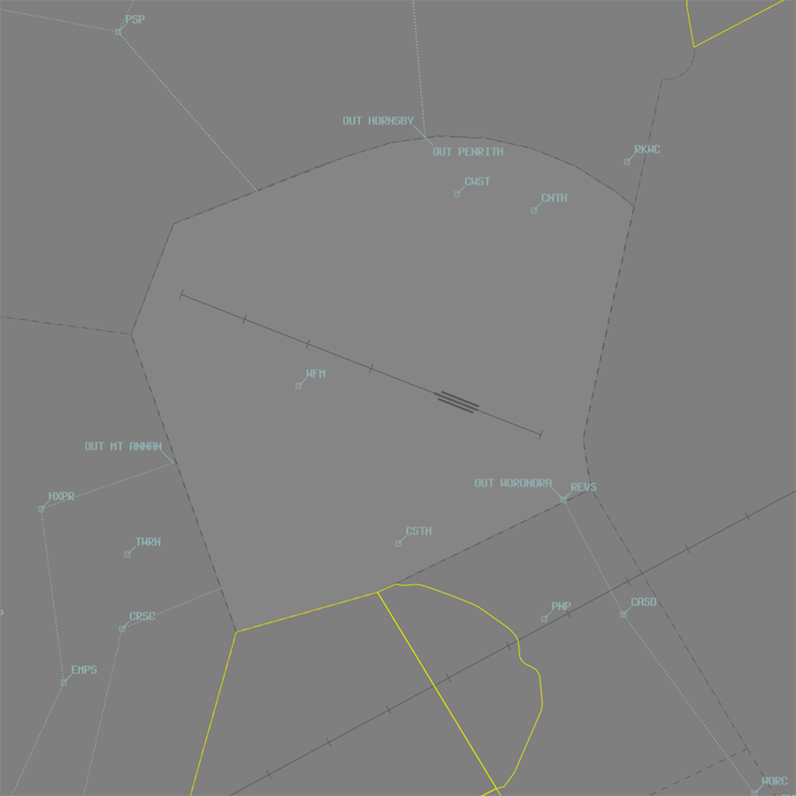
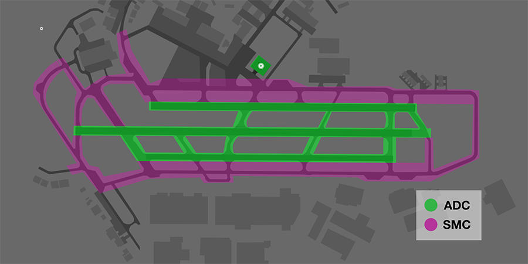

--8<-- "includes/abbreviations.md"

## Positions
| Name                    | Callsign             | Frequency   | Login ID      |
| ----------------------- | -------------------- | ----------- | ------------- |
| **Bankstown ADC North** | **Bankstown Tower**  | **132.800** | **BK_TWR**    |
| Bankstown ADC (Circuit) :material-information-outline:{ title="Non-standard position"} | Bankstown Tower | 123.600 | BK-C_TWR |
| **Bankstown SMC**       | **Bankstown Ground** | **119.900** | **BK_GND**    |
| **Bankstown ATIS**      |                      | **120.900** | **YSBK_ATIS** |

!!! abstract "Non-Standard Positions"
    :material-information-outline: Non-standard positions may only be used in accordance with [VATPAC Air Traffic Services Policy](https://vatpac.org/publications/policies){target=new}.  
    Approval must be sought from the **bolded parent position** prior to opening a Non-Standard Position, unless [NOTAMs](https://vatpac.org/publications/notam){target=new} indicate otherwise (eg, for events).

## Airspace
BK ADC is responsible for the Class D airspace in the BK CTR `SFC` to `A015`.

<figure markdown>
{ width="700" }
  <figcaption>BK ADC Airspace</figcaption>
</figure>

Refer to [Class D Tower Separation Standards](../../separation-standards/classd) for more information.

### Dual ADC Operations
When Bankstown ADC (Circuit) is online, responsibility for the **runway**, **circuit**, and **airspace** is divided between the two ADC controllers.

ADC North takes responsibility for the northern runways, circuit and airspace (Runway **11L/29R**, **11C/29C**), and southern airspace at **at A015**.

ADC (Circuit) takes responsibility for the southern runway, circuit and airspace (Runway **11R/29L**), **not above A010**

ADC (Circuit) is **not permitted** online when *single runway* operations are in use.

Refer to the [ATIS section](#runway-mode-formatting) for information on ATIS formatting when ADC (Circuit) is online.

## Manoeuvring Area
All apron areas and associated taxiways are *outside* the manoeuvring area. Each run up bay is inside the manoeuvring area and taxi instructions are required to proceed to them.

<figure markdown>
{ width="500" }
  <figcaption>YSBK Manoeuvring Area Responsibility</figcaption>
</figure>

## Local Procedures
### Start Approval
Start approval is required on SMC for all aircraft.

SMC shall assess the number of aircraft operating in, or intending to operate in, the circuit area, as well as the workload of adjacent controllers when determining whether start approval is available.

!!! phraseology
    **TEK**: "Bankstown Ground, Cherokee TEK, for Penrith Outbound, received A, request start"  
    **BK SMC**: "TEK, start approved"

!!! tip
    Some pilots may be unfamiliar with Bankstown's start approval requirement. Controllers should facilitate these aircraft movements with as little delay as possible.
    
### Adjacent Runways
Due to the close proximity of all three runways, there are additional considerations which must be applied between adjacent runway operations.

### Dependent Runway Operations (Departures Only)
All runways are considered independent unless a **multi-engined or jet aircraft** departs from an adjacent runway. In this instance, runways are treated as dependent *for departures only*. Controllers should apply the same runway standard across all dependant runways. Arriving aircraft are exempt from this clause.

**Independent**: Runways can operate simultaneously without restriction.  
**Dependent**: Runways are operated with restrictions, often one at a time.

!!! example "Examples"
    - A King Air (Multi-Engine) is ready to depart Runway 29R. A Cherokee is departing Runway 29L. Runways are not adjacent, and are therefore independent of each other.
    - A Citation (Jet) is ready Runway 11C. Both Runways 11L & 11R are adjacent, and a runway separation standard should be applied across **all** three runways. Note: Arriving aircraft are exempt.
    - A PC12 (Single Engine) is ready Runway 29C. This aircraft is a single-engined aircraft and the runways are treated independently from one another.
    - A Seminole (Multi-Engine) is cleared a touch & go on Runway 11R. Any aircraft departing from the adjacent runway (11C) must have a runway separation standard applied.

### Opposite Bases (Arrivals Only)
Due to the risk of collision, aircraft in each circuit should be staggered on base/final when operating in close proximity. Controllers should allow at least one aircraft to become established on final prior to the second commencing their turn to final, and pass mutual traffic information to both pilots.

!!! phraseology 
    **BK ADC:** "FWC, traffic is a King Air, late right base for runway centre"  

### Holding Aircraft Between Runways
All aircraft should remain on ADC frequency when between runways.

The largest aircraft that can safely hold between runways is a BE20 (King Air). All larger aircraft are considered to be occupying the runway behind until clear of all active runways.

!!! note
    All helicopters are considered to be larger than a King Air for the purpose of separation. 

## VFR Operations
Coded clearances are used to provide standardised routing for VFR aircraft arriving and departing YSBK while transiting Class D SY TCU airspace.

<figure markdown>
{ width="700" }
  <figcaption>Bankstown Coded Clearances</figcaption>
</figure>

Each coded clearance includes tracking instructions and height requirements that ensure aircraft remain within Class D airspace. Each coded clearance also includes explicit instructions on when to change frequencies.

### VFR Inbound Procedures
VFR aircraft will be cleared to track via a coded clearance by **SBA** and report inbound to **BK ADC** at PSP or CRSC. They should be instructed to join the circuit as below:

| VFR Approach Point | RWYs 29  | RWYs 11 |
| ----------------| --------- | ---------- |
| PSP    | *"Join right downwind runway 29R, maintain `A015`"*, then when abeam RWYs 11 threshold or clear of departing traffic, *"Cleared visual approach"*       | *"Join final runway 11L, report 3nm"*        |
| CRSC   | *"Join crosswind runway 29R, maintain `A015`"*, then when abeam RWYs 11 threshold or clear of departing traffic, *"Cleared visual approach"* | *"Join final runway 11L, report at Warwick Farm"*  |

!!! note
    Aircraft joining final in the RWY 11 direction are not assigned a level and are expected to commence a visual approach in accordance with the tracking instructions issued by ADC. Aircraft are required to enter the control zone at `A010`. There is no need to clear these aircraft for a visual approach.

### VFR Outbound Procedures
VFR aircraft intending to track via a coded clearance require an airways clearance from **BK SMC**. SMC shall update the FDR route of these aircraft with the following tracking points, as required.

| Coded Clearance      | Route               | Altitude | Notes |
| -------------------- | ------------------- | -------- | ----- |
| Hornsby Outbound     | `PRT CFCR PENH HSY` | `A015` to CFCR, thence `A018` |  |
| Mount Annan Outbound | `HXPR EMPS MAGG`    | `A015` to EMPS, thence `A025` |  |
| Penrith Outbound     | `PRT SITS VCBR`     | `A015`   |       |
| Woronora Outbound    | `REVS CASO WORC`    | `A015`   | Day Only |

!!! phraseology
    **UNY**: "Bankstown Ground, Diamond UNY, taxiway L, received B, for Hornsby Outbound, request taxi"   
    **BK SMC**: "UNY, Bankstown Ground, cleared Hornsby Outbound, taxi to holding point A8 runway 29R"  
    **UNY**: "Cleared Hornsby Outbound, taxi to holding point A8 runway 29R, UNY"  

These aircraft will report ready to **BK ADC** with their departure intentions. A takeoff clearance constitutes a clearance to operate in accordance with the aircraft's requested departure. After takeoff, the aircraft are expected to comply with the following tracking instructions:

=== "Departure RWY 11"

    | Coded Clearance                       | Tracking       | 
    | ------------------------------------- | --------------------- |
    | Mount Annan Outbound                  | <ul><li>At `A005`, turn left downwind, track to Dunc Gray Velodrome, climb to `A015`.</li><li>At Dunc Gray Velodrome and not before reaching `A015`, track to intersection of Hoxton Park Rd & M7.</li><li>Track via Mount Annan Outbound.</li></ul> |
    | Hornsby Outbound, or Penrith Outbound  | <ul><li>Climb to `A005`, then turn left direct to PRT, climb to `A015`.</li><li>Track via nominated coded clearance.</li></ul> |
    | Woronora Outbound                     | As directed by ATC to REVS |

=== "Departure RWY 29"

    | Coded Clearance                       | Tracking    | 
    | ------------------------------------- | --------------------- |
    | Mount Annan Outbound                  | <ul><li>Climb to `A010`.</li><li>Crossing Hume Highway, track to intersection of Hoxton Park Rd & M7, climb to `A015`.</li><li>Track via Mount Annan Outbound.</li></ul> |
    | Hornsby Outbound, or Penrith Outbound  | <ul><li>Climb to `A005`, then turn right direct to PRT, climb to `A010`.</li><li>Crossing the pipeline (approx 3nm BK), climb to `A015`.</li><li>Track via nominated coded clearance.</li></ul> |
    | Woronora Outbound                     | As directed by ATC to REVS |

Aircraft departing will transfer to appropriate frequency upon leaving the zone, **no explicit frequency transfer is given to these aircraft**. 

## Helicopter Operations
### General
These procedures apply during hours of daylight only. During hours of darkness, all helicopters must revert to fixed-wing operations.  

The Main Pad (abeam taxiway Mike) is treated like a runway and requires a takeoff/landing clearance. Helicopters are permitted to become airborne from a limited number of other locations on the aerodrome, such as taxiway November Two, and should be instructed to *"report airborne"* or *"report on the ground"*.

### Reporting Points
Three helicopter reporting points help keep helicopters segregated from other traffic.  

- **CWST**: Michels Patisserie located 1.2nm west of CNTH on the water pipeline  
- **CNTH**: Northern end of Regents Park Railway Station, roughly 300 metres north of the water pipeline  
- **CSTH**: Intersection of two creeks enclosing a sewage treatment works 2.1nm south of the aerodrome reference point

### Inbound Procedures
Helicopters should track inbound to the BK CTR as per below:

- Via a coded clearance or inbound reporting point (PSP or CRSC), or
- From R407, tracking RYB-CWST/CNTH (depending on runway mode) at `A007`

Pilots will report to **BK ADC** prior to entering the BK CTR and should be instructed to track as per below:

| Inbound Point | RWY 11 Config | RWY 29 Config |
| ----------------| --------- | ---------- |
| PSP | *"Report CWST"*, then  *"Join base main pad"* | *"Report CNTH"*, then  *"Join base main pad"* |
| CRSC | *"Report CSTH, A005"*, then  *"Overfly midfield at A005, join downwind main pad"* | *"Report CSTH, A005"*, then  *"Overfly midfield at A005, join downwind main pad"* |
| RYB | *"Report CWST"*, then  *"Join base main pad"* | *"Report CNTH"*, then  *"Join base main pad"* |

!!! note
    Helicopters tracking via CSTH will pass over the runway complex midfield at `A005` to join downwind. Be mindful of aircraft in the fixed-wing circuit and pass traffic information to both aircraft prior to the fixed-wing aircraft turning final.  

    Example:  
    *"LOI, traffic is a helicopter overflying the aerodrome to the north at `A005`, runway left, cleared touch and go"*  
    *"YZD, traffic is a Cherokee turning final for runway left, overfly midfield at `A005`, join downwind main pad"*

### Outbound Procedures
Helicopters should track outbound from the BK CTR as per below:

- Via a coded clearance, or
- To R407, tracking CWST/CNTH-RYB (depending on runway mode) at `A007`

Departures to the north must track via CWST when RWY 29s are in use and CNTH when RWY 11s are in use.

Helicopters shall report ready to **BK ADC** with their departure intentions. In response, **BK ADC** shall clear the aircraft for takeoff and instruct them to track via the appropriate exit gate.

!!! phraseology
    **YZD:** "Bankstown Tower, helicopter YZD, main pad, for Choppers North departure, ready"  
    **BK ADC:** "YZD, Bankstown Tower, depart Choppers North, main pad, cleared for takeoff"

!!! note
    Helicopters tracking via the Mt Annan Outbound will pass over the runway complex midfield at `A005` to join downwind. Be mindful of aircraft in the fixed-wing circuit and pass traffic information to both aircraft prior to the helicopter becoming airborne.  

    Example:  
    *"XEL, traffic is a helicopter overflying the aerodrome to the south at `A005`, runway left, cleared touch and go"*  
    *"YZD, traffic is a Cherokee turning final for runway left, depart Choppers South, main pad, cleared for takeoff"*

### Circuits
Circuits are conducted within the lateral confines of the fixed-wing circuit at `A007`, in the same direction as the current runway config. The termination point of the circuit is the Main Pad.

!!! phraseology
    **BK ADC:** "SUX, main pad, cleared stop and go"

## Runway Modes
### Preferred Runway Modes
Winds must always be considered for runway modes (Crosswind <20kts, Tailwind <5kts), however the order of preference is as follows:

| Priority - Mode | Arrivals  | Departures | Circuits |
| ----------------| --------- | ---------- | -------- |
| 1 - 29 PROPS | 29R (VFR) & 29C (IFR) | 29R (VFR) & 29C (IFR) | 29L |
| 2 - 11 PROPS | 11L (VFR) & 11C (IFR) | 11L (VFR) & 11C (IFR) | 11R |

#### Night Operational Restrictions
Runways 11L/29R & 11R/29L are unlit and **cannot** be used at night.

## SID Selection
IFR aircraft shall be assigned a SID corresponding to their direction of travel.

| Runway  | Via                  | SID           |
| ------- | -------------------- | ------------- |
| 11C/29C | NOLEM                | **MECKO** SID, NOLEM Transition |
| 11C/29C | Tracking N or E     | **URDOS** SID |
| 11C/29C | Tracking W or S | **MECKO** SID, RADAR Transition |

Pilots who are unable to accept a procedural SID shall be cleared the **BK (RADAR) SID**.

### Circuits
The circuit direction changes depending on time of day and runway being used.

| Runway | Day   | Night |
| ------ | ----- | ----- |
| 11L    | Left  | -     |
| 11C    | Left  | Right |
| 11R    | Right | -     |
| 29L    | Left  | -     |
| 29C    | Right | Left  |
| 29R    | Right | -     |

Circuits are flown at `A010`

## ATIS
### Runway Mode Formatting
The ATIS must indicate runway configuration in the format below:

| Mode        | Controllers | ATIS Runway information |
| ----------- | ----------- | ----------------------- |
| 11/29 PROPS | Single ADC  | `11L/29R FOR ARRS AND DEPS. RWY 11R/29L FOR CCT TRAINING. RWY 11C/29C IN USE` |
| 11/29 PROPS | Dual ADC    | `11L/29R FOR ARRS AND DEPS, FREQ 132.8. RWY 11R/29L FOR CCT TRAINING, FREQ 123.6. RWY 11C/29C IN USE` |

### Operational Info
When the crosswind component exceeds 15 knots, the OPR INFO field must include:  
`CROSSWIND ALERT – DO NOT PASS THROUGH FINAL FOR YOUR ASSIGNED RUNWAY`

The volume of airspace adjacent to the WS CTR overhead Camden (known as **SY CTA C10**) has a lower level that varies according to the time of day. The OPR INFO field should be updated to reflect the level of controlled airspace within the SY C10 area when it is lowered overnight, for the awareness of pilots operating in the vicinity.

| Condition    | OPR INFO Field |
| ------------ | -------------- |
| Between 2300 and 0600 Local   | `SY CTA 10 SOUTH OF WS CTR ACTIVE` |

## Coordination
### Departures
[Next](../../controller-skills/coordination/#next) coordination is **not** required for aircraft that are:   

- VFR aircraft departing via a [coded clearance](#vfr-outbound-procedures)

All other aircraft entering SBA CTA require a 'Next' call to SBA.

The Standard Assignable level from **BK ADC** to **SBA** is:

| Aircraft | Level |
| --- | -----|
| All | `A030` |

### Arrivals/Overfliers
SBA will heads-up coordinate arrivals/overfliers from Class C to BK ADC prior to **5 mins** from the boundary.
  
IFR aircraft will be cleared for the instrument prior to handoff to BK ADC, unless BK ADC nominates a restriction.  

!!! phraseology
    **SBA** -> **BK ADC**: "To the west, UJN, for the RNP-Z"  
    **BK ADC** -> **SBA**: "UJN, RNP-Z"

!!! tip
    Remember that IFR aircraft are only separated from other IFR or SVFR aircraft in class D. You should *generally* be able to issue a clearance for an approach and use other separation methods (visual separation, holding a departure on the ground, etc) if separation is required with these aircraft.
    
#### ADC (Circuit) Online
When ADC (Circuit) is online, SY TCU may not be familiar with which controller owns what airspace. Best practice is to receive the coordination no matter what, and if it was meant for the other ADC controller, relay the coordination to them internally.

### BK ADC Internal
BK ADC must heads-up coordinate **all aircraft** transiting from one ADC controller to the other.

!!! phraseology
    **BK ADC C** -> **BK ADC N**: "via CRSC, EWY for an overhead join"  
    **BK ADC N** -> **BK ADC C**: "EWY, A015"

BK ADC must coordinate **all helicopter traffic** via CSTH. Coordination must take place prior to Take-Off clearance bring issued (departures) OR before issuing a clearance beyond CSTH (arrivals). When responding to coordination, ADC2 should pass aircraft type and position of any aircraft likely to affect the crossing midfield at A005.

!!! phraseology
    **BK ADC N** -> **BK ADC C**: "Choppers South Inbound/Outbound"  
    **BK ADC C** -> **BK ADC N**: "Roger, Traffic is a Cherokee late downwind"