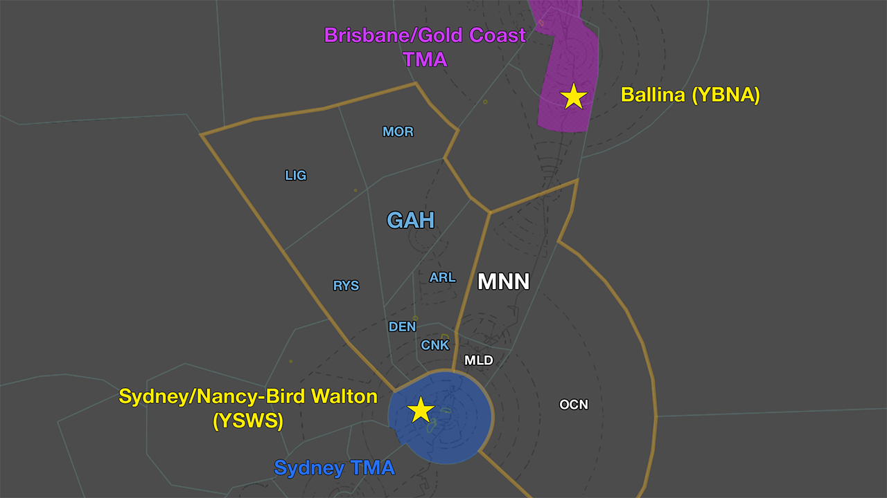
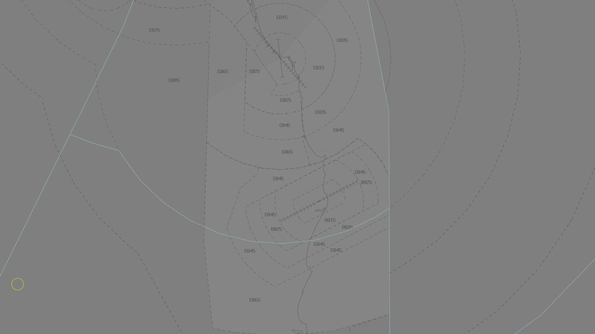
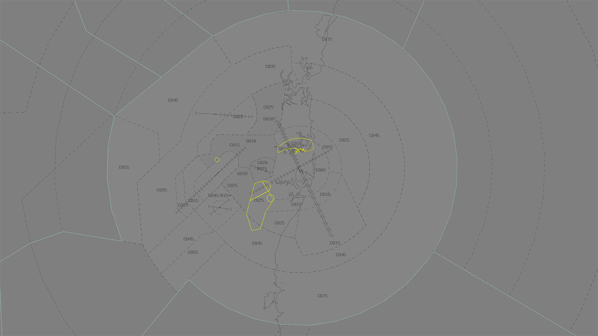
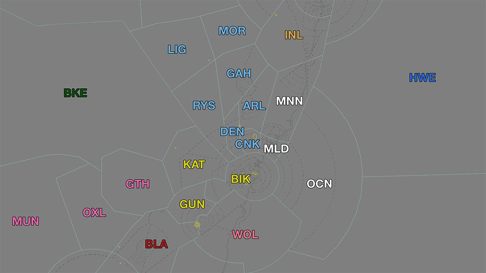

--8<-- "includes/abbreviations.md"

!!! comingsoon "Future Procedure"
    This page documents **future procedures** that are scheduled to be introduced on **09 July 2026**. 
    
    Controllers are strongly encouraged to familiarise themselves with the incoming changes before launch day.
    
## Summary of Changes
There are multiple significant changes being introduced in Australian airspace on **09 July 2026** (AIRAC 2607).

Control services are being introduced at two airports: [Ballina Airport (YBNA)](#ballina-airport-ybna) and the newly constructed [Sydney/Nancy-Bird Walton (YSWS)](#sydneynancy-bird-walton-airport-ysws), significantly affecting operations in two of Australia's busiest TMAs.

<figure markdown>
{ width="854" }
  <figcaption>Key AIRAC 2607 Changes</figcaption>
</figure>

On this page you will find a summary of the changes and the SOPs that will be introduced to support the new aerodromes, including aerodromes, terminal areas, and enroute sectors.

!!! abstract "Reference"
    You can find charts for all the new SIDs, STARs, and airspace volumes on the [Airservices Australia AIP](https://www.airservicesaustralia.com/aip/aip.asp){target=new}.

#### Questions?
A Q&A channel has been created on the [VATPAC Discord](https://discord.com/channels/343999482737721354/1508107412224081990), open to all members of the community. If you have any questions relating to these major changes, join the conversation!

### Ballina Airport (YBNA)
**Ballina Airport** is a certified aerodrome on the northern New South Wales coast, near Byron Bay.

In the real world, Ballina Airport is a very busy aerodrome. It is used daily by regular commercial jet and turboprop passenger traffic, general aviation traffic, sight-seeing helicopters, and flying schools. It is one of very few airports in Australia to operate a local SFIS.

**Beginning 09 July 2026, YBNA is becoming a controlled Class D airport.**

#### Aerodrome
A new **BA CTR** is being established around YBNA, `SFC-A015`. This airspace will be the responsibility of a new ADC controller, **BA ADC**.

The airspace in the BA CTR will be classified as Class D.

Please see the **[Upcoming Ballina (YBNA) SOPs](./ballina)** for full details about aerodrome operations.

#### TCU
Previously uncontrolled airspace surrounding YBNA is being reclassified:

- Class D airspace will extend up to 20NM DME from YBNA, with lower level steps starting from `A015`
- The lower level of Class C airspace up to 75NM DME YBCG is being lowered, as low as `A045` overhead YBNA.
    
<figure markdown>
{ width="854" }
  <figcaption>CTA around Ballina (YBNA)</figcaption>
</figure>

The **Brisbane/Gold Coast TCU** is being extended to cover the newly reclassified airspace. A new TCU controller, **BAA** (*'Ballina Approach'*), is being introduced as a child position of **BAC**, and will have primary responsibility for the area.

Please see the **[Upcoming Brisbane TCU SOPs](./brisbane)** for full details about TCU operations.

#### Enroute
**INL** has new responsibilities relating to YBNA, including STAR assignment and sequencing.

Please see the **[Upcoming Inverell SOPs](./INL)** for full details about INL operations.

### Sydney/Nancy-Bird Walton Airport (YSWS)
**Sydney/Nancy-Bird Walton Airport** is a newly constructed airport in Sydney's west, following a multi-billion dollar project designed to alleviate congestion at Sydney/Kingsford Smith (YSSY).

The airport is intended to operate without curfew restrictions and will be progressively expanded over the next fifty years as the aviation industry expands. 

**Beginning 09 July 2026, YSWS is becoming a controlled Class C airport.**

!!! tip
    Most people will be more familiar with the name *Western Sydney Airport*, or the IATA code *WSI*. To reduce ambiguity in radio communications, the airport is exclusively referred to as **Nancy-Bird Walton Airport** (or **Walton** for short) in all phraseology.
    
    !!! phraseology
        **ML ACD**: "YMA123, cleared to *Nancy-Bird Walton* via DOSEL, flight planned route."  

#### Aerodrome
A new **WS CTR** is being established around YSWS, `SFC-A015`. The airport will be controlled by three new aerodrome positions: **WS ADC**, **WS SMC**, and **WS ACD**. The airspace in the WS CTR will be classified as Class C.

YSWS operates 24 hours a day. When WS ADC is offline, SY TCU must provide a top-down service to the aerodrome.

Please see the **[Upcoming Sydney/Nancy-Bird Walton (YSWS) SOPs](./walton)** for full details about aerodrome operations.

#### Other Aerodrome Updates
##### Sydney (YSSY) Changes
Operations at Sydney (YSSY) are being adjusted to accommodate the new airport and associated aircraft movements.

- The SIDs have been significantly adjusted, particularly the procedures for aircraft departing to the west. Some SIDs are being replaced entirely (such as the RIC or WOL SIDs), and a new non-jet SID is being introduced.
- The Standard Assignable Departure Headings and Departure Frequencies are also changing.
- The lateral boundaries of the SY ADC CTR are also changing to match new CTA boundaries.
- The Erskineville and Georges River Helicopter Coded Clearances have been retired, as has the Harbour Scenic Two route.
- The R405 restricted area (over Sydney Harbour & the Parramatta River) is being retired, replaced with R407. R407 has similar, but not identical, boundaries.

Please see the **[Upcoming Sydney (YSSY) SOPs](./sydney-ad)** for full details about aerodrome operations.

##### Bankstown Airport (YSBK) Changes
Bankstown (YSBK) is located between YSWS and YSSY, and the new controlled airspace in the area has led to profound changes to operations at the airport.

- The Bankstown CTR has grown in size, and now adjoins newly introduced Class D airspace beneath the Class C steps in the SY TMA. This airspace will be controlled by SBA (*'Bankstown Approach'*), a SY TCU position.
- All VFR movements should now be conducted via newly introduced coded clearances. These coded clearances give specific routes for aircraft to follow as they transit SBA airspace.
- A new set of SIDs have been introduced to facilitate IFR departures.

Please see the **[Upcoming Bankstown (YSBK) SOPs](./Bankstown)** for full details about aerodrome operations.

##### Camden Airport (YSCN) Changes
Camden (YSCN) is located close to the southern boundary of the WS CTR.

- MYF and BRY are no longer inbound VFR waypoints for YSCN.
- During the hours of 23:00 and 06:00 Sydney local time, the volume of Class C airspace overhead YSCN is lowered from `A045` to `A015`, precluding normal operations. For this reason, controllers are prohibited from logging on as either CN ADC or CN SMC during this time.

##### Richmond Airport (YSRI) Changes
Richmond (YSRI) is located north of the WS CTR and is experiencing changes to its procedures.

- The restricted areas over Richmond have been renumbered.
- A new set of SIDs have been introduced, replacing all previous procedures.
- RI ADC's airspace is changing to match its real world boundaries.

#### Sydney TCU Changes
The **Sydney TCU** is expanding west to cover newly reclassified airspace associated with YSWS.

<figure markdown>
{ width="854" }
  <figcaption>Updated Sydney TMA boundaries</figcaption>
</figure>

- A new TCU controller, **SWA** (*'Walton Approach'*), is being introduced as a child position of **SAS**, and will have primary responsibility for the area.
- Another new TCU controller, **SRA** (*'Richmond Approach'*), is being introduced as a child position of **SAS**, with jurisdiction over the SY TCU airspace above YSRI.
- Yet another new TCU controller, **SBA** (*'Bankstown Approach'*), is being introduced as a child position of **SAS**, with jurisdiction over two lower level volumes of airspace used by aircraft arriving and departing YSBK.
- There are now SIDs and/or STARs for all controlled aerodromes within the Sydney Basin, with a complex network of altitude restrictions. While there is procedural separation between most SIDs/STARs, there are multiple potential sources of conflict that need to be closely monitored.

Please see the **[Upcoming Sydney TCU SOPs](./sydney-tcu)** for full details about TCU operations.

#### Enroute
The boundaries of several enroute positions are changing, as is the YBBB/YMMM FIR boundary.

Two new enroute primary positions are being created with jurisdiction over the airspace that was previously grouped under **ARL**.

<figure markdown>
{ width="854" }
  <figcaption>Updated enroute boundaries</figcaption>
</figure>

##### Armidale (ARL)
The updated **ARL** will have six child sectors: **CNK**, **DEN**, **LIG**, **GAH**, **MOR**, and **RYS**.

This area roughly aligned with the previous MDE, CNK, and ARL subsectors, but also includes airspace that was previously managed by KAT. The main responsibilities of this sector is to process and sequence arrivals to YSSY and YSWS, with additional responsibilities relating to YSTW and YBBN-YPAD traffic.

Several YSSY STARS from the west are changing, notably the replacement of the **ODALE** STAR with a new **AKMIR** STAR, which will alter the standard reroute given to aircraft when traffic levels are high.

Please see the **[Upcoming Armidale SOPs](./ARL)** for full details about ARL operations.

##### Manning (MNN)
**MNN** will have two child sectors: **MLD** and **OCN**.

These three positions were previously children of the ARL parent position, but are being split off to better manage the workload north of Sydney.

The main responsibilities of this sector is to process departures out of the SY TCU, with additional responsibilities relating to YWLM traffic.

Please see the **[Upcoming Manning SOPs](./MNN)** for full details about MNN operations.

##### Gundagai (GUN)
The boundaries of **GUN** are changing. 

- **KAT** is expanding to include airspace that was previously part of BIK. The subsector will have additional respondibilities to process and sequence YSWS arrivals.
- **BIK** is adjusting size to accomodate an expansion in KAT airspace close to the SY TCU boundary. BIK retains responsibility for the airspace above the SY TCU. 
- **GUN** is shrinking slightly as the BIK subsector extends westward. GUN will have additional responsibilities for processing arrivals to YSWS.

Please see the **[Upcoming Gundagai SOPs](./GUN)** for full details about GUN operations.

##### Wollongong (WOL)
The boundaries of **WOL** are very slightly adjusting at the western edge near YSCB. The sector will experience an increase in responsibilities for managing southbound departures from YSWS.