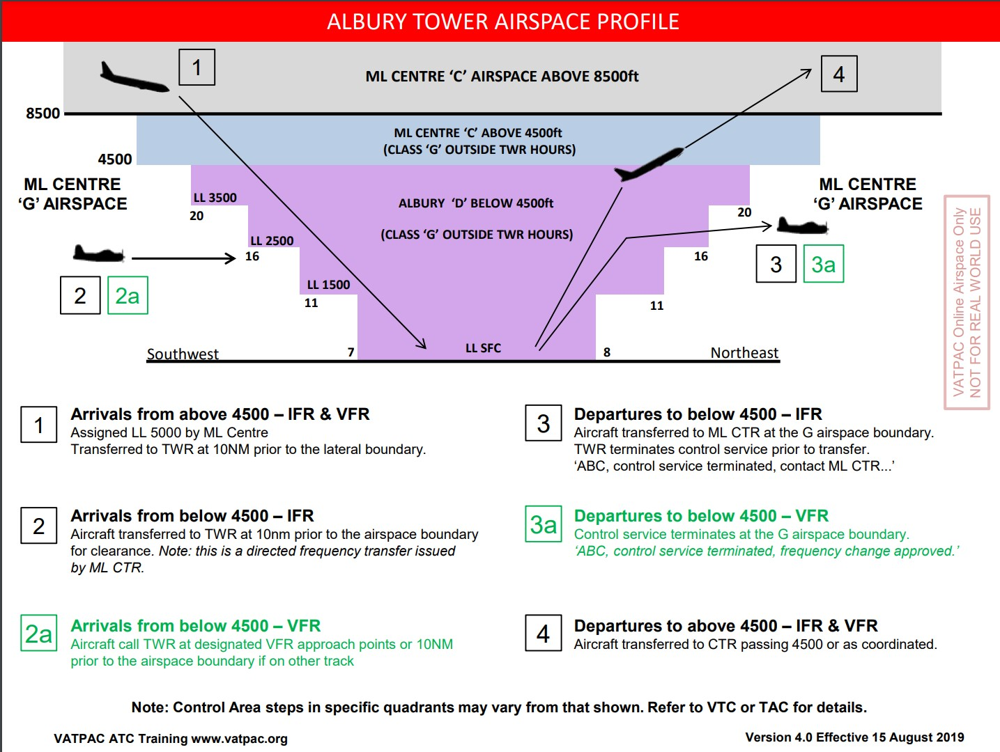

--8<-- "includes/abbreviations.md"

## Positions

| Name | Callsign | Frequency | Login Identifier |
| ---- | -------- | --------- | ---------------- |
| Albury ADC | Albury Tower | 123.250 | AY_TWR |
| Albury SMC | Albury Ground | 121.800 | AY_GND |
| Albury ATIS | N/A | 133.850 | YMAY_ATIS |

## Airspace

<figure markdown>
{ width="700" }
  <figcaption>YMAY Airspace</figcaption>
</figure>

## Surveillance
AY TWR is permitted to use Surveillance standards for separation. Surveillance coverage can be expected to be available at all levels in the AY CTR.  
For simulation purposes, visual separation is assumed to exist below the cloud base, and within 5nm. Visual separation can still be used to separate from aircraft on an instrument approach, below the cloud base.

## Lateral Separation
Placeholder for local lateral separation options, such as using visual features, useful VOR radials, etc.

## Coordination
### Departures
#### Taxi Call
A taxi call shall be made to BLA as an aircraft is given taxi clearance. Center will respond by acknowledging the callsign and activating FDR.

!!! example
    **AY_TWR** -> **ML-BLA_CTR**: "Taxis QFA400 for YSSY via MUSOP"  
    **ML-BLA_CTR** -> **AY_TWR**: "QFA400"  

#### Next Call
A next call is made for all aircraft when they are next to depart and will be departing within two minutes. Center will respond by either acknowledging the callsign or offering a higher level. Any higher level issued will be passed along in the takeoff clearance. If the controller is in a high workload environment, a next call may be omitted, in favour of taxi and departure coordination.

!!! example
    **AY_TWR** -> **ML-BLA_CTR**: "Next QFA400"  
    **ML-BLA_CTR** -> **AY_TWR**: "QFA400, FL320"  
    **AY_TWR** -> **ML-BLA_CTR**: "FL320, QFA400"  

#### Departure Call
A departure call should be made as the aircraft becomes airborne. If not already issued, CTR will issue a higher level. The aircraft should be transferred to CTR as they climb through the upper level of the AY class D airspace.

!!! example
    **AY_TWR** -> **ML-BLA_CTR**: "Departure QFA400 at 06"  
    **ML-BLA_CTR** -> **AY_TWR**: "QFA400"

The

#### Arrivals
As per [Standard coordination procedures](../../controller-skills/coordination/#class-d-twr-enrtcu), it is the responsibility of **BLA** to coordinate arrivals to AY TWR prior to **5 mins** from the airspace boundary. AY TWR is the arbiter of the sequence, so AY TWR shall tell **BLA** what level to assign when a new arrival is coordinated. The standard assignable level for an arrival is `A060`, however AY TWR must ensure the aircraft arrive in their airspace in a vertical stack, in order to ensure they are procedurally separated.

!!! example
    **BLA** -> **AY TWR**: "RXA3421, estimating YMAY time 52, via ARRAN1 arrival”  
    **AY TWR** -> **BLA**: "RXA3421, A060"  
    **BLA** -> **AY TWR**: "A060, RXA3421”  
    ...
    **BLA** -> **AY TWR**: "Addition to the sequence, ABC, estimating YMAY time 56, via DUBUS, Number 2. QLK123D, estimating YMAY time 59, via VEGRU1 arrival, Number 3”  
    **AY TWR** -> **BLA**: "RXA3421, new restriction to reach A060 by 9 GNSS POKIT, Number 1. ABC, A070 by 15 GNSS AY, Number 2. QLK123D, A080, Number 3"  
    **BLA** -> **AY TWR**: "A060 by 9 GNSS POKIT, RXA3421. A070 by 15 GNSS AY, ABC. A080, QLK123D”  

!!! note
    The restrictions *"by 9 GNSS POKIT"* and *"by 15 GNSS AY"* are in place to ensure the sequence is 1000ft separated *before* they enter lateral conflict. Once they're in your airspace, you can safely step the aircraft down as required to ensure they remain procedurally separated

## Standard Assignable Levels

All aircraft departing from Albury shall be assigned `A060`.

All aircraft arriving into Albury shall be assigned `A070`.