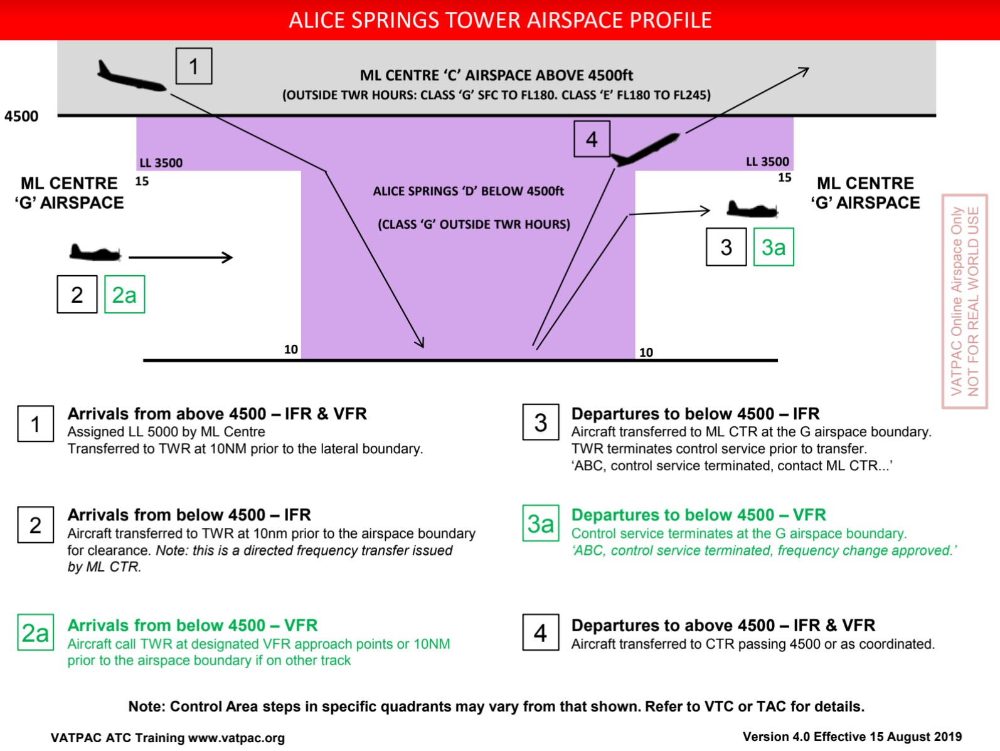

--8<-- "includes/abbreviations.md"

## Positions

| Name | Callsign | Frequency | Login Identifier |
| ---- | -------- | --------- | ---------------- |
| Alice Springs ADC | Alice Tower | 118.300 | AS_TWR |
| Alice Springs ATIS | N/A | 123.000 | YBAS_ATIS |

## Airspace

<figure markdown>
{ width="700" }
  <figcaption>YBAS Airspace</figcaption>
</figure>

## Surveillance
AS TWR is permitted to use Surveillance standards for separation. Surveillance coverage can be expected to be available at all levels in the AS CTR.  
For simulation purposes, visual separation is assumed to exist below the cloud base, and within 5nm. Visual separation can still be used to separate from aircraft on an instrument approach, below the cloud base.
## Coordination
### AS ADC / ENR

#### Taxi Call
A taxi call shall be made between AS TWR and ML CTR as an aircraft is given taxi clearance. Center will respond by acknowledging the callsign and activating FDR.

!!! example
    **AS_TWR** -> **ML-ASP_CTR**: "Taxis QFA797 for YMML via IDANU"  
    **ML-ASP_CTR** -> **AS_TWR**: "QFA797"  

#### Next Call
A next call is made for all aircraft when they are next to depart and will be departing within two minutes. Center will respond by either acknowledging the callsign or offering a higher level. Any higher level issued will be passed along in the takeoff clearance. If the controller is in a high workload environment, a next call may be omitted, in favour of taxi and departure coordination.

!!! example
    **AS_TWR** -> **ML-ASP_CTR**: "Next QFA797"  
    **ML-ASP_CTR** -> **AS_TWR**: "QFA797"    

#### Departure Call
A departure call should be made as the aircraft becomes airborne. If not already issued, CTR will issue a higher level. The aircraft should be transferred to CTR as they climb through the upper level of the AS class D airspace.

!!! example
    **AS_TWR** -> **ML-ASP_CTR**: "Departure QFA797 at 06"  
    **ML-ASP_CTR** -> **AS_TWR**: "QFA797, FL360"
    **AS_TWR** -> **ML-ASP_CTR**: "FL360, QFA797" 
#### Arrival Coordination
ML-ASP_CTR will coordinate all arrivals into Alice Springs Prior to handing over to tower in the following format:

- Callsign & Aircraft Type
- Estimate
- Inbound Radial/Procedure
- Assigned Level
- Sequence Number (if applicable)

!!! example
    **ML-ASP_CTR** -> **AS_TWR**: "JST734, A320, estimates Alice Springs 52, 189 radial, 5000ft, number 2”
    **AS_TWR** -> **ML-ASP_CTR**: "JST734"

## Standard Assignable Levels

Aircraft departing from Alice Springs shall be assigned `A060` or `RFL` if lower.

Aircraft arriving into Alice Springs shall be assigned `A070`.