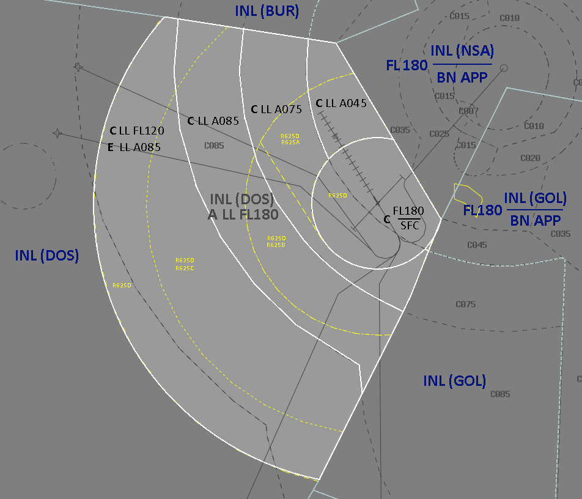

--8<-- "includes/abbreviations.md"

## YAMB Positions

| Name               | Callsign       | Frequency        | Login Identifier              |
| ------------------ | -------------- | ---------------- | --------------------------------------|
| Amberley TCU   | Amberley Approach   | 126.200        | AM_APP                                   |
| Amberley ADC    | Amberley Tower  | 118.300         | AM_TWR        |
| Amberley SMC    | Amberley Ground  | 129.350      | AM_GND        |
| Amberley ACD    | Amberley Delivery  | 134.600         | AM_DEL       |
| Amberley ATIS    |   | 123.300         | YAMB_ATIS       |

## Airspace
### AM TCU
#### Restricted Areas
By Default Amberley owns all of the R625 Restricted Areas, detailed below:

- R625A (`A015`-`A085`)  
- R625B (`A025`-`A085`)  
- R625C (`A045`-`A085`)  
- R625D (`A085`-`F210`)  

### Optional, as required
AM APP can negotiate further airspace releases from surrounding ENR sectors of the following Restricted Areas:

- R650A (`A050`-`A100`)  
- R650B (`A050`-`F600`)  
- R662A (`A050`-`F600`)  
- R662B (`A050`-`F600`)  
- R671A (`F125`-`F245`)  
- R671B (`F240`-`F600`)

!!! note
    When Controlling a Military Aerodrome on VATSIM its important to consider any notams regarding VSOAs as Restricted Airspaces may be activated. [VATPAC Notams](https://vatpac.org/publications/notam){target=new}

#### Diagram

<figure markdown>
{ width="952" }
  <figcaption>AM TCU Airspace Diagram</figcaption>
</figure>

### AM ADC
AM ADC owns the Class C airspace in the AM CTR within 10nm of the YAMB ARP from `SFC` to `A015`. 

## YAMB Aerodrome

### SID Selection
Aircraft planned via **BN**, **JEDDA**, **MESED**, **BOBOP**, **TATEN**, shall be assigned the **Procedural SID** that terminates at the appropriate waypoint.
Aircraft who are not planned via those points or who are negative RNAV may be assigned a RADAR sid or a visual departure. 

#### Coded Departures
Visual Departures are commonly requested which are often in the form of a coded departure (e.g. BYRON7 departure), which can be found in the AD2 Sups Page for Amberley. These coded departures provide a corridor with altitude and speed constraints to join the Military Training Areas east of Brisbane avoiding civilian traffic inbound to Brisbane. 

Aircraft will make a visual departure in the circuit direction and fly overhead Amberley to begin tracking for their initial waypoint.

!!! example
    WOLF03 was assiged the BYRON7 departure with their intial clearance. 
    **AM TCU**: "WOLF03, make left turn, reach `F190` by COWIE, cleared for takeoff"  
    **WOLF03**: "Make left turn, reach `F190` by COWIE, cleared for takeoff, WOLF03"  

Typically pilots will request a specific departure when obtaining their airways clearance.

### Runway Operations
Runways 15/33 are the primary runways at Amberley. 

## Charts
!!! note
    Additional charts to the AIP may be found in the RAAF TERMA document, available towards the bottom of [RAAF AIP page](https://ais-af.airforce.gov.au/australian-aip){target=new}

## Miscellaneous
### Circuit Operations
The Circuit Area Airspace is allocated to be within 5nm of the Amberley ARP from `SFC` to `A015`. Aircraft can be instructed to extend outside of this airspace by ATC for traffic management.

### Circuit Direction
| Runway | Direction |
| ------ | ----------|
| 15     | Right  |
| 33     | Left |
| 04     | Left |
| 22     | Left |

## Coordination
### Enroute
#### Departures
Departures from YAMB in to GOL/DOS/BUR Class C will be coordinated at taxi, and will be requesting a level.

!!! example
    **AM TCU** -> **DOS**: "Taxi, WOLF02 for YAMB via MATVI, Requesting F140"  
    **DOS** -> **AM TCU**: "WOLF02, F140"  
    **AM TCU** -> **DOS**: "F140, WOLF02"  

Fast Jets may also be cleared to climb straight to their transit level for the Restricted Area they are operating in; This still requires voiced coordination with INL.

#### Arrivals/Overfliers
All aircraft transiting from GOL/DOS/BUR to **AMB TCU** must be heads-up coordinated prior to **20nm** from the boundary. Operations within **AMB TCU** are fairly ad-hoc, so there are no standard assignable levels, simply whatever the GOL/DOS/BUR and **AM TCU** controller agree on.

!!! example
    **GOL** -> **AMB TCU**: "via HUUGO, PUMA11, will be assigned A090"  
    **AMB TCU** -> **GOL**: "PUMA11, A090"  

### AM ADC
#### Auto Release  

'Next' coordination is required from AM ADC to AM TCU for aircraft due to the busy ad-hoc nature of the airspace. Aircraft should typically be assigned the lower of `F180` or `RFL` or their transit level to the restricted areas. 

!!! example
    **AM ADC** -> **AM TCU**: "Next, ASY01, runway 33"  
    **AM TCU** -> **AM ADC**: "ASY01, Assigned Heading Right 030, unrestricted"  
    **AM ADC** -> **AM TCU**: "Assigned Heading Heading Right 030, ASY01"  