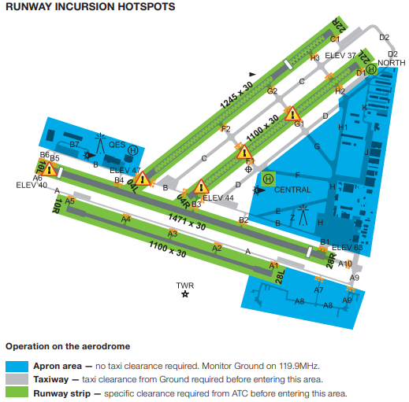
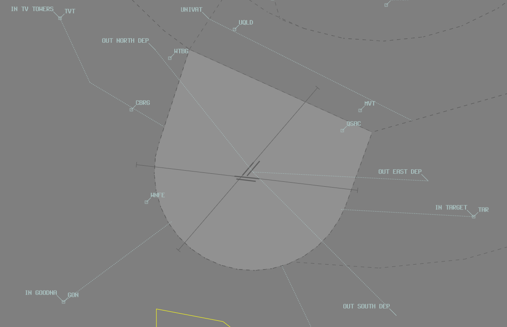

--8<-- "includes/abbreviations.md"

## Positions

| Name               | Callsign       | Frequency        | Login Identifier                         |
| ------------------ | -------------- | ---------------- | ---------------------------------------- |
| **Archerfield ADC**  | **Archer Tower**  | **118.100**          | **AF_TWR**                        |
| **Archerfield SMC**   | **Archer Ground**   | **129.300**          | **AF_GND**                       |
| Archerfield ATIS        |                | 120.900          | YBAF_ATIS                                |

 
In the absence of an SMC controller, ADC shall assume the SMC responsibilities.
<figure markdown>
{ width="500" }
  <figcaption>Maneuvering Area</figcaption>
</figure>

## Airspace
Tower airspace is defined as between SFC to 1500 FT.

<figure markdown>
{ width="700" }
  <figcaption>Archerfield Tower Airspace</figcaption>
</figure>

## VFR Arrival Procedures

| VFR Approach Point | RWYs 04  | RWYs 22 | RWYs 10  | RWYs 28 | 
| ----------------   | --------- | ---------- | --------- | ---------- |
| TV Towers (TVT)    |        |         |        |         |
| Goodna    (GON)    |        |         |        |         |
| Park Ridge (PKR)   |        |         |        |         |
| Target (TAR)       |        |         |        |         |

Entry into the Archerfield CTR shall be at 1500ft.

## VFR Departure Procedures

| Planned Departure Tracks | "Intentions"   | Tracking Requirement | 
| ---------------      | ---------      | ----------           | 
| BTN 310 & 019 DEG    | Northern Departure | Track via Walter Taylor (Indooroopilly) Bridge | 
| BTN 020 & 099 DEG    | Eastern Departure  | Track via Gateway Motorway and Pacific Motorway Intersection   *(Not available when Rwy 22 active EXC if departing into Class C)* | 
| BTN 100 & 204 DEG    | Southern Departure | Track 135 DEG from Archerfield |
| BTN 205 & 309 DEG    | Western Departure  | DEP AF CTR on a track between 220 & 309. Acft must nominate outbound DEP track with TAXI call |
| Other                |                    | As approved by ATC

Departure Altitude is 1000ft.

Aircraft should advise planned Departure Procedure with TAXI call.
Aircraft should advise "For Departure (direction)" with READY call.

!!! example
    "Archer Ground, Cherokee VPF is on the Main Apron, Solo, Western Departure, Received Information Alpha, Request Taxi"

    "Archer Tower, Cherokee VPF is B8, Runway 10 Left for Western Departure"

## Circuits
The circuit direction changes depending on time of day and runway being used.

| Runway | Day  | Night |
| ----------------| --------- | ---------- |
| 04R             | Right | -  |
| 04L             | Left  | -  |
| 22R             | Right | -  |
| 22L             | Left  | -  |
| 10R             | Right | -  |
| 10L             | Left  | Left  |
| 28R             | Right | Right |
| 28L             | Left  | -  |

Circuits are to be flown at 1000ft.

## ATIS
#### Operational Info

