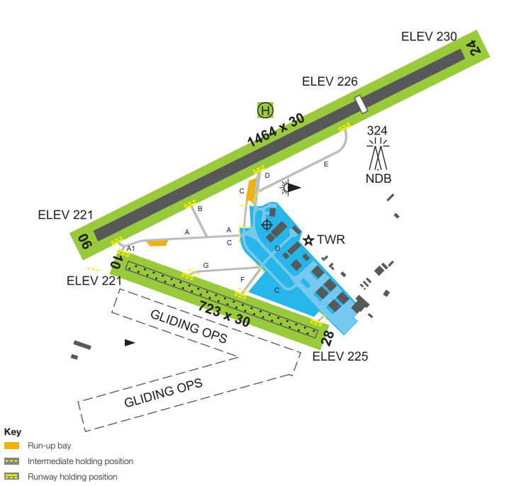

--8<-- "includes/abbreviations.md"

## Positions

| Name               | Callsign       | Frequency        | Login Identifier                         |
| ------------------ | -------------- | ---------------- | ---------------------------------------- |
| **Camden ADC**  | **Camden Tower**  | **120.100**          | **CN_TWR**                        |
| **Camden SMC**   | **Camden Ground**   | **121.900**          | **CN_GND**                       |
| Camden ATIS        |                | 125.100          | YSCN_ATIS                                |

 
In the absence of an SMC controller, ADC shall assume the SMC responsibilities.
<figure markdown>
{ width="500" }
<figcaption>Maneuvering Area</figcaption>
</figure>

## Airspace
Tower airspace is defined as between SFC to 2000 FT.      

## VFR Inbound Procedures

| VFR Approach Point | RWYs 06  | RWYs 24 |
| ----------------| --------- | ---------- |
| Bringelly (BRY)    | Join Downwind RWY 06, Maintain 1800ft, Report 2NM     | Join Final RWY 24, Maintain 1800ft, Report Oran Park (ONPK)       |
| Menangle (MEG)   | Overfly Camden to join Mid-Field Crosswind RWY 06, Maintain 1800ft, Report Overhead      | Overfly Camden to join Mid-Field Crosswind RWY 24, Maintain 1800ft, Report Overhead       |
| Picton (PIC)   | Overfly Camden to join Mid-Field Crosswind RWY 06, Maintain 1800ft, Report Overhead      | Overfly Camden to join Mid-Field Crosswind RWY 24, Maintain 1800ft, Report Overhead       |
| The Oaks (THK)   | Join Final RWY 06, Maintain 1800ft, Report 3NM    | Join Downwind RWY 24, Maintain 1800ft, Report 2NM      |
| Mayfield (MYF)   | Join Base RWY 06, Maintain 1800ft, Report 2NM      | Join Base RWY 24, Maintain 1800ft, Report 2NM       |

When Aircraft are clear of conflicting traffic below, aircraft may be issued a Visual Approach.

Sequencing Instruction: When the aircraft reports at their specified report (or downwind), issue the aircraft its sequence (if different from previous circuit)
*Example: "ABC, Number 3 Runway 06, Follow C172 on Base"*

## Circuits
The circuit direction changes depending on time of day and runway being used.

| Runway | Day  | Night |
| ----------------| --------- | ---------- |
| 06    | Left       | Left        |
| 24   | Right | Right  |
| 10 (Grass) | Left | - |
| 28 (Grass) | Right | - |

Circuits to be flown at A013 (High Performance Aircraft: A018 )

## Departures

All aircraft must depart at 1300ft via an extended leg of the circuit.
Upon reaching 2NM CN, all VFR aircraft should monitor the appropriate area frequency (Sydney Approach). A frequency transfer will not be issued to VFR aircraft.
Departing IFR aircraft will receive a frequency transfer.

## ATIS
#### Operational Info

When there is significant cloud in the YSCN area below 3500ft, CN TWR must include "Expect Instrument Approach" on the ATIS