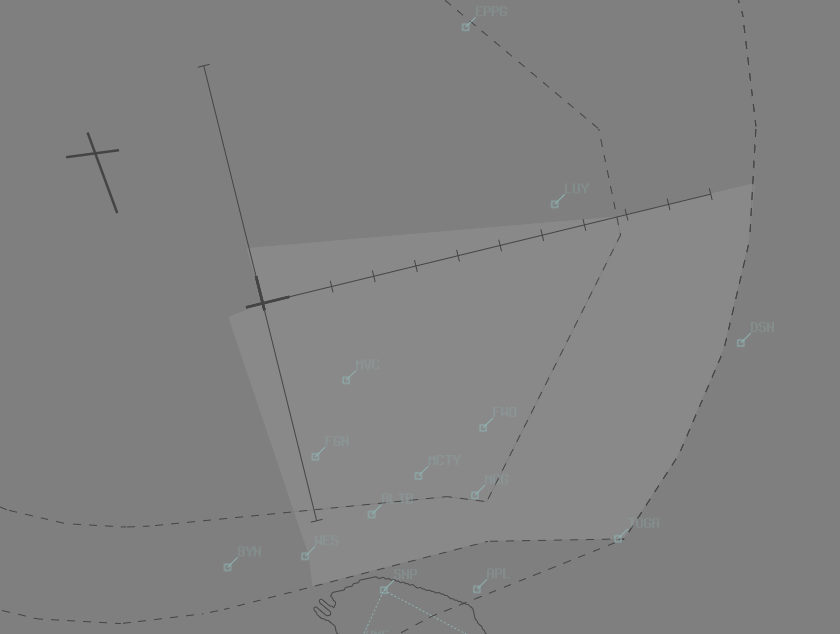

--8<-- "includes/abbreviations.md"

## Positions
| Name               | Callsign       | Frequency        | Login Identifier                         |
| ------------------ | -------------- | ---------------- | ---------------------------------------- |
| Essendon ADC      | Essendon Tower   | 125.100          | EN_TWR                                   |
| Essendon SMC      | Essendon Tower   | 121.900          | EN_TWR                                   |
| Essendon ATIS     |                | 119.800         | YMEN_ATIS                                |

## Airspace
EN ADC is responsible for the Class C airspace in the "Coffin" `SFC` to `A015`, and in the "South East Quadrant" `SFC` to `A020`.

<figure markdown>
{ width="500" }
</figure>

<figure markdown>
{ width="500" }
</figure>

## Runway Selection
Consideration of the Melbourne duty runway(s) should be made when nominating runways. The effect of Melbourne traffic on a runway selection takes priority over compliance with DAP Noise Abatement Procedures.

## Departures
IFR flights shall be cleared via:  
    a) When cloud base and visibility exceeds `A020` and 5 KM, visual departure;  
    b) otherwise; EN (RADAR) SID.  

Start clearance is required for:  
    a) Flights to ML;  
    b) Flights to MB and AV planned above `A020` (i.e. via ML TCU Class C).  

## Arrivals

### IFR
ML TCU shall clear aircraft for approach via the appropriate arrival gate: 

| Runway | Arrival Gate |
| ------ | ----------|
| 26     | MONTY  |
| 35     | MONTY |
| 17     | 5NM FINAL |
| 08     | 5NM FINAL |

!!! Note
    EN ADC must not permit aircraft to depart from the RWY 26 extended centreline until passed LUY and within the vertical limits of EN airspace.

### VFR
VFR arrivals from Class G shall be cleared (at not above `A015`) via:

| Direction | VFR Approach Point | RWY 17, 26 | RWY 36 |
|----------| ------------------------ | ----------| ----------|
| North | KAO | DCT | DCT |
| North East | YYN     | DCT | DCT |
| East | DSN    | DCT | DCT |
| South East | APL    | MCG  | MCG|
| South | SNP     | MVC | FGN  |
| South West | WES   | MVC | DCT |

## VFR Operations

### Circuit Direction
| Runway | Direction |
| ------ | ----------|
| 35     | Right  |
| 26     | Left |
| 17     | Left |
| 08     | Right |

### Circuit Altitude
Circuits are to be flown at `A015`

## Separation

### Separation with SHEED Track
By day only, ML TCU may require EN ADC to separate aircraft from the MONTY – SHEED track for RWY 34 ML during the Next call. EN ADC shall separate by restricting the departure to `A015` until clear of the MONTY – SHEED track.

### Additional EN ADC separation requirements
EN TWR shall separate traffic in EN airspace with:  
a) ML RWY 27 Arrivals and ML RWY 09 Departures on or north of ML RWY 09 / 27 centreline;  
b) ML RWY 34 arrivals and ML RWY 16 Departures on or west of ML RWY 16 / 34 centreline;  
c) ML RWY 34 arrivals from overhead EN;  
d) EN arrivals from ML TCU inbound via Arrival Gates or as coordinated.  

## Miscellaneous
Traffic in EN ADC airspace shall squawk 0100 unless a discrete code is required.

### Melbourne City Orbits
EN ADC is responsible for facilitating aircraft requesting city orbits. They shall be conducted at an altitude of:  
`A015` by day  
`A022` by night

!!! example
    **EOG**: "Essendon Tower, EOG, approaching Williamstown, A015, Requesting 1 left-hand city orbit, in receipt of L"  
    **EN ADC**: "EOG, Essendon Tower, cleared 1 left-hand city orbit A015"  
    **EOG**: "Cleared 1 left-hand city orbit A015, EOG"  
    *When orbit is complete and aircraft is leaving CTA laterally:*  
    **EN ADC**: "EOG, control services terminated, frequency change approved"  
    **EOG**: "EOG"

## ATIS
YMEN ATIS identifiers only uses letters `A` through to `M`, due to nearby YMML using letters `N` through `Y` 

## Coordination
### EN SMC / ML TCU
When an aircraft requests start clearance, the EN SMC controller shall coordinate with ML TCU to obtain the start clearance.

### EN ADC / ML TCU

#### Departures
Essendon departures that will not enter ML TCU Class C airspace are not required to be coordinated.

All aircraft departing into Class C must be coordinated to ML TCU with a "Next" Call

!!! example
    **EN ADC** -> **ML TCU**: "Next, FD318"  
    **ML TCU** -> **EN ADC**: "FD318, heading 330, unrestricted"  
    **EN ADC** -> **ML TCU**: "Heading 330, FD318"

The Standard Assignable level from EN ADC to ML TCU is the lower of `A030` or the `RFL`, any other level must be prior coordinated.

### Arrivals/Overfliers
ML TCU will heads-up coordinate arrivals/overfliers from Class C to EN ADC.  
IFR aircraft will be cleared for the coordinated approach (Instrument or Visual) prior to handoff to EN ADC, unless EN ADC nominates a restriction.  
VFR aircraft require a level readback.

!!! example 
    **ML TCU** -> **EN ADC**: "via KAO, KHU"  
    **EN ADC** -> **ML TCU**: "KHU, A015"

!!! Note
    For aircraft not tracking via an Arrival Gate (ML TCU shall clear aircraft for approach via the appropriate arrival gate:), ML TCU is required to coordinate descent of aircraft into EN ADC airspace.

When “The Coffin” is released, ML TCU is required to coordinate any use of Runway 27 prior to use.

#### Runway Change
Any Runway change must be prior coordinated to **ML TCU**

### ML ADC / EN ADC
EN ADC must advise ML ADC when “The Coffin” is activated or deactivated.

EN ADC must advise ML ADC, for traffic awareness, when an ad hoc airspace release to EN ADC will cause an aircraft to pass within 3 NM of any runway at ML.