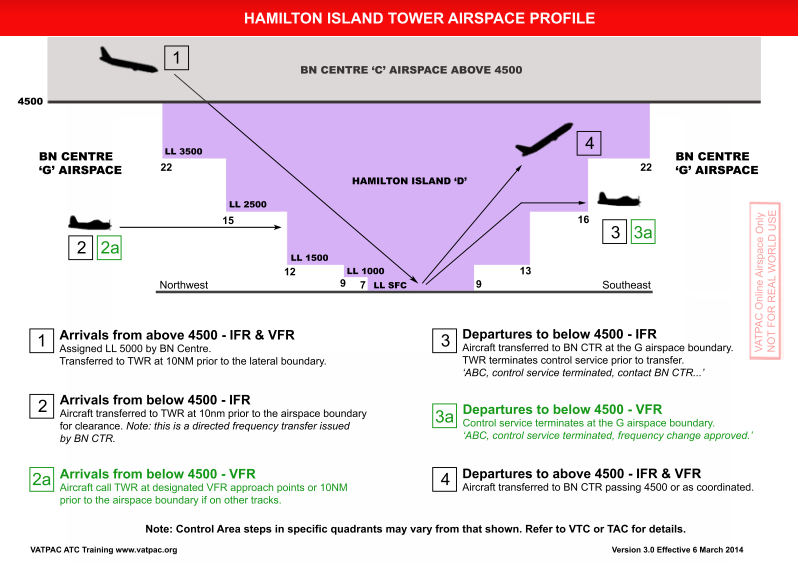

--8<-- "includes/abbreviations.md"

## Positions

| Name | Callsign | Frequency | Login Identifier |
| ---- | -------- | --------- | ---------------- |
| Hamilton Island ADC | Hamilton Tower | 118.700 | HM_TWR |
| Hamilton Island ATIS | N/A | 128.350 | YBHM_ATIS |

## Airspace

<figure markdown>
{ width="700" }
  <figcaption>YBHM Airspace</figcaption>
</figure>