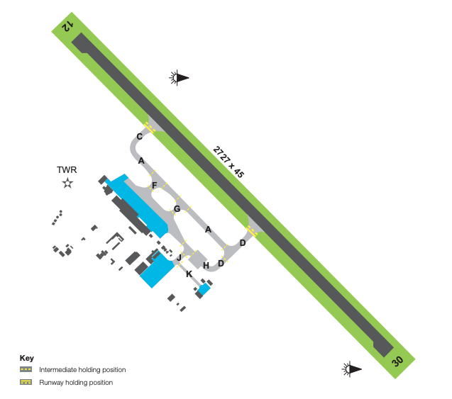

--8<-- "includes/abbreviations.md"

## Positions

| Name              | Callsign       | Frequency        | Login Identifier                         |
| ----------------- | -------------- | ---------------- | ---------------------------------------- |
| **Hobart ADC**    | **Hobart Tower**   | **118.100**     | **HB_TWR**                            |
| **Hobart SMC**    | **Hobart Ground**  | **121.700**     | **HB_GND**                  |
| Hobart ATIS       |                | 128.450          | YMHB_ATIS                                |

In the absence of an SMC controller, ADC shall assume the SMC responsibilities.

### Maneuvering Area Responsibility
<figure markdown>
{ width="500" }
</figure>

## Airspace

<figure markdown>
{ width="700" }
</figure>

<figure markdown>
{ width="700" }
</figure>

## SID Selection

Jet Aircraft planned via **CLARK**, **LATUM**, or **LAVOP**, shall be assigned the **Procedural SID** that terminates at the appropriate waypoint.

Jet Aircraft **not** planned via **CLARK**, **LATUM**, or **LAVOP**, shall be assigned an appropriate **Procedural SID** or a visual departure.

Non-Jet Aircraft planned via **CLARK**, **KANLI**, or **LAVOP**, shall be assigned the **Procedural SID** that terminates at the appropriate waypoint.

Non-Jet Aircraft **not** planned via **CLARK**, **KANLI**, or **LAVOP**, shall be assigned an appropriate **Procedural SID** or a visual departure.

## Cambridge (YCBG)

HB ADC and/or HB SMC is resposible for clearances into and out of Cambridge (YCBG).

Prior to leaving APN, aircraft will establish communications with HB SMC for Airways Clearance.

!!! Example
    **NDR** -> **HB SMC**: "Hobart Ground, NDR, for Devonport, Request Clearance"  
    **HB ADC** -> **NDR**: "NDR, Cleared to Devonport via KANLI flight plan route, KANLI# Departure, Climb via SID A045, Squawk 4432"
    `AIP GEN 3.4`

When ready to taxi and prior to leaving the apron aircraft must contact HB ADC, advising intended runway for departure and receipt of YMHB ATIS, to obtain TFC information.

!!! Example
    **NDR** -> **HB ADC**: "Hobart Tower, NDR, Cambridge Runway 32, Hobart Information D"  
    **HB ADC** -> **NDR**: "NDR, No reported IFR traffic, report ready"
    **NDR** -> **HB ADC**: "Wilco, NDR"  
    `AIP GEN 3.4`

Landing and Takeoff clearances are not given. ACFT will remain clear of active runway and report ready to HB ADC. Aircraft must not enter ACTIVE runway and become airborne until departure instructions have been issued.

!!! Example
    **NDR** -> **HB ADC**: "NDR, Ready"  
    **HB ADC** -> **NDR**: "NDR, track via the KANLI# departure, report airbourne"
    **NDR** -> **HB ADC**: "Track via the KANLI# departure, wilco, NDR"  
    `AIP GEN 3.4`

All IFR Aircraft departing Cambridge shall be assigned a **Visual Departure** or **Hobart SID**.

!!! Note
    If IMC conditions apply, IFR aircraft will fly Hobart IAP's then breakoff to circle to land.

## VFR Operations

### Circuit Direction

| Runway | Direction |
| ------ | ----------|
| 12     | Left  |
| 30     | Right |

### Inbound / Outbound

| Victor    | Inbound       | Outbound        | 
| --------- | -------------- | ---------------- | 
| Northwest |  CBV-CPA-RCH west of the Colebrook/Richmond Road to west abeam RADT.  | West abeam RADT-RCH-CPA-CBV west of the Richmond/Colebrook Road.    | 
| Northeast |  CBV-CPA-Orielton-SORL east of Colebrook Road to CPA then Orielton east of Tasman HWY to SORL. |  As directed by ATC to SORL then Orielton east of Tasman HWY, thence east of Colebrook Rd east of CPA to CBV.   | 
| East      |  DLY-SORL north of the Arthur HWY.        |  As directed by ATC to SORL   | 
| Southwest |  DRP to-CBG west of Mt Rumney.        |  Eest of Mt Rumney to DRP.        | 
| South     |  CRM-LAUD-CBG.            |  LAUD-CRM.          | 
| West      |  BOWB to Risdon Vale thence Cambridge township.   |  Risdon Vale thence BOWB. | 

<figure markdown>
{ width="700" }
</figure>

Clearances for aircraft entering the CTR must be worded so as to leave no possibility for misinterpretation by the pilot.

!!! Example
    **NDR** -> **HB ADC**: "Hobart Tower, NDR, Campania, A015, on the Victor Northwest, Request Clearance"  
    **HB ADC** -> **NDR**: "NDR, enter the CTR tracking via the Victor Northwest at A015."
    `AIP GEN 3.4`
