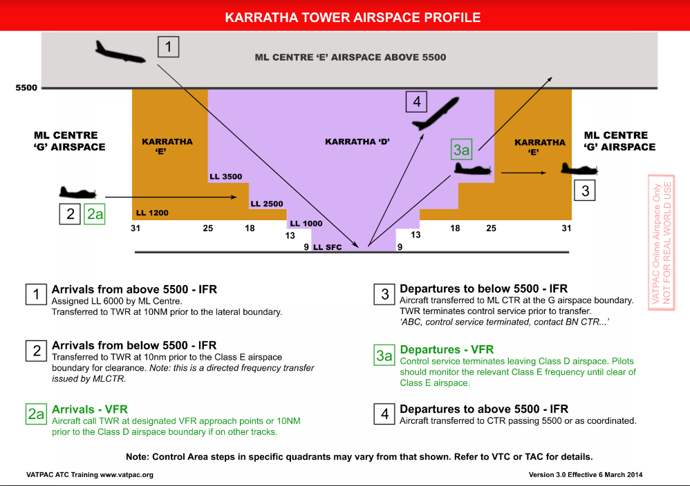

--8<-- "includes/abbreviations.md"

## Positions

| Name | Callsign | Frequency | Login Identifier |
| ---- | -------- | --------- | ---------------- |
| Karratha SMC | Karratha Ground | 123.550 | KA_GND |
| Karratha ADC | Karratha Tower | 127.350 | KA_TWR |
| Karratha ATIS | N/A | 128.350 | YBAS_ATIS |

## Airspace

<figure markdown>
{ width="700" }
  <figcaption>YPKA Airspace</figcaption>
</figure>

Refer to [Class D Tower Skills](../../controller-skills/classdtwr) for more information.

## Surveillance
KA TWR is permitted to use Surveillance standards for separation. Surveillance coverage can be expected to be available at all levels in the KA CTR.  
For simulation purposes, visual separation is assumed to exist below the cloud base, and within 5nm. Visual separation can still be used to separate from aircraft on an instrument approach, below the cloud base.
## Coordination
### Departures
A 'next' call is made for all aircraft when they are next to depart. KA TWR must inform OLW if the aircraft does not depart within **2 minutes** of the next call.

!!! example
    **KA TWR** -> **OLW**: "Next, NWK694"  
    **OLW** -> **KA TWR**: "NWK694"  

The Standard Assignable level from KA TWR to OLW is the lower of `A050` or the `RFL`, any other level must be prior coordinated.
### Arrivals
OLW will coordinate the sequence to KA TWR.

!!! example
    **OLW** -> **KA TWR**: "New Sequence of 2. Via PD, FD630J, Number 1. Via PKAEC for the RNAV Z RWY 26, VOZ1729, Number 2”  
    **KA TWR** -> **OLW**: "FD630J, Number 1. VOZ1729, Number 2"  

The Standard Assignable level from OLW to KA TWR is `A060`, any other level must be prior coordinated.