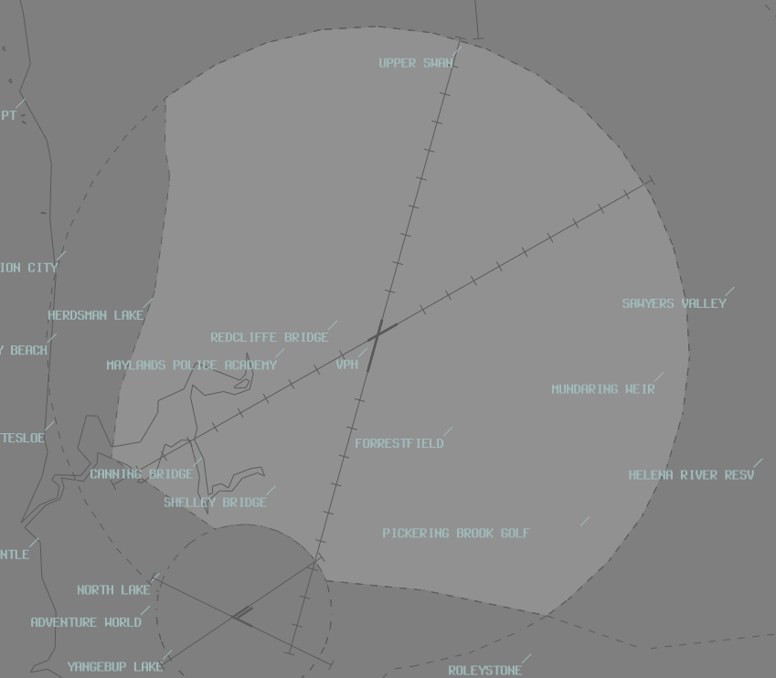

--8<-- "includes/abbreviations.md"

## Positions

| Name | Callsign | Frequency | Login ID |
| ---- | -------- | --------- | -------- |
| **Perth ADC** | Perth Tower | 127.400 | | PH_TWR |
| **Perth SMC West** | Perth Ground | 121.700 | PH_GND |
| Perth SMC East† | Perth Ground | 122.200 | PH-E_GND |
| **Perth ACD** | Perth Delivery | 118.550 | PH_DEL |
| Perth ATIS | N/A | 123.800 | YPPH_ATIS |

† **Non-standard position** – may only be used in accordance with [VATPAC Ratings and Controller Positions Policy](https://cdn.vatpac.org/documents/policy/Controller+Positions+and+Ratings+Policy+v5.2.pdf){target=new}

In the absence of an ACD controller, SMC shall asssume the ADC responsibilities.  
In the absence of an SMC controller, ADC shall assume the SMC and ADC responsibilities.

## Runway Selection

#### Southwest Plan

- Any combination of Runway 21 and/or 24.
- The ATIS shall notify "EXPECT ILS APPROACH"

**Runway Assignment**

| Feeder Fix | Runway |
| ---------- | ------ |
| JULIM | 21 |
| CONNI | 21 |
| WAVES | 21 |
| BEVLY | 21 | 
| GRENE | 24 |
| SOLUS | 24 |

#### Northeast Plan

- Any combination of Runway 03 and/or 06.
- In the following conditions, ATIS shall notify "EXPECT ILS APPROACH"
    - By night; and/or
    - Cloud base of 3200FT or below
- When Runway 03 is in use, process aircraft on the following SIDS from Runway 03:
    - MANDU
    - KEELS
    - SOLUS

## Airspace
Tower airspace is defined as between SFC to 1500 FT, within the lateral limits:
 a) 11DME PH; then 
 b) Herdsman Lake; then 
 c) 3NM JT ARP.

<figure markdown>
{ width="700" }
  <figcaption>Perth Tower Airspace</figcaption>
</figure>

## Standard Assignable Levels
ACD shall assign all departing aircraft 5000ft or the requested level if lower.
## Miscellaneous

### Circuit Training
Circuit training traffic shall be issued SSR code and clearance to operate within circuit area not above A015. Circuit training is typically conducted on Runway 03/21.

All circuits are to be conducted to the east of Runway 03/21. Circuits being conducted on Runway 03 are a non-standard right-hand circuit.

### Scenic Flights
When traffic permits, VFR scenic flights over Perth are cleared via VICTOR 65 route (CTE-PCTY-HKE).

### Separation
#### 2400m Reduced Runway Separation Minima
By day, ATC may use 2400m runway separation between aircraft arriving to Runway 03/21. Both aircraft may occupy the runway during application of the standard. Read more on the standard [here](../controller-skills/SepStandards.md).

### ATIS Notification of Departure Runway
When both Runway 03 and Runway 06 are nominated as departure runways, broadcast the following:

`RWY 03 FOR DEP VIA OTLED, AVNEX, MANDU, SOLUS AND KEELS. RWY 06 FOR
ALL OTHER DEP.`

## Coordination
### PH ADC / PH TCU
#### Auto Release

"Next" Coordination is a procedure where the PH TWR controller gives a heads-up to the PH TCU controller about an impending departure. The PH TCU controller will respond by assigning a heading to the aircraft, for the PH TWR controller to pass on with their takeoff clearance.

!!! example
    PH ADC -> PH TCU: "Next, ABC"  
    PH TCU -> PH ADC: "ABC, Heading 010"  
    PH ADC -> PH TCU: "Heading 010, ABC"  
    PH ADC -> ABC: "ABC, Assigned heading left 010, Runway 03, Cleared for Takeoff"  
    ABC -> PH ADC: "Left heading 010, Runway 010, Cleared for Takeoff, ABC"  
    `AIP GEN 3.4`

"Next" Coordination to PH TCU is additionally required for:  
    a) Aircraft on a non-standard level. 
    b) Aircraft departing from a runway not nominated in the ATIS. 

The PH TCU controller can suspend/resume Auto Release at any time, with the concurrence of PH TWR.

"Next" Coordination to PH TCU is not required for aircraft assigned a **Procedural SID** and the Standard Assignable Level.

## PH ADC / PH SMC
#### Ground Operations
ADC has Responsibility of the Runways, meaning SMC must always coordinate with ADC to allow aircraft to cross runways whilst taxiing. SMC may request, or ADC may elect, to release certain runways to the SMC controller, so they may let aircraft cross the runway without coordination (For example, Releasing runway 06/24 to SMC while not in use.) This Release may also be cancelled at the controller's discretion.

### PH ACD / PH TCU
The controller assuming responsibility of ACD shall give heads-up coordination to the relevant PH TCU controller prior to the issue of the following clearances:  
a) VFR Departures  
b) Aircraft using a runway not on the ATIS

!!! example
    ABC -> PH ACD: "Perth Delivery, ABC, Requesting a Victor 65 scenic."  
    PH ACD -> ABC: "ABC, Perth Delivery, Standby"  
    PH ACD -> PH TCU: "ABC, Requesting clearance for a victor 65 scenic"  
    PH TCU -> PH ACD: "ABC, Cleared for a victor 65 scenic"  
    PH ACD -> PH TCU: "Cleared for a victor 65 scenic ABC"  
    PH ACD -> ABC: "ABC, Cleared for a victor 65 scenic"  
    ABC -> PH ACD: "Cleared for a victor 65 scenic, ABC"  

## Standard Assignable Levels

All aircraft: `A050` or `RFL` if lower.

## Departures Controller

Refer to [Perth TCU Airspace Division](../../terminal/perth/#airspace-division) for information on airspace divisions when **PHD** is online.