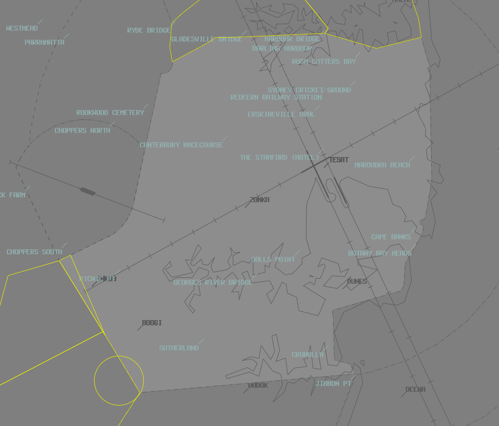

--8<-- "includes/abbreviations.md"

## Positions

| Name               | Callsign       | Frequency        | Login Identifier                         |
| ------------------ | -------------- | ---------------- | ---------------------------------------- |
| **Sydney ADC West**    | **Sydney Tower**   | **120.500**          | **SY_TWR**                                   |
| Sydney ADC East†   | Sydney Tower   | 124.700          | SY-E_TWR                                 |
| **Sydney SMC West**    | **Sydney Ground**  | **126.500**          | **SY_GND**                                   |
| Sydney SMC East†   | Sydney Ground  | 121.700          | SY-E_GND                                 |
| Sydney Coordinator† | Sydney Coordinator   | 127.600          | SY-C_GND                                |
| **Sydney ACD**         | **Sydney Delivery**| **133.800**          | **SY_DEL**                                   |
| Sydney ATIS        |                | 126.250          | YSSY_ATIS                                |

† **Non-standard position** – may only be used in accordance with VATPAC Ratings and Controller Positions Policy (link)

In the absence of an ACD controller, SMC shall asssume the ACD responsibilities.  
In the absence of an SMC controller, ADC shall assume the SMC and ACD responsibilities.
### Maneuvering Area Responsibility
<figure markdown>
{ width="500" }
  <figcaption>Maneuvering Area</figcaption>
</figure>

#### Standard Taxi Routes

Except when the traffic situation warrants, taxi clearances shall conform to the following diagram:
<figure markdown>
{ width="500" }
  <figcaption>Standard Taxi Routes</figcaption>
</figure>

!!! tip
    For aircraft taxiing northbound on B, consider instructing them to hold short of taxiway B8 when 34L is in use for arrivals, in order to separate from aircraft using the B9 rapid exit.

Intersection departures are not permitted for Jet aircraft on runway 34L. `ERSA FAC YSSY`
## Airspace
Tower airspace is defined as between SFC to 500 FT, within the lateral limits:
a) Wanda Kopter Route; then
b) along the SY CTR boundary; to
c) Long Bay; then
d) direct to YSSY.

<figure markdown>
{ width="700" }
  <figcaption>Sydney Tower Airspace</figcaption>
</figure>

## Runway Modes
Winds must always be considered for Runway modes (Crosswind <20kts, Tailwind <5kts), however the order of preference is as follows:

| Priority - Mode | Arrivals  | Departures |
| ----------------| --------- | ---------- |
| 1 - SODPROPS    | 34L       | 16L        |
| 2 - 34 PROPS    | 34L & 34R | 34L & 34R  |
| 2 - 16 PROPS    | 16L & 16R | 16L & 16R  |
| 3 - 16D/07A     | 07        | 16L & 16R  |
| 3 - 25D/34A     | 34L & 34R | 25         |
| 4 - 16D/25A     | 25        | 16L & 16R  |
| 5 - 07          | 07        | 07         |
| 5 - 25          | 25        | 25         |
| *Curfew         | 34L       | 16R        |

*Permitted between the hours of 2300 and 0600 Local. If the pilot does not want to participate in curfew mode operations, the controller must accommodate this request

!!! note
    In general, the SODPROPS, 16D/07A, and 25D/34A modes are most suitable for Noise Abatement. The PROPS modes are most suitable for higher capacity. Since for the most part, neither of these are a factor on VATSIM, it is up to you which runway mode you would like to operate, subject to winds. Consider favouring the higher capacity PROPS modes during busy times, such as events like Milk Run Monday or Panic Stations.

!!! tip
    Take in to account an aircraft's weight when Runway 16L/34R or 07/25 are in use. The aircraft may operationally require the longer Runway 16R/34L. If in doubt, ask the pilot. The aircraft may simply want a departure from 16R instead of 16L so they have a shorter taxi, for example. If the traffic situation permits, try to be accommodating of these requests.

When using the SODPROPS mode, pass traffic information to aircraft that are departing and landing at the same time

!!! example
    **SY ADC:** "ABC, Traffic is DEF, a 737, on short final for the opposite direction parallel runway. Runway 16L, Cleared for Takeoff"  
    **ABC:** "Cleared for Takeoff Runway 16L, ABC"  
    **SY ADC:** "DEF, Traffic is ABC, an A320, departing from the opposite direction parallel runway to the South-East. Runway 34L, Cleared to Land"  
    **DEF:** "Cleared to Land Runway 34L, DEF"  
## Parallel Runway Operations

#### Go-arounds / Missed Approaches
When operating under PROPS, go around headings shall diverge from the extended centreline by at least 30° away from the parallel runway. Aircraft on the ILS may follow the Published Missed Approach in order to meet this requirement.  
Go Arounds / Missed Approaches shall be coordinated to the SY TCU as per the standard procedure.

#### Runway Selection
Unless operationally required, aircraft shall be assigned the following runways for departure when PROPS are in progress:

| Aircraft tracking | Runway  |
| ----------------| --------- |
| via KADOM   | 16R/34L      |
| via WOL | 16R/34L |
| via RIC| 16R/34L |
| via ENTRA | 16L/34R |
| Other aircraft: |
| To the NORTH and EAST | 16L/34R |
| To the SOUTH and WEST | 16R/34L |

#### SID Selection

Jet Aircraft planned via **KADOM**, **WOL**, **RIC**, or **ENTRA**, shall be assigned the **Procedural SID** that terminates at the appropriate waypoint.

!!! example
    Jet Aircraft planned via ENTRA, assigned runway 16L, shall be given KEVIN# departure, ENTRA transition.

Jet Aircraft **not** planned via **KADOM**, **WOL**, **RIC**, or **ENTRA**, and **not** using Runway 25, shall be assigned the **Procedural SID** appropriate to their runway, with the **RADAR** transition.

!!! example
    Jet Aircraft planned via EVONN, assigned runway 34R, shall be given MARUB# departure, RADAR transition.

!!! note
    Heavier aircraft on long-haul flights may not be able to achieve the Climb Gradient required of the Procedural SIDs. In this instance, they shall be assigned the **Radar SID**, as it has a shallower minimum Climb Gradient. If in doubt, ask the pilot.

All other aircraft (Non-Jet aircraft, Aircraft with shallow Climb Gradient, and Aircraft using Runway 25), shall be assigned the **Radar SID**.

!!! example
    Non-Jet Aircraft planned via CORDO, assigned runway 16R, shall be given the SYDNEY# departure.

!!! tip
    A Radar SID (eg, SYDNEY 2 departure) is distinct from a SID with a RADAR transition (eg, RICHMOND 5 departure, RADAR transition) SIDs with a RADAR Transition are still considered Procedural SIDs. A Radar SID can be identified in the DAPs (link) as having a "(RADAR)" at the end of the name.
## ATIS
#### Approach Types

| Cloud Base             | Visibility     | Approach                             |
| -----------------------| -------------- | -------------------------------------|
| >3000FT                | >5000M         | `EXPECT INDEPENDENT VISUAL APPROACH` |
| Between 2000FT & 3000FT| >5000M         | `EXPECT INSTRUMENT APPROACH THEN INDEPENDENT VISUAL APPROACH WHEN VISUAL`|
| Below 2000FT **or**    | <5000M         | `EXPECT INSTRUMENT APPROACH`                |

#### Operational Info

When parallel runways are used for departures but inbound traffic levels don't necessitate independent approaches (low traffic levels), the ATIS OPR INFO shall include:  
`INDEPENDENT PARALLEL DEPARTURES IN PROGRESS`  

When parallel runways are used for departures and the arrival sequence requires independent approaches (high traffic levels), the ATIS OPR INFO shall include:  
`INDEPENDENT PARALLEL APPROACHES AND DEPARTURES IN PROGRESS`   

When SODPROPS are in operation, the ATIS OPR INFO shall include:  
`SIMULTANEOUS OPPOSITE DIRECTION PARALLEL RUNWAY OPERATIONS IN PROGRESS`  

When Independent Visual Approaches are run during PROPS, the OPR INFO must also include:
`DO NOT PASS THRU ASSIGNED RWY CENTRELINE`

!!! example
    <figure markdown>
        
    </figure>