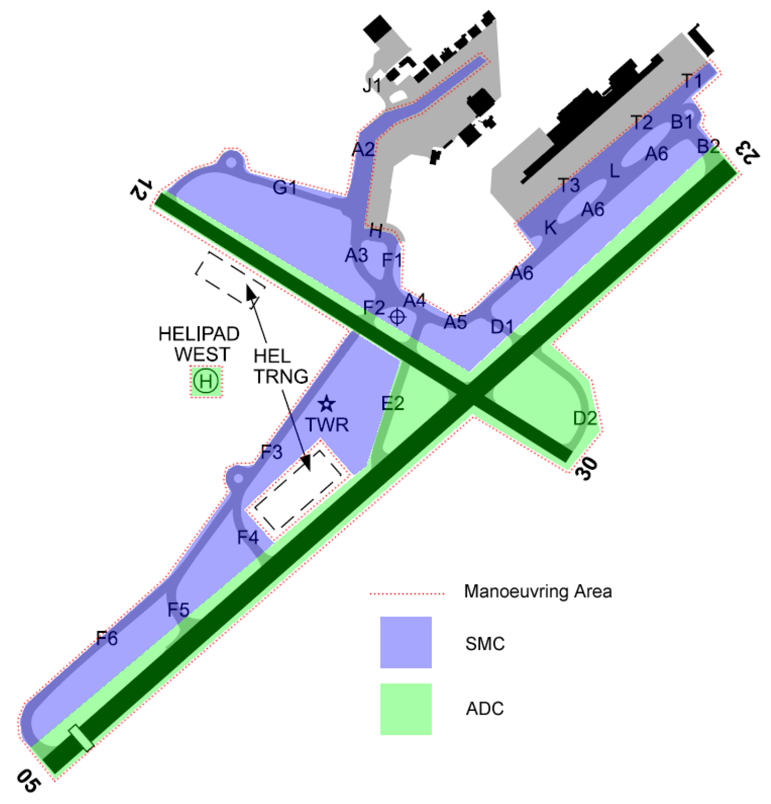

--8<-- "includes/abbreviations.md"

## Positions

| Name               | Callsign       | Frequency        | Login Identifier                         |
| ------------------ | -------------- | ---------------- | ---------------------------------------- |
| Adelaide ADC    | Adelaide Tower   | 120.500          | AD_TWR                                   |
| Adelaide SMC    | Adelaide Ground  | 121.700          | AD_GND                                   |
| Adelaide ACD         | Adelaide Delivery| 126.100          | AD_DEL                                   |
| Adelaide ATIS        |                | 134.500         | YPAD_ATIS                                |

## Airspace
AD ADC is not responsible for any airspace by default.

## Maneuvering Area Responsibility

<figure markdown>
{ width="500" }
  <figcaption>YPAD Maneuvering Area</figcaption>
</figure>

!!! note
    Where an aircraft will be taxiing via multiple taxiways of the same lettering (e.g. A6, then A5, then A4, etc), refer to the taxiway by only the letter.  

    E.g. an aircraft taxiing from the terminal to runway 05 could be instructed to taxi "*via Alpha, cross runway 30, Foxtrot, to holding point Foxtrot Six runway 05*".

## Scenic Coastal Flights
VFR aircraft may transit the control zone tracking coastal north or southbound, generally at `A005`. **AD TCU** is responsible for ensuring these aircraft remain separated from aircraft arriving/departing at YPAD and will likely delegate this responsibility to **ADC**, who may employ visual separation or other tools to ensure separation is maintained.  

The TCU controller will coordinate these aircraft with ADC prior to issuing airways clearance, including the intended clearance limit. On receipt of this coordination, ADC should consider any possible conflict from arriving or departing aircraft at YPAD (including the missed approach to runway 23).  The clearance limits in the table below will ensure that coastal aircraft remain clear of the runway 05 approach path and runway 23 departure/missed approach path. 

| Direction of Travel | Clearance Limit |
| --- | --- |
| Northbound | BTJ |
| Southbound | HNLY |

<figure markdown>
{ width="500" }
  <figcaption>Clearance Limits (red) and Approach/Departure Path (green)</figcaption>
</figure>

!!! example
    *CNY is a VFR Cessna 172 tracking coastal northbound, approaching PNL. They have contacted AD TCU for clearance.*    
    **TCU** -> **ADC**: "South of PNL, CNY, for coastal northbound, 500ft, clearance limit BTJ"  
    **ADC** -> **TCU**: "CNY"

If a delay is expected at the clearance limit, instruct the aircraft to hold there.

!!! example 
    **CNY:** "Adelaide Tower, CNY, maintaining not above 500ft"  
    **AD ADC:** "CNY, Adelaide Tower, hold at the clearance limit, expect onwards clearance in 5 minutes due inbound traffic"  
    **CNY:** "Hold at the clearance limit, CNY"  

Once the conflict is no longer a threat (or if no holding was required in the first place), cancel the clearance limit and issue onwards clearance tracking coastal north/southbound at the desired level.

!!! example 
    **AD ADC:** "CNY, cancel clearance limit, track coastal offshore northbound, not above 500ft"  
    **CNY:** "Cancel clearance limit, track coastal offshore northbound, not above 500ft, CNY"

Once the aircraft is clear of potential conflict with YPAD (i.e. north of HNLY or south of BTJ), transfer them back to AD TCU.

## Runway Modes
Single runway operations using Runway 05 or 23 (whichever is more favoured by the winds) are preferred at YPAD. However, when strong winds favour Runway 12 or 30, Non-Jets (Runway 12/30 is too short for most jets) would benefit from having that runway available to them as well. As a general rule of thumb, if the Crosswind on Runway 05/23 exceeds **20kts**, the more favourable of Runway 12 or 30 shall be in use as well as the more favourable of Runway 05 or 23.

!!! example
    METAR: `YPAD 210600Z 15030KT 9999 FEW030 21/11 Q1002 RMK RF00.0/000.0`  
    ATIS: `RUNWAY 23 AND 12 FOR ARRIVALS AND DEPARTURES`

!!! note
    Where low traffic levels and relevant meteorological conditions permit, non-jet arrivals from the west may be offered runway 12.

### Runway 23 Arrivals
With **Runway 23** in use for arrivals and the cloud base above `A024` but below `A043`, the ATIS APCH field shall include:  
`ACFT FM THE EAST AND JET ACFT FM THE WEST EXP INSTR APCH`  

This allows aircraft on the Victor STAR from the west to join a visual right base without the need to conduct an instrument approach, while keeping aircraft from the east clear of the higher terrain near the Adelaide Hills.

### Curfew Mode

Between the hours of 1330-2030 UTC (1230-1930 UTC HDS), AD ADC may elect to simulate Curfew operations, ie: **Runway 23 for arrivals, Runway 05 for departures**. When this is in operation, the ATIS shall include `CURFEW IN OPERATION UNTIL (time) ZULU`.

## SID Selection
Jet Aircraft planned via **PANKI**, **BENDO**, **GILES**, **HAWKY**, **ORBUN**. or **SEDAN**, shall be assigned the **Procedural SID** that terminates at the appropriate waypoint. Jet Aircraft **not** planned via any of these waypoints shall receive amended routing via the most appropriate SID terminus, unless the pilot indicates they are unable to accept a Procedural SID.

!!! example
    Jet Aircraft planned via PANKI, assigned runway 23, shall be given the PANKI SID.

a) Non-Jet Aircraft; or  
b) Aircraft using Runway 12/30; or  
c) Aircraft that cannot accept a Procedural SID  
Shall be assigned the **Radar SID**.

!!! example
    Non-Jet Aircraft planned via EEMUE, assigned runway 05, shall be given the AD (RADAR) SID.

## Coordination
### Auto Release
'Next' coordination is **not** required to AD TCU for aircraft that are:   
  a) Departing from a runway nominated on the ATIS; and  
  b) Assigned the standard assignable level; and  
  c) Assigned a **Procedural** SID

All other aircraft require a 'Next' call to AD TCU.

!!! example
    **AD ADC** -> **AD TCU**: "Next, RXA4362, Runway 23"  
    **AD TCU** -> **AD ADC**: "RXA4362, Track Extended Centreline, Unrestricted"  
    **AD ADC** -> **AD TCU**: "Track Extended Centreline, RXA4362"  
    
    **AD ADC**: "RXA4362, Track Extended Centreline 222 degrees, Runway 23, Cleared for Takeoff"  
    **RXA4362**: "Track Extended Centreline 222 degrees, Runway 23, Cleared for Takeoff, RXA4362"

The AD TCU controller can suspend/resume Auto Release at any time, with the concurrence of **AD ADC**.

The Standard Assignable level from AD ADC to AD TCU is:  
For Jets: `A050`  
For Non-Jets: The lower of `A040` or the `RFL`

### Departures Controller
When **AAE** is online, the AD TCU airspace is split down the 05/23 Runway Centreline. As such, departing aircraft shall be instructed to contact the departures controller corresponding to the direction of turn of the aircraft after departure

| Tracking via            | Departure Runway      | Departures Controller        |
| ------------------ | -------------- | ---------------- |
| VILAD   | 05/23/12   | AAE         |
| SEDAN    | 05/23/12   | AAE         |
| PANKI    | 05/23/12   | AAE         |
| BENDO     | 05/23/12 | AAE          | 
| ALBUT    | 05/23/12  | AAE          | 
| EEMUE    | 05/23/30  | AAW          | 
| GILES   | 05/23/30  | AAW          | 
| YORKE    | 05/23/30  | AAW          | 
| HAWKY    | 05/23/30  | AAW          | 
| HOLIT    | 05/23/30  | AAW          | 
| ORBUN    | 05/23/30  | AAW          | 
| All   | 12  | AAE          | 
| All   | 30  | AAW          | 