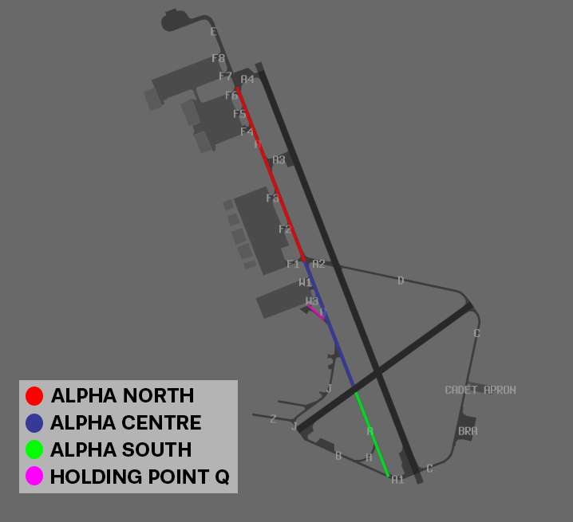

--8<-- "includes/abbreviations.md"

## Positions

| Name               | Callsign       | Frequency        | Login ID              |
| ------------------ | -------------- | ---------------- | --------------------------------------|
| **Amberley ADC**    | **Amberley Tower**  | **118.300**         | **AMB_TWR**        |
| **Amberley SMC**    | **Amberley Ground**  | **129.350**      | **AMB_GND**        |
| **Amberley ACD**    | **Amberley Delivery**  | **134.600**         | **AMB_DEL**       |
| Amberley ATIS    |   | 123.300         | YAMB_ATIS       |

## Airspace

AMB ADC owns the Class C airspace **in the AMB CTR** within 10nm of the YAMB ARP from `SFC` to `A015`. This airspace is primarily used for military circuits and initial and pitch approaches.

## YAMB Aerodrome

### SID Selection
Aircraft planned via **BN**, **JEDDA**, **MESED**, **BOBOP**, **TATEN**, shall be assigned the **Procedural SID** that terminates at the appropriate waypoint.
Aircraft who are not planned via those points or who are negative RNAV may be assigned a RADAR SID or a visual departure. 

### Coded Departures (Fast Jets)
Visual Departures are commonly requested by high performance military jets and often processed in the form of a coded departure (e.g. BYRON1 departure), which can be found in the AD2 Sups Page for YAMB. These coded departures provide a corridor with altitude constraints to join the Military Training Areas east of Brisbane, avoiding civilian traffic inbound to Brisbane. 

!!! phraseology
    CRNG21 plans to enter R637 via the gate MOSSI for Military Training.  
    **AMB ADC**: "CRNG21, cleared YAMB via MOSSI, flight planned route. Runway 15, Northern 3 Departure. Climb `F190`. Squawk 3601, Departure Frequency 126.20"   

Aircraft will depart the circuit visually and track overhead YAMB to begin tracking for their initial waypoint.

!!! phraseology
    WOLF03 was assiged the BYRON1 departure with their initial clearance.  
    **AMB ADC**: "WOLF03, make left turn, reach `F190` by COWIE, cleared for takeoff"  
    **WOLF03**: "Make left turn, reach `F190` by COWIE, cleared for takeoff, WOLF03"  

| Departure | Initial Constraint | Route |
| --------- | ----------| --------- |
| Northern 3 | `F190` at BINUP | BINUP MURJO BOBED LESKO MOSSI/ADNUK (Transition) |
| Northern 4 | `F200` at ANKED | ANKED JEZZA BOBED LESKO MOSSI/ADNUK (Transition) |
| Central 3 | `F190` at BINUP | BINUP MURJO BOBED VIRGE |
| Central 4 | `F200` at ANKED | ANKED JEZZA BOBED VIRGE |
| Byron 1 | `F190` at COWIE | COWIE KIWEE ZANET LOTMA SEMAJ |
| Byron 2 | `F200` at TUGUN | TUGUN LAGOB ZANET LOTMA SEMAJ |

!!! note
    Since the Coded Departures are not SIDs, AMB ACD needs to write the name of the coded departure in the Global Ops Field of the FDR and amend the flight plan route to include all relevant tracking points.

!!! abstract "Reference"
    Charts for the Coded Departures are available in: [YAMB FIHA AD2 Supp Section 6.2.25](https://ais-af.airforce.gov.au/australian-aip){target=new}

### Runway Operations
Runways 15/33 are the primary runways at YAMB. 

## Helicopter Operations

### Taxiway Alpha

Taxiway Alpha has been divided into portions for helicopter operations as follows;

| Location | Name |
| ------ | ----------|
| Between A2 and A4     | Alpha North  |
| Between A2 and RWY 04/22     | Alpha Centre |
| Between A1 and RWY 04/22     | Alpha South |
| TWY Q and A Junction     | Holding Point Quebec |

<figure markdown>
{ width="600" }
  <figcaption>YAMB Helicopter Taxiway Alpha</figcaption>
</figure>

### Helicopter Circuits

To facilitate helicopter circuits, two areas have been established.

**Choppers East**:  
Utilising the threshold RWY 22 as a HLS, remaining within 600 m of threshold RWY 22
and east of a line parallel to RWY 15/33 intersecting threshold RWY 22  

**Choppers West**  
Utilising the threshold RWY 04 as a HLS, remaining within 600 m of threshold RWY 04
and west of a line parallel to RWY 15/33 intersecting threshold RWY 04.

!!! note
    The primary area for continuous circuit operations is **Choppers East**, due to the displaced distance of the threshold of runway 22 from runway 15/33.

## Miscellaneous

### Circuit Operations
The Circuit Area Airspace is allocated to be within 5nm of the YAMB ARP from `SFC` to `A015`. Aircraft can be instructed to extend outside of this airspace by ATC for traffic management.

Aircraft shall conform to circuit height and direction as follows:  
a) jet and large turbo-prop not above `A015`; and  
b) C-27J, light aircraft and helicopters not above `A010`.  

### Circuit Direction
| Runway | Direction |
| ------ | ----------|
| 15     | Right  |
| 33     | Left |
| 04     | Left |
| 22     | Left |

### Civil Operations
Civil and AAFC conduct flying operations within the South Western Training Area (SWTA). The SWTA is divided in half by the Rosewood-Mt Walker-Aratula Road, SWTA Alpha (north) and SWTA Bravo (south). Once established in the SWTA, aircraft will remain OCTA. Pilots may request to enter the CTA and climb above `A025` when operationally required.

Departures:

| **Duty Runway** | **Routing** | **Altitude** |
|-----------------|-----------|--------------|
| 15              | MTWK      | `A025`         |
| 33              | CLVT      | `A025`        |

Arrivals:

| **Duty Runway** | **Routing** | **Altitude**         |
|-----------------|-----------|----------------------|
| 15              | CLVT      | `A025` or `A015`        |
| 33              | MTWK      | `A025` or `A015`       |

!!! phraseology 
    **AMB ADC**: "ASTR203, cleared SWTA Alpha via MTWK, maintain 2500, squawk 7301"  
    **ASTR203**: "Cleared SWTA Alpha via MTWK, maintain 2500, squawk 7301, ASTR203"    

## Coordination
### AMB TCU

'Next' coordination is required from AMB ADC to AMB TCU for all aircraft.

!!! example
    **AMB ADC** -> **AMB TCU**: "Next, STAL56, runway 33"  
    **AMB TCU** -> **AMB ADC**: "STAL56, Right heading 030, unrestricted"  
    **AMB ADC** -> **AMB TCU**: "Right heading 030, STAL56"  

### Level Assignment
The Standard Assignable Level from  **AMB ADC** to **AMB TCU** is:  
a) The Lower of `F180` or `RFL` for Aircraft assigned via Procedural or RNAV SID.  
b) `F190` for Aircraft assigned a Coded Departure.

## Charts
!!! note
    Additional charts to the AIP may be found in the RAAF TERMA document, available towards the bottom of [RAAF AIP page](https://ais-af.airforce.gov.au/australian-aip){target=new}
