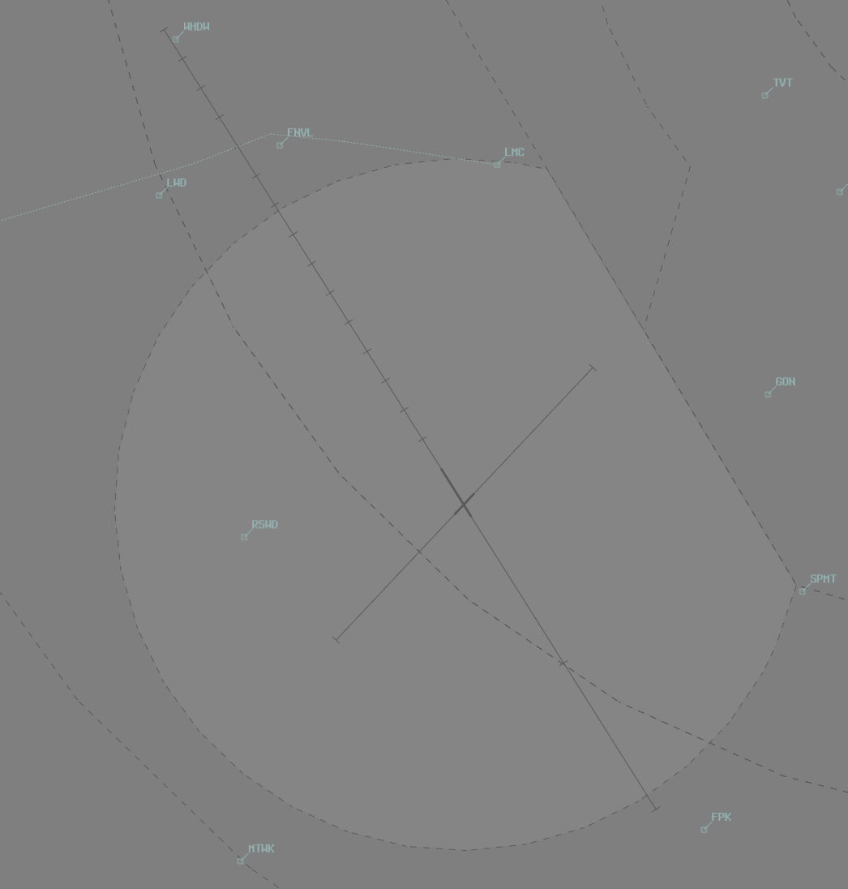
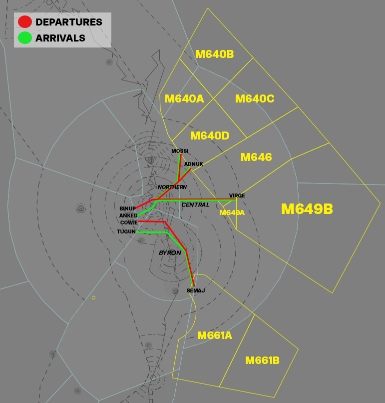

--8<-- "includes/abbreviations.md"

## Positions

| Name               | Callsign       | Frequency        | Login ID              |
| ------------------ | -------------- | ---------------- | --------------------------------------|
| **Amberley ADC**    | **Amberley Tower**  | **118.300**         | **AMB_TWR**        |
| **Amberley SMC**    | **Amberley Ground**  | **129.350**      | **AMB_GND**        |
| **Amberley ACD**    | **Amberley Delivery**  | **134.600**         | **AMB_DEL**       |
| **Amberley ATIS**    |   | **123.300**         | **YAMB_ATIS**       |

## Airspace
AMB ADC owns the Class C airspace in the AMB CTR from `SFC` to `A015`.

<figure markdown>
{ width="600" }
  <figcaption>AMB ADC Airspace</figcaption>
</figure>

## Runway Modes
Runways 15/33 are the primary runways at YAMB.

## Departures
### SID Selection
IFR aircraft planned via **BN**, **JEDDA**, **MESED**, **BOBOP**, **TATEN**, shall be assigned the **Procedural SID** that terminates at the appropriate waypoint.
Aircraft who are not planned via those points may be assigned the RADAR SID or a visual departure. 

## Coded Clearances (Fast Jets)
High performance military jet aircraft with planned operations in offshore SUA, or intending to depart to the east, shall be assigned a Coded Clearance departure. These Coded Clearances provide a standardised corridor avoiding civilian traffic in the adjacent airspace. 

<figure markdown>
{ width="700" }
  <figcaption>YAMB Coded Clearances</figcaption>
</figure>

!!! tip
    Descriptions of the coded clearances are available in the [FIHA AD2 Supps](https://ais-af.airforce.gov.au/australian-aip){target=new}.

### Departures
Aircraft will depart the circuit visually and track overhead YAMB to begin tracking for their initial waypoint. Aircraft cleared the BYRON departure must turn to the west on departure, and may set course for their inital waypoint within 10TAC AMB, remaining within the laterial limits of the AMB CTR in order to meet the inital constraint at `COWIE`.

The following altitude constraints and tracking points are implied by the coded clearance:

| Departure | Initial Constraint | Route |
| --------- | ----------| --------- |
| Northern 3 | `F190` by BINUP | BINUP MURJO BOBED LESKO MOSSI, or BINUP MURJO BOBED LESKO ADNUK |
| Central 3 | `F190` by BINUP | BINUP MURJO BOBED VIRGE |
| Byron 1 | `F190` by COWIE | COWIE KIWEE ZANET LOTMA SEMAJ |

!!! phraseology
    *CRNG21 plans to enter R637 via the gate MOSSI for military training.*  
    **AMB ADC**: "CRNG21, cleared to YAMB via BINUP, thence Northern 3, MOSSI transition, flight planned route. Runway 15, visual departure, climb to `F190`, squawk 3601, departure frequency 126.2"   

!!! warning "Important"
    The Coded Clearances are not present in vatSys, so AMB ACD must write the name of the coded departure in the Global Ops Field of the FDR and amend the flight plan route to include all relevant tracking points.

!!! phraseology
    **AMB ADC**: "CRNG21, make left turn, cleared for takeoff"  
    **CRNG21**: "Make left turn, cleared for takeoff, CRNG21"  

## Circuit Operations
The Circuit Area Airspace is allocated to be within 5nm of the YAMB ARP from `SFC` to `A015`. Aircraft can be instructed to extend outside of this airspace by ATC for traffic management.

Circuits are flown at the following altitudes:

| Aircraft Type | Circuit Altitude |
| ------------- | ---------------- |
| Jets & large turboprops | `A015` |
| Non-jets, small turboprops (up to C-27J) | `A010` | 

### Circuit Direction
| Runway | Direction |
| ------ | ----------|
| 15     | Right  |
| 33     | Left |
| 04     | Left |
| 22     | Left |

## Civil Training Area
Civil operators (including Australian Air Force Cadets) conduct flying operations within the South Western Training Area (SWTA). The SWTA is divided in half by the Rosewood-Mt Walker-Aratula Road into SWTA Alpha (north) and SWTA Bravo (south). The training area is classified Class G airspace but a clearance is required to transit the AMB CTA to/from SWTA.

### Outbound Aircraft
Aircraft shall be cleared via the following waypoints when departing YAMB for the SWTA, assigned `A025`:

| **Duty Runway** | **Routing** |
|-----------------|-----------|
| 15              | MTWK      |
| 33              | CLVT      |
| 04 or 22        | As required |

!!! phraseology 
    **AMB ACD**: "ASTR203, cleared to South Western Training Area Alpha via MTWK, climb to A025, squawk 7301"  
    **ASTR203**: "Cleared South Western Training Area Alpha via MTWK, climb to A025, squawk 7301, ASTR203"

### Inbound Aircraft
AMB TCU will clear inbound aircraft to YAMB via the following waypoints:

| **Duty Runway** | **Routing** |
|-----------------|-----------|
| 15              | CLVT      |
| 33              | MTWK      |
| 04 or 22        | As required |

TCU will transfer the aircraft to ADC approaching the CTR boundary. Instruct the aircraft to join the circuit for the applicable duty runway and clear them for a visual approach (traffic permitting).   

!!! phraseology  
    **ASTR203**: "Amberley Tower, ASTR203, A015"     
    **AMB ADC**: "ASTR203, Amberley Tower, join final Runway 33, cleared visual approach"  
    **ASTR203**: "Join final Runway 33, cleared visual approach, ASTR203"  

## Helicopter Operations
### Arrivals & Departures
Helicopters should be processed as per fixed wing operations unless requested otherwise.

The HLS at the intersection of Taxiway Alpha and Quebec may be used for arriving or departing helicopters at pilot request. It must be treated like a runway, with takeoff and landing clearances issued.

!!! phraseology 
    **BSMN60**: "Amberley Tower, helicopter BSMN60, 12nm south, A010, inbound, received Foxtrot, request Taxiway Alpha"  
    **AMB ADC**: "BSMN60, Amberley Tower, track to Taxiway Alpha, not above A010"  
    **BSMN60**: "Track to Taxiway Alpha, not above A010, BSMN60"  

    **AMB ADC**: "BSMN60, Taxiway Alpha, cleared to land"  
    **BSMN60**: "Taxiway Alpha, cleared to land, BSMN60"

### Low-Level Ops
Taxiway Alpha is used for a variety of ground effect & low-level helicopter operations. It is divided into the following regions:

| Location | Name |
| ------ | ----------|
| Between A2 and A4     | Alpha North  |
| Between A2 and RWY 04/22     | Alpha Centre |
| Between A1 and RWY 04/22     | Alpha South |
| TWY Q and A Junction     | Holding Point Quebec |

<figure markdown>
{ width="600" }
  <figcaption>YAMB Helicopter Taxiway Alpha</figcaption>
</figure>

!!! phraseology 
    **CHOP41**: "Amberley Delivery, CHOP41, for low-level ops within Alpha Centre, request clearance"  
    **AMB ACD**: "CHOP41, Amberley Delivery, cleared to operate within Alpha Centre, not above A001"  
    **CHOP41**: "Cleared to operate within Alpha Centre, not above A001, CHOP41" 

#### Taxiway Segregation
SMC shall provide taxi instructions to the designated area of operations and retain the helicopter on their frequency. It may be necessary to instruct the helicopter to give way to other taxiing aircraft, or provide alternate taxi instructions to other aircraft.

Aircraft taxiing outbound from the Southern Apron shall be instructed to hold short of Holding Point Quebec when necessary, to provide separation with helicopters operating on Taxiway Alpha.

### Helicopter Circuits
To facilitate helicopter circuits, two areas have been established.

**Choppers East**:  
Utilising the threshold RWY 22 as a HLS, remaining east of a line parallel to RWY 15/33 intersecting threshold RWY 22. 

**Choppers West**  
Utilising the threshold RWY 04 as a HLS, remaining west of a line parallel to RWY 15/33 intersecting threshold RWY 04.

!!! note
    The primary area for continuous circuit operations is **Choppers East**, due to the displaced distance of the threshold of runway 22 from runway 15/33.

Circuits are flown at `A010`, in the same circuit direction as the duty runway. 

## Coordination
### AMB TCU
'Next' coordination is required from AMB ADC to AMB TCU for all aircraft.

!!! phraseology
    **AMB ADC** -> **AMB TCU**: "Next, STAL56, runway 33"  
    **AMB TCU** -> **AMB ADC**: "STAL56, unrestricted"  
    **AMB ADC** -> **AMB TCU**: "STAL56"  

The Standard Assignable Level from  **AMB ADC** to **AMB TCU** is:  
a) The Lower of `F180` or `RFL` for Aircraft assigned via Procedural or RNAV SID.  
b) `F190` for Aircraft assigned a Coded Departure.

## Charts
!!! abstract "Reference"
    Additional charts to the AIP may be found in the RAAF TERMA document, available towards the bottom of [RAAF AIP page](https://ais-af.airforce.gov.au/australian-aip){target=new}
