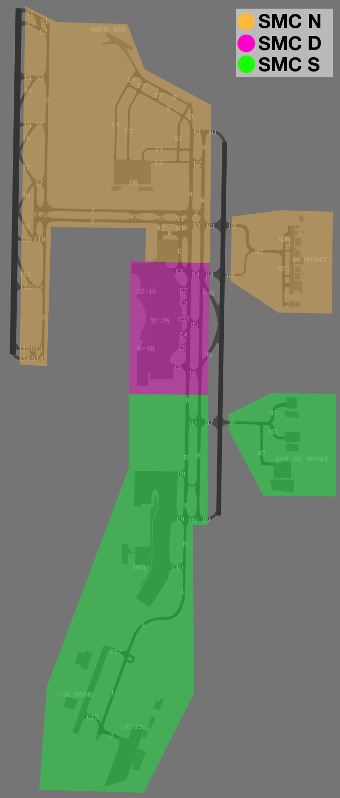

--8<-- "includes/abbreviations.md"

## Positions

| Name              | Callsign              | Frequency   | Login ID      |
| ----------------- | --------------------- | ----------- | ------------- |
| **Brisbane ADC East** | **Brisbane Tower** | **120.500** | **BN_TWR**   |
| Brisbane ADC West :material-information-outline:{ title="Non-standard position"} | Brisbane Tower | 118.000 | BN-W_TWR |
| **Brisbane SMC Domestic** | **Brisbane Ground** | **121.700** | **BN_GND** |
| Brisbane SMC South :material-information-outline:{ title="Non-standard position"} | Brisbane Ground | 122.250 | BN-S_GND |
| Brisbane SMC North :material-information-outline:{ title="Non-standard position"} | Brisbane Ground | 124.050 | BN-N_GND |
| **Brisbane ACD**  | **Brisbane Delivery** | **118.850** | **BN_DEL**    |
| **Brisbane ATIS** |                       | **126.250** | **YBBN_ATIS** |

!!! abstract "Non-Standard Positions"
    :material-information-outline: Non-standard positions may only be used in accordance with [VATPAC Air Traffic Services Policy](https://vatpac.org/publications/policies){target=new}.  
    Approval must be sought from the **bolded parent position** prior to opening a Non-Standard Position, unless [NOTAMs](https://vatpac.org/publications/notam){target=new} indicate otherwise (eg, for events).

## Airspace
BN ADC is not responsible for any airspace by default.

## Manoeuvring Area Responsibility
There are three SMC positions at Brisbane which are responsible for various parts of the manoeuvring area, as shown below.

<figure markdown>
{ width="500" }
  <figcaption>YBBN Manoeuvring Area Responsibility</figcaption>
</figure>

### SMC Frequency Change Instructions
To minimise conflict in the next SMC area of responsibility, aircraft should be instructed to hold short of predetermined taxiways and instructed to contact the next SMC controller (for international aircraft or less-experienced pilots) or allowed to transfer to the next frequency independently (for domestic aircraft).

| Originating SMC | Receiving SMC  | Taxi Instruction |
| --------------- | --------- | ---------- |
| SMC Domestic | SMC North | Hold short W |
| SMC North | SMC Domestic | Hold short B4 |
| SMC Domestic | SMC South | Hold short B7 |
| SMC South | SMC Domestic | Hold short B6 |

When aircraft wish to cross runway 01R/19L and taxi to/from eastern General Aviation Maintenance Area via taxiway H3, they should be instructed to hold short of the runway and contact the next SMC.

### Standard Taxi Routes
Taxiway A is to be used in the same direction as the duty runway. Taxiway B is to be used in the opposite direction to the duty runway.

Taxiway Y is to be used in a westerly direction and Taxiway Z in an easterly direction.

!!! tip
    Aircraft vacating runway 19R may conflict with aircraft taxiing outbound via taxiway Yankee as they turn onto taxiway Sierra. Consider instructing departing aircraft to hold short of Sierra until the conflict can be resolved.  
    
    A similar conflict may exist between aircraft taxiing inbound via taxiway Zulu and aircraft taxiing outbound for runway 19L. Consider instructing inbound aircraft to hold short of taxiway Y1, allowing the use of Y1 and Charlie in case of a queue for holding point A3.

<figure markdown>
{ width="500" }
  <figcaption>Standard Taxi Routes</figcaption>
</figure>

## Separation
### Reduced Runway Separation
When conditions permit, the [2400m separation standard for landing aircraft](../../separation-standards/runway.md#2400m-standard) may be applied to aircraft arriving on any runway.

### SODPROPS
When using the SODPROPS mode, pass traffic information to aircraft that are departing and landing at the same time.

!!! phraseology
    **BN ADC:** "JST521, traffic is a 737 on a 3nm final for the opposite direction parallel runway, runway 01R, cleared for takeoff"  
    **JST521:** "Runway 01R, cleared for takeoff, JST521"  
    **BN ADC:** "VOZ954, traffic is an A320 departing from the opposite direction parallel runway, runway 19R, cleared to land"  
    **VOZ954:** "Runway 19R, cleared to land, VOZ954" 

Ensure the [ATIS](#atis) is updated to reflect the SODPROPS runway mode. 

### Parallel Runway Operations
Refer to [Parallel Runway Separation Standards](../../../separation-standards/parallelapps) for more information

## Workload Management
### Pushback Requests on ACD
During busy periods, SMC and ACD may coordinate to implement the [Pushback Requests on ACD](../../../controller-skills/grounddelaymanagement#pushback-requests-on-acd) procedure to balance the workload across ACD and SMC frequencies.

When implementing the procedure the ATIS [OPR INFO field](#acd-pushback-requests) must be updated to inform pilots the correct frequency on which to request pushback.

## Helicopter Operations
Brisbane has one helipad located on taxiway **F4**. Most rescue helicopters are based within the general aviation maintenance area and may operate from taxiway **H2**.

ADC shall inform SMC of any inbound helicopters so that they may prevent other aircraft from taxiing on the HLS.

!!! tip
    Refer to [Manoeuvring Area Responsibility](#manoeuvring-area-responsibility) to determine which SMC or ADC position is responsible for managing helicopter arrivals and departures.

### Waypoints
In VMC, all helicopters shall be processed via two visual waypoints (outlined below) positioned north and south of the field. Where VMC does not exist, IFR helicopters will conform to fixed wing ops and be processed via the **BN (RADAR) SID** from an appropriate runway.

| Direction of Flight  | Inbound/Outbound Tracking Point |
| ------------------ | -------------- |
| North      | BLHS   |
| South      | MBHM   |
| East      | MBHM   |
| West      | BLHS   |

### Departures
Where a helicopter has not filed via the appropriate waypoint, they should be rerouted.

!!! phraseology
    **RSCU533:** "Brisbane Delivery, helicopter RSCU533, MEDEVAC, for YXHE, request clearance"  
    **BN ACD:** "RSCU533, Brisbane Delivery, cleared to YXHE via amended BLHS, YXHE, climb A025, squawk 1256, departure frequency 124.7"  
    **RSCU533:** "Cleared to YXHE via amended BLHS, YXHE, climb A025, squawk 1256, departures 124.7, RSCU533"

Both taxiways **H2** and **F4** are inside the manoeuvring area and treated like a runway, requiring a takeoff and landing clearance from BN ADC. Helicopters departing on other surfaces outside the manoeuvring areas should be instructed to *"report airborne"*. 

!!! phraseology
    **RSCU533:** "Brisbane Tower, helicopter RSCU533, Taxiway H2 ready"  
    **BN ADC:** "RSCU533, Brisbane Tower, Taxiway H2 cleared for takeoff"  
    **RSCU533:** "Taxiway H2 cleared for takeoff, RSCU533"
 
    **BN ADC:** "RSCU533, contact departures"  
    **RSCU533:** "Departures, RSCU533"

### Arrivals
Helicopters arriving to YBBN during VMC shall be cleared by **BN TCU** via the appropriate inbound waypoint, with that waypoint issued as the clearance limit. TCU shall coordinate the arrival with ADC and transfer the aircraft approaching the clearance limit.

ADC shall assess the current traffic situation and, if necessary, instruct the pilot to hold and/or maintain own separation with any arriving or departing aircraft, then clear them for a visual approach to their nominated landing site. 

If holding is required prior to arrival, helicopters shall be instructed to hold at the following positions:

| Inbound Via | Holding Position |
| ----------- | ---------------- |
| BLHS        | Brisbane Entertainment Centre *(3nm northwest of runway 01L/19R)* |
| MBHM        | MBHM             |

!!! phraseology
    **TCU** -> **ADC**: "North, helicopter X6G, inbound at A010, clearance limit BLHS"  
    **ADC** -> **TCU**: "X6G"  

    **X6G**: "Brisbane Tower, helicopter X6G, for Taxiway F4"  
    **BN ADC**: "X6G, Brisbane Tower, cancel clearance limit, track to and hold at the Brisbane Entertainment Centre, maintain A010"  
    **X6G**: "Cancel clearance limit, track to and hold at the Brisbane Entertainment Centre, maintain A010, X6G"

    **BN ADC**: "X6G, report sighting, and able to maintain own separation with, a Qantas 737, 4nm final runway 19R"  
    **X6G**: "Traffic sighted, and we are able to maintain own separation. X6G"  
    **BN ADC**: "X6G, cancel hold, pass behind the 737, maintain own separation, caution wake turbulence, cleared visual approach Taxiway F4"  
    **X6G**: "Cancel hold, pass behind the 737, maintain own separation, cleared visual approach Taxiway F4, X6G"

Remember to pass traffic information to both aircraft.

!!! phraseology
    **BN ADC**: "QFA1852, traffic is a helicopter, currently 3nm northwest of the field at A010, they'll pass behind you on approach to the F4 helipad and maintain own separation with you, runway 19R, cleared to land"

Both taxiway **H2** and **F4** are inside the manoeuvring area and treated like a runway, requiring a takeoff and landing clearance by BN ADC. Helicopters landing on other surfaces outside the manoeuvring areas should be instructed to *"report on the ground"* so the controller knows when they are no longer active in their airspace.

!!! phraseology
    **BN ADC:** "X6G, Taxiway F4, cleared to land"  
    **X6G:** "Taxiway F4, cleared to land, X6G"

## Runway Modes
### Preferred Runway Modes
Winds must always be considered for Runway modes (Crosswind <20kts, Tailwind <5kts), however the order of preference is as follows:

| Priority - Mode   | Arrivals  | Departures |
| ----------------- | --------- | ---------- |
| 1 - SODPROPS      | 19R       | 01R        |
| 2 - 19 PROPS      | 19L & 19R | 19L & 19R  |
| 3 - 01 PROPS      | 01L & 01R | 01L & 01R  |
| 4 - 19 Segregated | 19R *or* 19L | 19L *or* 19R |
| 5 - 01 Segregated | 01R *or* 01L | 01L *or* 01R |
| *Curfew (RRO)   | 19L       | 01R        |

*Permitted between the hours of 2200 and 0600 Local. If the pilot does not want to participate in curfew mode operations, the controller must accommodate this request.

!!! note
    The SODPROPS, segregated, and RRO modes are most suitable for Noise Abatement. The PROPS modes is most suitable for higher capacity. Since for the most part, neither of these are a factor on VATSIM, it is up to you which runway mode you would like to operate, subject to winds. Consider favouring the higher capacity PROPS modes during busy times, such as events like Panic Stations.

When using the SODPROPS mode, pass traffic information to aircraft that are departing and landing at the same time

!!! phraseology
    **BN ADC:** "ABC, Traffic is DEF, a 737, on short final for the opposite direction parallel runway. Runway 01R, Cleared for Takeoff"  
    **ABC:** "Cleared for Takeoff Runway 01R, ABC"  
    **BN ADC:** "DEF, Traffic is ABC, an A320, departing from the opposite direction parallel runway to the South-West. Runway 19R, Cleared to Land"  
    **DEF:** "Cleared to Land Runway 19R, DEF"  

### Runway Selection
Unless operationally required, aircraft shall be assigned the following runways for departure when PROPS are in progress:

| Aircraft tracking | Runway  |
| ----------------  | --------- |
| via AKOBA | 01L/19R |
| via BIXAD | 01L/19R |
| via BUGNU | 01L/19R |
| via ITIDE | 01L/19R |
| via SAMVI | 01L/19R |
| via WACKO | **01R**/19R |
| via LAGOB | 01R/19L |
| via GUMKI | 01R/19L |
| via SANEG | 01R/19L |
| via SCOTT | 01R/19L |
| Other aircraft: | |
| To the NORTH or WEST | 01L/19R |
| To the SOUTH or EAST | 01R/19L |

## SID Selection
Jet Aircraft planned via **BIXAD**, **GUMKI**, **SCOTT**, **SANEG**, or **WACKO**, shall be assigned the **Procedural SID** that terminates at the appropriate waypoint. Jet Aircraft **not** planned via any of these waypoints shall receive amended routing via the most appropriate SID terminus^, unless the pilot indicates they are unable to accept a Procedural SID.

!!! example
    Jet Aircraft planned via SCOTT, assigned runway 19L, shall be assigned the SCOTT SID.

!!! exception
    ^Jet Aircraft with ADES **YBSU** may plan via **ITIDE**, and be assigned the **Radar SID**. Amended routing is *not required*.

Non-Jet aircraft, and aircraft that cannot accept a Procedural SID, shall be assigned the **Radar SID**.

!!! example
    Non-Jet Aircraft planned via WACKO, assigned runway 01R, shall be assigned the BN (RADAR) SID.
	
### Climb Gradient Requirements
Climb gradient requirements apply to all Procedural SIDs. It is the pilot's responsibility to advise if they are unable to meet these requirements. Pilots that advise this shall be assigned the **RADAR** SID instead, regardless of aircraft type.

## ATIS
### Approach Types
The ATIS shall always have `EXP INST APCH` as the approach type.

Visual Approaches are permitted on request, as long as a separation standard exists between the aircraft and any aircraft arriving on the parallel runway during PROPS, or departing from the parallel runway during SODPROPS.

### Runway Mode
| Mode     | ATIS Runway information      |
| -------- | ---------------------------- |
| 01 PROPS | `01L AND R FOR ARRS AND DEPS` |
| 19 PROPS | `19L AND R FOR ARRS AND DEPS` |
| SODPROPS  | `19R FOR ARRS, RWY 01R FOR DEPS` |
| Segregated Runway Operations | *As appropriate for chosen duty runway* |

### Operational Info
The Operational Information field should be updated based on the runway mode in use, as per the table below:

| Runway Mode | OPR INFO Field |
| ----------- | -------------- |
| 19 PROPS 01 PROPS | `INDEPENDENT PARALLEL DEPARTURES IN PROG` |
| SODPROPS    | `SIMULTANEOUS OPPOSITE DIRECTION PARALLEL RUNWAY OPERATIONS IN PROG` |
| Curfew Mode | AEST: `CURFEW RWY NOMINATION. CURFEW IN OPERATION UNTIL TIME 2000.` |

#### ACD Pushback Requests
When implementing the [Pushback Requests on ACD](#pushback-requests-on-acd) procedure, the OPR INFO shall include:  
`ALL DEPARTURES MUST REQUEST PUSH BACK ON 118.85`  

## Coordination
### Auto Release
[Next](../../controller-skills/coordination.md#next) coordination is **not** required to BN TCU for aircraft that are:

- Departing from a runway nominated on the ATIS (except during SODPROPS^); and  
- Assigned the standard assignable level; and  
- Assigned a **Procedural** SID; or
- Assigned the **Radar** SID with a [Standard Assignable Heading](#standard-assignable-departure-headings)

^*Auto Release is not available during SODPROPS runway mode. All aircraft must be coordinated from BN ADC to BN TCU.*

All other aircraft require a 'Next' call to BN TCU.

The Standard Assignable level from BN ADC to BN TCU is:  

| Aircraft | Level |
| -------- | ----- |
| Jets | `A060` |
| Non-Jets | The lower of `A040` and `RFL` |

### Departures Controller
When a TCU controller is online, aircraft shall be issued with a departure frequency during their airways clearance in accordance with the table below. If no TCU controllers are online, the most appropriate Enroute controller or Advisory frequency shall be issued.

=== "01 PROPS"
    
    | Runway | Via  | Departure Frequency |
    | ------ | ---- | -------------------- |
    | 01L | All | 133.45 (BDN) |
    | 01R | All | 118.45 (BDS) |

=== "19 PROPS"

    | Runway | Via  | Departure Frequency |
    | ------ | ---- | -------------------- |
    | 19L | BIXAD WACKO | 133.45 (BDN) |
    | 19L | All others | 118.45 (BDS)|
    | 19R | All | 133.45 (BDN) |
    
=== "SODPROPS"

    | Runway | Via  | Departure Frequency |
    | ------ | ---- | -------------------- |
    | 01R | All | 118.45 (BDS) |

### Standard Assignable Departure Headings
Aircraft that have been cleared the **BN (RADAR) SID** must receive an assigned heading with their line up or takeoff clearance. 'Next' coordination is not required (excluding during SODPROPS) to the BN TCU controller when the departing aircraft has been assigned the standard assignable level and assigned one of the headings listed below:

| Runway | Assigned Heading |
| ------ | -------------- |
| 01L | H340 |
| 01R | H120 |
| 19L | H110 |
| 19R | H270 |

!!! tip
    If strong winds are present at altitude, ADC/DEP should discuss slight changes to these headings (+/- 5 degrees) to compensate for large crosswind components.
