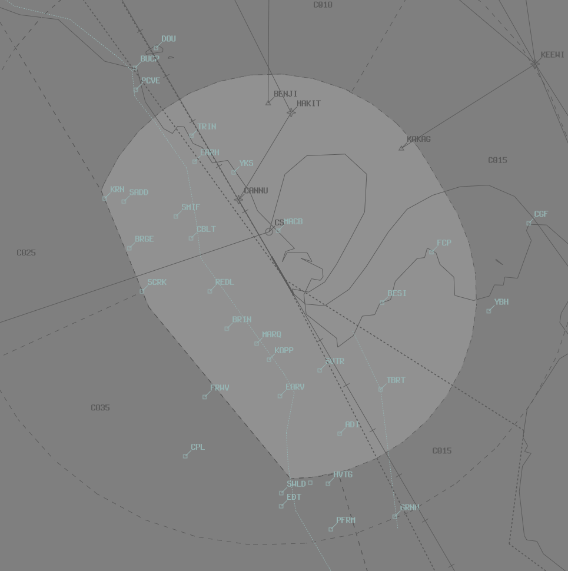

--8<-- "includes/abbreviations.md"

## Positions
| Name               | Callsign       | Frequency        | Login Identifier                         |
| ------------------ | -------------- | ---------------- | ---------------------------------------- |
| Cairns ADC    | Cairns Tower   | 124.900          |  CS_TWR                 |
| Cairns SMC    | Cairns Ground   | 121.700          |  CS_GND               |
| Cairns ACD    | Cairns Delivery   | 128.750          |  CS_DEL                  |
| Cairns ATIS        |                | 131.100          | YBCS_ATIS                                |

## Airspace
CS ADC is responsible for the Class C airspace within the CS CTR `SFC` to `A010`.

!!! important
    CS ADC is responsible for issuing visual approach clearances to some aircraft tracking for runway 33 in CTA, as well as initial airways clearances for VFR aircraft entering the CTR from class G. See [Runway 33 Arrival Procedures](#runway-33) for more information.

<figure markdown>
{ width="700" }
  <figcaption>CS ADC Airspace</figcaption>
</figure>

## Runway Selection
The preferred runway direction is Runway 15.

## Separation

### ADC Separation Responsibility
When weather conditions are suitable, ADC shall visually separate aircraft operating in the circuit from aircraft on the extended runway centreline, within 5nm. ADC shall also separate aircraft operating on (or departing to join) the Western VFR Corridor, within the CTR. 

!!! Note 
    ADC shall advise TCU when this separation cannot be applied.

                        ### Reciprocal Runway Operations (DELETE)
                        Prior to issuing departure instructions and until the departing aircraft is airborne and another method of separation is applied, TCU shall ensure that the arriving aircraft is:  
                        a) assigned a level above and vertically separated from the assigned level of the departure and be at a distance which permits uninterrupted profile descent without loss of radar separation;  
                        b) be confined to a square base leg to join not less than a 10 mile final; or  
                        c) confined to a procedurally separated clearance  

                        The above does not apply if tower accepts responsibility for separation.

                        !!! Note
                            The ADC may not accept responsibility for separation when a jet aircraft is departing Runway 33.

## Arrivals
### Runway 15
When visual approaches are in use, expect light & medium category aircraft (B737/A320 and below) to track via the Creek Corridor, to join an approx 2nm final. These aircraft will be cleared for a visual approach by **CS TCU**. See the Cairns DAP Noise Abatement Procedures chart for more information.

### Runway 33
When visual approaches are in use, expect light & medium category aircraft (B737/A320 and below) to track via a straight in visual approach, or track via a visual right base. Aircraft inside CTA tracking for a right base to runway 33 will pass overhead the CTR, so CS TCU **will not** clear them for a visual approach. These aircraft will be coordinated by CS TCU.

ADC must assess any conflict with aircraft in the CTR and clear the inbound aircraft for a visual approach when suitable. Due to the small amount of airspace available, it is vital that ADC maintains separation assurance between inbound aircraft and those operating in the CTR, to avoid a delay in issuing the visual approach clearance.

!!! example 
    **TCU** -> **ADC**: "Via right base, RXA5418, will be assigned A020"  
    **ADC** -> **TCU**: "A020, RXA5418"  

    **RXA5418**: "Cairns Tower, RXA5418, descending to A020"  
    **CS ADC**: "RXA5418, Cairns Tower, cleared visual approach"  
    **RXA5418**: "Cleared visual approach, RXA5418"  
    
    **CS ADC**: "RXA5418, runway 33, cleared to land"  
    **RXA5418**: "Runway 33, cleared to land, RXA5418"

## Departures

### IFR Departures
IFR aircraft shall be processed via one of the following SIDs:

a) RWY 15, Jets via AKROM: AKROM SID. Non-Jets via NONUM: NONUM SID  
b) RWY 33, All Jets: EAZEE SID, Radar Transition  
c) All others: CS (RADAR) SID  

!!! Note
    Non-jet aircraft may be issued a Visual Departure if conditions are suitable.

## VFR Operations

### Western VFR Corridor
The Western VFR Corridor conflicts with the extended centreline to the north of the aerodrome. Clearances for aircraft entering the CTR must be worded so as to leave no possibility for misinterpretation by the pilot.

!!! Example
    **NDR**: "Cairns Tower, NDR, EDT, A015, for the Western VFR Corridor, Request Clearance"  
    **CS ADC**: "NDR, enter the CTR tracking via the Western VFR corridor at A015. Remain on the corridor until advised."

If a clearance limit is associated with the clearance, then it must be reiterated to the pilot to remain “on or west of the VFR Corridor”.

!!! Example
    **NDR**: "Cairns Tower, NDR, EDT, A015, for the Western VFR Corridor, Request Clearance"  
    **CS ADC**: "NDR, enter the CTR tracking via the Western VFR Corridor at A015. Clearance limit is ADI, Remain on or west of the Western VFR Corridor at all times."

### Inbound
Aircraft planning to enter the CS CTR between *Mt Gorton*, CGF and Upolo Cay at `A005`, must contact CS ADC for airways clearance.

!!! Example
    **NDR**: "Cairns Tower, NDR, Cape Grafton, A005, Inbound, Information Alpha, Request Clearance"  
    **CS ADC**: "NDR, enter the CTR tracking for a Right Base runway 33, maintain A005."

### Circuit Direction
| Runway | Direction |
| ----------------- | ---------------|
| 15                | Left  |
| 33                | Right |

## ATIS
### Approach Expectation

The ATIS approach expectation shall be `EXPECT INSTRUMENT APPROACH` when:

| Time | Condition |
| ------| ------- |
| Day   | VMC conditions do not exist below `A030` |
| Night | All conditions |

!!! note
    This procedure allows aircraft to track via the Creek Corridor (see YBCS DAP Noise Abatement Procedures) for runway 15, or via a visual right base (commenced from vectors or the KEEWI Victor STAR), when VMC exists below `A030`.

## Taxiway Restrictions
Taxiways A2 and A between A2 and A3 are not available to aircraft above 7,000 kilograms. Taxiway A4 is not available to aircraft above 90,000 kilograms. Taxiway Y is not available to aircraft above 10,000 kilograms.

## Coordination

### CS TCU
#### Auto Release
'Next' coordination is **not** required for aircraft that are:   
  a) Departing from a runway nominated on the ATIS; and  
  b) Assigned the standard assignable level; and  
  c) Assigned a **Procedural** SID

All other aircraft require a 'Next' call to CS TCU.

!!! example
    **CS ADC** -> **CS TCU**: "Next, HND151"  
    **CS TCU** -> **CS ADC**: "HND151, Heading 030, unrestricted"  
    **CS ADC** -> **CS TCU**: "Heading 030, HND151"   

    **CS ADC**: "HND151, Assigned heading Left 030, Runway 15, Cleared for Takeoff"  
    **HND151**: "Left heading 030, Runway 15, Cleared for Takeoff, HNT151"

The Standard Assignable level from CS ADC to CS TCU is the lower of `A060` or the `RFL`.

#### Arrivals
Aircraft tracking via a visual right base to runway 33 will be coordinated by CS TCU (see [Runway 33](#runway-33)). All other arriving aircraft do not require coordination.

#### ACD to CS TCU
The controller assuming responsibility of **CS ACD** shall give heads-up coordination to the relevant CS TCU controller prior to the issue of the following clearances:  
a) VFR Departures  
b) Aircraft using a runway not on the ATIS

!!! example
    **CS ACD** -> **CS TCU**: "ABC, Requesting clearance for a Northbound VFR Coastal departure at A035"  
    **CS TCU** -> **CS ACD**: "ABC, Cleared for a Northbound VFR Coastal departure, A035"  
    **CS ACD** -> **CS TCU**: "Cleared for a Northbound VFR Coastal departure, A035, ABC"   
    
    **CS ACD**: "ABC, Cleared for a Northbound VFR Coastal departure, A035, Squawk 3601"  
    **ABC**: "Cleared for a Northbound VFR Coastal departure, A035, 3601, ABC"  

### CS FLW
FLW must advise ADC of any sequence changes within 36 Miles CS.  
All requests for non-duty runway arrivals must be approved by ADC.
