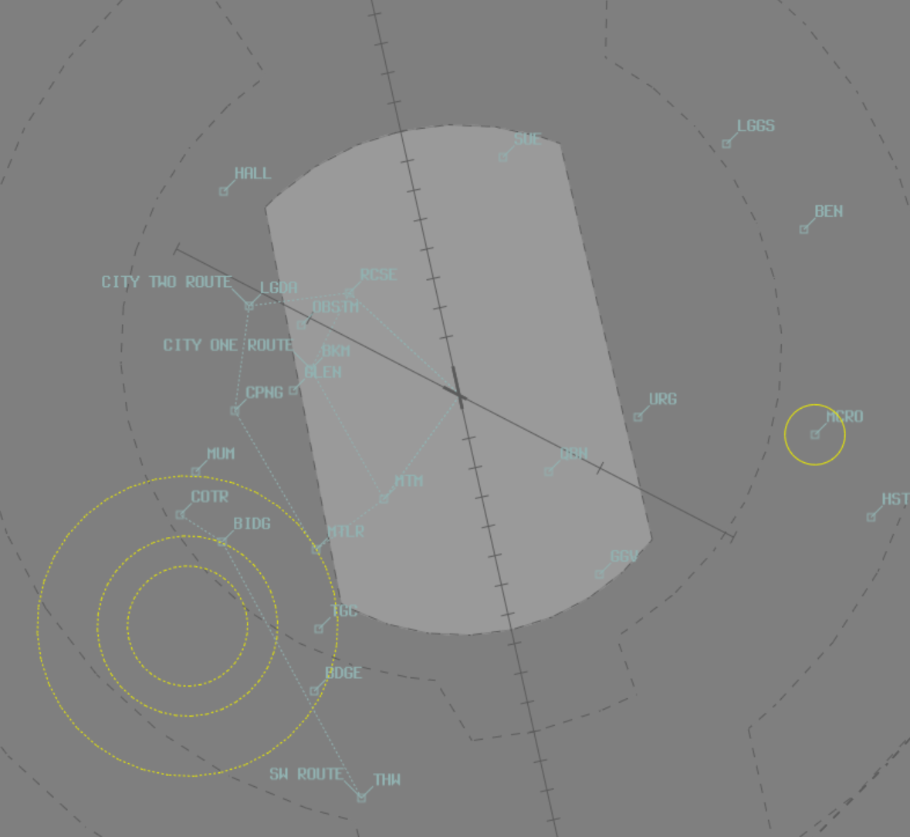
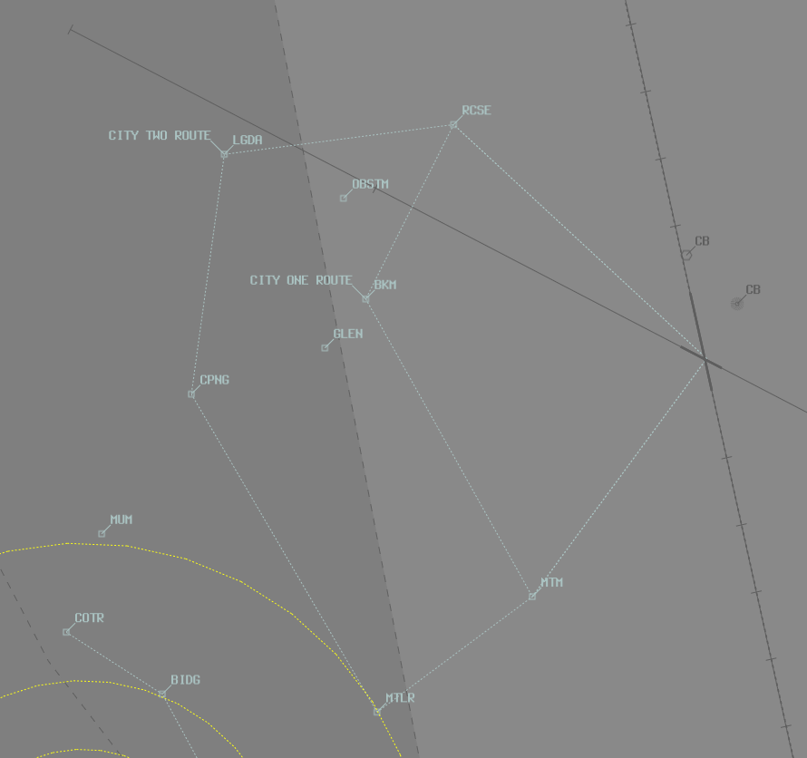

--8<-- "includes/abbreviations.md"

## Positions
| Name               | Callsign       | Frequency        | Login ID                         |
| ------------------ | -------------- | ---------------- | ---------------------------------------- |
| **Canberra ADC**    | **Canberra Tower**   | **118.700**          | **CB_TWR**                                   |
| **Canberra SMC**    | **Canberra Ground**  | **121.700**          | **CB_GND**                                   |
| **Canberra ATIS**        |                | **127.450**         | **YSCB_ATIS**                                |

## Airspace
CB ADC is responsible for the Class C Airspace within the CB CTR `SFC` to `A035`.

<figure markdown>
{ width="700" }
  <figcaption>CB ADC Airspace</figcaption>
</figure>

## SID Selection
**Jet** Aircraft planned via **CULIN**, **TANTA**, **WG**, **HOWLY**, **NONUP** or **AVBEG** shall be assigned the **Procedural SID** that terminates at the appropriate waypoint. Jet Aircraft **not** planned via any of these waypoints shall receive amended routing via the most appropriate SID terminus, unless the pilot indicates they are unable to accept a Procedural SID.

**Non-Jet** Aircraft planned via **AKMIR** or **DUBUS** shall be assigned the **Procedural SID** that terminates at the appropriate waypoint.

!!! example
    Jet Aircraft planned via TANTA, assigned runway 35, shall be given the TANTA SID.

a) Jet or Non-Jet aircraft departing **Off Mode** that don't meet the above critera; or   
b) Aircraft that cannot accept a Procedural SID  
Shall be assigned the **Radar SID**.

!!! example
    Non-Jet Aircraft planned via TANTA, assigned runway 35, shall be given the CB (RADAR) SID.

## VFR Operations
VFR aircraft that will operate only in ADCs airspace shall be assigned SSR code 0040.

Aircraft operating in the circuit area are to remain on the ADC frequency. The phrasing of the airways clearance is:

!!! phraseology
    “ABC, cleared to operate in the circuit area, not above A030, squawk 0040”.

The circuit direction is not specified in the airways clearance, but with a take-off or touch-and-go clearance.

Military jet training circuits are conducted at `A035`, unless otherwise requested by the pilot. ADC shall notify the TCU of the beginning and end of the sortie.

### City Scenic Flights
City Scenic Flights are available by day and to the west of the aerodrome. Aircraft on these routes shall be cleared at `A045`.

| Runway              | City Flight One      | City Flight Two       |
| ------------------ | -------------- | ---------------- | 
| North (anti-clockwise)    | ALPHA ONE   | ALPHA TWO         | 
| South (clockwise)  | CHARLIE ONE  | CHARLIE TWO          | 

<figure markdown>
{ width="500" }
  <figcaption>City Scenic Flights</figcaption>
</figure>

### Helicopter Operations
The Canberra CTR contains the Southcare Helicopter Base (YXSB) as well as two hospitals (Calvary Hospital and Canberra Hospital). Helicopters operating to and from these pads require a clearance from **CB ADC**.

#### Departing Aircraft
Helicopters departing the pads require an airways clearance to do so, either taking the form of a clearance to transit the zone to the Class G airspace adjacent to the CTR (if the pilot has no intention to enter CTA) or as a normal airways clearance for a departure into the surrounding CTA. Ensure that no conflict exists with arriving or departing traffic and consider delegating separation responsibility to the VFR aircraft if required. It may also be required to coordination with the TMA controller to ensure no additional conflict exists in their sector.

Departing aircraft should **not** be issued a takeoff clearance (as the helipads are outside the manoeuvring area). Instead, instruct aircraft to 'report airborne'.

!!! phraseology
    *RSCU201 is a VFR AW139 helicopter intending to depart Southcare Base (YXSB) to the northwest at `A035` (below the base of the Class C steps).*  
    **RSCU201**: "Canberra Tower, helicopter RSCU201, Southcase Base, for departure to the northwest, A035, received Juliet, ready"  
    **CB ADC**: "RSCU201, Canberra Tower, transit approved not above A035, report OCTA"  
    **RSCU201**: "Transit approved, not above A035, RSCU201"

!!! phraseology
    *RSCU209 is an IFR AW139 helicopter intending to depart Canberra Hospital (YXCB) for Bankstown (YSBK) at `A090` (inside Class C CTA).*  
    **RSCU209**: "Canberra Tower, helicopter RSCU209, on the pad at Canberra Hospital, for Bankstown, received Juliet, ready"  
    **CB ADC**: "RSCU209, Canberra Tower, report sighting a Jetstar A320 on a 3nm final runway 35 and advise able to maintain own separation with that aircraft"  
    **RSCU209**: "Traffic sighted and affirm, RSCU209"  
    **CB ADC**: "RSCU209, pass behind the A320, maintain own separation, caution wake turbulence, cleared to Bankstown via AKMIR, flight planned route, climb A090, squawk 3762"  
    **RSCU209**: "Cleared to Bankstown via AKMIR flight planned route, climb A090, squawk 3762, pass behind the A320 and maintain own separation, RSCU209"  

    *Remember to pass traffic information to both aircraft.*  
    **CB ADC**: "JST619, traffic is a helicopter becoming airborne from Canberra Hospital, approximately 5nm southwest of the field, maintaining own separation with you, runway 35, cleared to land"  

#### Arriving Aircraft
Helicopters arriving to the pads will generally be coordinated by the TMA controller and should be cleared via a visual approach (when available) and instructed to report on the ground. Do **not** issue a landing clearance to these aircraft (as the helipads are outside the manoeuvring area). It may be necessary to instruct these helicopters to track via amended visual points or sight and pass other aircraft.

!!! phraseology
    **RSCU203**: "Canberra Tower, gday, RSCU203"  
    **CB ADC**: "RSCU203, Canberra Tower, report sighting a Qantas 737 lining up on runway 17 and advise able to maintain own separation with that aircraft"  
    **RSCU203**: "Traffic sighted and affirm, RSCU203"  
    **CB ADC**: "RSCU203, that aircraft will be departing upwind, maintain own separation, cleared visual approach, report on the ground"  
    **RSCU203**: "Maintain own separation, cleared visual approach, RSCU203"  

    *Remember to pass traffic information to both aircraft.*  
    **CB ADC**: "QFA714, traffic is a helicopter 1nm south of the field tracking for Calvary Hospital, opposite direction to you and maintaining own separation, runway 17, cleared for takeoff"

## Coordination
### Auto Release
'Next' coordination is not required to CB TCU for aircraft that are:   
  a) Departing from a runway nominated on the ATIS; and  
  b) Assigned the standard assignable level; and  
  c) Assigned a **Procedural** SID

All other aircraft require a 'Next' call to CB TCU.

!!! phraseology
    **CB ADC** -> **CB TCU**: "Next, XEB, runway 35"  
    **CB TCU** -> **CB ADC**: "XEB, heading 010, Unrestricted"  
    **CB ADC** -> **CB TCU**: "Heading 010, XEB"

    **CB ADC**: "XEB, Assigned heading Right 010, Runway 35, Cleared for Takeoff"  
    **XEB**: "Right heading 010, Runway 35, Cleared for Takeoff, XEB"

The CB TCU controller can suspend/resume Auto Release at any time, with the concurrence of **CB ADC**.

The Standard Assignable level from CB ADC to CB TCU is:  
For IFR aircraft: `A100`  
For VFR aircraft: The lower of `A040` or the `RFL`

### Runway Change
Any Runway change must be prior coordinated to **CB TCU**.