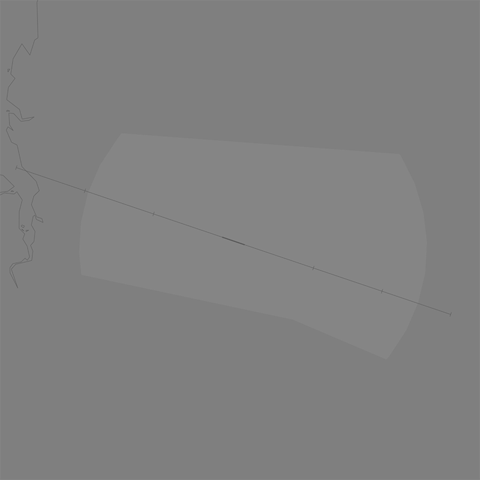
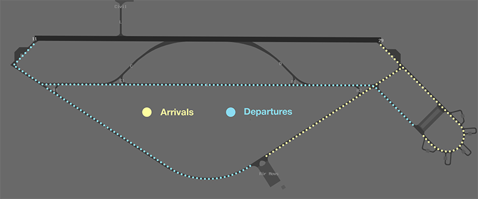
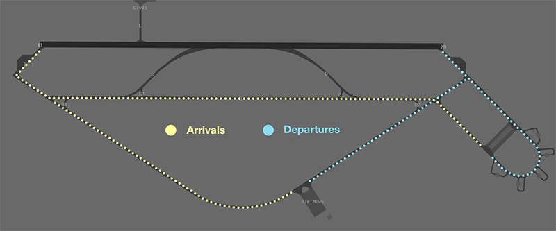
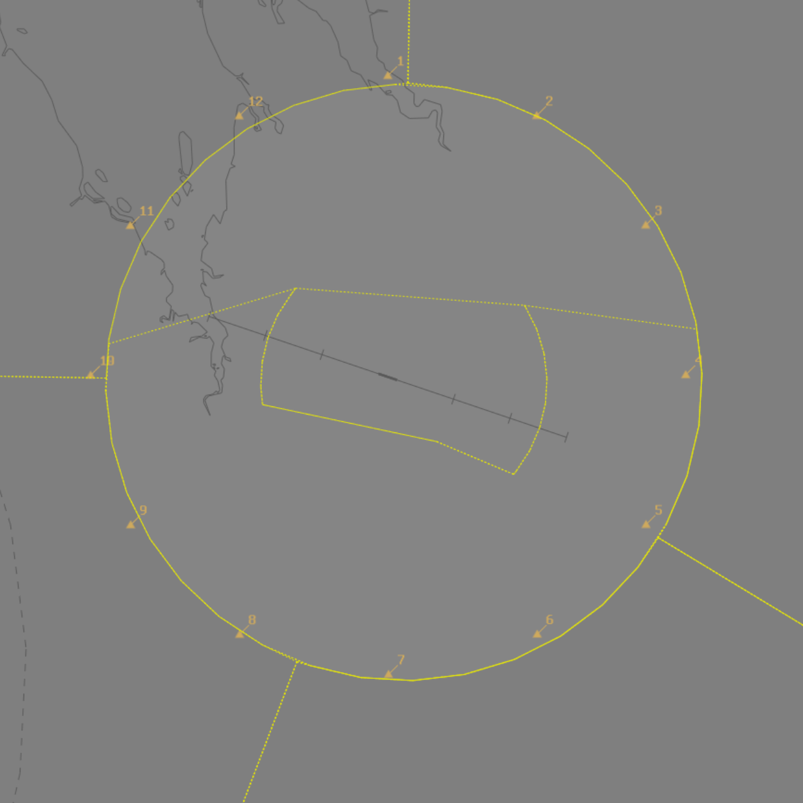

--8<-- "includes/abbreviations.md"

## Positions

| Name              | Callsign              | Frequency   | Login ID      |
| ----------------- | --------------------- | ----------- | ------------- |
| **Curtin ADC**    | **Curtin Tower**      | **118.300** | **CIN_TWR**   |
| **Curtin SMC**    | **Curtin Ground**     | **126.200** | **CIN_GND**   |
| **Curtin ACD**    | **Curtin Delivery**   | **136.800** | **CIN_DEL**   |
| **Curtin ATIS**   |                       | **134.800** | **YCIN_ATIS** |

!!! note
    YCIN is a [joint military/civil aerodrome](../../../controller-skills/military/#military-aerodromes) and procedures can differ significantly to those at a civil aerodrome. Ensure you are familiar with the [military controller skills](../../../controller-skills/military) necessary to provide a quality service.

## Airspace
<figure markdown>
{ width="700" }
  <figcaption>CIN ADC Airspace</figcaption>
</figure>

**CIN ADC** is responsible for the Class C airspace within the **R825** [restricted area](../../../controller-skills/sua/#restricted-areas), `SFC` to `A035`.

### Restricted Area Activations
When **CIN ADC** is online, the **R825** restricted area `SFC` to `A035` is [activated](../../../controller-skills/sua/#activation-of-sua) by default.

## Manoeuvring Area
### Recommended Taxi Routes
Except when the traffic situation warrants, taxi clearances shall conform to the following diagram:

=== "Runway 11"
	<figure markdown>
	{ width="500" }
	  <figcaption>Recommended Taxi Routes for RWY 11</figcaption>
	</figure>
	
=== "Runway 29"
	<figure markdown>
	{ width="500" }
	  <figcaption>Recommended Taxi Routes for RWY 29</figcaption>
	</figure>

## Local Procedures
### Initial and Pitch
The [intial points](../../../controller-skills/military/#initial-and-pitch) are aligned with Taxiway A at the following locations.

| RWY  | Initial Point | Altitude |
| ---- | ------------- | -------- |
| 11   | 5NM downwind, over Derby Highway  | `A020`   |
| 29   | 4.3NM downwind, over the Defence land perimeter boundary  | `A020`   |

### Military Gates
There are numerous [military gates](../../../controller-skills/military/#military-gates) established throughout the CIN TMA to facilitate entry and exit to adjoining SUA.

<figure markdown>
{ width="700" }
  <figcaption>CIN SUA Gates</figcaption>
</figure>

Pilots should include the desired departure gate when requesting clearance.

!!! phraseology
    *OBAK11 plans to enter the R806A restricted area via Gate 12 for military training and airwork.*  
    **OBAK11**: "Curtin Delivery, OBAK11 for Gate 12, `F190` for R806A, request clearance."  
    **CIN ACD**: "OBAK11, Curtin Delivery. cleared Gate 12 direct, climb to `F190`, squawk 6001, departure frequency 121.0."   

If the pilot **does not** nominate a gate, or nominates a gate that does not provide access to their intended SUA, CIN ACD should clear the aircraft to depart via the **appropriate gate**.

| Intended SUA    | TCU Exit Gate       |
| --------------- | ------------------- |
| R803A-B         | 2 or 4  |
| R804A-B         | 6       |
| R805A-B         | 8       |
| R806A-B         | 10 or 12 |

!!! tip
    [Coordination requirements](#acd-to-cin-tcu) exist between ACD and TCU when aircraft are requesting clearance to operate in an SUA that has not been activated. Controllers performing the role of ACD should ensure they coordinate with TCU before providing clearance.

## Runway Modes
### Circuit Direction

| Runway | Direction |
| ------ | ----------|
| 11     | Right |
| 29     | Left  |

## Coordination
### Auto Release
[Next](../../../controller-skills/coordination/#next) coordination is required from CIN ADC to CIN TCU for all aircraft.

The Standard Assignable Level from  **CIN ADC** to **CIN TCU** is:

| Aircraft | Level |
| -------- | ----- |
| All | The lower of `F190` and `RFL` |

### Departures Controller
When a TCU controller is online, aircraft shall be issued with a departure frequency during their airways clearance in accordance with the table below. If no TCU controllers are online, the advisory frequency or appropriate enroute freequency shall be issued.

| Runway | Via  | Departure Frequency |
| ------ | ---- | -------------------- |
| All    | All  | 121.0 (CIA) |

### ACD to CIN TCU
The controller assuming responsibility of **ACD** shall give [heads-up](../../../controller-skills/coordination/#airways-clearance) coordination to CIA (or the enroute controller responsible for the CIN TCU) prior to the issue of a clearance to an aircraft intending to operate in an SUA that **has not** been activated. 

!!! phraseology
    **CIN ACD** -> **CIA**: "OBAK11 requests clearance to R806A”  
    **CIA** -> **CIN ACD**: "OBAK11, clearance approved."  

## Charts
!!! abstract "Reference"
    In addition to the civilian `ERSA` and `AIP` publications, [the RAAF AIP website](https://ais-af.airforce.gov.au/australian-aip){target=new} contains the necessary charts (available in the TERMA) and description of procedures (in each airports' FIHA).