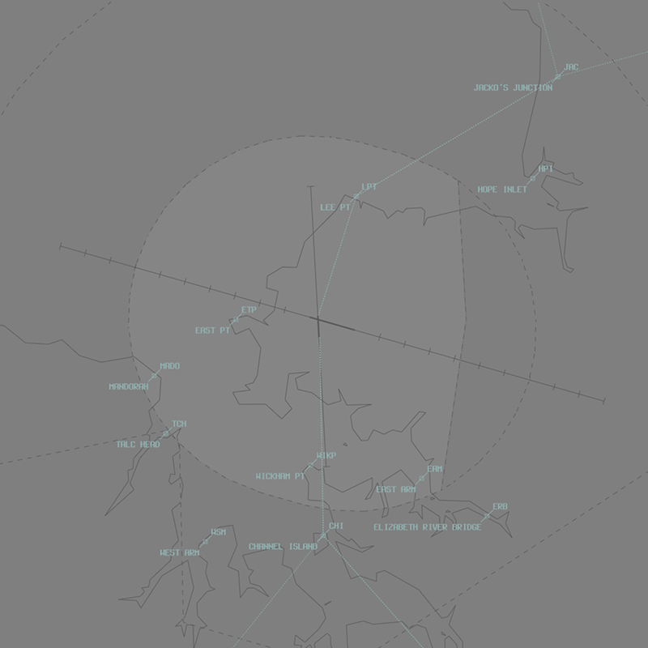

--8<-- "includes/abbreviations.md"

## Positions

| Name               | ID      | Callsign       | Frequency        | Login Identifier              |
| ------------------ | --------------| -------------- | ---------------- | --------------------------------------|
| Darwin ADC    | | Darwin Tower  | 133.100         | DN_TWR        |
| Darwin SMC   ||  Darwin Ground  | 121.800         | DN_GND        |
| Darwin ACD    | | Darwin Delivery  | 126.800         | DN_DEL       |
| Darwin ATIS    |   | | 128.250         | YPDN_ATIS       |

## Airspace
ADC owns the airspace within the DN CTR (`SFC`–`A010`). This airspace is designed to facilitate the processing of helicopter scenic flights and low-level helicopter circuits.  
The CTR extends 7NM from the thresholds of runways 11 and 29 but does not including the Robertson Barracks transit zone.  

ADC may request DN TCU (`SFC`–`A020`) from DN TCU to facilitate fixed-wing circuit operations:  
a) Fixed-wing circuit operations are typically conducted at Delissaville (YDLV) due to high traffic density at Darwin  
b) ADC may deny requests for circuits if IFR traffic may be unduly delayed  

<figure markdown>
{ width="700" }
  <figcaption>DN ADC Airspace</figcaption>
</figure>

## Aerodrome
### Standard Taxi Routes
Aircraft transiting to or from the Southern and Northern GA should follow the following standardised taxi routes:  
a) Outbound via V1  
b) Inbound via Y1  

Traffic permitting, aircraft above 136,000kg MTOW shall be entered/exited for RWY 11/29 from taxiways B2, C3, D or E2 and backtracked as required.  

Taxiway V has a passing bay, located adjacent to the ARFF section. The passing bay is the preferred location for engine run-ups, no longer than 3 minutes  

### Runway Modes
Runway selection shall be coordinated by DN ADC. In any case, a change of runway mode shall not be broadcast on the ATIS until DAW accepts the change.  

The Runway Mode options available are:

a) Runway 29 and Runway 36;  
b) Runway 29 and Runway 18;  
c) Runway 29 only;  
d) Runway 11 and Runway 36;  
e) Runway 11 and Runway 18;  
f) Runway 11 only.  

## Charts
!!! note
    Additional charts to the AIP may be found in the RAAF TERMA document, available towards the bottom of [RAAF AIP page](https://ais-af.airforce.gov.au/australian-aip){target=new}

## Miscellaneous
### Circuit Operations
VFR aircraft that will operate only in ADCs airspace shall be assigned SSR code 0100  

Circuit altitude will depend on the type of aircraft. Assign circuit altitudes for the following aircraft types:  
a) MIL Jet: `A020`  
b) Jet: `A015`  
c) Non-jet: `A010`  
d) Helo: `A010`  

## Coordination
### Auto Release
"Next" Coordination is a procedure where the **DN ADC** controller gives a heads-up to the DN TCU controller about an impending departure. The DN TCU controller will respond by assigning a heading to the aircraft, for the **DN ADC** controller to pass on with their takeoff clearance.

!!! example
    **DN ADC** -> **DN TCU**: "Next, ABC, runway 18"  
    **DN TCU** -> **DN ADC**: "ABC, Track Extended Centreline, unrestricted"  
    **DN ADC** -> **DN TCU**: "Track Extended Centreline, unrestricted, ABC"  

All departures from 18/36 require departure coordination with **DN TCU**

### IFR Level Assignment
The Standard Assignable level from **DN ADC** to **DN TCU** is the lower of `F180` or the `RFL`.  
If the aircraft is **not** planned via an RNAV SID and has a light wake turbulance cateogry, they are to be assigned the lower of `A030` or the `RFL`.

### VFR Departures
`A020` or the planned level; whichever is lower, to all VFR aircraft.  

VFR aircraft are required to track via one of the published VFR Routes.  

VFR routes shall be assigned based on the destination radial from Darwin.  

Assign VFR routes in accordance with the following radial chart:  

|Outbound Radial |Assigned VFR Route|
|---|---|
|360 – 040 |VFR Route 1|
|041 – 084 |VFR Route 2|
|085 – 124 |VFR Route 3|
|125 – 180 |VFR Route 4|
|181 – 224 |VFR Route 5|
|225 – 359| Direct|

!!! tip
    If a VFR aircraft has not planned via a VFR route as above, use the phraseology: “ABC, cleared amended route VFR route 1, maintain A020, squawk 4512”

### Auto-Release Wedge

The Darwin auto-release wedges extend from the departure end runway threshold, 30 degrees splayed from the centreline, to 7nm  

Auto-release at Darwin is only available for VFR aircraft and low-level IFR aircraft.

Tower may depart aircraft that conform with the above conditions within the auto-release wedge using the following headings:

|Departure Type| Runway 11| Runway 29|
|---|---|----|
|VFR |H070V, H106V or H140V| H260V, H286V or H320V|
|IFR (Visual Dep)| H070V, H106V, or H140V |H260V, H286V or H320V|
|IFR (Radar)| H070, H106 or H140 |H260, H286 or H320|

!!! tip
    Tower shall provide visual separation between aircraft in the auto-release wedge and subsequent departures until the preceding departure has been maneuvered by TCU

