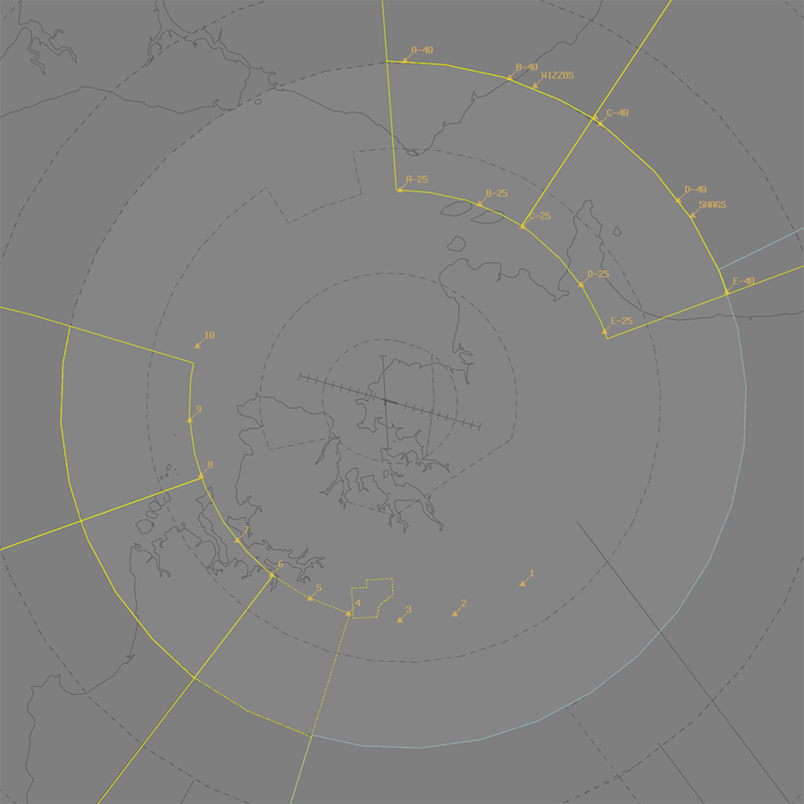

--8<-- "includes/abbreviations.md"

## Positions

| Name              | Callsign              | Frequency   | Login ID      |
| ----------------- | --------------------- | ----------- | ------------- |
| **Darwin ADC**    | **Darwin Tower**      | **133.100** | **DN_TWR**    |
| **Darwin SMC**    | **Darwin Ground**     | **121.800** | **DN_GND**    |
| **Darwin ACD**    | **Darwin Delivery**   | **126.800** | **DN_DEL**    |
| **Darwin ATIS**   |                       | **128.250** | **YPDN_ATIS** |

!!! note
    YPDN is a [joint military/civil aerodrome](../../../controller-skills/military/#military-aerodromes) and procedures can differ significantly to those at a civil aerodrome. Ensure you are familiar with the [military controller skills](../../../controller-skills/military) necessary to provide a quality service.

## Airspace
**DN ADC** owns the Class C airspace in the DN MIL CTR `SFC` to `A010`. 

<figure markdown>
{ width="600" }
  <figcaption>DN ADC Airspace</figcaption>
</figure>

## Restricted Area Activations
There are no [restricted areas or MOAs](../../../controller-skills/sua) activated by default when DN ADC is online.

## Manoeuvring Area
### Manoeuvring Area Responsibility
ADC is responsible for all runways as well as the [**Eastern HLS**](#helipads).

### Recommended Taxi Routes
Except when the traffic situation warrants, taxi clearances shall conform to the recommended taxi routes:

Southern and Northern GA:

| Direction | Taxiway |
| --------- | ------- |
| Outbound  | V1      |
| Inbound   | Y1      |

OLAs:

| Direction | Taxiway |
| --------- | ------- |
| Outbound  | S and T |
| Inbound   | R       |

#### Taxiway Limitations
Traffic permitting, aircraft above 136,000kg MTOW shall be entered/exited for Runway 11/29 from taxiways B2, C3, D or E2 and backtracked as required.  

Taxiway V has a passing bay, located adjacent to the ARFF section. The passing bay is the preferred location for engine run-ups. 

## Local Procedures
### Initial and Pitch
The [intial points](../../../controller-skills/military/#initial-and-pitch) are at 5 TAC, aligned with Runway 11 and 29. Aircraft will arrive via a straight initial.

### Marrara Coded Clearance
VFR aircraft arriving via LPT may be cleared for a visual approach via a **'Marrara Downwind'** clearance. Aircraft that area cleared for a Marrara Downwind will track from LPT towards *Marrara Stadium* before turning to joing a left (Runway 11) or right (Runway 29) downwind.

!!! phraseology
    **DN ADC:** "ZYX, cleared visual approach via Marrara Downwind, Runway 11"
    
### Military Gates
There are numerous [military gates](../../../controller-skills/military/#military-gates) established throughout the TMA to facilitate entry and exit to adjoining SUA.

<figure markdown>
{ width="700" }
  <figcaption>DN SUA Gates</figcaption>
</figure>

Pilots should include the desired departure gate when requesting clearance.

!!! phraseology
    *GRFN11 plans to enter the M278A-D MOA via Gate A for military training and airwork.*  
    **GRFN11**: "Darwin Delivery, GRFN11 for Gate A, `A180` for M278A-D, request clearance."  
    **DN ACD**: "GRFN11, Darwin Delivery. Cleared Gate A, LIZAD3 departure. Climb via SID to `A180`, squawk 6001, departure frequency 126.8."   

If the pilot **does not** nominate a gate, or nominates a gate that does not provide access to their intended SUA, DN ACD should clear the aircraft to depart via the **appropriate gate**.

| Intended SUA    | TCU Exit Gate        |
| --------------- | -------------------- |
| M277A-D         | Gates 6-8            |
| M277E-H         | Gates 5-6            |
| M278A           | Gates A25-C25        |
| M278B-D         | Gates A40-C40        |
| M278E           | Gates C25-E25        |
| M278F-H         | Gates A40-C40        |
| R245            | Gates 2-3            |
| R251            | Gate 1               |
| R276A-D         | Gate 4               |

!!! tip
    [Coordination requirements](#acd-to-dn-tcu) exist between ACD and TCU when aircraft are requesting clearance to operate in an SUA that has not been activated. Controllers performing the role of ACD should ensure they coordinate with TCU **before** providing clearance.

## VFR Operations
VFR aircraft that will operate only in ADCs airspace shall be assigned SSR code 0100.

### Departures
VFR aircraft are required to track via one of the published VFR Routes (as shown on the Darwin VTC). VFR routes shall be assigned based on the destination radial from Darwin, as per below:  

| Outbound Radial | Route | Outbound     | Inbound | 
| --------------- | ----- | ------------ | ------- |
| 270-044 | VFR Route 1 | `LPT JAC CGR`  | `CGR JAC LPT`  |
| 045-104 | VFR Route 2 | `LPT JAC ADRM` | `ADRM JAC LPT` |
| 105-133 | VFR Route 3 | `CHI LAD ADB`  | `ADB LAD CHI`  |
| 134-179 | VFR Route 4 | `CHI LAD MTD`  | `MTD LAD CHI`  |
| 180-269 | VFR Route 5 | `CHI BYNO`     | `BYNO CHI`     |

!!! tip
    If a VFR aircraft has not planned via a VFR route as above, use the phraseology: “*ABC, cleared amended route VFR route 1, climb to `A020`, squawk 4512*”

## Helicopter Operations
### Helipads
There is one helipad at YPDN, **Eastern Helipad**, located south of Taxiway U1.

The helipad is part of the manoeuvring area and controlled by DN ADC. Any helicopter taking off or landing on the helipad requires a specific takeoff or landing clearance from ADC.

!!! phraseology 
    **DN ADC**: "CHOP71, Eastern Helipad, cleared to land"  
    
Military aircraft may also request clearance to land on Taxiway A or Taxiway C. Both locations are within the manoeuvring area, and DN ADC will provide takeoff or landing clearance following [appropriate coordination with SMC](../../../controller-skills/coordination/#helicopter-operations-in-smc-jurisdiction).
    
### Departures
DN ACD will issue airways clearance for all helicopters, including those on a helicopter route. The helicopter route title should be recorded in the **global ops field** and the route waypoints should be added to the FDR route, as below.

| Route | Waypoints |
| ----- | --------- |
| TALC HEAD OUTBOUND | `WOW TCH` |

!!! phraseology
    **QRS:** "Darwin Delivery, helicopter QRS, for the Talc Head outbound, request clearance"  
    **DN ACD:** "QRS, Darwin Delivery, cleared Talc Head outbound, squawk 0215, departure frequency 134.1"  
    **QRS:** "Cleared Talc Head outbound, squawk 0215, departure frequency 134.1, QRS"

### Arrivals
VFR helicopters are generally processed via by the TALC HEAD Inbound route.  IFR helicopters should conform to fixed wing ops and be processed via an appropriate runway.

!!! phraseology
    **QRS:** "Darwin Tower, helicopter QRS, WSM, `A005`, received Tango, request Talc Head Inbound"  
    **DN ADC:** "QRS, Darwin Tower, cleared Talc Head Inbound, report at WOW."  
    **QRS:** "Cleared Talc Head Inbound, QRS"  

### Hospital Helipads
The Darwin CTR contains the helipad at the Royal Darwin Hospital (YXDH). This pad sits outside the manoeuvring area, so no takeoff or landing clearances should be issued. Instead, helicopters should be instructed to report airborne or report on the ground.

### Snake Pit
The **Snake Pit** is an area of dirt adjacent Runway 36 used for low level hover operations, most commonly by helicopters located at the apron known as the **Snake Farm**, south of OLA 6-10.

<figure markdown>
{ width="700" }
<figcaption>Snake Pit</figcaption>
</figure>

Helicopters requesting clearance to operate in the Snake Pit shall be cleared to air transit to, and then operate within, the area by ADC.

!!! phraseology
    **CHOP19**: "Darwin Tower, helicopter ZXY, Snake Farm, for Snake Pit."   
    **DN ADC**: "CHOP19, Darwin Tower, air transit Snake Pit, cleared to operate Snake Pit, not above 100ft."
	**CHOP19**: "Air transit Snake Pit, cleared to operate Snake Pit, not above 100ft, CHOP19."   

## Runway Modes
### Preferred Runway Modes
If winds are too great, single runway operations may be necessary (eg, Runway 11 for Arrivals and Departures). However, pending wind limitations (Crosswind <20kts, Tailwind <5kts), the following runway modes are to be used:

| Mode | Arrivals | Departures |
| ---- | -------- | ---------- |
| 29AD36A | 29 & 36 | 29 |
| 29AD18A | 29 & 18 | 29 |
| 11AD36A | 11 & 36 | 11 |
| 11AD18A | 11 & 18 | 11 |

### Special Runway Operations
#### LAHSO
!!! warning "Important"
    Due to its operational complexity, LAHSO **must be authorised by a senior VATPAC staff member or a nominated event coordinator**.

    Very little benefit is achieved by running LAHSO without a flow controller and it is almost exclusively reserved for our busiest events.

Detailed procedures exist to ensure that controllers are aware of their responsibilities when performing LAHSO. See [Controller Skills](../../controller-skills/runwaymanagement.md#lahso) for more information.

##### Weather Conditions
LAHSO may only be used where the weather conditions meet the following minimum requirements:

| Element | Criteria |
| ------- | -------- |
| Cloud Ceiling | `A030` or higher |
| Visibility | 8km or greater |
| Surface Condition | Dry |
| Windshear | None Reported |

Two simultaneous landings may be conducted by both day and night. A simultaneous takeoff and landing may only be conducted by day.

##### Runway Mode
The only approved LAHSO mode at YPDN is **29AD36A**. Runway 36 is considered the active runway, while runway 29 is considered the passive runway.

### Circuits
The circuit height differs according to type of aircraft. 

| Aircraft     | Altitude |
| ------------ | -------- |
| Military Jet | `A020`   |
| Civil Jet    | `A015`   |
| Others       | `A010`   |

## SID Selection 
### Civil Aircraft
Civil aircraft planned via **HELLI**, **JULIE**, **LAKUP**, **OCTOB**, **OLTAS**, **RUSKA**, **RUPEG**, or **VANDI** shall be assigned the **Procedural SID** that terminates at the appropriate waypoint. Civil jet aircraft **not** planned via any of these waypoints shall receive amended routing via the most appropriate SID terminus, unless the pilot indicates they are unable to accept a procedural SID.

Civil aircraft using Runway 18/36, non-RNAV aircraft, and aircraft that are unable to accept a procedural SID shall be assigned the **Radar SID** or, for light aircraft, a visual departure.

### Military Aircraft
Military aircraft planned for **Gates 1-10** or **Gates A-E** shall be assigned the **LIZAD** SID (if departing Runway 11), or the **TURTL** SID (if departing Runway 29).

All other military aircraft, including military aircraft that are unable to fly a SID, shall be assigned either the RADAR SID or a visual departure.

## ATIS
### Operational Info
#### LAHSO
When [LAHSO](#lahso) is in use, the ATIS OPR INFO shall include:  
`LAND AND HOLD SHORT OPERATIONS IN PROGRESS`

## Coordination
### Auto Release
[Next](../../controller-skills/coordination.md#next) coordination is required from DN ADC to DN TCU for all aircraft.

The Standard Assignable Level from  **DN ADC** to **DN TCU** is:

| Aircraft | Level |
| -------- | ----- |
| IFR aircraft assigned a **Procedural** SID | The lower of `F180` and `RFL` |
| IFR aircraft **not** assigned a **Procedural** SID | The lower of `A030` and `RFL` |
| VFR aircraft | The lower of `A020` and `RFL` |

### Departures Controller
When a TCU controller is online, aircraft shall be issued with a departure frequency during their airways clearance in accordance with the table below. If no TCU controllers are online, the most appropriate Enroute controller or Advisory frequency shall be issued.

=== "11"
	| Runway | Via | Departure Frequency |
	| ------ | ---- | -------------------- |
	| 11 | All | 125.2 (DAE) |

=== "18"
	| Runway | Via | Departure Frequency |
	| ------ | ---- | -------------------- |
	| 18 | East | 125.2 (DAE) |
	| 18 | West | 134.1 (DAW) |

=== "29"
	| Runway | Via | Departure Frequency |
	| ------ | ---- | -------------------- |
	| 29 | All | 134.1 (DAW) |

=== "36"
	| Runway | Via | Departure Frequency |
	| ------ | ---- | -------------------- |
	| 36 | East | 125.2 (DAE) |
	| 36 | West | 134.1 (DAW) |

### ACD to DN TCU
The controller assuming responsibility of **ACD** shall give [heads-up](../../../controller-skills/coordination/#airways-clearance) coordination to DN TCU (or the enroute controller responsible for the DN TCU) prior to the issue of a clearance to an aircraft intending to operate in an SUA that **has not** been activated. 

!!! phraseology
    **DN ACD** -> **DAE**: "GRFN11 requests clearance to M278A”  
    **DAE** -> **DN ACD**: "GRFN11, clearance approved."  

## Charts
!!! abstract "Reference"
     In addition to the civilian `ERSA` and `AIP` publications, [the RAAF AIP website](https://ais-af.airforce.gov.au/australian-aip){target=new} contains the necessary charts (available in the TERMA) and description of procedures (in each airports' FIHA).
