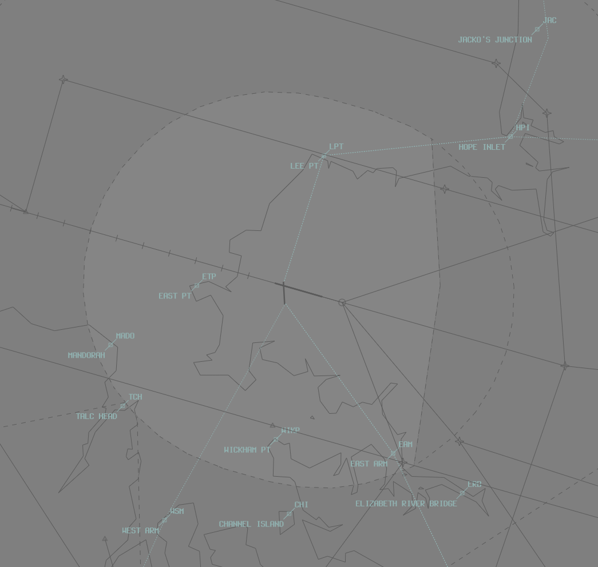

--8<-- "includes/abbreviations.md"

## Positions

| Name              | Callsign       | Frequency        | Login ID              |
| ------------------ | -------------- | ---------------- | --------------------------------------|
| **Darwin ADC**    | **Darwin Tower**  | **133.100**         | **DN_TWR**        |
| **Darwin SMC**   |  **Darwin Ground**  | **121.800**         | **DN_GND**        |
| **Darwin ACD**    | **Darwin Delivery**  | **126.800**         | **DN_DEL**       |
| **Darwin ATIS**    |   | **128.250**         | **YPDN_ATIS**       |

## Airspace
ADC owns the airspace within the DN CTR (`SFC`–`A010`). This airspace is designed to facilitate the processing of helicopter scenic flights and low-level helicopter circuits.  
The CTR extends 7NM from the thresholds of runways 11 and 29 but does not including the Robertson Barracks transit zone.  

ADC may request DN TCU (`SFC`–`A020`) from DN TCU to facilitate fixed-wing circuit operations:  
a) Fixed-wing circuit operations are typically conducted at Delissaville (YDLV) due to high traffic density at Darwin  
b) ADC may deny requests for circuits if IFR traffic may be unduly delayed  

<figure markdown>
{ width="700" }
  <figcaption>DN ADC Airspace</figcaption>
</figure>

## Standard Taxi Routes
Aircraft transiting to or from the Southern and Northern GA should follow the following standardised taxi routes:  
a) Outbound via V1  
b) Inbound via Y1  

Traffic permitting, aircraft above 136,000kg MTOW shall be entered/exited for RWY 11/29 from taxiways B2, C3, D or E2 and backtracked as required.  

Taxiway V has a passing bay, located adjacent to the ARFF section. The passing bay is the preferred location for engine run-ups, no longer than 3 minutes  

## Runway Modes
Runway selection shall be coordinated by DN ADC. In any case, a change of runway mode shall not be broadcast on the ATIS until DAW accepts the change.  

The Runway Mode options available are:

a) Runway 29 and Runway 36;  
b) Runway 29 and Runway 18;  
c) Runway 29 only;  
d) Runway 11 and Runway 36;  
e) Runway 11 and Runway 18;  
f) Runway 11 only.  

## LAHSO
!!! warning "Important"
    Due to its operational complexity, LAHSO **must be authorised by a member of the VATPAC ATS or Events Staff Team or a C3-rated controller**.

    Very little benefit is achieved by running LAHSO without a flow controller and it is almost exclusively reserved for our busiest events.

LAHSO is the independent operation of two crossing runways for arrivals and departures. Whilst arrivals to each runway are considered independent, they will still be flowed to provide some degree of lateral segregation. ADC must maintain a visual separation standard between both aircraft during their approach and in the event of a go around.

ADC must provide traffic information to both aircraft where a LAHSO standard has been applied between them. Additionally, the active LAHSO aircraft (the aircraft landing with a requirement to not pass the crossing runway) must be explicitely instructed to hold short of the crossing runway. Passive aircraft (the aircraft with full use of their assigned runway) must be informed that the active aircraft will hold short.

### Weather Conditions
LAHSO may only be used where the weather conditions meet the following minimum requirements:

| Element | Criteria |
| ------- | -------- |
| Cloud Ceiling | `A030` or higher |
| Visibility | 8km or greater |
| Surface Condition | Dry |
| Windshear | None Reported |

Two simultaneous landings may be conducted by both day and night. A simultaneous takeoff and landing may only be conducted by day.

### Runway Mode
The only approved LAHSO mode at YPDN is **36A/29AD**. Runway 36 is considered the active runway, while runway 29 is considered the passive runway.

!!! phraseology
    **DN ADC:** "YZU, traffic is an E120 landing on the crossing runway, hold short runway 29, cleared to land runway 36."  
    **YZU:** "Hold short runway 29, cleared to land runway 36, YZU"

    **DN ADC:** "ANO407, traffic is a Seminole landing on the crossing runway, will hold short. Runway 29 cleared to land"  
    **ANO407:** "Runway 29 cleared to land, AN407"

### Go arounds
To prepare for a go around of one or both aircraft, ADC shall monitor both flight paths and provide speed adjustments where necessary to ensure that in the event of a go around, the aircraft remain clear of each other. ADC must maintain a visual separation standard between both aircraft until a radar standard (3nm or 1000ft) is available, then the aircraft may be transferred to the TCU controller.

## ATIS
When LAHSO is in use, the ATIS OPR INFO shall include:  
`LAND AND HOLD SHORT OPERATIONS IN PROGRESS`

## Non-RNAV Departures
For non-RNAV approved IFR aircraft with a wake turbulence category of medium or greater, issue a Radar SID  
For non-RNAV approved IFR aircraft with a wake turbulence category of light, issue a visual departure or Radar SID  

## Charts
!!! abstract "Reference"
    Additional charts to the AIP may be found in the RAAF TERMA document, available towards the bottom of [RAAF AIP page](https://ais-af.airforce.gov.au/australian-aip){target=new}

## Miscellaneous
### Circuit Operations
VFR aircraft that will operate only in ADCs airspace shall be assigned SSR code 0100  

Circuit altitude will depend on the type of aircraft. Assign circuit altitudes for the following aircraft types:  
a) MIL Jet: `A020`  
b) Jet: `A015`  
c) Non-jet: `A010`  
d) Helo: `A010`  

### VFR Departures
VFR aircraft are required to track via one of the published VFR Routes.  

VFR routes shall be assigned based on the destination radial from Darwin.  

Assign VFR routes in accordance with the following radial chart:  

|Outbound Radial |Assigned VFR Route|
|---|---|
|360 – 040 |VFR Route 1|
|041 – 084 |VFR Route 2|
|085 – 124 |VFR Route 3|
|125 – 180 |VFR Route 4|
|181 – 224 |VFR Route 5|
|225 – 359| Direct|

!!! tip
    If a VFR aircraft has not planned via a VFR route as above, use the phraseology: “ABC, cleared amended route VFR route 1, maintain A020, squawk 4512”

## Coordination
### DN TCU
Auto-Release is **not available** at YPDN. All Departures will be coordinated when ready for departure.

!!! phraseology
    **DN ADC** -> **DN TCU**: "Next, EOC, runway 18"  
    **DN TCU** -> **DN ADC**: "EOC, Track Extended Centreline, unrestricted"  
    **DN ADC** -> **DN TCU**: "Track Extended Centreline, EOC"  

The Standard Assignable level from **DN ADC** to **DN TCU** is:

- For IFR aircraft assigned a Procedural SID: the lower of `F180` or the `RFL`.  
- For IFR aircraft **not** assigned a Procedural SID: the lower of `A030` or the `RFL`.  
- For VFR aircraft: the lower of `A020` or the `RFL`.