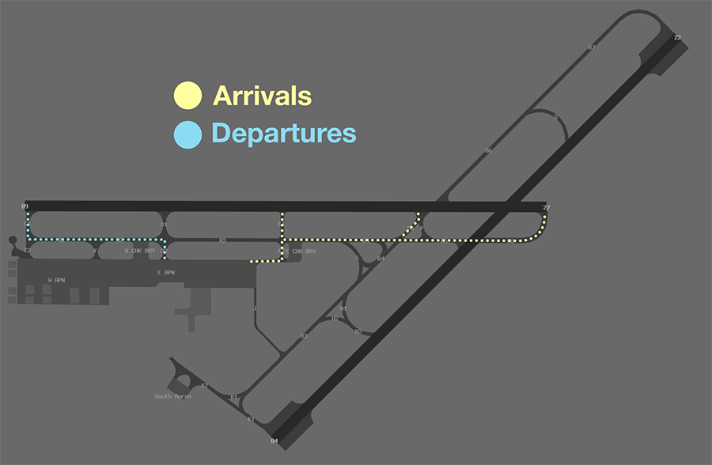
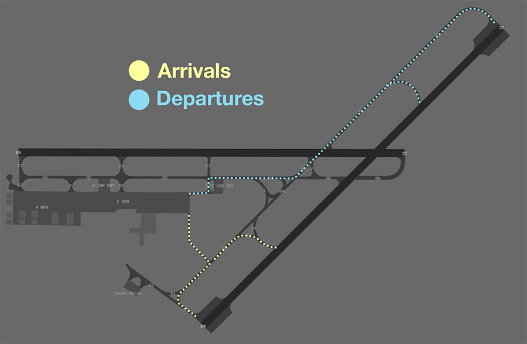
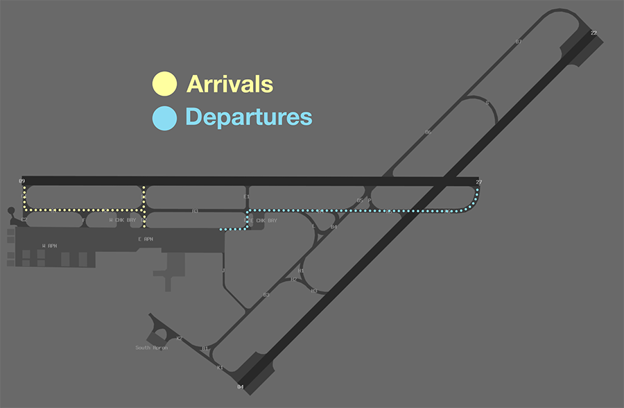

--8<-- "includes/abbreviations.md"

## Positions

| Name              | Callsign              | Frequency   | Login ID      |
| ----------------- | --------------------- | ----------- | ------------- |
| **East Sale ADC** | **Sale Tower**        | **118.300** | **ES_TWR**    |
| **East Sale SMC** | **Sale Ground**       | **127.250** | **ES_GND**    |
| **East Sale ACD** | **Sale Delivery**     | **134.100** | **ES_DEL**    |
| **East Sale ATIS** |                      | **125.400** | **YMES_ATIS** |

!!! note
    YMES is a [military aerodrome](../../../controller-skills/military/#military-aerodromes) and procedures can differ significantly to those at a civil aerodrome. Ensure you are familiar with the [military controller skills](../../../controller-skills/military) necessary to provide a quality service.

## Airspace
ES ADC is not responsible for any airspace by default.

### Restricted Area Activations
There are no [restricted areas or MOAs](../../../controller-skills/sua) activated by default when ES ADC is online.

## Manoeuvring Area
### Recommended Taxi Routes
Except when the traffic situation warrants, taxi clearances shall conform to the following diagram:

=== "Runway 04"
	<figure markdown>
	{ width="500" }
	  <figcaption>Recommended Taxi Routes for RWY 04</figcaption>
	</figure>

=== "Runway 09"
	<figure markdown>
	{ width="500" }
	  <figcaption>Recommended Taxi Routes for RWY 09</figcaption>
	</figure>

=== "Runway 22"
	<figure markdown>
	{ width="500" }
	  <figcaption>Recommended Taxi Routes for RWY 22</figcaption>
	</figure>

=== "Runway 27"
	<figure markdown>
	{ width="500" }
	  <figcaption>Recommended Taxi Routes for RWY 27</figcaption>
	</figure>

## Local Procedures 
### Initial and Pitch
The [intial points](../../../controller-skills/military/#initial-and-pitch) are aligned with Taxiway A at the following locations.

| RWY  | Initial Point | Altitude |
| ---- | ------------- | -------- |
| 04   | Longford Road overpass | `A015` |
| 09   | Comfort Inn Motel      | `A015` |
| 22   | Lake 2NM west of Lake Wellington Yacht Club | `A015` |
| 27   | Western edge of Lake Wellington | `A015` |

### Coded Clearances
Aircraft departing to specified training areas may be cleared via a coded clearance.

!!! tip
    [Coordination requirements](#acd-to-es-tcu) exist between ACD and TCU when aircraft are requesting clearance to operate in an SUA that has not been activated. Controllers performing the role of ACD should ensure they coordinate with TCU **before** providing clearance.

#### Low Flying Area
The **Low Flying Area** is located in the south-west of the ES TMA `SFC-A020`, entirely within the R360A restricted area.

Aircraft requesting clearance to operate in the area shall be cleared a 'LOW FLYING AREA' clearance. This clearance gives aircraft permission to track to, and operate within, the area.

!!! phraseology
    **ALDN11**: "Sale Delivery, ALDN11 for Low Flying Area, request clearance.”   
    **ES ACD**: "ALDN11, cleared LOW FLYING AREA, squawk 0361, departure frequency 123.3"    

!!! note
    ACD shall write the coded clearance in the **global ops field** prior to issuing clearance, for the awareness of other controllers.
    
When the area is active the [ATIS should be updated](#specified-training-area-activations) to reflect the activation.
    
#### Roulette Training Area
The **Roulette Training Areas** are located in the north-east of the ES TMA `SFC-A060`, entirely within the R360A restricted area. There are two training areas:

- Training Area North
- Training Area South

Training Area South may be activated in isolation, whereas Training Area North can only be activated in conjunction with Training Area South.

Aircraft requesting clearance to operate in the area shall be cleared a 'ROULETTE TRAINING AREA' clearance. This clearance gives aircraft permission to track to, and operate within, the area.

!!! phraseology
    **RLTS11**: "Sale Delivery, RLTS11 for Roulette Training Area South, request clearance.”   
    **ES ACD**: "RLTS11, cleared ROULETTE TRAINING AREA SOUTH, squawk 0362, departure frequency 123.3"    

!!! note
    ACD shall write the coded clearance in the **global ops field** prior to issuing clearance, for the awareness of other controllers.
    
When the area is active the [ATIS should be updated](#specified-training-area-activations) to reflect the activation.

### Training Areas
The ES TMA is divided into sixteen individual training areas to facilitate local training operations. 

<figure markdown>
{ width="700" }
  <figcaption>ES Training Areas</figcaption>
</figure>

The inner training areas (designated 'A-H') extend from 12NM to 35NM YMES ARP, and the outer training areas (designated 'S-Z') extend from 35NM to 50NM YMES ARP.

Aircraft requesting clearance to operate in a training area shall be cleared via the appropriate [military gate or lane](#military-gates).

### Military Gates
There are numerous [military lanes](../../../controller-skills/military/#military-gates) established throughout the ES TMA to facilitate entry and exit to [training areas](#training-areas) and SUA.

<figure markdown>
{ width="700" }
  <figcaption>ES SUA Gates</figcaption>
</figure>

Pilots should include the desired departure lane when requesting clearance.

!!! phraseology
    *DNGO31 plans to enter Training Area A via Northern Lane for military training and airwork.*  
    **DNGO31**: "Sale Delivery, DNGO31 for ALPHA via Northern Lane, request clearance.”   
    **ES ACD**: "DNGO31, cleared ALPHA via Northern Lane, climb to `A060`, squawk 0362, departure frequency 123.3" 

If the pilot **does not** nominate a lane, or nominates a lane that does not provide access to their intended SUA, ES ACD should clear the aircraft to depart via the **appropriate lane**.

| Intended [Training Area](#training-areas) | Outbound Lane  |
| ----------------------------------------- | -------------- |
| A, H, S, Z | NORTHERN Lane |
| B, C, T, U | EASTERN Lane  |
| D, E, V, W | SOUTHERN Lane |
| F, G, X, Y | WESTERN Lane  |

!!! tip
    [Coordination requirements](#acd-to-es-tcu) exist between ACD and TCU when aircraft are requesting clearance to operate in an SUA that has not been activated. Controllers performing the role of ACD should ensure they coordinate with TCU **before** providing clearance.

## Helicopter Operations
### Helipads
There are two helipads at YMES: 

- **Pad A** (at the intersection of Taxiways A and D)
- **SAR Pad** (apron north of the SAR hangar)

Both helipads are outside of the manoeuvring area so no takeoff or landing clearances should be issued. Instead, helicopters should be instructed to report airborne or report on the ground.

!!! phraseology 
    **ES ADC**: "CHOP22, Pad A, report on the ground"  

When Runway 09/27 is being used for fixed-wing circuit training, helicopters should be processed via the the Runway 04 threshold, landing and taking off parallel to Runway 09/27. 

## Runway Modes
### Preferred Runway Modes
Winds must always be considered for Runway modes (Crosswind <20kts, Tailwind <5kts). Only single runway operations are approved.

### Circuits
#### Circuit Direction
| Runway | Direction |
| ------ | ----------|
| 09     | Left      |
| 22     | Left      |
| 04     | Right     |
| 27     | Right     |

#### Low Approach
By day, pilots of local aircraft may request a low approach. Pilots are responsible for ensuring that no collision risk exists and that there is suitable spacing to continue the approach and for the potential/subsequent go-around.

## SID Selection
In **VMC by day**, all military aircraft shall be assigned a visual departure via the [military lane](#military-gates) corresponding with their direction of travel. 

In all other situations:

- Aircraft planned via **AY VOR**, **ANTLA**, **BULKO**, **DUNNE**, **GIPPS**, **MNG NDB**, **MOZZA**, **NUNPA**, **TYERS**, **VALDU**, or **VISER** shall be assigned the **Procedural SID** that terminates at the appropriate waypoint.
- Aircraft who are not planned via those points may be assigned the RADAR SID. 

## ATIS
### Operational Info
#### Specified Training Area Activations
The Operational Information field should be updated when any of the [specified training areas](#coded-clearances) are active.

| Activated Training Area | OPR INFO Field |
| ----------------------- | -------------- |
| [Low Flying Area](#low-flying-area) | `LOW FLYING AREA ACTIVE, LOWEST USEABLE LEVEL 3000FT` |
| [Roulette Training Area](#roulette-training-area) | `ROULETTE TRAINING AREA [NORTH AND] SOUTH ACTIVE, LOWEST USEABLE LEVEL 7000FT` | 

## Coordination
### Auto Release
[Next](../../../controller-skills/coordination/#next) coordination is required from ES ADC to ESA for all aircraft.

The Standard Assignable Level from  **ES ADC** to **ESA** is:

| Aircraft | Level |
| -------- | ----- |
| All | The lower of `A060` and `RFL` |

### Departures Controller
When a TCU controller is online, aircraft shall be issued with a departure frequency during their airways clearance in accordance with the table below. If no TCU controllers are online, the Advisory frequency shall be issued.

| Runway | Via | Departure Frequency |
| ------ | ---- | -------------------- |
| All | All | 123.3 (ESA) |

### ACD to ES TCU
The controller assuming responsibility of **ACD** shall give [heads-up](../../../controller-skills/coordination/#airways-clearance) coordination to ESA (or the enroute controller responsible for the ES TCU) prior to the issue of a clearance to an aircraft intending to operate in an SUA that **has not** been activated. 

!!! phraseology
    **ES ACD** -> **ESA**: "HDSN11 requests clearance to R360D"  
    **ESA** -> **ES ACD**: "HDSN11, clearance approved."  

## Charts
!!! abstract "Reference"
    In addition to the civilian `ERSA` and `AIP` publications, [the RAAF AIP website](https://ais-af.airforce.gov.au/australian-aip){target=new} contains the necessary charts (available in the TERMA) and description of procedures (in each airports' FIHA).