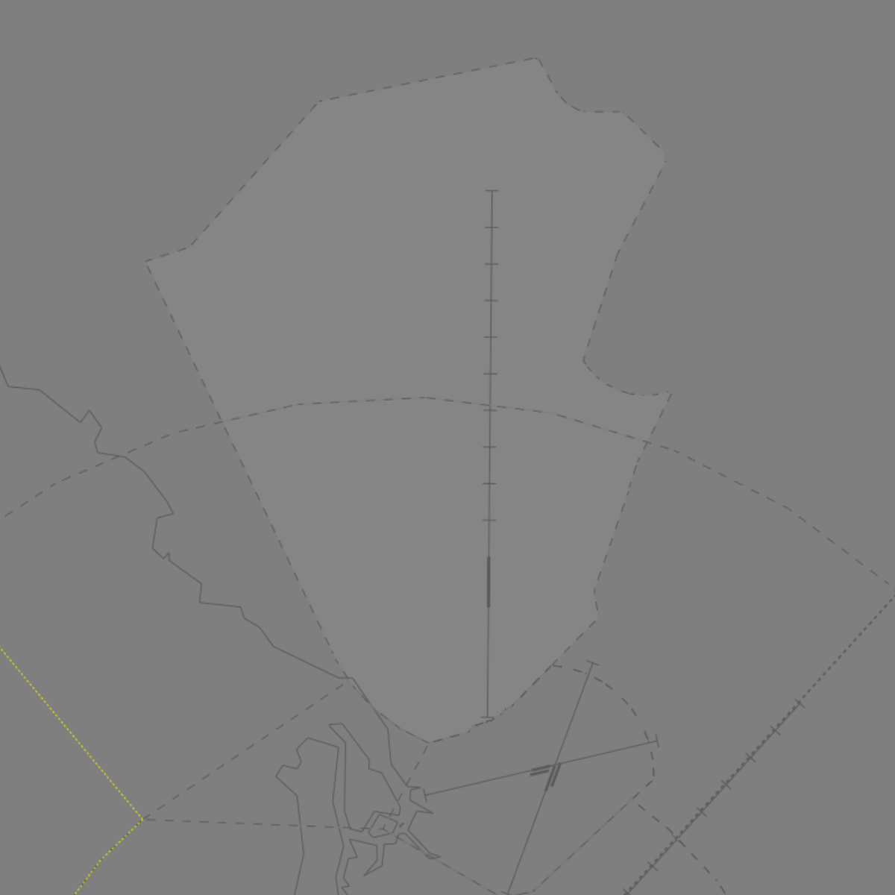
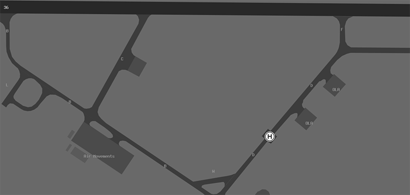
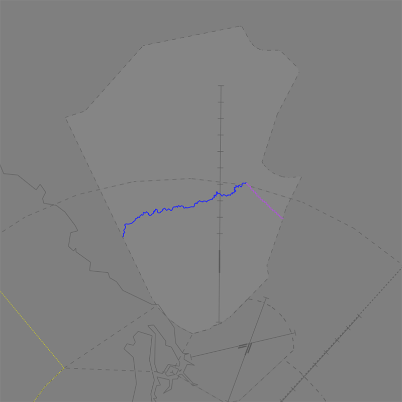

--8<-- "includes/abbreviations.md"

## Positions

| Name               | Callsign              | Frequency   | Login ID      |
| ------------------ | --------------------- | ----------- | ------------- |
| **Edinburgh ADC**  | **Edinburgh Tower**   | **118.300** | **ED_TWR**    |
| **Edinburgh SMC**  | **Edinburgh Ground**  | **134.100** | **ED_GND**    |
| **Edinburgh ATIS** |                       | **126.250** | **YPED_ATIS** |

!!! note
    YPED is a [military aerodrome](../../../controller-skills/military/#military-aerodromes) and procedures can differ significantly to those at a civil aerodrome. Ensure you are familiar with the [military controller skills](../../../controller-skills/military) necessary to provide a quality service.

## Airspace
**ED ADC** is responsible for the Class C airspace in the ED MIL CTR `SFC` to `A015`. 

<figure markdown>
{ width="700" }
  <figcaption>ED ADC Airspace</figcaption>
</figure>

## Restricted Area Activations
There are no [restricted areas or MOAs](../../../controller-skills/sua) activated by default when ED ADC is online.

#### SUA in TCU Airspace
Military operations taking place in SUA in TCU airspace are outside the jurisdiction of ED ADC.

ED SMC must [give **heads up** coordination](#smc-to-ad-tcu) to relevant TCU controllers before providing airways clearance to an aircraft intending to operate in a currently inactive SUA.

This gives the parent controller sufficient time to assess the request, make necessary adjustments to any aircraft in the area currently, and activate the SUA; or alternately to refuse the activation request before the aircraft is in the air.

## Local Procedures
### Inital and Pitch
The [intial points](../../../controller-skills/military/#initial-and-pitch) are east of the runway, at the following locations. Aircraft will pitch west in order not to impede on the Class G boundary. 

| RWY  | Initial Point | Altitude |
| ---- | ------------- | -------- |
| 18   | 2NM South     | `A015`   |
| 36   | 4NM North     | `A015`   | 

## Helicopter Operations
### Helipads
There is one helipad at YPED, on Taxiway D immediately east of OLA 11.

<figure markdown>
{ width="700" }
</figure>

The helipad is part of the manoeuvring area and controlled by ED SMC. Any helicopter taking off or landing on the helipads require a specific takeoff or landing clearance from ADC, following the [appropriate coordination with SMC](../../../controller-skills/coordination/#helicopter-movements-in-smc-jurisdiction).

!!! phraseology 
    **ED ADC**: "CHOP41, taxiway D, cleared to land" 

## Runway Modes
### Circuits
Circuit operations occur within the CTR bounded by the Gawler River to the north and the powerline running from the Gawler River (1.5NM south of the Gawler Township) to the south eastern boundary of the ED CTR.

<figure markdown>
{ width="700" }
</figure>

#### Circuit Heights
| Type    | Normal Altitude |
| ------- | --------------- |
| Non Jet | A015            |
| Jet     | A020            |

#### Circuit Direction

| Runway | Direction |
| ------ | --------- |
| 18     | Left      |
| 36     | Left      |

## Coordination
### Departures
[Next](../../controller-skills/coordination.md#next) coordination is required from ED ADC to AD TCU for all aircraft.

The Standard Assignable level from **ED ADC** to **AD TCU** is:

| Aircraft | Level |
| -------- | ----- |
| All | The lower of `A040` and `RFL` |

#### Departures Controller
When an AD TCU controller is online, aircraft shall be issued with a departure frequency during their airways clearance in accordance with the table below. If no TCU controllers are online, the appropriate enroute or advisory frequency shall be issued.

| Runway | Via   | Departure Frequency |
| ------ | ----- | -------------------- |
| All    | All   | 124.2 (AAW) |

### Arrivals/Overfliers
AD TCU will Heads-up coordinate all arrivals/overfliers to ED ADC.

!!! phraseology
    **AD TCU** -> **ED ADC**: "To the west, PLE, for the ILS-Z"  
    **ED ADC** -> **AD TCU**: "PLE, ILS-Z"

Inbound aircraft will be cleared for an instrument or visual approach prior to handoff to ED ADC, unless ADC nominates a restriction.

### SMC to AD TCU
The controller assuming responsibility of **SMC** shall give [heads-up](../../../controller-skills/coordination/#airways-clearance) coordination to AD TCU (or the enroute controller responsible for the AD TCU) prior to the issue of a clearance to an aircraft intending to operate in an SUA that **has not** been activated. 

!!! phraseology
    **ED SMC** -> **AAW**: "STKR11 requests clearance to R265B"  
    **AAW** -> **ED SMC**: "STKR11, clearance approved."  

## Charts
!!! abstract "Reference"
    In addition to the civilian `ERSA` and `AIP` publications, [the RAAF AIP website](https://ais-af.airforce.gov.au/australian-aip){target=new} contains the necessary charts (available in the TERMA) and description of procedures (in each airports' FIHA).