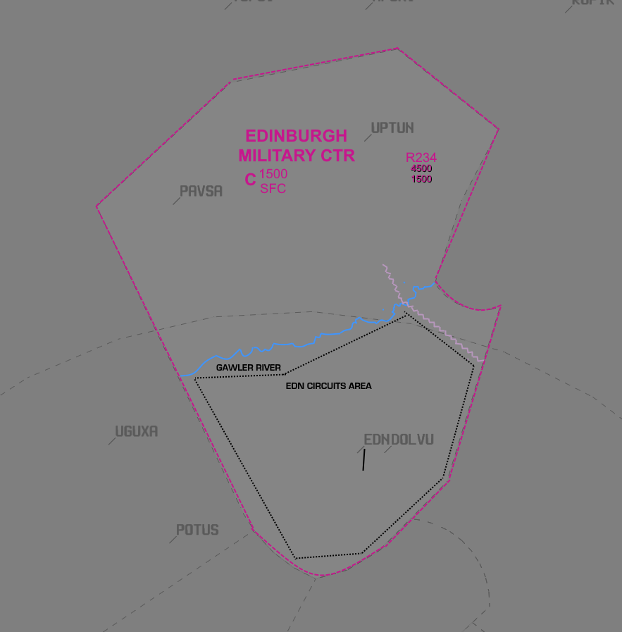

--8<-- "includes/abbreviations.md"

## Positions

| Name            | Callsign           | Frequency  | Login Identifier |
| --------------- | ------------------ | ---------- | ---------------- |
| Edinburgh ADC   | Edinburgh Tower    | 118.300    | ED_TWR           |
| Edinburgh SMC   | Edinburgh Ground   | 134.100    | ED_GND           |

## Airspace
<figure markdown>
{ width="700" }
</figure>

- **ED ADC Airspace**: `SFC` to `A015` within the Edinburgh Control Zone (ED CTR).

## Runway Modes
Single runway operations only.

## Circuit Procedures
The Edinburgh Circuit Area (ED CIRA) is active at all times when the Edinburgh CTR is active.

Circuit operations occur within the CTR bounded by the Gawler River to the north and the powerline running from the Gawler River (1.5NM south of the Gawler Township) to the south eastern boundary of the ED CTR. Vertical Limits `SFC` to `A020`

### Circuit Heights
| Type    | Normal Altitude |
| ------- | --------------- |
| Non Jet | A015            |
| Jet     | A020            |

### Circuit Direction

| Runway | Direction |
| ------ | --------- |
| 18     | Left      |
| 36     | Left      |

## Helicopter Operations
- **HLS Locations**: The HLS is located on TWY D immediately east of OLA 11. There are no SIDs associated with the HLS; aircraft requiring an instrument departure can expect to depart from the runway.

## Coordination
### Departures
'Next' coordination is required from ED ADC to AD TCU for all aircraft.

!!! phraseology
    **ED ADC** -> **AD TCU**: "Next, SGE"  
    **AD TCU** -> **ED ADC**: "SGE, unrestricted"  
    **ED ADC** -> **AD TCU**: "SGE"

The Standard Assignable level from ED ADC to AD TCU is the lower of `A050` or the `RFL`.

### Arrivals/Overfliers
AD TCU will Heads-up coordinate all arrivals/overfliers to ED ADC.

!!! phraseology
    **AD TCU** -> **ED ADC**: "To the west, PLE, for the ILS-Z"  
    **ED ADC** -> **AD TCU**: "PLE, ILS-Z"

- **IFR arrivals** will be cleared for the coordinated approach (Instrument or Visual) prior to handoff to ED ADC, unless ED ADC nominates a restriction.  
- **VFR arrivals** will be cleared for the coordinated visual approach prior to handoff to ED ADC, unless ED ADC nominates a restriction.