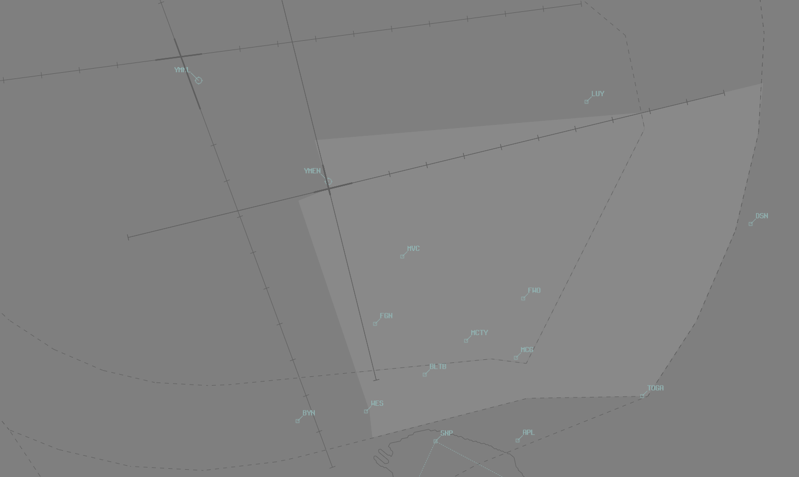

--8<-- "includes/abbreviations.md"

## Positions
| Name              | Callsign              | Frequency   | Login ID      |
| ----------------- | --------------------- | ----------- | ------------- |
| **Essendon ADC**  | **Essendon Tower**    | **125.100** | **EN_TWR**    |
| **Essendon SMC**  | **Essendon Ground**   | **121.900** | **EN_GND**    |
| **Essendon ATIS** |                       | **119.800** | **YMEN_ATIS** |

## Airspace
EN ADC is responsible for the Class C airspace shown below, `SFC` to `A020`.

<figure markdown>
{ width="700" }
</figure>

## Separation
EN ADC is responsible for **all separation** with YMML Traffic, including arrivals to RWY34 via the MOSVO-SHEED track, and all potential arrivals, departures, and missed approach paths.  
Some important points to note are that:  
- Aircraft operating on or south of the 08/26 Centreline are separated with YMML 09/27 Traffic at all times  
- Aircraft operating on or east of the 17/35 Centreline are **only** visually separated with YMML 16/34 Traffic in **Day VMC**  
- Aircraft conducting the ILS 26 Published Missed Approach are **only** visually separated with YMML 16/34 Traffic in **Day VMC**

EN ADC must assume that **any runway** at YMML may be used for arrival, departure, or a missed approach, **at any time**.  
When the cloud base is below **A020**, or the Visibility is below **5000m**, all aircraft operating within **3nm** of the 09/27 or 16/34 extended centreline must be [boundary coordinated](../../../controller-skills/coordination/#boundary) to ML ADC, as prescribed in [Coordination](#ml-adc)

If ML ADC nominates a restriction, and EN ADC determines they **cannot** maintain visual or lateral separation with the YMML traffic, EN ADC must delay the aircraft in their airspace until the separation can be assured. 

## Local Procedures
### SSR Assignment
Traffic in EN ADC airspace shall squawk 0100 unless a discrete code is required.

### Sunbury Corridor
Day VFR Helicopters may request clearance via the Sunbury Corridor. It is defined as the corridor 1nm either side of a track from SWT - PWLC - 16/27 Intersection at YMML.

Boundary Coordination must be completed to ML TCU for clearances in this airspace.

!!! phraseology
    **EN ADC** -> **ML TCU**: "HM3 requests clearance via Sunbury Corridor, not above `A020`."   
    **ML TCU** -> **EN ADC**: "HM3, clearance approved"  

### Melbourne City Orbits
EN ADC is responsible for facilitating aircraft requesting city orbits. They shall be conducted at an altitude of:  

- `A015` by day  
- `A022` by night

!!! phraseology
    **EOG**: "Essendon Tower, EOG, approaching WMS, A015, Requesting 1 left-hand city orbit, in receipt of L"  
    **EN ADC**: "EOG, Essendon Tower, cleared 1 left-hand city orbit A015"  
    **EOG**: "Cleared 1 left-hand city orbit A015, EOG"  
    *When orbit is complete and aircraft is leaving CTA laterally:*  
    **EN ADC**: "EOG, control services terminated, frequency change approved"  
    **EOG**: "EOG"

### IFR Departures
IFR flights shall be cleared via:  
    a) When cloud base and visibility exceeds `A020` and 5 KM, visual departure;  
    b) otherwise; EN (RADAR) SID.  

Start clearance is required for:  
    a) Flights to ML;  
    b) Flights to MB and AV planned above `A020` (i.e. via ML TCU Class C).  

### IFR Arrivals 
ML TCU shall clear aircraft for approach via the appropriate arrival gate:.

| Runway | Arrival Gate |
| ------ | ----------|
| 26     | MOSVO  |
| 35     | MOSVO |
| 17     | 5NM FINAL |
| 08     | 5NM FINAL |

!!! Note
    EN ADC must not permit aircraft to depart from the RWY 26 extended centreline until passed LUY and within the vertical limits of EN airspace.

## VFR Operations 
### Departures
VFR departures to Class G shall be cleared (at not above `A015`) via:

| Direction | VFR Outbound Point |
|----------| ------------------------ |
| East  | DSN |
| South East  | FWO |
| South | WES |
| North^ | CGB |
| North East^ | EPPG |
| West^ | ROK |
| North West^ | [Sunbury Corridor](#sunbury-corridor) |

!!! Note
    ^ Departures to the north and west are generally not available due to YMML traffic. Where YMML taffic permits, departures to these direction may be available [pending coordination](#smc-to-ml-tcu) with ML TCU.

### Arrivals
VFR arrivals from Class G shall be cleared (at not above `A015`) via:

| Direction | VFR Approach Point | RWY 17, 26 | RWY 35 |
|----------| ------------------------ | ----------| ----------|
| North | KAO | DCT | DCT |
| North East | YYN     | DCT | DCT |
| East | DSN    | DCT | DCT |
| South East | APL    | MCG  | MCG|
| South | SNP     | MVC | FGN  |
| South West | WES   | MVC | DCT |
| North West | [Sunbury Corridor](#sunbury-corridor) | DCT | DCT |

## Helicopter Operations
Essendon has multiple helipads spread over the airfield with 2 of the major ones being located at Emergency Apron or on taxiway **J**.

ADC shall inform SMC of any inbound helicopters so that they may prevent other aircraft from taxiing on the HLS.

### Departures
VFR Helicopters are generally processed via one of Essendon's VFR Departure Gates (see above). IFR helicopters should conform to fixed wing ops and be processed via the **EN (RADAR) SID** from an appropriate runway, unless a visual departure is acceptable.

### Arrivals 
VFR helicopters are generally processed via by one of Essendon's VFR Arrival Gates (see above).  IFR helicopters should conform to fixed wing ops and be processed via an appropriate runway.

## Runway Modes
### Preferred Runway Modes
Runway selection at Essendon requires consideration of winds, the runway mode in use at YMML, and local noise abatement procedures. 

Melbourne has priority when determining duty runways, and Essendon runways are selected, pending wind limitations (Crosswind <20kts, Tailwind <5kts), to minimise potential conflicts.

!!! tip 
    For example, when Runway 34 is in use for arrivals at Melbourne, aircraft departing Runway 26 at Essendon would almost immediately cause a breakdown in separation. 

This often results in Essendon using runways with large crosswind components, as the more favourable headwind direction is "reserved" for Melbourne traffic. The 26A17D runway mode, which concentrates traffic on the side of Essendon *away* from Melbourne, is generally the best configuration for avoiding conflicts with Melbourne traffic.

### Circuits
Circuits are to be flown at `A015`.

#### Circuit Direction
| Runway | Direction |
| ------ | ----------|
| 35     | Right  |
| 26     | Left |
| 17     | Left |
| 08     | Right |

## ATIS
### ATIS Identifier
YMEN ATIS identifiers only uses letters `A` through to `M`, due to nearby YMML using letters `N` through `Y` 

## Coordination
### ML TCU
#### SMC to ML TCU
##### Start Clearance
When an aircraft requests start clearance, the EN SMC controller shall coordinate with ML TCU to obtain the start clearance.

##### VFR Clearance
When an aircraft requests a VFR outbound departure to the north or west, the EN SMC controller shall coordinate with ML TCU to obtain approval to provide such clearance.

!!! phraseology
    **EN SMC** -> **ML TCU**: "XYZ requests clearance via ROK."  
    **ML TCU** -> **EN SMC**: "XYZ, clearance approved, not above `A025`."

When a clearance cannot be given (for example, due to conflicting traffic at YMML), EN SMC shall instead provide clearance to depart to the south or east.

#### Departures
[Next](../../controller-skills/coordination.md#next) coordination is required from EN ADC to ML TCU for all aircraft **entering ML TCU CTA**.

The Standard Assignable level from EN ADC to ML TCU is:

| Aircraft | Level |
| -------- | ----- |
| All | The lower of `A030` and `RFL` |

#### Arrivals/Overfliers
ML TCU will heads-up coordinate arrivals/overfliers from Class C to EN ADC.  
IFR aircraft will be cleared for the coordinated approach (Instrument or Visual) prior to handoff to EN ADC, unless EN ADC nominates a restriction.

!!! phraseology 
    **ML TCU** -> **EN ADC**: "via KAO, KHU"  
    **EN ADC** -> **ML TCU**: "KHU, A015"

!!! Note
    For aircraft not tracking via an Arrival Gate, ML TCU is required to coordinate descent of aircraft into EN ADC airspace.

When “The Coffin” is released, ML TCU is required to coordinate any use of Runway 27 prior to use.

#### Runway Change
Any Runway change must be prior coordinated to **ML TCU**

### ML ADC
EN ADC is responsible for separation with all YMML traffic, and must coordinate any aircraft operating in EN ADC airspace that cannot be visually or laterally separated with the 09/27 or 16/34 Extended Centrelines at YMML.

!!! phraseology 
    **EN ADC** -> **ML ADC**: "For Ident, OXG, published missed approach from the ILS 26"  
    **ML ADC** -> **EN ADC**: "OXG, my restriction is QFA451 on a 10nm final RWY 34, your separation"  
    **EN ADC** -> **ML ADC**: "My separation with QFA451, OXG"
