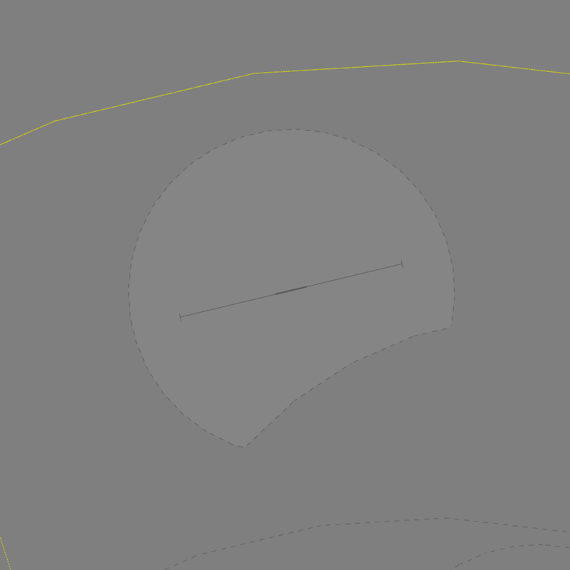

--8<-- "includes/abbreviations.md"

## Positions

| Name              | Callsign              | Frequency   | Login ID      |
| ----------------- | --------------------- | ----------- | ------------- |
| **Gingin ADC**    | **Gingin Tower**      | **118.500** | **GIG_TWR**   |
| **Gingin SMC**    | **Gingin Ground**     | **121.650** | **GIG_GND**   |
| **Gingin ATIS**   |                       | **134.500** | **YGIG_ATIS** |

## Airspace
GIG ADC owns the airspace within the GIG CIRA, which is defined as within **5nm** of the YGIG ARP, *excluding* the area south of **12 TACAN PEA**, from `SFC` to `A035`.

This airspace is primarily used for military circuits and initial and pitch approaches.

<figure markdown>
{ width="600" }
  <figcaption>GIG ADC Airspace</figcaption>
</figure>

## Local Procedures
### Initial and Pitch Procedures 
The initial points for Gingin are RWY 08 is the corner of the pine plantation and RWY 26 is the paddock divided by the creek. The initial altitude is `A015`.

## Runway Modes
### Circuits 
The CIRA airspace is allocated to be within 5nm of the YGIG ARP from `SFC` to `A035` exculding the area within 12TAC Pearce. Aircraft can be instructed to extend outside of this airspace by ATC for traffic management.

The Circuit altitude is `A016` for Jets, and `A012` for Non-Jets.

#### Circuit Direction
The Ciruits are preferred to be to the south of the field.

## Coordination
### Auto Release
[Next](../../controller-skills/coordination.md#next) coordination is required from GIG ADC to PE TCU for all aircraft.

The Standard Assignable Level from **GIG ADC** to **PE TCU** is:

| Aircraft | Level |
| -------- | ----- |
| All | The lower of `A050` and `RFL` |

### Departures Controller
When a PE TCU controller is online, aircraft shall be issued with a departure frequency during their airways clearance in accordance with the table below. If no TCU controllers are online, the Advisory frequency shall be issued.

| Runway | Via | Departure Frequency |
| ------ | ---- | -------------------- |
| All | All | 130.2 (PEA) |

## Charts
!!! abstract "Reference"
    Additional charts to the AIP may be found in the RAAF TERMA document, available towards the bottom of [RAAF AIP page](https://ais-af.airforce.gov.au/australian-aip){target=new}