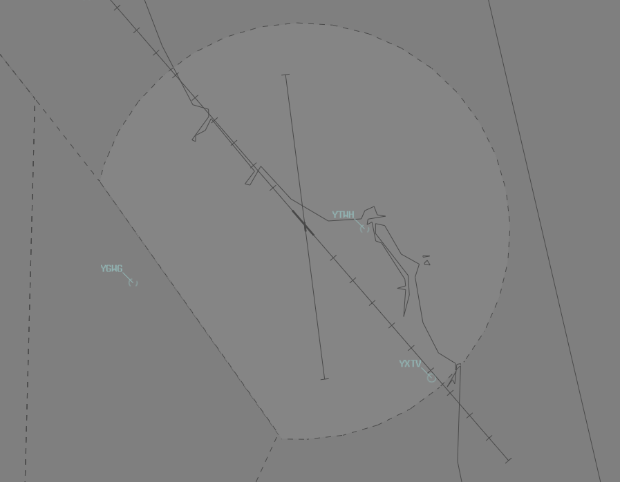

--8<-- "includes/abbreviations.md"

## Positions
| Name               | Callsign                | Frequency   | Login ID      |
| ------------------ | ----------------------- | ----------- | ------------- |
| **Gold Coast ADC** | **Gold Coast Tower**    | **118.700** | **CG_TWR**    |
| **Gold Coast SMC** | **Gold Coast Ground**   | **121.800** | **CG_GND**    |
| **Gold Coast ACD** | **Gold Coast Delivery** | **128.750** | **CG_DEL**    |
| **Gold Coast ATIS** |                        | **134.500** | **YBCG_ATIS** |

## Airspace
CG ADC is responsible for the Class C Airspace within the CG CTR `SFC` to `A015`.

<figure markdown>
{ width="700" }
  <figcaption>CG ADC Airspace</figcaption>
</figure>

## Manoeuvring Area
### Manoeuvring Area Responsibility
ADC is responsible for all runways, and the helipad adjacent taxiway G.

<figure markdown>
{ width="500" }
  <figcaption>YBCG Manoeuvring Area Responsibility</figcaption>
</figure>

!!! note
    While Taxiway **C** does directly intersect Runway **17/35**, it must still be kept clear of traffic for arriving and departing traffic. All aircraft need explicit clearance to cross the Runway **17/35** holding points on this taxiway.

### Taxiway Limitations
Taxiways **F**, **G**, and **J** can only support light aircraft.

## Local Procedures
### Low-Level Coastal Flights
Surf Lifesaving Patrol and Scenic Tour operations conducting low-level coastal flights within the CG CTR shall be cleared overwater in the required direction of travel, not above `A002`.

!!! phraseology
    **LIFE46:** "Gold Coast Tower, helicopter LIFE46, Q1, 3 POB, for low level coastal operations, received G, request clearance"  
    **CG ADC:** "LIFE46, Gold Coast Tower, cleared overwater southbound, not above A002"  
    **LIFE46:** "Cleared overwater southbound, not above A002, LIFE46"

### Western VFR Route
The Western VFR Route begins at NEN and tracks inland, terminating at Burringbar. It should generally be flown at `A015` (higher levels will require clearance from TCU). This route serves as an alternative route for aircraft wishing to transit through Gold Coast CTR and is laterally separated (by the 3nm radar standard) from both runway approach paths. Note that southern portion of the route is **not** laterally separated from the runway 14 departure paths.

!!! phraseology
    **WCS:** "Gold Coast Tower, helicopter WCS, NEN, A015, for Western VFR Route, received F, request clearance"  
    **CG ADC:** "WCS, Gold Coast Tower, cleared Western VFR Route, not above A015, QNH 1013"  
    **WCS:** "Cleared Western VFR Route, not above A015, QNH 1013, WCS"  

    Once the aircraft exits the CTA, cancel their control services.

    **WCS:** "WCS, clear of Class C airspace"  
    **CG ADC:** "WCS, control services terminated, frequency change approved"   
    **WCS:** "Frequency change approved, WCS" 

!!! tip
    You can find details of the Western VFR Route on the [Gold Coast VTC](https://www.airservicesaustralia.com/aip/aip.asp){target=new}.

### Intersection Departures
Unless a full-length departure is operationally required, aircraft departing **Runway 32** must use the Taxiway **K** intersection for departure.

### Arrivals
Arriving aircraft that are operating at or below `A015` may contact ADC for inbound clearance. These aircraft shall be assigned a discrete SSR code but shall not be radar identified.

Aircraft shall be cleared subject to the following conditions:

| Via             | RWY 14      | RWY 32       |
| ------------------ | -------------- | ---------------- |
|  **North** Jets   |  Not below `A050` until vectored over water to join final    | Via right circuit for 10 NM final; or Right base south of DNGR  |
|  **North** Non-Jets   |   Not below `A030` until vectored over water to join final   | Via right circuit for 10 NM final; or Right base south of DNGR  |
|  **East**   |   Via LAMSI STAR; or Over water until final   |    Join 10 NM final   |
|  **South** Jets   |    Via STAR; or Not below `A050` until over water to join final |  Via STAR to join final  |
|  **South** Non-Jets   |    Via STAR; or Not below `A030` until over water to join final |  **IMC:** via STAR **VMC:** Join left base for 2 NM final |

## VFR Operations
VFR aircraft often transit the CG CTR via the coast. This conflicts with arrivals and departures to both runway 14 and 32, and should be accommodated where traffic permits. During busy traffic periods, transit aircraft shall be cleared via the [Western VFR Route](#western-vfr-route). 

### Arrivals
#### From the North
Aircraft approaching from the north will generally contact ADC at Q1 or ROT for clearance. They should be instructed to track coastal southbound, then join final runway 14 or downwind runway 32.

!!! phraseology
    **OMU:** "Gold Coast Tower, Cessna 172 OMU, abeam Q1, recieved F, inbound, request clearance"  
    **CG ADC:** "OMU, Gold Coast Tower, cleared overwater southbound, not above A015"  
    **OMU:** "Cleared overwater southbound, not above A015, OMU"

    **CG ADC:** "OMU, track for final runway 14, cleared visual approach"  
    **OMU:** "Track for final runway 14, cleared visual approach, OMU"

Where insufficient spacing exists with IFR aircraft, instruct VFR aircraft to expect a clearance via ROTC, which will offset them from the extended runway centreline. 

!!! note
    The Class C lower limit overhead ROTC is `A015`.

!!! phraseology
    **BTA:** "Gold Coast Tower, Sling BTA, abeam Q1, inbound, received P, request clearance"  
    **CG ADC:** "BTA, Gold Coast Tower, remain outside Class C airspace, expect a clearance tracking via ROTC, report approaching ROTC."  
    **BTA:** "Remain outside Class C airspace, wilco, BTA"  

    **CG ADC:** "BTA, traffic is an A320, 1 mile north of BLGH, report sighting and able to maintain own separation"  
    **BTA:** "Traffic in sight, we're able to maintain own separation, BTA"  
    **CG ADC:** "BTA, follow the A320, maintain own separation, track for final runway 14, cleared visual approach"  
    **BTA:** "Follow the A320, maintain own separation, track for final runway 14, cleared visual approach BTA"  

#### From the South
Aircraft approaching from the south will generally contact ADC approaching HASS for clearance. They should be instructed to join the circuit for the duty runway.

!!! phraseology
    **FTQ:** "Gold Coast Tower, Cherokee FTQ, HASS, A015, inbound, received H, request clearance"  
    **CG ADC:** "FTQ, Gold Coast Tower, join final runway 32, cleared visual approach"  
    **FTQ:** "Join final runway 32, cleared visual approach, FTQ"

Where insufficient spacing exists with IFR aircraft, instruct VFR aircraft to remain OCTA and report again at CGD (for runway 32) or to track northbound overwater with a clearance limit of CIS (for runway 14). Once clear of conflict, aircraft may join final for runway 32 or downwind/base for runway 14.

!!! phraseology
    **JCZ:** "Gold Coast Tower, Cessna 172 JCZ, HASS, A015, inbound, received M, request clearance"  
    **CG ADC:** "JCZ, Gold Coast Tower, cleared overwater northbound, not above A015, clearance limit CIS"  
    **JCZ:** "Cleared overwater northbound, not above A015, clearance limit CIS, JCZ"

    **CG ADC:** "JCZ, cancel clearance limit, track coastal northbound, report DNGR"  
    **JCZ:** "Cancel clearance limit, track coastal northbound, JCZ"  

    **JCZ:** "JCZ, DNGR"  
    **CG ADC:** "JCZ, join left base runway 14, cleared visual approach"   
    **JCZ:** "Join left base runway 14, cleared visual approach, JCZ" 

!!! phraseology
    **LKU:** "Gold Coast Tower, Cherokee LKU, HASS, A015, inbound, received B, request clearance"  
    **CG ADC:** "LKU, Gold Coast Tower, remain outside Class C airspace, report again at CGD"  
    **LKU:** "Remain outside Class C airspace, LKU"  

    **LKU:** "LKU, CDG"  
    **CG ADC:** "LKU, expect clearance in three minutes due inbound traffic, report sighting and able to maintain own separation with a 737, currently on a 12nm final runway 32"  
    **LKU:** "Wilco, LKU"  

    **LKU:** "LKU, traffic sighted, we can maintain own separation"  
    **CG ADC:** "LKU, follow the 737, maintain own separation, join final runway 32, cleared visual approach"  
    **LKU:** "Follow the 737, maintain own separation, join final runway 32, cleared visual approach, LKU"

### Helicopter Operations
The HLS (Helipad) is located between the GA Apron and Taxiway Golf. The Helipad is part of the manoeuvring area and is controlled by CG ADC. Any helicopter taking off or landing on the helipad requires a specific takeoff or landing clearance from ADC.

!!! phraseology 
    **CG ADC**: "WP2, helipad, cleared to land"

Local helicopter operations are conducted on the Western Grass which is the area contained by blue gable markers north of the VOR and west of the runway intersection. This is marked on the aerodrome chart as “HELO OPS”. Circuits from the Western Grass are to be made in the same direction as the duty runway.

### Hospital Helipads
Within the Gold Coast CTR, there are two main hospital helipads. Tweed Heads Hospital (YTWH), and Tweed Valley Hospital (YXTV).

<figure markdown>
{ width="700" }
  <figcaption>CG ADC Airspace</figcaption>
</figure>

#### Arrivals
ADC shall assess the current traffic situation and, if necessary, instruct the pilot to hold and/or maintain own separation with any arriving or departing aircraft, then clear them for a visual approach to their inbound hospital.

!!! phraseology
    **WP1:** "Gold Coast Tower, helicopter WP1, 6 miles south, inbound YXTV, received G"  
    **CG ADC:** "WP1, Gold Coast Tower, cleared to YXTV direct, not above A015"  
    **WP1:** "Cleared to YXTV direct, not above A015, WP1"  

Both hospital helipads are outside the manoeuvring area and do not require a landing clearance from CG ADC. Helicopters arriving to these helipads should be instructed to "report on the ground" so the controller knows when they are no longer active in their airspace.

!!! phraseology
    **CG ADC:** "WP1, cleared visual approach YXTV, report on the ground"  
    **WP1:** "Cleared visual approach YXTV, wilco, WP1"  

#### Departures
Aircraft departing from hospitals within the Gold Coast CTR must obtain clearance prior to becoming airborne. The Tweed Valley Hospital (YXTV) helipad, is located 6nm south beneath Runway 32 extended centerline, and may present potential traffic conflicts. Aircraft will be subject to delays depending on traffic in the Gold Coast CTR.

Both hospital helipads are outside the manoeuvring area and do not require a takeoff clearance from CG ADC, however a clearance to become airborne is required. Helicopters departing from these helipads should be instructed to "report airborne".

!!! phraseology
    **RSCU588:** "Gold Coast Tower, helicopter RSCU588, YXTV, ready for northen departure"  
    **CG ADC:** "RSCU588, Gold Coast Tower, remain on the ground, expect clearance in 3 minutes due traffic"  
    **RSCU588:** "Remain on the ground, RSCU588"

    **CG ADC:** "RSCU588, Cleared to YBBN via STOT, flight planned route. Not above A015, report airborne"  
    **RSCU588:** "Cleared to YBBN via STOT, flight planned route. Not above A015, wilco, RSCU588"  

## Runway Modes
The preferred runway is **Runway 14**.

Runway 17/35 may be used at the same time as Runway 14/32, weather and traffic permitting.

### Circuits
Circuits are to be conducted at `A010`.  

#### Circuit Direction
| Runway               | Direction       |
| ------------------ | -------------- |
| 14 | Left  |
| 32 | Right  |
| 17 | Left | 
| 35 | Right    | 

## SID Selection
**RNAV-equipped** jet aircraft planned via **APAGI** shall be assigned the **APAGI SID**. **RNP (0.3)** approved operators planned via **APAGI** shall be assigned the **CUDGN** or **BURLI** procedural SIDs.

IFR aircraft departing Runway 17/35 shall be assigned a **visual departure**.

Aircraft not meeting the above criteria, or that cannot accept a Procedural SID shall be assigned the **Radar SID**.

## ATIS
### Approach Types

| Cloud Base          | Visibility | Approach         |
| ------------------- | ---------- | ---------------- |
| At or above `A030`  | >5000M     | (blank)          |
| Below `A030` **or** | <5000M     | `EXP INSTR APCH` |
| At night 			  |            | `EXP INSTR APCH` |

## Coordination
### Auto Release
[Next](../../controller-skills/coordination.md#next) coordination is **not** required to BN TCU for aircraft that are:   
  
  - Departing from a runway nominated on the ATIS; and  
  - Assigned the standard assignable level; and  
  - Assigned a **Procedural** SID

All other aircraft require a 'Next' call to CG TCU.

The Standard Assignable level from CG ADC to BN TCU is:  

| Aircraft | Level |
| -------- | ----- |
| Jets | `A060` |
| Non-Jets | The lower of `A060` and `RFL` |

### Start Clearance
A start clearance is required for aircraft planned to YBBN. Start clearance must be coordinated with BN TCU.
