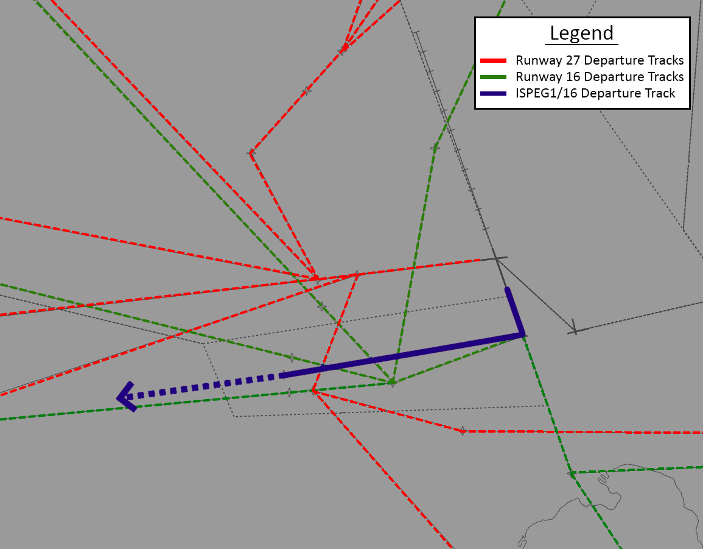

--8<-- "includes/abbreviations.md"

## Positions
| Name               | Callsign       | Frequency        | Login ID                         |
| ------------------ | -------------- | ---------------- | ---------------------------------------- |
| **Melbourne ADC**    | **Melbourne Tower**   | **120.500**          | **ML_TWR**                                   |
| **Melbourne SMC**    | **Melbourne Ground**  | **121.700**          | **ML_GND**                                   |
| **Melbourne ACD**         | **Melbourne Delivery**| **127.200**          | **ML_DEL**                                   |
| **Melbourne ATIS**        |                | **118.000**         | **YMML_ATIS**                                |

## Airspace
ML ADC is not responsible for any airspace by default.

## Maneuvering Area
### Standard Taxi Routes

Except when the traffic situation warrants, taxi clearances shall conform to the following diagram:
<figure markdown>
{ width="700" }
  <figcaption>YMML Standard Taxi Routes</figcaption>
</figure>

### Taxiway Construction
In the real world, a number of projects are shaping the layout of YMML. Simulator scenery packages are often slow to respond to these changes and different pilots may have different aerodrome layouts available to them. Controllers should continue to give taxi instructions in accordance with the ground map in vatSys, but they should be prepared to accommodate pilots using a variety of scenery packages.

<figure markdown>
{width="700"}
    <figcaption>Taxiway Works</figcaption>
</figure>

#### Taxiway D/E
An additional taxiway parallel to runway 27 has been built, named taxiway D. This is allowing for taxiway E to be removed and reconstructed in a slightly different position.

The majority of simulators do not have scenery which reflects this construction, however X-Plane (and possibly some other niche scenery packages) do.

#### Taxiway Y Apron Taxi Lanes
The apron off taxiway Y has been amended to include two separate taxi lanes, capable of facilitating simultaneous pushbacks from aircraft at Pier F and Pier G.

The majority of simulators will still have the old apron layout with a single taxi lane between the two piers. Controllers should be wary of the potential for collision if simultanous pushback approval is given to aircraft in this area.

## Separation
### Reduced Runway Separation
When conditions permit, the [2400m separation standard for landing aircraft](../../separation-standards/runway.md#2400m-standard) may be applied to aircraft arriving Runway **16/34**.

## Workload Management
During busy events, such as [Milk Run Monday](../../../events/milkrun/), the **SMC** controller may end up with a much higher workload than the **ACD** controller. Additionally, delays may need to be implemented for aircraft requesting pushback, so as to not overload the taxiways and holding points.

### Pushback Requests on ACD
During busy periods, SMC and ACD may coordinate to implement the [Pushback Requests on ACD](../../controller-skills/grounddelaymanagement#pushback-requests-on-acd) procedure to balance the workload across ACD and SMC frequencies.

When implementing the procedure the ATIS [OPR INFO field](#acd-pushback-requests) must be updated to inform pilots the correct frequency on which to request pushback.

### COBT Slot Times
During busy events, VATPAC may utilise prebooked slots to manage traffic congestion. Aircraft which are compliant with their booked slot time should be prioritised over aircraft who are non-compliant or do not have a slot.

<figure markdown>
{ width="200" }
  <figcaption>COBT Slot Time</figcaption>
</figure>

## Local Procedures
### Sunbury Corridor
Day VFR Helicopters may request clearance via the **Sunbury Corridor**. It is defined as the corridor 1nm either side of a track from SWT - PWLC - 16/27 Intersection at YMML.

<figure markdown>
{ width="700" }
  <figcaption>Sunbury Corridor</figcaption>
</figure>

Boundary Coordination must be completed to ML TCU for clearances in this airspace

!!! phraseology
    **ML ADC** -> **ML TCU**: "For Ident, HM3, Sunbury Corridor, not above A020"  
    **ML TCU** -> **ML ADC**: "HM3, No Restrictions"  

Due to the close proximity of the airspace to the arrival and departure paths at YMML, controllers should be aware of surrounding traffic before issuing a clearance to helicopters.

!!! phraseology
    **HM3:** "Melbourne Tower, HM3, approaching SWT, A020, for YMEN via the Sunbury Corridor, request clearance"  
    **ML ADC:** "HM3, cleared to YMEN, track Sunbury Corridor, not above A020"  
    **HM3:** "Cleared to YMEN, track Sunbury Corridor, not above A020, HM3"

If necessary, consider issuing a clearance limit for separation or instruct helicopters to report sighting and to maintain own separation with other aircraft.  Alternatively, tower controllers can simulate visual separation provided no risk of collision exists and both aircraft remain in sight of the controller at all times. 

!!! phraseology
    **ML ADC:** "HM3, report sighting a Jetstar A320, 4nm final runway 16"  
    **HM3:** "Traffic sighted, HM3"  
    **ML ADC:** "HM3, pass behind that aircraft, maintain own separation, caution wake turbulence"  
    **HM3:** "Pass behind the A320, maintain own separation, HM3"

Remember to pass traffic information to both aircraft.

!!! phraseology
    **ML ADC:** "JST515, traffic is a helicopter, 2nm northwest of the field, tracking for Essendon and maintaining own separation with you, runway 16, cleared to land"  
    **JST515:** "Runway 16, cleared to land, JST515"

### Pushback Disconnect Points
In the real world, YMML utilises Towbar Disconnect Points (TDPs) to allow predictable pushback paths from various bays. On VATSIM, this is difficult to simulate, given the limited access to pushback maps and the additional plugins required to facilitate a pushback in this way.

!!! warning "Important"
    In the real world, disconnect points are rarely assigned by the SMC controller, as each bay has a standard disconnect point. As such, disconnect points should only be assigned where there is benefit to traffic flow on the apron, after confirming that **both the pilot & controller** are competent in their use, or on **pilot request**.

### Departure Queueing
Where excessive queueing is taking place at the holding points, minimise its effect on the surrounding taxiways by strategically positioning outbound aircraft to keep the main arterial taxiways clear.

Particular attention should be paid to departures for runways 27 and 34. Taxiway E may be used to keep runway 27 departures clear of the inbound path to the northern aprons. Taxiway V may be used to keep runway 34 departures (via the J intersection) clear of Taxiway A, allowing aircraft to transit to all aprons or taxi for a full length departure.

<figure markdown>
{ width="800" }
  <figcaption>Segregated queues for runway 34 keeping Taxiway A clear</figcaption>
</figure>

## Runway Modes
###Preferred Runway Modes
If winds are too great, single runway operations may be necessary (eg, Runway 16 for Arrivals and Departures). However, pending wind limitations (Crosswind <20kts, Tailwind <5kts), the following runway modes are to be used

| Mode | Arrivals  | Departures |
| ----------------| --------- | ---------- |
| 27AD/34D   | 27       | 34 (Via MNG, NONIX, and DOSEL), 27 (All other deps)        |
| 16A/27D    | 16 | 27  |
| 09A/16D    | 09 | 16  |
| 34A/27AD   | 34 & 27 | 27 |

!!! info
    When utilising the 27AD/34D runway mode, Heavy Aircraft may require Runway 34 for departure due to the shorter length of Runway 27. Assigning Runway 34 to aircraft from the southern apron can also improve aerodrome efficiency due to the reduced taxi distance.

!!! note
    See [Runway Mode Formatting](#runway-mode-formatting) for details on how to format each runway mode in the ATIS.

### LAHSO
!!! warning "Important"
    Due to its operational complexity, LAHSO **must be authorised by a senior VATPAC staff member or a nominated event coordinator**.

    Very little benefit is achieved by running LAHSO without a flow controller and it is almost exclusively reserved for our busiest events.

Detailed procedures exist to ensure that controllers are aware of their responsibilities when performing LAHSO. See [Controller Skills](../../controller-skills/runwaymanagement.md#lahso) for more information.

#### Weather Conditions
LAHSO may only be used where the weather conditions meet the following minimum requirements:

| Element | Criteria |
| ------- | -------- |
| Cloud Ceiling | `A045` or higher |
| Visibility | 8km or greater |
| Surface Condition | Dry |
| Windshear | None Reported |

Two simultaneous landings may be conducted by both day and night. A simultaneous takeoff and landing may only be conducted by day.

#### Runway Mode
The only approved LAHSO mode at YMML is **34A/27AD**. Runway 34 is considered the active runway, while runway 27 is considered the passive runway.

## SID Selection
Jet Aircraft planned via **MNG**, **NONIX**, **DOSEL**, **CORRS**, **KEPPA**, **PEDNI**, **SUNTI**, **ESDIG**, or **CRENA**, shall be assigned the **Procedural SID** that terminates at the appropriate waypoint. Jet Aircraft **not** planned via any of these waypoints shall receive amended routing via the most appropriate SID terminus, unless the pilot indicates they are unable to accept a Procedural SID.

!!! example
    Jet Aircraft planned via DOSEL, assigned runway 27, shall be given the DOSEL SID.

#### Off Mode Departures
!!! info "Definition"
    **Off Mode:** Aircraft departing from a runway not prescribed as active for departures on the ATIS. For example, a heavy aircraft that operationally requires Runway 16 for departure during the 16A/27D Mode.

For jet aircraft departing Runway 16 **Off Mode** via **MNG**, **NONIX**, **DOSEL**, **KEPPA**, **PEDNI**, or **ESDIG**, the **ISPEG SID** must be assigned. **Off Mode** departures to the south-east shall be assigned the relevant **Procedural SID**.
<figure markdown>
{ width="700" }
  <figcaption>Runway 16 and 27 departure conflicts visualised with the ISPEG SID</figcaption>
</figure>

!!! note
    The ISPEG SID does not resolve all conflicts. Departures via SUNTI and CORRS need to be handled tactically by ML TCU.

#### RADAR SID
a) Jet aircraft departing **Off Mode** that don't meet the above critera; or  
b) Non-Jet Aircraft; or  
c) All aircraft using Runway 09; or  
d) Aircraft that cannot accept a Procedural SID  
Shall be assigned the **Radar SID**.

!!! example
    Non-Jet Aircraft planned via DOSEL, assigned runway 34, shall be given the ML (RADAR) SID.

## ATIS
### ATIS Identifier
YMML ATIS identifiers only uses letters `N` through to `Y`, due to nearby YMEN using letters `A` through `M`.  

### Approach Expectation
With **Runway 34** in use for arrivals and the cloud base above `A030` but below `A042`, the APCH field shall include:  
`ACFT ON THE ALPHA STAR EXP INSTR APCH` 

This permits controllers to assign aircraft either the Alpha or Victor STAR and process them for a GLS/RNP approach or a visual approach (depending on traffic flow and pilot preference).

### Runway Mode formatting
| Mode | ATIS Runway information |
| ----------------| --------- |
| 27AD/34D   | `27 FOR ARR, RWY 34 FOR DEPS VIA MNG, NONIX AND DOSEL, RWY 27 FOR ALL OTHER DEPS` |
| 16A/27D    | `16 FOR ARR, RWY 27 FOR DEP` |
| 09A/16D    | `09 FOR ARR, RWY 16 FOR DEP` |
| 34A/27AD   | `34 FOR ARR, RWY 27 FOR ARR AND DEP` |

### Operational Info
#### Independent Crossing Runway Operations
When using runway mode 09A/16D, the ATIS OPR INFO shall include:  
`SIMUL INDEP CROSSING RWY OPS IN PROG`

This allows for both Runway 09 and Runway 16 to operate independently of each other, with aircraft departing Runway 16 from Taxiway Echo.

#### LAHSO
When [LAHSO](#lahso) is in use, the ATIS OPR INFO shall include:  
`LAND AND HOLD SHORT OPERATIONS IN PROGRESS`

#### ACD Pushback Requests
When implementing the [Pushback Requests on ACD](#pushback-requests-on-acd) procedure, the OPR INFO shall include:  
`ALL DEPARTURES MUST REQUEST PUSH BACK ON 127.2`  

## Coordination
### Auto Release
!!! warning "Important"
    Melbourne utilises auto release for all **Procedural** SIDs and the **ML (RADAR)** SID provided aircraft are assigned the Standard Assignable Level and a [Standard Assignable Heading](#standard-assignable-departure-headings).

[Next](../../controller-skills/coordination.md#next) coordination is **not** required for aircraft that are:  

- Assigned a **Procedural** SID  
    - Departing from a runway nominated on the ATIS; and  
    - Assigned `A050`  
- Assigned the **ML (RADAR)** SID  
    - Departing from a runway nominated on the ATIS; and  
    - Assigned `A050`; and  
    - Assigned a [Standard Assignable Heading](#standard-assignable-departure-headings)  
- Assigned the **ISPEG** SID  
    - Departing from Runway 16 during the 16A27D Runway Mode; and  
    - Assigned `A050`; and  
    - Tracking via **MNG**, **NONIX**, **DOSEL**, **KEPPA**, **PEDNI** or **ESDIG**

All other aircraft require a 'Next' call to ML TCU.

The Standard Assignable level from **ML ADC** to **ML TCU** is:

| Aircraft | Level |
| -------- | ----- |
| All | The lower of `A050` and `RFL` |

### Standard Assignable Departure Headings
Aircraft that have been cleared the **ML (RADAR) SID** must receive an assigned heading with their line up or takeoff clearance.

The following Standard Assignable Headings may be used for aircraft assigned the ML (RADAR) SID, depending on their direction of travel.

| Runway | W | NE | SE | S |
| ---- | :----: | :----: | :----: | :----: |
| RWY 09* | - | - | - | - |
| RWY 16** | H290 | H290 | H160 | H260 |
| RWY 27 | H320 | H290 | H260 | H260 |
| RWY 34 | H340 | H340 | H340 | H260 |

*When Runway 09 is in use for departures, ML TCU shall nominate a heading to ML ADC for use as a standard assignable heading.

**When Runway 09 is in use for arrivals, all Runway 16 departures shall be assigned heading 160.

### Runway Change
Any runway change must be prior coordinated to **MAE** and **EN ADC**.

### Departures Controller
Refer to [Melbourne TCU Airspace Division](../../../terminal/melbourne/#airspace-division) for information on airspace divisions when **MDN** and/or **MDS** are online.

### EN ADC
EN ADC is responsible for separation with all YMML traffic, and will coordinate any aircraft operating in EN ADC airspace that cannot be visually or laterally separated with YMML traffic.

!!! phraseology 
    **EN ADC** -> **ML ADC**: "For Ident, OXG, published missed approach from the ILS 26"  
    **ML ADC** -> **EN ADC**: "OXG, my restriction is QFA451 on a 10nm final RWY 34, your separation"  
    **EN ADC** -> **ML ADC**: "My separation with QFA451, OXG"