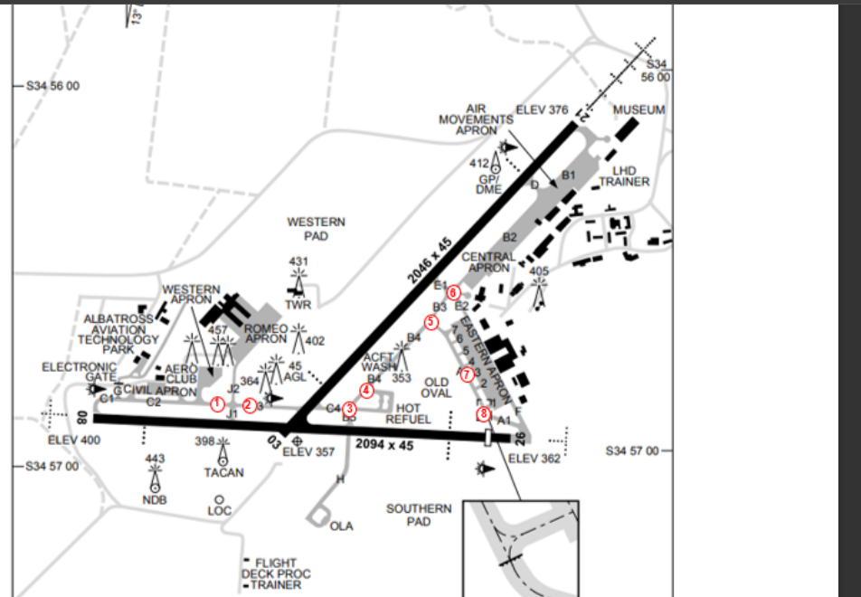

--8<-- "includes/abbreviations.md"

## Positions

| Name               | Callsign       | Frequency        | Login ID              |
| ------------------ | -------------- | ---------------- | --------------------------------------|
| **Nowra ADC**    | **Nowra Tower**  | **118.850**         | **NW_TWR**        |
| **Nowra SMC**   | **Nowra Ground**  | **135.850**        | **NW_GND**        |
| **Nowra ACD**    | **Nowra Delivery**  | **128.350**         | **NW_DEL**       |
| **Nowra ATIS**    |  | **125.65**         | **YSNW_ATIS**       |

## Airspace
NW ADC owns the Class C airspace from `SFC` to `A020`, within a 5nm radius of the NWA TACAN. This airspace is designed to facilitate helicopter and circuit traffic.

## Runway Modes
Any combination of runway configurations are permitted, including single runway operations during strong wind conditions. The following list dictates common runway modes.

- Runway 21 and Runway 08;  
- Runway 21 and Runway 26;  
- Runway 03 and Runway 08;  
- Runway 03 and Runway 26;   

## Circuit Procedures

Circuit operations occur within a `5NM` radius of NWA TACAN, at the following altitudes:

- Fixed Wing: `A020`
- Rotary Wing: `A012`
- Flight Deck Procedural Trainer: not above `A007`

### Circuit Direction
| Runway | Direction |
| ------ | ----------|
| 08     | Right  |
| 21     | Right |
| 03     | Left |
| 26     | Left |

## Helicopter Operations
VFR helicopters may elect to operate to/from designated positions (helicopter spots) on the aerodrome by both day and night, remaining clear of the active runway/s. IFR helicopters must operate from/to the active duty runway.

### Helicopter Spots
Take-offs and landings to the Helicopter Spots should be parallel to the duty RWY direction. Normally the most upwind Helicopter Spot parallel to the RWY is designated for departures, and the downwind Helicopter Spot designated for arrivals. Helicopter Spots have been designed to allow simultaneous arrivals and departures of an adjacent Helicopter Spot. After landing at a Helicopter Spot, helicopters shall not vacate the Spot until in receipt of a taxi clearance from SMC.

The following pre-defined helicopter spots can be used for this purpose. These spots are physically marked with bidirectional numbers in addition to the standard “H” marking.

- Spot 1 (Taxiway C2)
- Spot 2 (Taxiway C3)
- Spot 3 (Taxiway B4)
- Spot 4 (Taxiway B4)
- Spot 5 (Taxiway B3)
- Spot 6 (Taxiway B3)
- Spot 7 (Taxiway A2)
- Spot 8 (Taxiway A2)

<figure markdown>
{ width="700" }
<figcaption>NW VFR CRD</figcaption>
</figure>

| Active Runway | Departure Spots (Order of Preference) | Arrival Spots (Order of Preference) |
|---------------|----------------------------------------|-------------------------------------|
| Runway 08     | Spot 2 (C3), Spot 1 (C2)               | Spot 8 (A2), Spot 7 (A2)            |
| Runway 26     | Spot 8 (A2), Spot 7 (A2)               | Spot 2 (C3), Spot 1 (C2)            |
| Runway 03     | Spot 6 (B3), Spot 5 (B3)               | Spot 4 (B4), Spot 3 (B4)            |
| Runway 21     | Spot 4 (B4), Spot 3 (B4)               | Spot 6 (B3), Spot 5 (B3)            |

!!! phraseology
    **NW ADC**: "TAIP52, spot 2, cleared to land"  
    **TAIP52**: "Spot 2, cleared to land, TAIP52"

## Charts
Aerodrome and instrument approach charts are available in the AIP, or otherwise in the RAAF TERMA document, available towards the bottom of [RAAF AIP page](https://ais-af.airforce.gov.au/australian-aip){target=new}.

## Coordination
### Auto Release
[Next](../../controller-skills/coordination.md#next) coordination is required from NW ADC to NW TCU for all aircraft.

The Standard Assignable level from **NW ADC** to **NW TCU** is:

| Aircraft | Level |
| -------- | ----- |
| All | The lower of `F120` and `RFL` | 

Helicopters departing from helicopter spots will be treated as if departing from the duty runway.

!!! phraseology
    *PSDN14 is a VFR helicopter departing from spot 2 (in the direction of runway 08)*  
    **NW ADC** -> **NW TCU**: "Next, PSDN14, runway 08"  
    **NW TCU** -> **NW ADC**: "PSDN14, right turn, unrestricted"  
    **NW ADC** -> **NW TCU**: "Right turn, PSDN14"