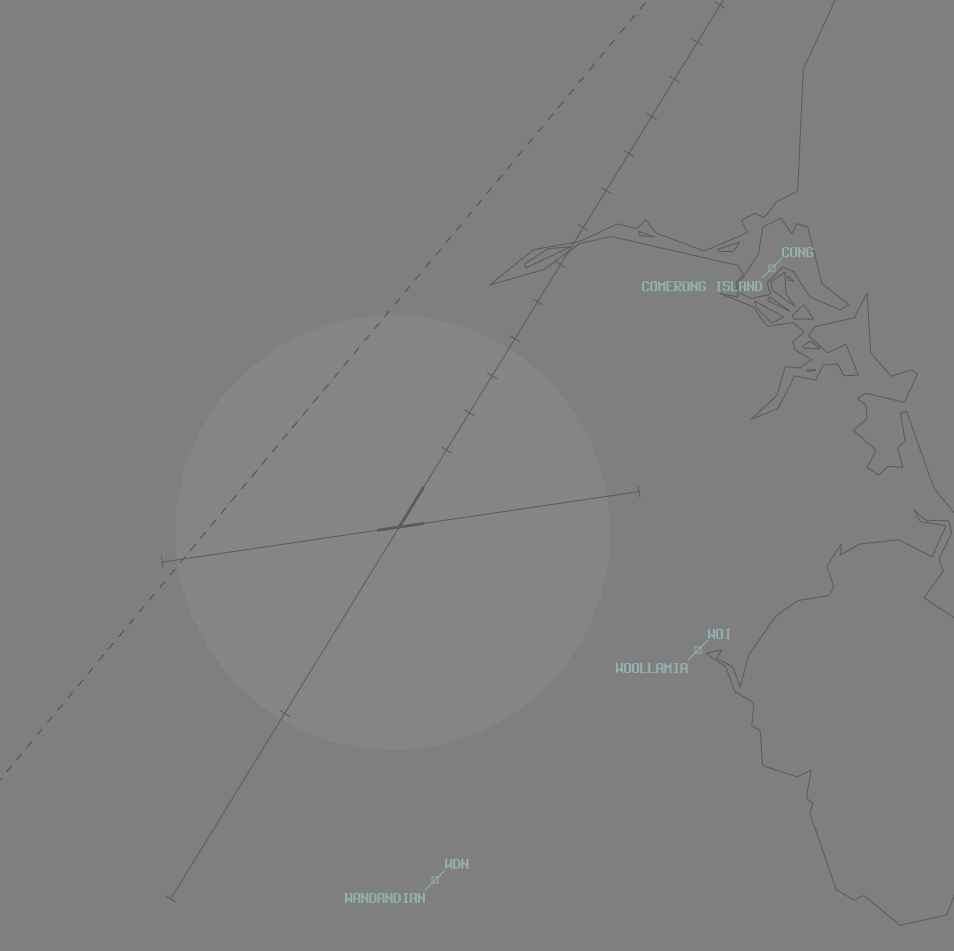
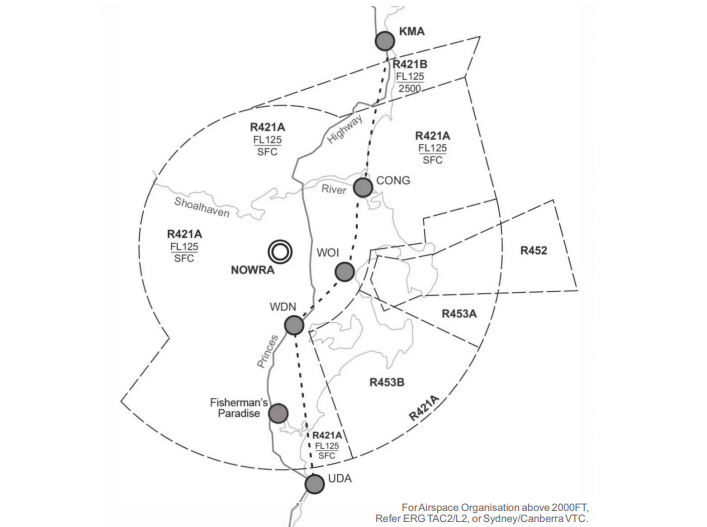

--8<-- "includes/abbreviations.md"

## Positions

| Name               | ID      | Callsign       | Frequency        | Login Identifier              |
| ------------------ | --------------| -------------- | ---------------- | --------------------------------------|
| Nowra TMA    | | Nowra Approach | 123.500          |NW_APP        |
| Nowra ADC    | | Nowra Tower  | 118.850         | NW_TWR        |
| Nowra SMC   ||  Nowra Ground  | 135.850         | NW_GND        |
| Nowra ACD    | | Nowra Delivery  | 128.350         | NW_DEL       |
| Nowra ATIS    |   | | 125.65         | YSNW_ATIS       |

## Airspace
### Airspace Ownership and Activation

#### TMA Ownership

The Terminal Control Area (TMA) owns the airspace within zone R421 up to FL125. This airspace is designed to facilitate the processing of military aircraft and low-level helicopter operations.

#### Activation of Restricted Areas

When a controller logs in as Nowra ADC (NW ADC) or TMA, they need to announce that trestricted area R421 is now active.

#### Airspace Details

- **R421**: Extends up to FL125 and is used for military and low-level helicopter operations.
- **R420F**: Extends from FL125 to FL300.

#### Controller Responsibilities

- **Dynamic Coloring in VatSys**: The dynamic coloring in VatSys will show the controllers the airspace they own. Surrounding controllers must activate the applicable restricted areas on their systems to see the outlines.
- **Treating Restricted Areas as CTA**: In practice, restricted areas like R421 are treated as Class C airspace. Civil aircraft frequently request clearances through these areas, and they are issued clearances as if it were Class C airspace.
- **Air Traffic Services**:
  - All authorized aircraft receive Class D service.
  - All other aircraft receive Class C service.

#### Procedures controllers coming online

1. **Announce Activation**: When logging in as NW ADC or TMA, announce that R421 and other applicable PRDs are active.
2. **Activate Surrounding Areas**: Ensure surrounding controllers activate the restricted areas to get the outlines visible.
3. **Issue Clearances**: Treat restricted areas like R421 as Class C/D airspace and issue clearances accordingly.
4. **Service Levels**:
   - Official aircraft: Class D service. (Military)
   - Unofficial aircraft: Class C service. (Non Military)

## VFR corridor (DAY ONLY)
*
    - All VFR aircraft passing through R421 must request clearance and be assigned a squawk code.
    - If clearance is not immediately available, instruct the aircraft to remain in Class G airspace.

2. **Altitude Restriction**
    - VFR traffic must not pass through the corridor above 2000FT AMSL.

3. **ATC Responsibilities**
    - **Provide Clearance**: Ensure all VFR aircraft have requested and received clearance before entering R421.
    - **Monitor Altitudes**: Verify that VFR traffic remains below 2000FT AMSL while transiting the corridor.
    - **Ensure Separation**: Maintain separation between VFR and IFR traffic within the corridor, providing necessary traffic advisories.

<figure markdown>
{ width="700" }
<figcaption>NW ADC Airspace</figcaption>
</figure>

<figure markdown>
{ width="700" }
<figcaption>NW VFR CRD</figcaption>
</figure>

# Helicopter Operations

## Helicopter Spots

The following helicopter spots are designated on various taxiways at Nowra aerodrome to facilitate visual helicopter arrivals and departures day and night. These spots are physically marked with bidirectional numbers in addition to the standard “H” marking:

    * Spot-1 (Taxiway C2)
    * Spot-2 (Taxiway C3)
    * Spot-3 (Taxiway B4)
    * Spot-4 (Taxiway B4)
    * Spot-5 (Taxiway B3)
    * Spot-6 (Taxiway B3)
    * Spot-7 (Taxiway A2)
    * Spot-8 (Taxiway A2)

Helicopter departures for aircraft not requiring the use of a runway shall be conducted from the helicopter spots.  Helicopter spots shall be used by all departures and arrivals. Helicopters must remain at their designated slot until given a clearance from GND or TWR.

Take-offs and landings to the Helicopter Spots should be parallel to the duty RWY direction. Normally the most upwind Helicopter Spot parallel to the RWY is designated for departures, and the downwind Helicopter Spot designated for arrivals. Helicopter Spots have been designed to allow simultaneous arrivals and departures of an adjacent Helicopter Spot.

Post landing at a Helicopter Spot, helicopters shall not vacate the Spot until in receipt of a taxi clearance from ATC (SMC)

### Duty runway Spots
| Active Runway | Departure Spots (Order of Preference) | Arrival Spots (Order of Preference) |
|---------------|----------------------------------------|-------------------------------------|
| Runway 08     | Spot-2 (C3), Spot-1 (C2)               | Spot-8 (A2), Spot-7 (A2)            |
| Runway 26     | Spot-8 (A2), Spot-7 (A2)               | Spot-2 (C3), Spot-1 (C2)            |
| Runway 03     | Spot-6 (B3), Spot-5 (B3)               | Spot-4 (B4), Spot-3 (B4)            |
| Runway 21     | Spot-4 (B4), Spot-3 (B4)               | Spot-6 (B3), Spot-5 (B3)            |

## Aerodrome
#### Taxiway Procedures

#### Taxiway Usage by Aircraft Type

1. **Jet Airliners**
    - Permitted Taxiways: G, J, H, R

2. **King Air or Similar Size**
    - Permitted Taxiways: G, J, H, R, A2 (Inverts 1 and 2), E2, J2 (on request)

3. **Cessna Type Aircraft**
    - Permitted Taxiways: G, J, H, R, A1, A2, C, F, E2, J2 (on request)

4. **Helicopters (Wheeled)**
    - Permitted Taxiways: G, J, H, R, A1, A2 (all inverts), C, F, E2, J2

#### General Guidelines

1. **Ground Taxiing for Wheeled Helicopters**
    - Where practicable, wheeled helicopters are encouraged to “ground taxi” on prepared surfaces to minimize rotor wash and its effects.

### The Runway Mode options available are:

a) Runway 21 and Runway 08;  
b) Runway 21 and Runway 26;  
c) Runway 21 only;  
d) Runway 03 and Runway 08;  
e) Runway 03 and Runway 26;   

## Charts
!!! note
    Additional charts to the AIP may be found in the RAAF TERMA document, available towards the bottom of [RAAF AIP page](https://ais-af.airforce.gov.au/australian-aip){target=new}

## Miscellaneous
### Circuit Procedures

1. **Circuit Direction**
    - Circuit directions unless otherwise directed by ATC:
        - RWY 08: Right
        - RWY 21: Right

2. **Duty Runway Selection**
    - ATC will select the duty runway as per the Manual of Air Traffic Services (MATS).
    - **Preferred Runway (08/26)**: Use RWY 08/26 for continuous circuits when the crosswind is 10 kt or less to avoid conflicts with other traffic.

3. **Circuit Altitude**
    - Circuit operations at Nowra occur within the CIRA, a 5NM radius of Nowra, from the surface to 2000ft.
        - Fixed wing: 2000ft
        - Rotary wing: 1200ft
        - Flight Deck Procedural Trainer: not above 700ft

## Coordination
NWU TCU

'Next' coordination is required from NWU ADC to NWU TCU for all aircraft.

Example

NWU ADC -> NWU TCU: "Next, ASY01, runway 33"
NWU TCU -> NWU ADC: "ASY01, Assigned Heading Right 030, unrestricted"
NWU ADC -> NWU TCU: "Assigned Heading Heading Right 030, ASY01"
Level Assignment

The Standard Assignable Level from NWU ADC to NWU TCU is:
a) The Lower of F180 or RFL for Aircraft assigned via Procedural or RNAV SID.
b) F190 for Aircraft assigned a Coded Departure.

### IFR Level Assignment
Issue `F180` or `RFL`; whichever is lower, to aircraft cleared via an RNAV SID or aircraft with a wake turbulence category of medium or greater.  
Issue `F180` or `RFL`; whichever is lower, to jet aircraft not cleared via an RNAV SID regardless of wake turbulence category.  
Issue `A030` or `RFL`; whichever is lower, to aircraft not cleared via an RNAV SID with a wake turbulence category of light.  

!!! note
    Additional charts to the AIP may be found in the RAAF TERMA document, available towards the bottom of [RAAF AIP page](https://ais-af.airforce.gov.au/australian-aip){target=new}