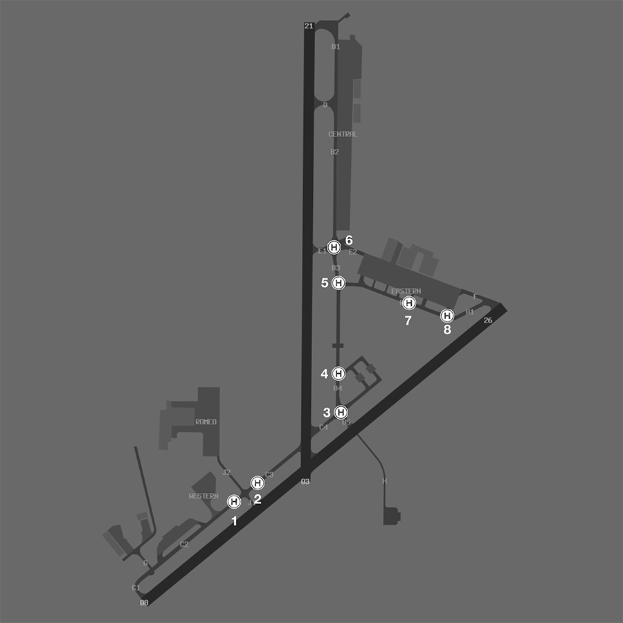
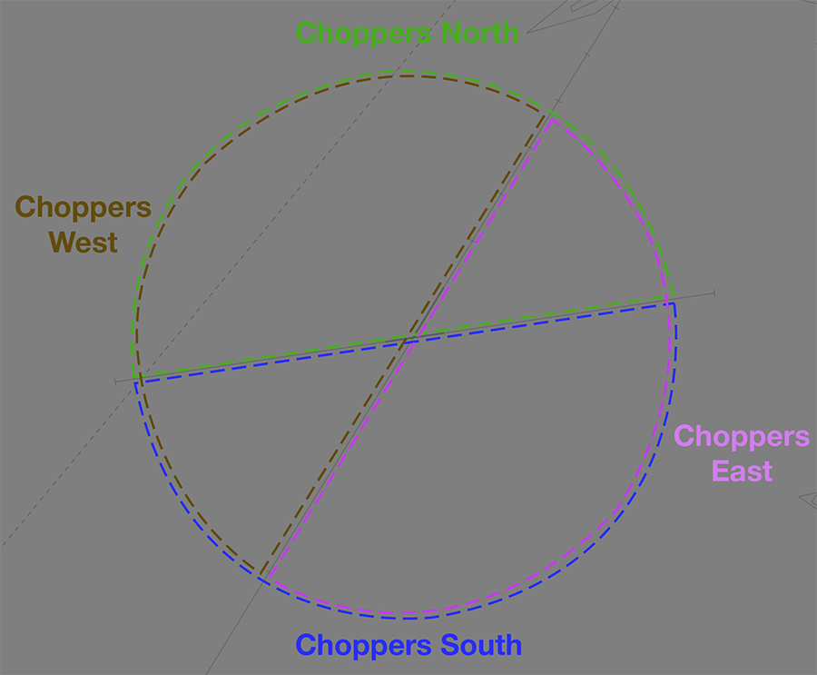
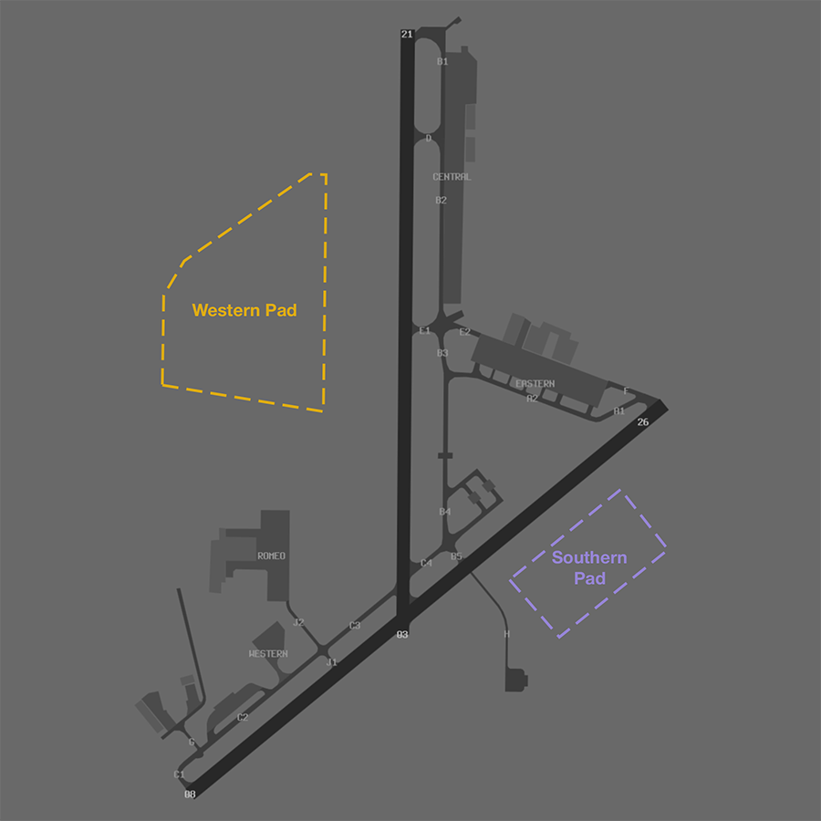

--8<-- "includes/abbreviations.md"

## Positions

| Name              | Callsign              | Frequency   | Login ID      |
| ----------------- | --------------------- | ----------- | ------------- |
| **Nowra ADC**     | **Nowra Tower**       | **118.850** | **NW_TWR**    |
| **Nowra SMC**     | **Nowra Ground**      | **135.850** | **NW_GND**    |
| **Nowra ACD**     | **Nowra Delivery**    | **128.350** | **NW_DEL**    |
| **Nowra ATIS**    |                       | **125.650** | **YSNW_ATIS** |

!!! note
    YSNW is a [military aerodrome](../../../controller-skills/military/#military-aerodromes) and procedures can differ significantly to those at a civil aerodrome. Ensure you are familiar with the [military controller skills](../../../controller-skills/military) necessary to provide a quality service.

## Airspace
NW ADC is not responsible for any airspace by default.

### Restricted Area Activations
There are no [restricted areas or MOAs](../../../controller-skills/sua) activated by default when NW ADC is online.

## Local Procedures
### Initial and Pitch
The [intial points](../../../controller-skills/military/#initial-and-pitch) are on the dead side of each runway at the following locations.

| RWY  | Initial Point | Altitude |
| ---- | ------------- | -------- |
| 03   | 5NM downwind  | `A020`   |
| 08   | 5NM downwind  | `A020`   |
| 21   | 5NM downwind  | `A020`   |
| 26   | 5NM downwind  | `A020`   |

### Start Approval
Start approval is required for all aircraft, when

- [PJE](../../../terminal/nowra/#parachute-operations) are being conducted within the NW TMA, or;
- During busy periods, at the discretion of NW ADC.

The ATIS [shall be updated](#operational-info) to indicate the requirement.

!!! phraseology
    **EMYU11**: "Nowra Ground, EMYU11, for [Choppers East](#chopper-areas), received A, request start"  
    **NW SMC**: "EMYU11, start approved"

When an aircraft requests start approval, the NW SMC controller [shall coordinate](#smc-to-nw-tcu) with NWA to obtain the start approval.

## Helicopter Operations
### Helipads
There are eight helicopter spots at YSNW, located across the aerodrome.

<figure markdown>
{ width="600" }
  <figcaption>YSNW AD HLS</figcaption>
</figure>

All eight helicopter spots are part of the manoeuvring area and controlled by NW SMC. Helicopters will be cleared to take off/land from the spots by NW ADC, following [coordination with SMC](../../../controller-skills/coordination/#helicopter-movements-in-smc-jurisdiction).

!!! phraseology
    **NW ADC**: "TAIP52, spot 2, cleared to land"  
    **TAIP52**: "Spot 2, cleared to land, TAIP52"

Helicopter spots have been designed to allow simultaneous arrivals and departures of an adjacent helicopter spot.

| Active Runway | Departure Spots (Order of Preference) | Arrival Spots (Order of Preference) |
| ------------- | ------------------------------------- | ----------------------------------- |
| Runway 08     | Spot 2, Spot 1                        | Spot 8, Spot 7                      |
| Runway 26     | Spot 8, Spot 7                        | Spot 2, Spot 1                      |
| Runway 03     | Spot 6, Spot 5                        | Spot 4, Spot 3                      |
| Runway 21     | Spot 4, Spot 3                        | Spot 6, Spot 5                      |

#### Chopper Areas
Helicopters performing operations within 5nm YSNW ARP may be assigned one of four '**Choppers**' areas.

<figure markdown>
{ width="600" }
  <figcaption>Helicopter Operating Areas within NW TMA</figcaption>
</figure>

| Choppers Area  | Dimensions                             | Altitude         |
| -------------- | -------------------------------------- | ---------------- |
| Choppers North | North of Runway 08/26, within 5nm YSNW | Not above `A015` |
| Choppers South | South of Runway 08/26, within 5nm YSNW | Not above `A015` |
| Choppers East  | East of Runway 03/21, within 5nm YSNW  | Not above `A015` |
| Choppers West  | West of Runway 03/21, within 5nm YSNW  | Not above `A015` |
    
!!! note
	Choppers East/West and North/South should not be used simultaneously.

### Operating Areas
<figure markdown>
{ width="600" }
  <figcaption>YSNW Operating Areas</figcaption>
</figure>

Helicopters may perform airwork below 100FT AGL within the '**Western Pad**' or '**Southern Pad**', located at the 

Helicopters requesting clearance to operate in these areas shall be cleared to air transit to, and then operate within, the area by ADC.

!!! phraseology
    **NW ADC**: "TAIP52, cleared to operate Western Pad, not above 100ft."  

## Runway Modes
### Preferred Runway Modes
Winds must always be considered for runway modes (Crosswind <20kts, Tailwind <5kts), however the order of preference is as follows:

| Priority - Mode | Arrivals | Departures | Circuits |
| --------------- | -------- | ---------- | -------- |
| =1 - 21AD08/26C | 21       | 21         | 08 or 26 |
| =1 - 03AD08/26C | 03       | 03         | 08 or 26 |
| =2 - 21 Only    | 21 | 21 | 21 |
| =2 - 03 Only    | 03 | 03 | 03 |
| =2 - 26 Only    | 26 | 26 | 26 |
| =2 - 08 Only    | 08 | 08 | 08 |

### Circuits
The circuit height is `A020` for fixed wing aircraft, and `A012` for rotary wing aircraft.

#### Circuit Direction
| Runway | Direction |
| ------ | ----------|
| 08     | Right     |
| 21     | Right     |
| 03     | Left      |
| 26     | Left      |

## SID Selection
In **VMC by day**, all military aircraft shall be assigned a visual departure. 

In all other situations:

- IFR aircraft planned via **ABASS**, **CB VOR**, **COM NDB**, **AKMIR**, **TONTO**, **GLB NDB**, **WOL NDB**, or **URBOB** shall be assigned the **Procedural SID** that terminates at the appropriate waypoint.
- Aircraft who are not planned via those points may be assigned the RADAR SID. 

Aircraft who are not planned via those points, or that cannot accept a Procedural SID may be assigned the RADAR SID or a visual departure. 

## ATIS
### Operational Info
When [start approval](#start-approval) is required, the ATIS OPR INFO shall include `START APPROVAL REQ`.

## Coordination
[Next](../../../controller-skills/coordination/#next) coordination is required from NW ADC to NW TCU for all aircraft.

The Standard Assignable level from **NW ADC** to **NW TCU** is:

| Aircraft | Level |
| -------- | ----- |
| All      | The lower of `A100` and `RFL` | 

#### ACD to NW TCU
The controller assuming responsibility of **ACD** shall give [heads-up coordination](../../controller-skills/coordination/#airways-clearance) to NWA (or the enroute controller responsible for the NW TCU) prior to the issue of a clearance to an aircraft intending to operate in an SUA that **has not** been activated. 

!!! phraseology
    **NW ACD** -> **NWA**: "SWFH12 requests clearance to R420F”  
    **NWA** -> **NW ACD**: "SWFH12, clearance approved."  
    
#### SMC to NW TCU
When [start approvals](#start-approval) are nominated as required on the ATIS, when an aircraft requests start approval, the NW SMC controller shall coordinate with NW TCU to obtain the start approval.

### Departures Controller
When a TCU controller is online, aircraft shall be issued with a departure frequency during their airways clearance in accordance with the table below. If no TCU controllers are online, the appropriate enroute or advisory frequency shall be issued.

| Runway | Via  | Departure Frequency |
| ------ | ---- | ------------------- |
| All    | All  | 123.5 (NWA)         |

## Charts
!!! abstract "Reference"
     In addition to the civilian `ERSA` and `AIP` publications, [the RAAF AIP website](https://ais-af.airforce.gov.au/australian-aip){target=new} contains the necessary charts (available in the TERMA) and description of procedures (in each airports' FIHA).