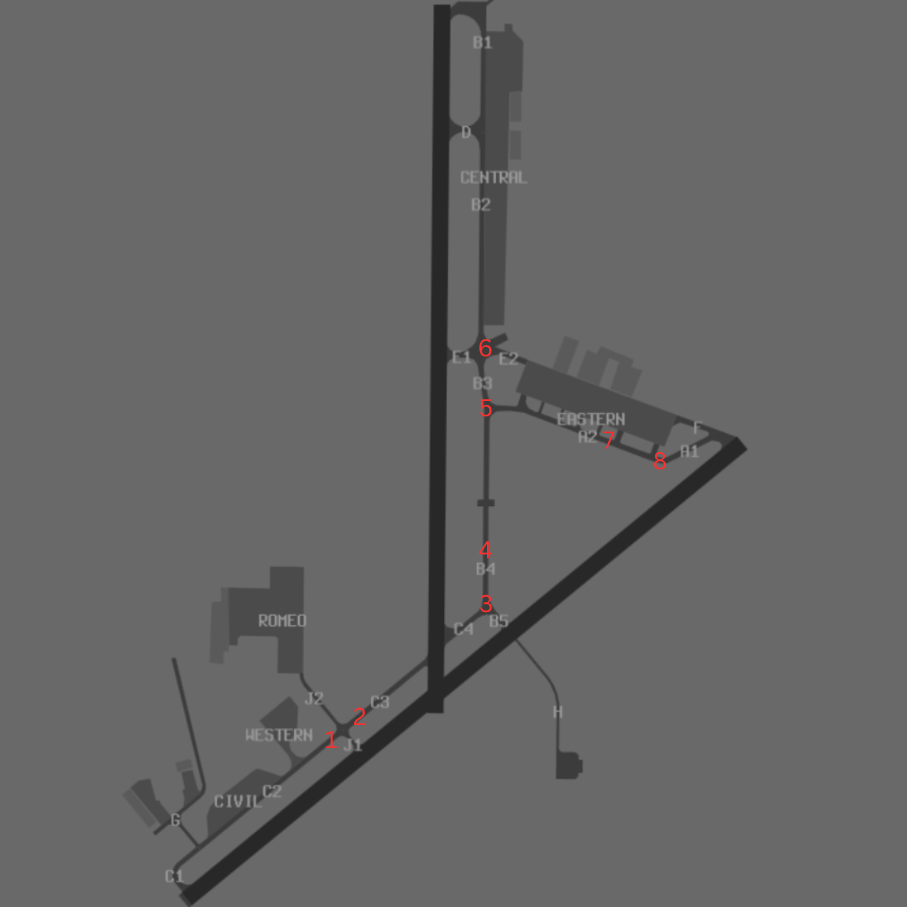

--8<-- "includes/abbreviations.md"

## Positions

| Name               | ID      | Callsign       | Frequency        | Login Identifier              |
| ------------------ | --------------| -------------- | ---------------- | --------------------------------------|
| Nowra TMA    | | Nowra Approach | 123.500          |NW_APP        |
| Nowra ADC    | | Nowra Tower  | 118.850         | NW_TWR        |
| Nowra SMC   ||  Nowra Ground  | 135.850         | NW_GND        |
| Nowra ACD    | | Nowra Delivery  | 128.350         | NW_DEL       |
| Nowra ATIS    |   | | 125.65         | YSNW_ATIS       |

## Airspace

### TMA Ownership

The Terminal Control Area (TMA) owns the airspace within R421 up to FL125; optionally R420F extends from FL125 to FL300.
This airspace is for facilitating military aircraft and low-level helicopter operations.

### Activation of Restricted Areas

When a controller logs in as Nowra ADC (NW ADC) or TMA:

1. **Announce Activation**: Announce that R421 and other applicable PRDs are active.
2. **Activate Surrounding Areas**: Notify surround controllers to activate the restricted areas to get the outlines visible.
3. **Issue Clearances**: Treat restricted areas like R421 as Class C/D airspace and issue clearances accordingly.
4. **Service Levels**:
    - Official aircraft: Class D service. (eg Military)
    - Unofficial aircraft: Class C service. (eg Non Military)

### Airspace Details

<figure markdown>
{ width="700" }
<figcaption>NW ADC Airspace</figcaption>
</figure>

- **R421**: Extends up to FL125 and is used for military and low-level helicopter operations.
- **R420F**: Extends from FL125 to FL300.

## VFR corridor (DAY ONLY)
<figure markdown>
{ width="700" }
<figcaption>NW VFR CRD</figcaption>
</figure>
- All VFR aircraft passing through R421 must request clearance and be assigned a squawk code.
- If clearance is not immediately available, instruct the aircraft to remain in Class G airspace.
- VFR traffic must not pass through the corridor above 2000FT AMSL.
- Separation must be maintained between IFR and VFR traffic including providing necessary traffic advisories.

## Aerodrome

### General Guidelines

1. **Ground Taxiing for Wheeled Helicopters**
    - Where practicable, wheeled helicopters are encouraged to “ground taxi” on prepared surfaces to minimize rotor wash and its effects.

### The Runway Mode options available are:

a) Runway 21 and Runway 08;  
b) Runway 21 and Runway 26;  
c) Runway 21 only;  
d) Runway 03 and Runway 08;  
e) Runway 03 and Runway 26;   

## Charts
!!! note
    Additional charts to the AIP may be found in the RAAF TERMA document, available towards the bottom of [RAAF AIP page](https://ais-af.airforce.gov.au/australian-aip){target=new}

## Miscellaneous
### Circuit Procedures
Circuit operations at Nowra occur within the CIRA, a `5NM` radius of Nowra, from the surface to `2000ft`.

- Fixed wing: `2000ft`
- Rotary wing: `1200ft`
- Flight Deck Procedural Trainer: not above `700ft`

### Circuit Direction
| Runway | Direction |
| ------ | ----------|
| 08     | Right  |
| 21     | Right |
| 03     | Left |
| 26     | Left |

## Helicopter Operations

### Helicopter Spots

The following helicopter spots are designated on various taxiways at Nowra aerodrome to facilitate visual helicopter arrivals and departures day and night.

These spots are physically marked with bidirectional numbers in addition to the standard “H” marking:

* Spot-1 (Taxiway C2)
* Spot-2 (Taxiway C3)
* Spot-3 (Taxiway B4)
* Spot-4 (Taxiway B4)
* Spot-5 (Taxiway B3)
* Spot-6 (Taxiway B3)
* Spot-7 (Taxiway A2)
* Spot-8 (Taxiway A2)

<figure markdown>
{ width="700" }
<figcaption>NW VFR CRD</figcaption>
</figure>

Helicopter departures for aircraft not requiring the use of a runway shall be conducted from the helicopter spots.  Helicopter spots shall be used by all departures and arrivals. Helicopters must remain at their designated slot until given a clearance from GND or TWR.

Take-offs and landings to the Helicopter Spots should be parallel to the duty RWY direction. Normally the most upwind Helicopter Spot parallel to the RWY is designated for departures, and the downwind Helicopter Spot designated for arrivals. Helicopter Spots have been designed to allow simultaneous arrivals and departures of an adjacent Helicopter Spot.

Post landing at a Helicopter Spot, helicopters shall not vacate the Spot until in receipt of a taxi clearance from ATC (SMC)

### Duty runway Spots
| Active Runway | Departure Spots (Order of Preference) | Arrival Spots (Order of Preference) |
|---------------|----------------------------------------|-------------------------------------|
| Runway 08     | Spot-2 (C3), Spot-1 (C2)               | Spot-8 (A2), Spot-7 (A2)            |
| Runway 26     | Spot-8 (A2), Spot-7 (A2)               | Spot-2 (C3), Spot-1 (C2)            |
| Runway 03     | Spot-6 (B3), Spot-5 (B3)               | Spot-4 (B4), Spot-3 (B4)            |
| Runway 21     | Spot-4 (B4), Spot-3 (B4)               | Spot-6 (B3), Spot-5 (B3)            |

## Coordination
NWA TCU

'Next' coordination is required from NWA ADC to NWA TCU for all aircraft.

!!! example
    **NWA ADC** -> **NWA TCU**: "Next, ASY01, runway 08"  
    **NWA TCU** -> **NWA ADC**: "ASY01, Assigned Heading Right 030, unrestricted"  
    **NWA ADC** -> **NWA TCU**: "Assigned Heading Heading Right 030, ASY01" 

### Level Assignment

The Standard Assignable Level from **NWA ADC** to **NWA TCU** is:

a) The Lower of F180 or RFL for Aircraft assigned via Procedural or RNAV SID.

### IFR Level Assignment
Issue `F180` or `RFL`; whichever is lower, to aircraft cleared via an RNAV SID or aircraft with a wake turbulence category of medium or greater.  
Issue `F180` or `RFL`; whichever is lower, to jet aircraft not cleared via an RNAV SID regardless of wake turbulence category.  
Issue `A030` or `RFL`; whichever is lower, to aircraft not cleared via an RNAV SID with a wake turbulence category of light.  
