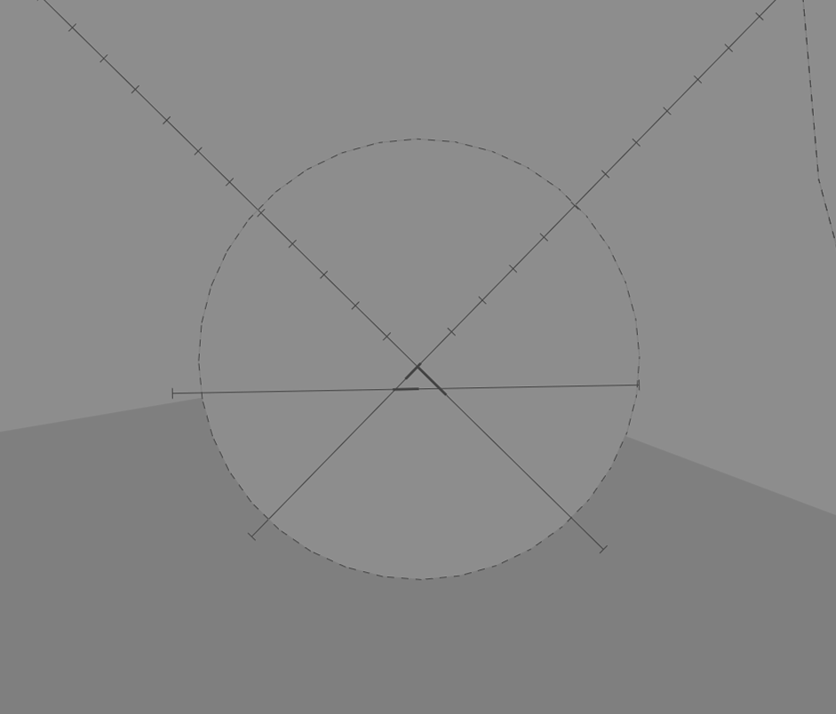
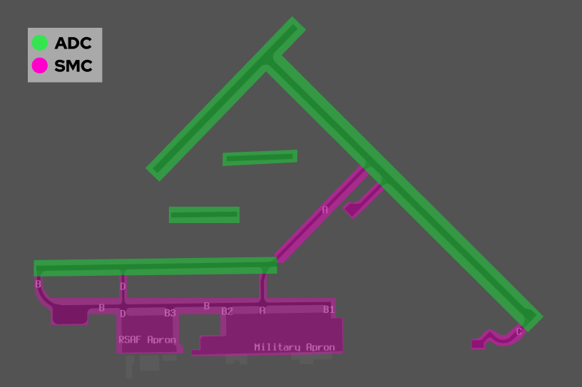
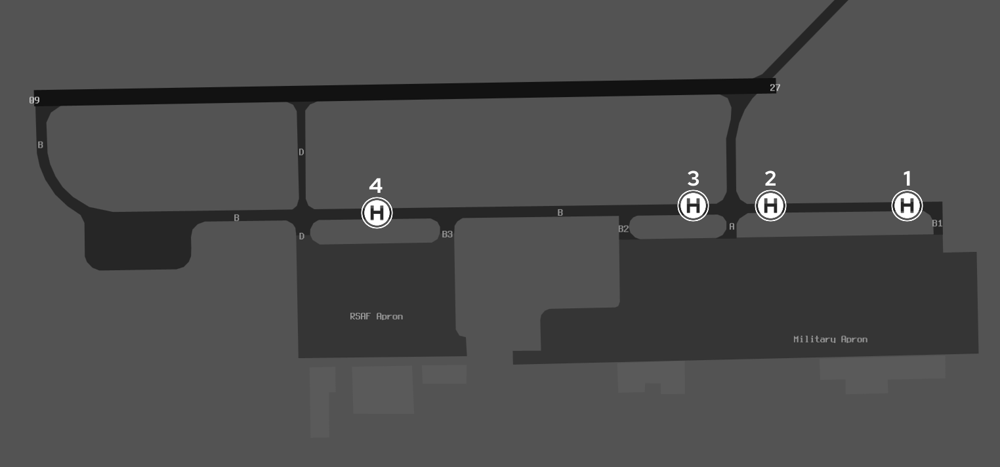
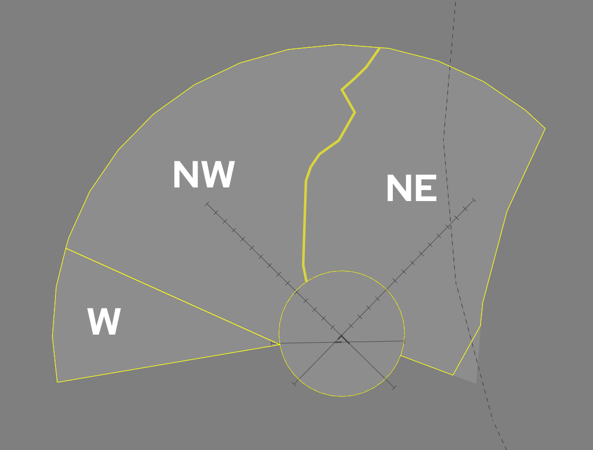

--8<-- "includes/abbreviations.md"

## Positions

| Name              | Callsign              | Frequency   | Login ID      |
| ----------------- | --------------------- | ----------- | ------------- |
| **Oakey ADC**     | **Oakey Tower**       | **120.100** | **OK_TWR**    |
| **Oakey SMC**     | **Oakey Ground**      | **121.900** | **OK_GND**    |
| **Oakey ACD**     | **Oakey Delivery**    | **133.350** | **OK_DEL**    |
| **Oakey ATIS**    |                       | **124.300** | **YBOK_ATIS** |

## Airspace
OK ADC owns the airspace within 5 DME of the OK VOR from `SFC` to `A030`. This airspace is designed to facilitate circuit traffic.

<figure markdown>
{ width="600" }
  <figcaption>YBOK ADC Airspace</figcaption>
</figure>

## Manoeuvring Area

### Manoeuvring Area Responsibility

<figure markdown>
{ width="600" }
  <figcaption>Manoeuvring Area Responsibility</figcaption>
</figure>

### Taxiway Bravo

Four helipads are available on Taxiway Bravo from east to west, they are named Pad 1, Pad 2, Pad 3 and Pad 4. Taxiway Bravo may be used for helicopter arrivals and departures in any direction as specified by ATC. These pads are inside the manoeuvring area and treated like a runway, requiring a takeoff and landing clearance from OK ADC.

Aircraft taxiing outbound from the RSAF and Military Aprons shall be instructed to hold short of the most appropriate taxiway when necessary, to provide separation with helicopters operating on Taxiway Bravo. 

<figure markdown>
{ width="600" }
  <figcaption>Taxiway Bravo</figcaption>
</figure>

### Lanes

Three helicopter lanes are located immediately north of Runway 09/27, aligned in the 09/27 cardinal direction. Lanes 1 and 3 are sealed pavement, while Lane 2 is grass. Each lane may only be occupied by one aircraft at a time. These lanes are inside the manoeuvring area and treated like a runway, requiring a takeoff and landing clearance from OK ADC. 

Lanes may be used for circuits and low-level operations. Aircraft cleared to land or enter a lane may conduct operations within that lane. Lane operations permit hover not above `A003` within the respective lane.

<figure markdown>
{ width="600" }
  <figcaption>YBOK Lanes</figcaption>
</figure>

## Local Procedures

### Oakey Flying Training Area

#### Flying Training Areas

R654A, B, C and D are divided into the Western, North West and North East FTAs, these areas overlay the LFAs.

<figure markdown>
{ width="600" }
  <figcaption>Flying Training Areas</figcaption>
</figure>

#### Low Flying Areas

There are eight LFAs within the OFTA, LFAs are the primary location for military helicopters conducting low level operations. LFAs are numbered 1-8 with the prefix L, pronounced as, "LIMA (number)".

#### SAAFRs

SAAFRs provide efficient movement through the OFTA to specific LFAs during periods of increased traffic. They are defined as 2nm wide, and are named "X-Ray", "Yankee" and "Zulu".

#### Transit Areas

Three transit areas, named "Whiskey" (western), "Charlie" (central) and "Echo" (eastern) are located between the Oakey CTR and inner boundaries of their respective LFAs. Transit Areas exist to provide flexibility in routing when leaving or enter Oakey CTR.

!!! tip
    Detailed images depicting LFAs, SAAFRs and Transit Areas are available on the [Oakey AD2 SUP](https://ais-af.airforce.gov.au/australian-aip)

## Departure and Arrival Procedures

### Departures

By default, transit to LFAs will **not** be achieved through the use of SAAFRs and Transit Areas, direct tracking to the requested LFA shall always be issued.  

!!! phraseology
    **FRTL21:** "Oakey Delivery, helicopter FRTL21, for Lima 1, request clearance"    
    **OK ACD:** "FRTL21, Oakey Delivery, cleared Lima 1 direct, not above A030, squawk 7264"    
    **FRTL21:** "Cleared Lima 1 direct, not above A030, squawk 7264, FRTL21"  

Aircraft requesting clearance to LFAs through a specific SAAFR or Transit Area should be cleared as requested.

Not all SAAFRs and Transit Areas provide access to every LFA, each SAAFR and Transit Area connects to various LFAs. Aircraft should be cleared as requested, however if the requested SAAFR or Transit Area does not connect to the intended LFA, the aircraft must be recleared via the most appropriate alternative.

!!! example
    Aircraft requesting clearance to Lima 4 via Yankee, shall be cleared via X-Ray, as Yankee does not connect to Lima 4.

=== "SAAFRs"
	| Name | Connected LFAs |
	| ---- | ---- |
	| X-Ray | Lima 1, 3, 4, 5, 6 |
	| Yankee | Lima 1, 5, 6, 7, 8 |
	| Zulu | Lima 8, 7 |

=== "Transit Areas"
	| Name | Connected LFAs |
	| ---- | ---- |
	| Whiskey | Lima 2, 3, 4 |
	| Charlie | Lima 1 |
	| Echo | Lima 8 |

!!! phraseology
    **RSCU904:** "Oakey Delivery, helicopter RSCU904, for Lima 2, via Whiskey, request clearance"    
    **OK ACD:** "RSCU904, Oakey Delivery, cleared Lima 2, via Whiskey, not above A030, squawk 7314"    
    **RSCU904:** "Cleared Lima 2, via Whiskey, not above A030, squawk 7314, RSCU904" 

Aircraft requesting clearance for the FTAs, shall be cleared not above `A030`.

!!! phraseology
    **CYCP90:** "Oakey Delivery, helicopter CYCP90, for the northeast training area, request clearance"    
    **OK ACD:** "CYCP90, Oakey Delivery, cleared northeast training area, not above A030, squawk 7324"  
    **CYCP90:** "Cleared northeast training area, not above A030, squawk 7324, CYCP90"  

Aircraft will depart the CIRA visually and track direct to their LFA, or the requested outbound SAAFRs / Transit Area as cleared.

!!! phraseology
    **OK ADC:** "FRTL21, make right turn, cleared for takeoff"    
    **FRTL21:** "Make right turn, cleared for takeoff, FRTL21"  

### Arrivals

OK TCU will clear inbound aircraft to YBOK direct, not above `A030`. OK TCU will transfer the aircraft to ADC approaching the CTR boundary. Instruct the aircraft to join the circuit for the applicable duty runway or lane and clear them for a visual approach (traffic permitting).

!!! phraseology
    **KNGT31:** "Oakey Tower, helicopter KNGT31, A030, request Lane 3"    
    **OK ADC:** "JUNO76, Oakey Tower, join base Lane 3, cleared visual approach"    
    **KNGT31:** "Join base Lane 3, cleared visual approach, KNGT31"    

## Runway Modes
### Circuits
#### Circuit Heights
a) Standard Circuit `A024`  
b) Low Level Circuit `A017`

#### Circuit Direction
The standard circuit direction is to the north of the field.

| Runway | Direction |
| ------ | ----------|
| 32     | Right  |
| 14     | Left |
| 23     | Right |
| 05     | Left |
| 09     | Left |
| 27     | Right |

## Coordination
### Auto Release
[Next](../../controller-skills/coordination.md#next) coordination is required from OK ADC to OK TCU for all aircraft.

The Standard Assignable level from **OK ADC** to **OK TCU** is:

| Aircraft | Level |
| -------- | ----- |
| Fixed-wing | The lower of `F120` and `RFL` |
| Rotary-wing | The lower of `A030` and `RFL` |

### Departures Controller
When a TCU controller is online, aircraft shall be issued with a departure frequency during their airways clearance in accordance with the table below. If no TCU controllers are online, the Advisory frequency shall be issued.

| Runway | Via | Departure Frequency |
| ------ | ---- | -------------------- |
| All | All | 125.4 (OKA) |

### Departures Controller
When a TCU controller is online, aircraft shall be issued with a departure frequency during their airways clearance in accordance with the table below. If no TCU controllers are online, the Advisory frequency shall be issued.

| Runway | Via | Departure Frequency |
| ------ | ---- | -------------------- |
| All | All | 125.4 (OKA) |

## Charts
!!! abstract "Reference"
    Additional charts to the AIP may be found in the RAAF TERMA document, available towards the bottom of [RAAF AIP page](https://ais-af.airforce.gov.au/australian-aip){target=new}