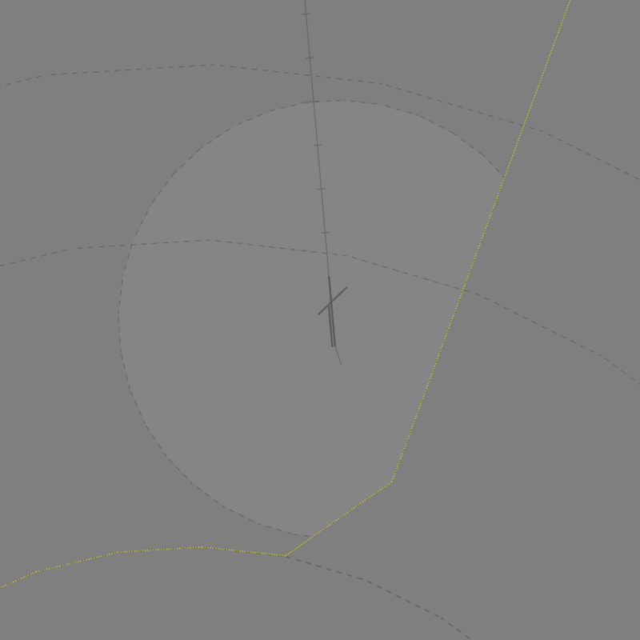
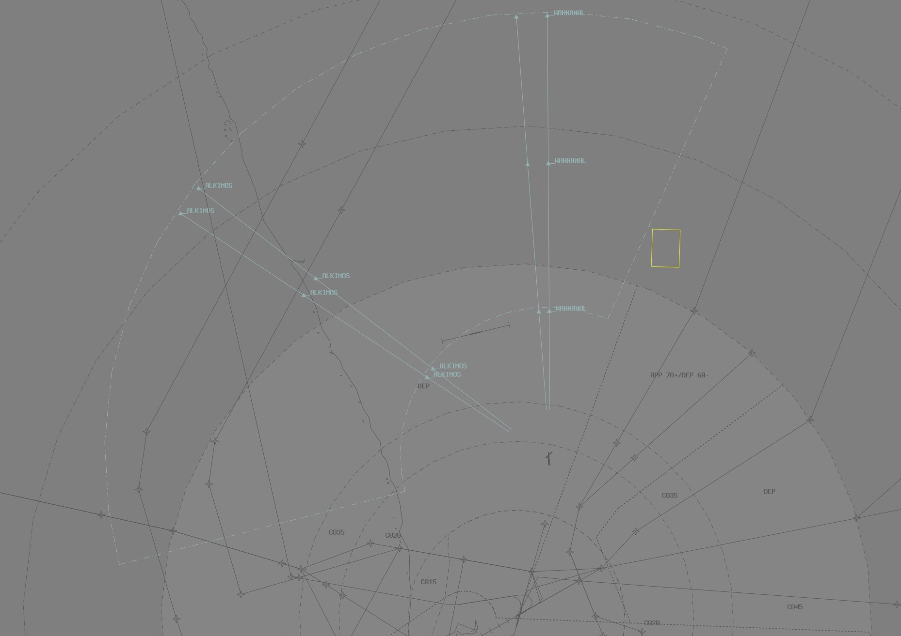

--8<-- "includes/abbreviations.md"

## Positions

| Name              | Callsign              | Frequency   | Login ID      |
| ----------------- | --------------------- | ----------- | ------------- |
| **Pearce ADC**    | **Pearce Tower**      | **118.300** | **PE_TWR**    |
| **Pearce SMC**    | **Pearce Ground**     | **127.250** | **PE_GND**    |
| **Pearce ACD**    | **Pearce Delivery**   | **134.100** | **PE_DEL**    |
| **Pearce ATIS**   |                       | **136.400** | **YPEA_ATIS** |

## Airspace
PE ADC owns the airspace within the Pearce CIRA (**5nm** Radius of YPEA ARP, located entirely within **R155A**) from `SFC` to `A035`. This airspace is primarily used for military circuits and initial and pitch approaches.

<figure markdown>
{ width="600" }
  <figcaption>PE ADC Airspace</figcaption>
</figure>

## Local Procedures 
### Initial and Pitch Procedures 
The [initial](../../../controller-skills/military/#initial-and-pitch) points changes according to both runway, and direction.

| Runway | Direction Initial | Inital Altitude
| ------ | ------------------|----------------|
| 05     | Any | `A010` |
| 18L    | Left/Straight Right | `A015` `A010` |
| 18R    | Left/Straight Right | `A015` `A010` |
| 23     | Any | `A015` |
| 36L    | Left Right | `A010` `A015` |
| 36R    | Left Right | `A010` `A015` |

## Runway Modes
### Circuits
Circuit altitude will depend on the type of aircraft. Assign circuit altitudes for the following aircraft types:  

| Aircraft | Altitude |
| ----- | ---- |
| Military Jet (e.g. HAWK) | `A016` |
| Non-Jet (e.g. PC21) | `A012` |

!!! note
    Runway 36L/18R is unsuitable for HAWK aircraft.

#### Circuit Direction

| Runway | Direction |
| ------ | ----------|
| 05      | Left  |
| 18L    | Right |
| 18R    | Right |
| 23     | Right |
| 36L    | Left  |
| 36R    | Left  |

## SID Selection
Aircraft planned via **GUNOK** shall be assigned the **GUNOK** SID. Aircraft planned via the **Wannamal Lane**, **Alkimos Lane**, or **Mullalloo Lane** shall be assigned relevant **Procedural SID**.

Aircraft **not** meeting that criteria, and **non-RNAV** aircraft shall be assigned either the RADAR SID or a visual departure. 

<figure markdown>
{width="700"}
  <figcaption>Pearce Lanes</figcaption>
</figure>

## Coordination
### Auto Release
[Next](../../controller-skills/coordination.md#next) coordination is required from PE ADC to PE TCU for all aircraft.

The Standard Assignable Level from **PE ADC** to **PE TCU** is:

| Departure Procedure | Level |
| ------------------- | ----- |
| **GUNOK** SID | `A030` |
| A **Procedural** SID | `F130` |
| All others | The lower of `F130` and `RFL` |

### Departures Controller
When a TCU controller is online, aircraft shall be issued with a departure frequency during their airways clearance in accordance with the table below. If no TCU controllers are online, the Advisory frequency shall be issued.

| Runway | Via | Departure Frequency |
| ------ | ---- | -------------------- |
| All | All | 130.2 (PEA) |

## Charts
!!! abstract "Reference"
    Additional charts to the AIP may be found in the RAAF TERMA document, available towards the bottom of [RAAF AIP page](https://ais-af.airforce.gov.au/australian-aip){target=new}