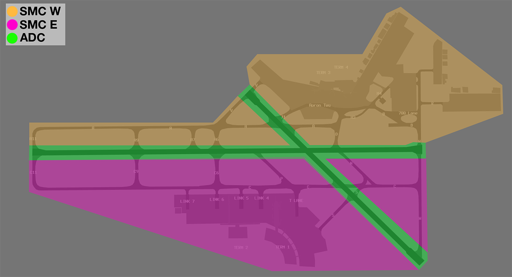

--8<-- "includes/abbreviations.md"

## Positions
| Name | Callsign | Frequency | Login ID |
| ---- | -------- | --------- | -------- |
| **Perth ADC** | **Perth Tower** | **127.400** | **PH_TWR** |
| **Perth SMC West** | **Perth Ground** | **121.700** | **PH_GND** |
| Perth SMC East† | Perth Ground | 122.200 | PH-E_GND |
| **Perth ACD** | **Perth Delivery** | **118.550** | **PH_DEL** |
| Perth ATIS |  | 123.800 | YPPH_ATIS |

† *Non-standard positions* may only be used in accordance with [VATPAC Air Traffic Services Policy](https://vatpac.org/publications/policies){target=new}

## Airspace
PH ADC is not responsible for any airspace by default.

## Maneuvering Area Responsibility
The division of responsibility between ADC, SMC West, and SMC East is shown below.

<figure markdown>
{ width="700" }
  <figcaption>YPPH Maneuvering Area Responsibility</figcaption>
</figure>

## Runway Selection
### Southwest Plan
With the Southwest Plan active, all departures shall be assigned runway 21. Arrivals will be processed to either runway 21 or 24 based on their feeder fix, as per the table below:

| Feeder Fix | Assigned Runway |
| --- | --- |
| JULIM | 21 |
| SAPKO | 21 |
| IPMOR | 21 |
| KABLI | 24 (or 21 if operationally required) |
| LAVEX | 24 |
| SOLUS | 24 |

The ATIS shall notify `EXP ILS APCH`.

### Northeast Plan
With the Northeast Plan active, departures via `AVNEX`, `OTLED`, `OLMAM`, `SOLUS`, and `OPEGA` shall be assigned runway 03. All other departures shall be assigned runway 06. All arrivals will be processed to runway 03.

When both Runway 03 and Runway 06 are nominated as departure runways, broadcast the following: `RWY 03 FOR DEP VIA OTLED, AVNEX, OLMAM, SOLUS AND OPEGA. RWY 06 FOR ALL OTHER DEP.`

In the following conditions, ATIS shall notify `EXP ILS APCH`:  
    - By night; and/or  
    - Cloud base of `A032` or below

## Circuit Training
Circuit training traffic shall be issued SSR code and clearance to operate within circuit area not above `A015`. Circuit training is typically conducted on Runway 03/21.

All circuits are to be conducted to the east of Runway 03/21 (right-hand circuit Runway 03).

## Helicopter Operations
There are no helipad facilities at YPPH. Helicopters should be issued an airways clearance in accordance with the fixed-wing operation applicable to their flight rules (i.e. SID for IFR helicopters, VFR departure via appropriate VFR route if necessary for VFR helicopters). Helicopters should be cleared to takeoff/land from runways or taxiways, as deemed appropriate by ADC. The point of takeoff/landing must be specified by ADC.

!!! example
    **PH ADC:** "YOE, taxiway Romeo, cleared to land"  

    **PH ADC:** "HWD, runway 21, cleared for takeoff"

## Scenic Flights
When traffic permits, VFR scenic flights over Perth are cleared via VICTOR 65 route (`CTE-PCTY-HKE`). Coordination with PH TCU is required prior to issuing this clearance, see [ACD to PH TCU](#acd-to-ph-tcu).

## Coordination
### Auto Release
'Next' coordination is **not** required for aircraft that are:   
    a) Departing from a runway nominated on the ATIS; and  
    b) Assigned the standard assignable level; and  
    c) Assigned a **Procedural SID**

All other aircraft require a 'Next' call to PH TCU.

!!! example
    **PH ADC** -> **PH TCU**: "Next, ABC, runway 03"  
    **PH TCU** -> **PH ADC**: "ABC, Heading 010, unrestricted"  
    **PH ADC** -> **PH TCU**: "Heading 010, ABC"  

    **PH ADC**: "ABC, Assigned heading left 010, Runway 03, Cleared for Takeoff"  
    **ABC**: "Left heading 010, Runway 010, Cleared for Takeoff, ABC"

The PH TCU controller can suspend/resume Auto Release at any time, with the concurrence of **PH ADC**.

The Standard Assignable level from PH ADC to PH TCU is the lower of `A050` or the `RFL`.

### Departures Controller
Refer to [Perth TCU Airspace Division](../../../terminal/perth/#airspace-division) for information on airspace divisions when **PHD** is online.

### ACD to PH TCU
The controller assuming responsibility of ACD shall give heads-up coordination to the relevant PH TCU controller prior to the issue of the following clearances:  
a) VFR Departures  
b) Aircraft using a runway not on the ATIS

!!! example
    **ABC**: "Perth Delivery, ABC, request Victor 65"  
    **PH ACD**: "ABC, Perth Delivery, standby"  

    **PH ACD** -> **PH TCU**: "ABC, requesting Victor 65"  
    **PH TCU** -> **PH ACD**: "ABC, cleared Victor 65, 1,500ft"  
    **PH ACD** -> **PH TCU**: "Cleared Victor 65, 1,500ft, ABC"   
     
    **PH ACD**: "ABC, cleared Victor 65, climb to 1,500ft, squawk 0442"  
    **ABC**: "Cleared Victor 65, climb to 1,500ft, squawk 0442, ABC"  