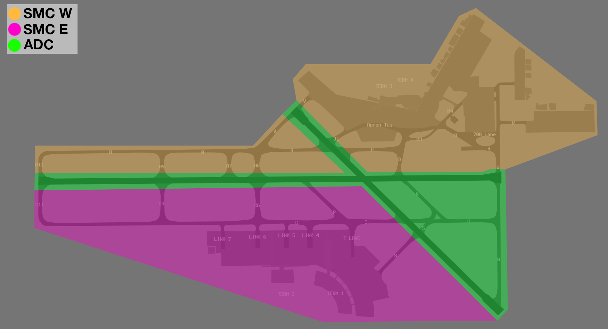

--8<-- "includes/abbreviations.md"

## Positions
| Name | Callsign | Frequency | Login ID |
| ---- | -------- | --------- | -------- |
| **Perth ADC** | **Perth Tower** | **127.400** | **PH_TWR** |
| **Perth SMC West** | **Perth Ground** | **121.700** | **PH_GND** |
| Perth SMC East :material-information-outline:{ title="Non-standard position"} | Perth Ground | 122.200 | PH-E_GND |
| **Perth ACD** | **Perth Delivery** | **118.550** | **PH_DEL** |
| **Perth ATIS** |  | **123.800** | **YPPH_ATIS** |

!!! abstract "Non-Standard Positions"
    :material-information-outline: Non-standard positions may only be used in accordance with [VATPAC Air Traffic Services Policy](https://vatpac.org/publications/policies){target=new}.  
    Approval must be sought from the **bolded parent position** prior to opening a Non-Standard Position, unless [NOTAMs](https://vatpac.org/publications/notam){target=new} indicate otherwise (eg, for events).

## Airspace
PH ADC is not responsible for any airspace by default.

## Maneuvering Area Responsibility
The area of responsibility between SMC West and East is divided by Runway 03/21.  

<figure markdown>
{ width="500" }
  <figcaption>Maneuvering Area</figcaption>
</figure>

## Runway Modes
### Preferred Runway Modes
If winds are too great, single runway operations may be necessary (eg, Runway 21 for Arrivals and Departures). However, pending wind limitations (Crosswind <20kts, Tailwind <5kts), the following runway modes are to be used:

| Mode | Arrivals  | Departures |
| ---------------- | --------- | ---------- |
| Southwest Plan (24A/21AD) | 21 & 24 | 21 |
| Northeast Plan (03AD/06D) | 03 | 03 (via AVNEX, OTLED, OLMAM, SOLUS, and OPEGA), 06 (all other deps)  |

### SID Selection
Jet Aircraft planned via **AMANA**, **AVNEX**, **HECTO**, **MEMUP**, **MUBID**, **YNRV**, **OLMAM**, **SOLUS**, or **OPEGA**, shall be assigned the **Procedural SID** that terminates at the appropriate waypoint.

Non-jet Aircraft planned via **LENVU**, **PUMRY**, **OLMAM**, **SOLUS**, **OPEGA**, **OTLED**, or **REPOK**, shall be assigned the **Procedural SID** that terminates at the appropriate waypoint.

Aircraft **not** planned via any of these waypoints shall receive amended routing via the most appropriate SID terminus, unless the pilot indicates they are unable to accept a Procedural SID.

#### Off Mode Departures
!!! info "Definition"
    **Off Mode:** Aircraft departing from a runway not prescribed as active for departures on the ATIS. For example, a heavy aircraft planned via **HECTO** that operationally requires Runway 03 for departure during the Northeast Plan Mode.

For aircraft departing Runway 03 **Off Mode** via **AMANA**, **HECTO**, **MEMUP**, or **YNRV**, the **Radar SID** must be assigned.

!!! note
    Assigning the Radar SID to an off-mode departure does not meet the requirements for [auto release](#auto-release). These aircraft must be 'Next' coordinated with PH TCU.

#### Runway 03 Departures
When the R155A and R115B restricted areas overhead Pearce are *not active*, aircraft departing departing Runway 03 to the north may be assigned either the **Radar SID** or the **EKEPO** SID. This offers aircraft a shorter, more direct route than the **OTLED** and **AVNEX** SIDs.

## Circuit Training
Circuit training traffic shall be issued SSR code and clearance to operate within circuit area not above `A015`. Circuit training is typically conducted on Runway 03/21.

All circuits are to be conducted to the east of Runway 03/21 (right-hand circuit Runway 03).

## Helicopter Operations
There are no helipad facilities at YPPH. Helicopters should be issued an airways clearance in accordance with the fixed-wing operation applicable to their flight rules (i.e. SID for IFR helicopters, VFR departure via appropriate VFR route if necessary for VFR helicopters). Helicopters should be cleared to takeoff/land from runways or taxiways, as deemed appropriate by ADC. The point of takeoff/landing must be specified by ADC.

!!! phraseology
    **PH ADC:** "YOE, taxiway Romeo, cleared to land"  

    **PH ADC:** "HWD, runway 21, cleared for takeoff"

## Scenic Flights
When traffic permits, VFR scenic flights over Perth are cleared via VICTOR 65 route (`CTE-PCTY-HKE`). Coordination with PH TCU is required prior to issuing this clearance, see [ACD to PH TCU](#acd-to-ph-tcu).

## ATIS
### Approach Expectation
With the [Southwest Plan](#runway-modes) active, the ATIS shall notify `EXP ILS APCH`.

With the [Northeast Plan](#northeast-plan) active, the ATIS shall notify `EXP ILS APCH` when:

- Cloud base of `A032` or below, or:
- By night.

### Runway Mode formatting
| Mode | ATIS Runway information |
| ----------------| --------- |
| Southwest Plan (24A/21AD) | 21 and RWY 24 FOR ARR, RWY 21 FOR DEP. |
| Northeast Plan (03AD/06D) | 03 FOR ARR. RWY 03 FOR DEP VIA OTLED, AVNEX, OLMAM, SOLUS AND OPEGA. RWY 06 FOR ALL OTHER DEP. |

### Operational Info
#### ACD Pushback Requests
When implementing the [Pushback Requests on ACD](#pushback-requests-on-acd) procedure, the OPR INFO shall include:  
`ALL DEPARTURES MUST REQUEST PUSH BACK ON 118.55`  

## Workload Management
### Pushback Requests on ACD
During busy periods, SMC and ACD may coordinate to implement the [Pushback Requests on ACD](../../controller-skills/grounddelaymanagement#pushback-requests-on-acd) procedure to balance the workload across ACD and SMC frequencies.

When implementing the procedure the ATIS [OPR INFO field](#acd-pushback-requests) must be updated to inform pilots the correct frequency on which to request pushback.

## Coordination
### Auto Release
[Next](../../controller-skills/coordination.md#next) coordination is **not** required for aircraft that are:   

- Departing from a runway nominated on the ATIS; and  
- Assigned the standard assignable level; and  
- Assigned a **Procedural SID**

All other aircraft require a 'Next' call to PH TCU.

The Standard Assignable level from PH ADC to PH TCU is:

| Aircraft | Level |
| -------- | ----- |
| All | The lower of `A050` and `RFL` |

### Departures Controller
Refer to [Perth TCU Airspace Division](../../../terminal/perth/#airspace-division) for information on airspace divisions when **PHD** is online.

### ACD to PH TCU
The controller assuming responsibility of ACD shall give [heads-up](../../controller-skills/coordination.md#airways-clearance) coordination to the relevant PH TCU controller prior to the issue of the following clearances:  

- VFR departures into PH TCU CTA
- Aircraft using a runway not on the ATIS 