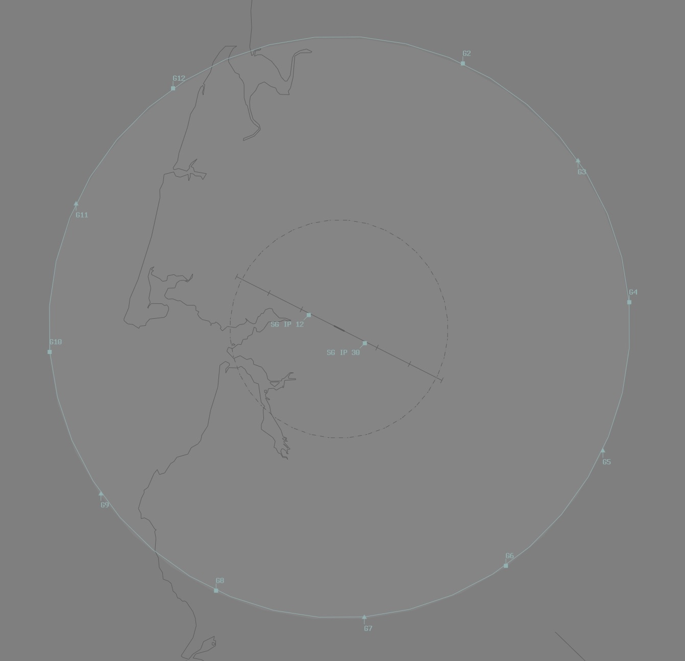

--8<-- "includes/abbreviations.md"

## Positions

| Name               | Callsign              | Frequency   | Login ID      |
| ------------------ | --------------------- | ----------- | ------------- |
| **Scherger ADC**   | **Scherger Tower**    | **118.300** | **SG_TWR**    |
| **Scherger SMC**   | **Scherger Ground**   | **126.200** | **SG_GND**    |
| **Scherger ATIS**  |                       | **134.800** | **YBSG_ATIS** |

## Airspace
SG ADC owns the Class C airspace within the SG CTR from `SFC` to `A015` with a **5nm radius** around YBSG.

### Local Procedures 
There are 12 gates to facilate departues and arrivals from the SG Training Airspace, based on the SG TACAN. Aircraft can be cleared to track direct to the gate, or allow them to intercept the outbound radial by 10 DME. Aircraft are expected to depart at `F190`.

The following gates are used for outbound aircraft:

| Gate Name | Ident | Bearing (°M) | Distance (nm) | Level |
| ------ | ----------| ----------| ----------| ----------|
| Gate 2 | G2 | 030 | 40 |
| Gate 4 | G4 | 090 | 40 |
| Gate 6 | G6 | 150 | 40 | 
| Gate 8 | G8 | 210 | 40 |
| Gate 10 | G10 | 270 | 40 |
| Gate 12 | G12 | 330 | 40 |

!!! phraseology 
    CLAS35 plans to enter the M610 area via the Gate 10 for military training operations.  
    **SG ACD**: "CLAS35, cleared to M610 via Gate 10, intercept the outbound radial by 10 DME, climb to `F190`, squawk 6001, departure frequency 124.2"   

<figure markdown> 
{width="700"}
  <figcaption>SG Gates</figcaption>
</figure>

### Initial and Pitch 
Initial Point (IP) for RWY 12 and 30 are aligned with TWY Alpha and are located at 4.5NM for RWY 12 and 4.2NM for RWY 30.

## Runway Modes
### Circuits
| Runway | Direction |
| ------ | ----------|
| 30     | Right  |
| 12     | Left |

## Coordination
### Auto Release
[Next](../../controller-skills/coordination.md#next) coordination is required from SG ADC to SG TCU for all aircraft.

The Standard Assignable Level from **SG ADC** to **SG TCU** is:

| Aircraft | Level |
| ------- | ------- |
| All | The lower of `F240` and `RFL` |

SG TCU shall perform [Heads Up](../../controller-skills/coordination.md#heads-up) coordination for all aircraft inbound to YBWP.

### Departures Controller
When a TCU controller is online, aircraft shall be issued with a departure frequency during their airways clearance in accordance with the table below. If no TCU controllers are online, the Advisory frequency shall be issued.

| Runway | Via | Departure Frequency |
| ------ | ---- | -------------------- |
| All | All | 124.2 (SGA) |

### ISA(ARA)
When SG TCU is offline, coordination is not required between SG ADC and ISA(ARA). Aircraft entering ISA(ARA) airspace shall be handed off, and instructed to contact ISA(ARA) for onwards clearance.

## Charts
!!! abstract "Reference"
    Additional charts to the AIP may be found in the RAAF TERMA document, available towards the bottom of [RAAF AIP page](https://ais-af.airforce.gov.au/australian-aip){target=new}