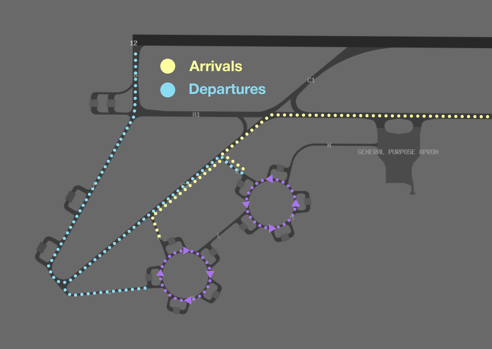
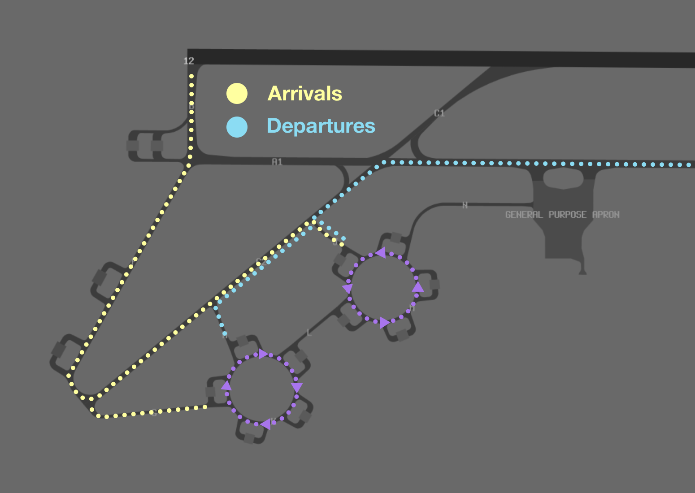

--8<-- "includes/abbreviations.md"

## Positions

| Name               | Callsign              | Frequency   | Login ID      |
| ------------------ | --------------------- | ----------- | ------------- |
| **Scherger ADC**   | **Scherger Tower**    | **118.300** | **SG_TWR**    |
| **Scherger SMC**   | **Scherger Ground**   | **126.200** | **SG_GND**    |
| **Scherger ATIS**  |                       | **134.800** | **YBSG_ATIS** |

!!! note
    YBSG is a [military aerodrome](../../../controller-skills/military/#military-aerodromes) and procedures can differ significantly to those at a civil aerodrome. Ensure you are familiar with the [military controller skills](../../../controller-skills/military) necessary to provide a quality service.

## Airspace
**SG ADC** is not responsible for any airspace by default.

### Restricted Area Activations
There are no [restricted areas or MOAs](../../../controller-skills/sua) activated by default when SG ADC is online.

## Manoeuvring Area
### Recommended Taxi Routes
Except when the traffic situation warrants, taxi clearances shall conform to the following diagram:

=== "Runway 12"
	<figure markdown>
	{ width="500" }
	  <figcaption>Standard Taxi Routes for RWY 12</figcaption>
	</figure>
	
=== "Runway 30"
	<figure markdown>
	{ width="500" }
	  <figcaption>Standard Taxi Routes for RWY 30</figcaption>
	</figure>

## Local Procedures
### Initial and Pitch 
The [intial points](../../../controller-skills/military/#initial-and-pitch) are aligned with Taxiway A at the following locations.

| RWY  | Initial Point | Altitude |
| ---- | ------------- | --------------------------- |
| 12   | Bend in Mission River at 4.5 TAC SGR | `A025` |
| 30   | Intersection of Marmoss Creek and easterly estuary | `A025` |

### Military Gates
There are numerous [military gates](../../../controller-skills/military/#military-gates) established throughout the SG TMA to facilitate entry and exit to adjoining SUA.

<figure markdown>
{ width="700" }
  <figcaption>SG SUA Gates</figcaption>
</figure>

Pilots should include the desired departure gate when requesting clearance.

!!! phraseology
    *FBED14 plans to enter the M610A MOA via the Gate 10 for military training and airwork.*  
    **FBED14**: "Scherger Ground, FBED14 for Gate 10, `F180` for M610A, request clearance."  
    **SG SMC**: "FBED14, Scherger Ground. cleared Gate 10 direct, climb to `F180`, squawk 6001, departure frequency 124.2."   

If the pilot **does not** nominate a gate, or nominates a gate that does not provide access to their intended SUA, SG SMC should clear the aircraft to depart via the **appropriate gate**.

| Intended SUA    | TCU Exit Gate       |
| --------------- | ------------------- |
| N/A (Deps East) | Gate 2, 4, and 6    |
| M601A           | Gate 8, 10, and 12  |

!!! tip
    [Coordination requirements](#smc-to-sg-tcu) exist between SMC and TCU when aircraft are requesting clearance to operate in an SUA that has not been activated. Controllers performing the role of SMC should ensure they coordinate with TCU before providing clearance.

## Helicopter Operations
### Helipads
There are two helipads at YBSG, both located south of Taxiway A2.

Both helipads are outside of the manoeuvring area so no takeoff or landing clearances should be issued. Instead, helicopters should be instructed to report airborne or report on the ground.

!!! phraseology 
    **SG ADC**: "RHWK11, Pad 1, report on the ground" 

## Runway Modes
### Circuits
The circuit height is `A015`.

#### Circuit Direction
| Runway | Direction |
| ------ | ----------|
| 30     | Right     |
| 12     | Left      |

## ATIS
#### Operational Info
The Operational Information field should be updated to reflect the activation of either [TRA Scherger or SG MIL CTR](../../../terminal/scherger/#sg-mil-ctr) when **SG TCU** is online.

| Activated SUA | OPR INFO Field |
| ------------- | -------------- |
| TRA Scherger  | `T R A SCHERGER ACTIVE` |
| SG MIL CTR    | `SCHERGER MILITARY CONTROL ZONE ACTIVE` |

## Coordination
### Auto Release
[Next](../../../controller-skills/coordination/#next) coordination is required from SG ADC to SG TCU for all aircraft.

The Standard Assignable Level from **SG ADC** to **SG TCU** is:

| Aircraft | Level   |
| -------- | ------- |
| All      | The lower of `F190` and `RFL` |

### Departures Controller
When a TCU controller is online, aircraft shall be issued with a departure frequency during their airways clearance in accordance with the table below. If no TCU controllers are online, the advisory frequency shall be issued.

| Runway | Via  | Departure Frequency |
| ------ | ---- | ------------------- |
| All    | All  | 124.2 (SGA)         |

### SMC to SG TCU
The controller assuming responsibility of **SMC** shall give [heads-up](../../../controller-skills/coordination/#airways-clearance) coordination to SGA (or the enroute controller responsible for the SG TCU) prior to the issue of a clearance to an aircraft intending to operate in an SUA that **has not** been activated. 

!!! phraseology
    **SG SMC** -> **SGA**: "FBED13 requests clearance to M610A”  
    **SGA** -> **SG SMC**: "FBED13, clearance approved."  

## Charts
!!! abstract "Reference"
    In addition to the civilian `ERSA` and `AIP` publications, [the RAAF AIP website](https://ais-af.airforce.gov.au/australian-aip){target=new} contains the necessary charts (available in the TERMA) and description of procedures (in each airports' FIHA).