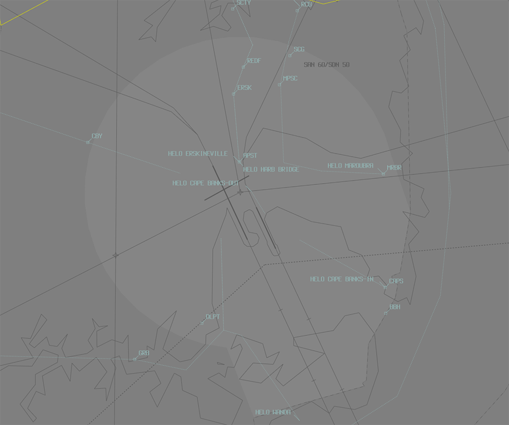
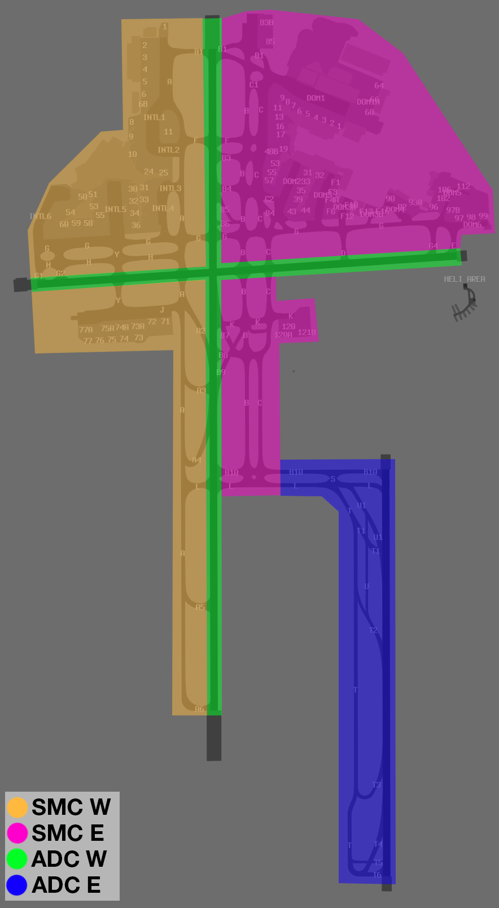
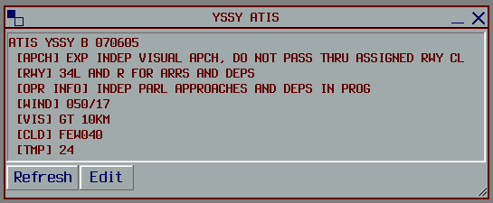
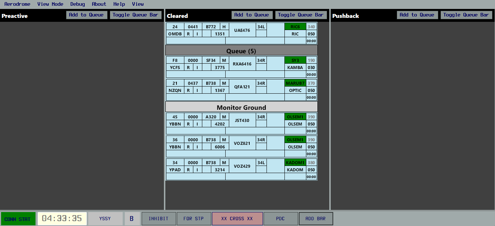

--8<-- "includes/abbreviations.md"

## Positions

| Name               | Callsign       | Frequency        | Login ID                         |
| ------------------ | -------------- | ---------------- | ---------------------------------------- |
| **Sydney ADC West**    | **Sydney Tower**   | **120.500**          | **SY_TWR**                                   |
| Sydney ADC East :material-information-outline:{ title="Non-standard position"}   | Sydney Tower   | 124.700          | SY-E_TWR                                 |
| **Sydney SMC East**    | **Sydney Ground**  | **121.700**          | **SY_GND**                                   |
| Sydney SMC West :material-information-outline:{ title="Non-standard position"}   | Sydney Ground  | 126.500          | SY-W_GND                                 |
| Sydney Coordinator :material-information-outline:{ title="Non-standard position"} | Sydney Coordinator   | 127.600          | SY-C_GND                                |
| **Sydney ACD**         | **Sydney Delivery**| **133.800**          | **SY_DEL**                                   |
| **Sydney ATIS**        |                | **126.250**          | **YSSY_ATIS**                                |

!!! abstract "Non-Standard Positions"
    :material-information-outline: Non-standard positions may only be used in accordance with [VATPAC Air Traffic Services Policy](https://vatpac.org/publications/policies){target=new}.  
    Approval must be sought from the **bolded parent position** prior to opening a Non-Standard Position, unless [NOTAMs](https://vatpac.org/publications/notam){target=new} indicate otherwise (eg, for events).

## Airspace
SY ADC is responsible for the Class C airspace in the SY CTR `SFC` to `A005` as shown below.

<figure markdown>
{ width="700" }
  <figcaption>SY ADC Airspace</figcaption>
</figure>

### Helicopter Operations

VFR helicopters are generally processed via one of Sydney's Helicopter Routes. There are both inbound and outbound routes. Each procedure is delivered as a coded clearance designed to separate helicopters from fixed-wing aircraft.
**Inbound** coded clearances contain tracking, altitudes, a clearance limit and at which waypoint to self-transfer to tower.
**Outbound** coded clearances contain tracking and altitude to be flown. Outbound routes typically end at the CTA boundary

You can find details of each Helicopter Route here, and full details are in the `ERSA FAC YSSY`.

<figure markdown>
{ width="700" }
  <figcaption>SY heli routes</figcaption>
</figure>

Refer to [Heliport Responsibility](#heliport-responsibility) to determine which ADC position (when both are online) is responsible for managing helicopter arrivals and departures.

#### Departures
VFR helicopters are generally processed via an outbound helicopter route (see above)
IFR helicopters should conform to fixed wing ops and be processed via the **SY (RADAR) SID** from an appropriate runway, unless a visual departure is acceptable.

SY ACD will issue VFR airways clearance for a Helicopter Route
!!! tip
    

!!! phraseology
    **YOE:** "Sydney Delivery, helicopter YOE, for the Harbour Bridge 5 outbound, request clearance"  
    **SY ACD:** "YOE, Delivery, cleared Harbour Bridge 5 outbound, squawk 0215, departure frequency 123.0"  
    **YOE:** "Cleared Harbour Bridge 5 outbound, squawk 0215, departure frequency 123.0, YOE"

Most helicopters will be capable of departing from their company helipad.  If reposition is required to Helipad 1 (the primary helipad), this must be approved by **SY ADC**.
!!! phraseology
    **YOE:** "Sydney Tower, helicopter YOE, Hotel 7, request reposition Hotel 1"  
    **SY ADC:** "YOE, reposition approved"  
    **YOE:** "Reposition approved, YOE"

Helipad 1 is controlled by **SY ADC** and treated like a runway (takeoff clearances required).  All other pads are outside Tower's jurisdiction and do not require a takeoff/landing clearance, however, approval must still be sought for helicopters to become airborne in the SY CTR.  This approval is communicated in the form of a requirement to *'report airborne'*.
!!! phraseology
    **HWD:** "Sydney Tower, helicopter HWD, Hotel 7, for the Harbour Bridge 5 outbound, ready"  
    **SY ADC:** "HWD, Sydney Tower, report airborne"  
    **HWD:** "HWD"  
     
    **HWD:** "HWD, airborne"  
    **SY ADC:** "HWD, contact departures"  
    **HWD:** "Departures, HWD"

Helicopter operations should be accommodated without unduly delaying fixed wing traffic to/from the aerodrome.  Where possible, visually separate helicopters and fixed wing aircraft, and when necessary, delegate responsibility for separation to the helicopter.
!!! phraseology
    **SY ADC:** "HSZ, traffic is a 737 shortly rolling on runway 34R, report in sight"  
    **HSZ:** "Traffic sighted, HSZ"  
    **SY ADC:** "HSZ, maintain own separation, caution wake turbulence, report airborne"  
    **HSZ:** "Maintain own separation, wilco, HSZ"

#### Arrivals
VFR helicopters are generally processed via by one of Sydney's Helicopter Routes (see above).  IFR helicopters should conform to fixed wing ops and be processed via an appropriate runway.

SY TCU will clear helicopters for all inbound Helicopter Routes, with the exception of the `CAPE BANKS 5 INBOUND` and `WANDA 5 INBOUND`.  Tower controllers should assess the current traffic situation and issue clearances for these aircraft when available.  

!!! phraseology
    **YZD:** "Sydney Tower, helicopter YZD, JIBN, A005, received Tango, request Cape Banks 5 Inbound"  
    **SY ADC:** "YZD, Sydney Tower, cleared Cape Banks 5 Inbound, report at the Container Terminal"  
    **YZD:** "Cleared Cape Banks 5 Inbound, YZD"  

    **YZD:** "YZD, Container Terminal"  
    **SY ADC:** "YZD, cleared visual approach, report on the ground"  
    **YZD:** "Cleared visual approach, wilco, YZD"

!!! tip
    You can find details of each Helicopter Route (including applicable clearance limits) in the `YSSY ERSA FAC`.

During times of peak fixed wing traffic, instruct helicopters to hold at their designated clearance limit on their Helicopter Route and maintain own separation on approach to the heliport.
!!! phraseology
    **SY ADC:** "YOE, hold at the clearance limit, traffic is a 717 on a 4nm final to runway 25, report in sight"  
    **YOE:** "Hold at the clearance limit, traffic sighted, YOE"  
    **SY ADC:** "YOE, pass behind that aircraft, maintain own separation, caution wake turbulence, cleared visual approach, report on the ground"  
    **YOE:** "Pass behind the 717, maintain own separation, cleared visual approach, YOE" 

    *Remember to pass traffic information to both aircraft.*  
    **SY ADC:** "QJE1745, traffic is a helicopter, currently 3nm north of the field, they'll maintain own separation and pass behind you on approach to the heliport, runway 25, cleared to land"  
    **QJE1745:** "Runway 25, cleared to land, QJE1745" 
    
    **YOE:** "YOE, on the pad"  
    **SY ADC:** "YOE"

Helipad 1 is controlled by **SY ADC** and treated like a runway (landing clearances required).  All other pads are outside Tower's jurisdiction and do not require a takeoff/landing clearance.  Helicopters should be instructed to *'report on the ground'* so the controller knows when they are no longer active in their airspace.

#### Hospital Helipads
The Sydney CTR contains a number of hospital helipads to the west, north, and east of YSSY. These pads sit outside the manoeuvring area, so no takeoff or landing clearances should be issued. Instead, helicopters should be instructed to report airborne or report on the ground.

Arriving helicopters will be cleared for a visual approach by **SY TCU** and transferred to **SY ADC**. ADC should instruct these aircraft to report on the ground. During times of poor weather, helicopters may be cleared for the ILS approach to the closest runway with an expectation of breaking off the approach and tracking to the hospital when they become visual. In these situations, SY TCU will coordinate any approach expectations to ADC.

!!! phraseology
    *RSCU201 is a VFR AW139 helicopter inbound from the southwest for St George Hospital (YXSG).*  
    **RSCU201**: "Sydney Tower, helicopter RSCU201"  
    **SY ADC**: "RSCU201, Sydney Tower, report on the ground"

!!! phraseology
    *RSCU207 is an IFR AW139 helicopter cleared the RWY 16L ILS with intentions to track for Royal Prince Alfred Hsopital (YRPA).*  
    **RSCU207**: "Sydney Tower, helicopter RSCU207"  
    **SY ADC**: "RSCU207, Sydney Tower, report visual"  
    **RSCU207**: "Wilco, RSCU207"  

    **RSCU207**: "RSCU207, visual"  
    **SY ADC**: "RSCU207, track direct to RPA, cleared visual approach, report on the ground"  
    **RSCU207**: "Track direct RPA, cleared visual approach, RSCU207"

Departing helicopters require an airways clearance to either transit the CTR into the adjacent Class G airspace, or to enter the overlying CTA as per their filed route. It may be necessary to instruct departing helicopters to maintain own separation with other aircraft in the CTR if a suitable gap is not available for their departure.

!!! phraseology
    *LIFE21 is a VFR BK117 helicopter outbound from Sydney Childrens Hospital (YXSN), intending to track via Victor 1 to YLSB.*  
    **LIFE21**: "Sydney Tower, helicopter LIFE21, Sydney Childrens Hospital, for transit to Victor 1, ready"  
    **SY ADC**: "LIFE21, traffic is a Boeing 737 on a 5nm final to runway 25, report sighting and able to maintain own separation"  
    **LIFE21**: "Traffic sighted and able to maintain own separation, LIFE21"  
    **SY ADC**: "LIFE21, maintain own separation with the 737, cleared to transit to Victor 1, not above A005, report airborne"  
    **LIFE21**: "Maintain own separation with the 737, cleared to transit to Victor 1, not above A005, LIFE21"

    *Remember to pass traffic information to both aircraft.*  
    **SY ADC**: "QFA843, traffic is a helicopter becoming airborne at a hospital approximately 3nm east of the field, maintaining own separation with you, runway 25, cleared to land"

Helicopters intending to enter SY TCU CTA must be first coordinated with SY TCU. Once the aircraft reports airborne and is clear of any conflicts in ADC's airspace, they should be transferred to the TCU.

!!! phraseology
    *RSCU209 is an IFR AW139 helicopter outbound from St George Hospital (YXSG) for Orange (YORG) at A045.*  
    **RSCU209**: "Sydney Tower, helicopter RSCU209, St George Hospital, for Orange, ready, request clearance"  
    **SY ADC**: "RSCU209, standby"  

    **SY ADC** -> **SY TCU**: "Next, helicopter RSCU209, outbound from St George Hospital for the west"  
    **SY TCU** -> **SY ADC**: "RSCU209, A030"  
    **SY ADC** -> **SY TCU**: "A030, RSCU209"  

    **SY ADC**: "RSCU209, cleared to YORG via KADOM, flight planned route, climb to A030, squawk 0545, report airborne"  
    **RSCU209**: "Cleared to YORG via KADOM, flight planned route, climb to A030, squawk 0545, RSCU209"    

## Maneuvering Area Responsibility
<figure markdown>
{ width="500" }
  <figcaption>Maneuvering Area</figcaption>
</figure>

## Standard Taxi Routes
Except when the traffic situation warrants, taxi clearances shall conform to the following diagram:

<figure markdown>
{ width="500" }
  <figcaption>Standard Taxi Routes</figcaption>
</figure>

!!! tip
    For aircraft taxiing northbound on B, consider instructing them to hold short of taxiway B8 when 34L or 16R are in use for arrivals, in order to separate from aircraft using the B7 & B9 rapid exits.

`ERSA FAC YSSY` noise abatement procedures require jet aircraft to depart runway 34L from full length only. This should be simulated where practical but intersection departures should be offered to jet aircraft on request where available.

### Runway 16L/34R
When both ADC and SMC are online, SMC shall issue aircraft departing on runway 16L/34R with a taxi limit in accordance with the table below. When runway 34R is in use, ADC shall issue further taxi to the holding point, considering any conflict with arriving aircraft taxiing via `U1` and `L`.

| Departure Runway | Taxi Limit |
| --- | --- |
| Runway 16L | Holding point `B10` |
| Runway 34R | Taxiway `S` |

!!! phraseology
    **SY SMC:** "VOZ853, taxi via Charlie, cross runway 25, hold short Sierra"  
    **VOZ853:** "Taxi via Charlie, cross runway 25, hold short Sierra, VOZ853"  

    **VOZ853:** "Sydney Tower, VOZ853, holding short Sierra, ready"  
    **SY ADC:** "VOZ853, Sydney Tower, give way to the inbound Jetstar A320, taxi to holding point Tango Six, runway 34R"

Aircraft landing on runway 16L/34R are expected to vacate the runway and taxi via the standard taxi routes to join taxiway Lima. If pilots are unfamiliar with local procedures, they should be instructed by **ADC** to taxi accordingly. Where possible, outbound aircraft should give way to inbound aircraft to avoid creating congestion at the runway exits.

!!! phraseology
    **SY ADC**: "JAL52, taxi via Tango, Lima, on Lima contact Ground 121.7"

### Transferring Between SMCs
When both SMC positions are online and an aircraft is to be passed from one to the other (e.g. an aircraft taxis from the domestic terminal for runway 34L), they should be instructed to hold short of runway 16R/34L and to contact the next SMC frequency.

!!! phraseology
    **SMC East**: "JST412, cross runway 25, taxi via Lima, hold short runway 34L, on Lima contact ground 126.5"  
    **JST412**: "Cross runway 25, taxi via Lima, hold short runway 34L, contact ground 126.5, JST412"

    **JST412**: "Sydney Ground, JST412, holding short runway 34L"  
    **SMC West**: "JST412, cross runway 34L, taxi to holding point Alpha Six"  
    **JST412**: "Cross runway 34L, taxi to holding point Alpha Six, JST412"

Generally, aircraft shall cross runway 16R/34L in the following directions at the following locations:

| Location | Direction of Taxi |
| --- | --- |
| Taxiway Golf | Eastbound |
| Runway 25 | Westbound |
| Taxiway Lima | As required |

## Runway Modes
### Preferred Runway Modes
Winds must always be considered for Runway modes (Crosswind <20kts, Tailwind <5kts), however the order of preference is as follows:

| Priority - Mode | Arrivals  | Departures |
| ----------------| --------- | ---------- |
| 1 - SODPROPS    | 34L       | 16L        |
| 2 - 34 PROPS    | 34L & 34R | 34L & 34R  |
| 2 - 16 PROPS    | 16L & 16R | 16L & 16R  |
| 3 - 16D/07A     | 07        | 16L & 16R  |
| 3 - 25D/34A     | 34L & 34R | 25         |
| 4 - 16D/25A     | 25        | 16L & 16R  |
| 5 - 07          | 07        | 07         |
| 5 - 25          | 25        | 25         |
| *Curfew         | 34L       | 16R        |

*Permitted between the hours of 2300 and 0600 Local. If the pilot does not want to participate in curfew mode operations, the controller must accommodate this request.

!!! note
    In general, the SODPROPS, 16D/07A, and 25D/34A modes are most suitable for noise abatement. The PROPS modes are most suitable for higher capacity. Since for the most part, neither of these are a factor on VATSIM, it is up to you which runway mode you would like to operate, subject to winds. Consider favouring the higher capacity PROPS modes during busy times, such as events like Milk Run Monday or Panic Stations.

!!! tip
    Take in to account an aircraft's weight when runways 16L/34R or 07/25 are in use. Heavier aircraft may operationally require the longer Runway 16R/34L, or pilots may prefer a departure from 16R instead of 16L so they have a shorter taxi. If in doubt, ask the pilot and try to be accommodating of these requests.

### SODPROPS
When using the SODPROPS mode, pass traffic information to aircraft that are departing and landing at the same time.

!!! phraseology
    **SY ADC:** "JST521, traffic is a 737 on a 3nm final for the opposite direction parallel runway, runway 16L, cleared for takeoff"  
    **JST521:** "Runway 16L, cleared for takeoff, JST521"  
    **SY ADC:** "VOZ954, traffic is an A320 departing from the opposite direction parallel runway to the southeast, runway 34L, cleared to land"  
    **VOZ954:** "Runway 34L, cleared to land, VOZ954"  

### Heliport Responsibility
When runway 07 or 25 is in use for either arrivals or departures, the responsibility for management of the helicopter area and associated arriving and departing helicopters falls to **ADC West**. During all other runway modes, **ADC East** (if online) takes responsibility for the heliport.

## Parallel Runway Operations
Refer to [Parallel Runway Separation Standards](../../../separation-standards/parallelapps) for more information

### Go-arounds / Missed Approaches
When operating under PROPS, go around headings shall diverge from the extended centreline of the parallel runway by at least 30°. Aircraft cleared the ILS or IVA may follow the published missed approach in order to meet this requirement.  
Go arounds / missed approaches shall be coordinated with the SY TCU as per the standard procedure.

### Runway Selection
Unless operationally required, aircraft shall be assigned the following runways for departure when PROPS are in progress:

| Aircraft tracking | Runway  |
| ----------------| --------- |
| via KADOM   | 16R/34L      |
| Jets via WOL | 16R/**34R** |
| Non-Jets via WOL | 16R/34L |
| via RIC | 16R/34L |
| via OLSEM | 16L/34R |
| Other aircraft: |
| To the NORTH and EAST | 16L/34R |
| To the SOUTH and WEST | 16R/34L |

!!! note
    During times of heavy traffic, it may be beneficial for ACD to balance the load between Runways 34L and 34R for domestic jet departures via WOL. Non-jet departures via WOL should still be processed on 34L. The same principle may be applied to the Runway 16 direction when the 16R holding points are becoming congested and a large amount of heavy, international aircraft are planned to depart during a given window.  

    Where the traffic levels are normal, preference should be given to departing aircraft in accordance with the runway selection table above.

## SID Selection

!!! tip
    A radar SID (e.g. **SY (RADAR) SID**) is distinct from a procedural SID with a RADAR transition (eg, **RIC SID, RADAR transition**). A radar SID can be identified in the [DAPs](https://www.airservicesaustralia.com/aip/aip.asp){target=new} as having a *"(RADAR)"* at the end of the name.

=== "Runway 07"

    | Type  | Via  | SID     |
    | ------| ---- | --------|
    | Jet  | OLSEM WOL | **FISHA** SID, Relevant Transition |
    | Jet  | All others | **FISHA** SID, RADAR Transition |
    | Non-Jet | All       | **RADAR** SID |

=== "Runway 16L"

    | Type  | Via  | SID     |
    | ------| ---- | --------|
    | Jet  | OLSEM NOBAR DIPSO EVONN CAWLY OPTIC | **KEVIN** SID, Relevant Transition |
    | Jet  | WOL | **ABBEY** SID |
    | Jet  | All others | **KEVIN** SID, RADAR Transition |
    | Non-Jet | All | **RADAR** SID |

=== "Runway 16R"

    | Type  | Via  | SID     |
    | ------| ---- | --------|
    | Jet  | RIC KADOM WOL | **GROOK** SID, Relevant Transition |
    | Jet  | All others | **GROOK** SID, RADAR Transition |
    | Non-Jet | All | **RADAR** SID |

=== "Runway 25"

    | Type  | Via  | SID     |
    | ------| ---- | --------|
    | All  | All | **RADAR** SID |

=== "Runway 34L"

    | Type  | Via  | SID     |
    | ------| ---- | --------|
    | Jet  | WOL | **WOL** SID |
    | Jet  | KADOM | **KADOM** SID |
    | Jet  | RIC | **RIC** SID, RIC Transition |
    | Jet  | All others | **RIC** SID, RADAR Transition |
    | Non-Jet | All | **RADAR** SID |

=== "Runway 34R"

    | Type  | Via  | SID     |
    | ------| ---- | --------|
    | Jet  | OLSEM | **OLSEM** SID |
    | Jet  | WOL | **MARUB** SID, WOL Transition |
    | Jet  | All others | **MARUB** SID, RADAR Transition |
    | Non-Jet | All | **RADAR** SID |

!!! warning "Important"
    Some jet aircraft may require the use of the **RADAR** SID and will communicate this requirement when requesting airways clearance (see [Climb Gradient Requirements](#climb-gradient-requirements)).

### Climb Gradient Requirements
Climb gradient requirements apply to all Procedural SIDs. It is the pilot's responsibility to advise if they are unable to meet these requirements. Pilots that advise this shall be assigned the **RADAR** SID instead, regardless of aircraft type.

## ATIS
### Approach Types

| Cloud Base             | Visibility     | Approach                             |
| -----------------------| -------------- | -------------------------------------|
| >3000FT                | >5000M         | `EXP INDEP VISUAL APCH` |
| Between 2000FT & 3000FT| >5000M         | `EXP INSTR APCH THEN INDEP VISUAL APCH WHEN VISUAL`|
| Below 2000FT **or**    | <5000M         | `EXP INSTR APCH`                |

!!! warning "Important"
    Independent Visual Approaches (IVAs) may only be run during Parallel Runway Operations (PROPS). During single runway operations, regular visual approaches (blank ATIS 'APCH' field) should be used instead.

When Independent Visual Approaches are run during PROPS, the APCH field must also include `DO NOT PASS THRU ASSIGNED RWY CL`.

### Operational Info
The Operational Information field should be updated based on the runway mode and approach type in use, as per the table below:

| Condition | OPR INFO Field |
| ---------- | -------------- |
| `EXP INSTR APCH`, or `EXP INSTR APCH THEN INDEP VISUAL APCH WHEN VISUAL` | `INDEP PARL DEPS IN PROG` |
| `EXP INDEP VISUAL APCH` | `INDEP PARL APPROACHES AND DEPS IN PROG` |
| SODROPS | `SIMUL OPP DIR PARL RWY OPS IN PROG` |
| Curfew Mode Operations | AEST: `CURFEW RWY NOMINATION. CURFEW IN OPERATION UNTIL TIME 2000.`  AEDT: `CURFEW RWY NOMINATION. CURFEW IN OPERATION UNTIL TIME 1900.` |

!!! Note
    `INDEP PARL DEPS IN PROG` permits independent departures (two simultaneous departures on parallel runways) but NOT independent approaches (two simultaneous arrivals on parallel runways without perscribed separation minima).  

When [Coordinator](#sydney-coordinator) is online, the ATIS OPR INFO shall include `WHEN READY FOR PUSH BACK OR TAXI CTC COORDINATOR 127.6`.

When [Coordinator](#sydney-coordinator) is online and start approval is required, the ATIS OPR INFO shall include `START APPROVAL RQ. WHEN READY FOR PUSH BACK OR ENGINE START, CTC SYDNEY COORDINATOR ON FREQ 127.6, FOR START TIME`.

!!! example
    <figure markdown>
        
    </figure>

## Sydney Coordinator
Sydney Coordinator is activated to reduce frequency congestion on SMC and ensure compliance with pre-determined slot times. The position is only beneficial with large amounts of traffic and when performed carefully and deliberately. When Coordinator is online, all departures are first directed to them prior to monitoring SMC, thus reducing one radio call per aircraft on the SMC frequency.

!!! warning "Important"
    Sydney Coordinator is a non-standard position which may only be used in accordance with [VATPAC Air Traffic Services Policy](https://vatpac.org/publications/policies){target=new}.

!!! tip
    The responsibilities of Sydney Coordinator may be delegated to **ACD** when there is high SMC workload but no seperate Coordinator controller available. This should be reflected in the ATIS accordingly.

To open Coordinator:

1. **SMC** and **COORD** coordinate to implement the procedure.
2. **SMC** coordinates with **ADC** in order to have the [ATIS](#operational-info) updated to include `WHEN READY FOR PUSH BACK OR TAXI CTC COORDINATOR 127.6`.
3. **ACD** places the `MONITOR GROUND` bar in the **Cleared Bay** in [OzStrips](../../client/towerstrips.md#coordinator).

To operate with Coordinator open:  

1. When **ACD** has finished issuing an airways clearance, they will **handoff** pilots to Coordinator using *"contact Coordinator 127.6 for pushback"* OR **remind** pilots to *"contact me when ready for pushback"* (during combined ACD and COORD).  
2. When a pilot requests pushback, **COORD** will assess their priority based on apron congestion and number of aircraft in the queue (see [Queue Management](#queue-management)).  
3. **COORD** will either instruct them to **monitor** *(not contact)* SMC, or remain on the Coordinator frequency if a delay is required.  
4. If an aircraft is instructed to monitor SMC, **COORD** will move the strip below the **Monitor Ground** bar in the **Queue** section of the **Cleared Bay** in [OzStrips](../../client/towerstrips.md#coordinator), to denote they are awaiting pushback approval.  
5. When **SMC** has adequate space on the aprons, taxiways, and holding point, they will issue pushback/taxi to the next aircraft in line by scanning the [Cleared Queue bay](../../../client/towerstrips/#stripboard).

The decision whether or not to send an aircraft to SMC or hold them on the Coordinator frequency should be made in accordance with the [Queue Management](#queue-management) techniques.

!!! tip
    Remember that the **bottom** aircraft represents the **front** of the queue.

!!! warning "Important"
    If SMC needs to reduce the pushback rate due to congestion at the holding points or excessive workload, **Coordinator** should be informed without delay, and instructed to hold all departures on their frequency. This will stop aircraft being told to monitor the SMC frequency. Remember to cancel this requirement when congestion eases.

!!! phraseology
    **VOZ543:** "Sydney Delivery, VOZ543, PDC read back"  
    **SY ACD:** "VOZ543, Sydney Delivery"  
    **VOZ543:** "Runway 34R, OLSEM1 departure, squawk 1336, bay 33, VOZ543"  
    **SY ACD:** "VOZ543, contact Coordinator 127.6 for pushback"  
    **VOZ543:** "127.6 for push, VOZ543"  
    ...   
    **VOZ543:** "Sydney Coordinator, VOZ543, bay 33, request pushback"  
    **SY COORD:** "VOZ543, monitor ground 121.7"  
    **VOZ543:** "Monitor 121.7, VOZ543"  
    ...   
    **SY SMC:** "VOZ543, Sydney Ground, pushback approved."

If a delay is required prior to transferring an aircraft to SMC, provide an estimated delay value to the pilot or advise them of their position in the queue.

!!! phraseology
    **VOZ543:** "Sydney Coordinator, VOZ543, bay 33, request pushback"  
    **SY COORD:** "VOZ543, estimated delay 10 minutes, remain this frequency."

#### Queue Management
To reduce SMC workload, ACD should not allow more than **three** aircraft to be awaiting pushback or taxi on the SMC frequency. When three aircraft are already queued on the SMC frequency, any additional aircraft should be told to remain on the ACD frequency and informed of their position in the queue or approximate delay (if known). These aircraft should be placed in the **Cleared Bay Queue**, above the **Monitor Ground** bar.

<figure markdown>
{ width="800" }
  <figcaption>Coordinator Ops with OzStrips <small>Three aircraft are monitoring SMC (below the Queue bar), and QFA121 and RXA6416 have both requested push/taxi but are being held on the Coordinator frequency. QFA121 is closer to the bottom, so will be next to be told to monitor SMC.</small></figcaption>
</figure>

When SMC moves an aircraft from below the **Monitor Ground** bar to the **Pushback Bay**, Coordinator should instruct the next aircraft in line to monitor the SMC frequency (and move the strip appropriately).

!!! warning "Important"
    Strips must remain in the strip bay of their **current state**, even if they are in a queue. For example, if they have received an airways clearance and are in the queue for pushback, they must remain in the **Cleared Bay**, **not** the Pushback Bay.

#### Start Approval
When delays for taxi are excessive (e.g. 15–30 minutes), it may be necessary to include the following ATIS OPR INFO: `START APPROVAL RQ. WHEN READY FOR PUSH BACK OR ENGINE START, CTC SYDNEY COORDINATOR ON FREQ 127.6, FOR START TIME`. This will ensure aircraft don't end up burning considerable amounts of fuel and potentially disrupting the latter parts of the flight (with insufficient fuel for lengthy en-route sequencing or holds).

With start approvals in operation, aircraft who do not require pushback will contact Coordinator prior to starting. Coordinator should issue an estimated start time to the aircraft, and contact them when they reach the front of the queue to provide start approval. Aircraft are still expected to report ready to taxi to Coordinator, who will follow the procedure above and tell them to monitor the SMC frequency.

#### COBT Slot Times
During busy events, VATPAC may utilise prebooked slots to manage traffic congestion. Aircraft which are compliant with their booked slot time should be prioritised over aircraft who are non-compliant or do not have a slot.

<figure markdown>
{ width="200" }
  <figcaption>COBT Slot Time</figcaption>
</figure>

## Coordination
### Auto Release
!!! warning "Important"
    YSSY utilises auto release for all **Procedural** SIDs (except **ABBEY** SID during SODPROPS), and the **SY (RADAR)** SID provided aircraft are assigned the standard assignable level and a [Standard Assignable Heading](#standard-assignable-departure-headings).

[Next](../../controller-skills/coordination.md#next) coordination is **not** required for aircraft that are:   

- Departing from a runway nominated on the ATIS; and   
- Assigned the Standard assignable level; and  
- Assigned a **Procedural SID** (except **ABBEY** SID); or  
- Assigned the **Radar** SID with a [Standard Assignable Heading](#standard-assignable-departure-headings)

All other aircraft require a 'Next' call to SY TCU.

'Next' coordination is additionally required for:  

- Visual departures  
- Departures to YSBK  
- After a go around, the next departure from that runway  
- Jets departing 16L via WOL  
- All aircraft during the Curfew Runway Mode

The Standard Assignable level from SY ADC to SY TCU is: 

| Aircraft | Level |
| -------- | ----- |
| Jets | `A050` |
| Non-Jets | The lower of `A030` and `RFL` |

### Departures Controller
Refer to [Sydney TCU Airspace Division](../../../terminal/sydney/#airspace-division) for information on airspace divisions when **SDN** and/or **SDS** are online.

### Standard Assignable Departure Headings
Aircraft that have been cleared the **SY (RADAR) SID** must receive an assigned heading with their line up or takeoff clearance. 'Next' coordination is not required to the SY TCU controller when the departing aircraft has been assigned the standard assignable level and assigned one of the headings listed below:

| Runway     | Jet         | Non-Jet                                        |
| ---------- | :---------: | :--------------------------------------------: |
| RWY 07     | 070         | H020, H110                                     |
| RWY 16L    | 125         | H125 (RWY 25 in use), H090 (RWY 25 not in use) |
| RWY 16R    | 170         | H210                                           |
| RWY 25     | 300, 240    | H020, H210, H240                               |
| RWY 34L    | 290         | H230                                           |
| RWY 34R    | 030, 070    | H350                                           |

!!! note
    Where multiple standard assignable headings are available, assign the heading most suitable for the aircraft's direction of flight.

!!! tip
    If strong winds are present at altitude, ADC/DEP should discuss slight changes to these headings (+/- 5 degrees) to compensate for large crosswind components.

### Between ADC and SMC
#### Inactive Runway Releases
**SY ADC** has responsibility of all runways, requiring **SY SMC** to coordinate with **SY ADC** to allow aircraft to cross runways whilst taxiing. **SY SMC** may request, or **SY ADC** may elect, to release certain runways to the **SY SMC** controller, so they may let aircraft cross the runway without coordination (for example, releasing runway 07/25 to **SY SMC** whilst PROPS are in progress.) This release may also be cancelled at the controller's discretion.

### ACD to SY TCU
The controller assuming responsibility of **SY ACD** shall give [heads-up](../../controller-skills/coordination.md#airways-clearance) coordination to the relevant SY TCU controller prior to the issue of the following clearances: 

- VFR departures, other than helicopters assigned a helicopter route coded clearance  
- Aircraft using a runway not on the ATIS
