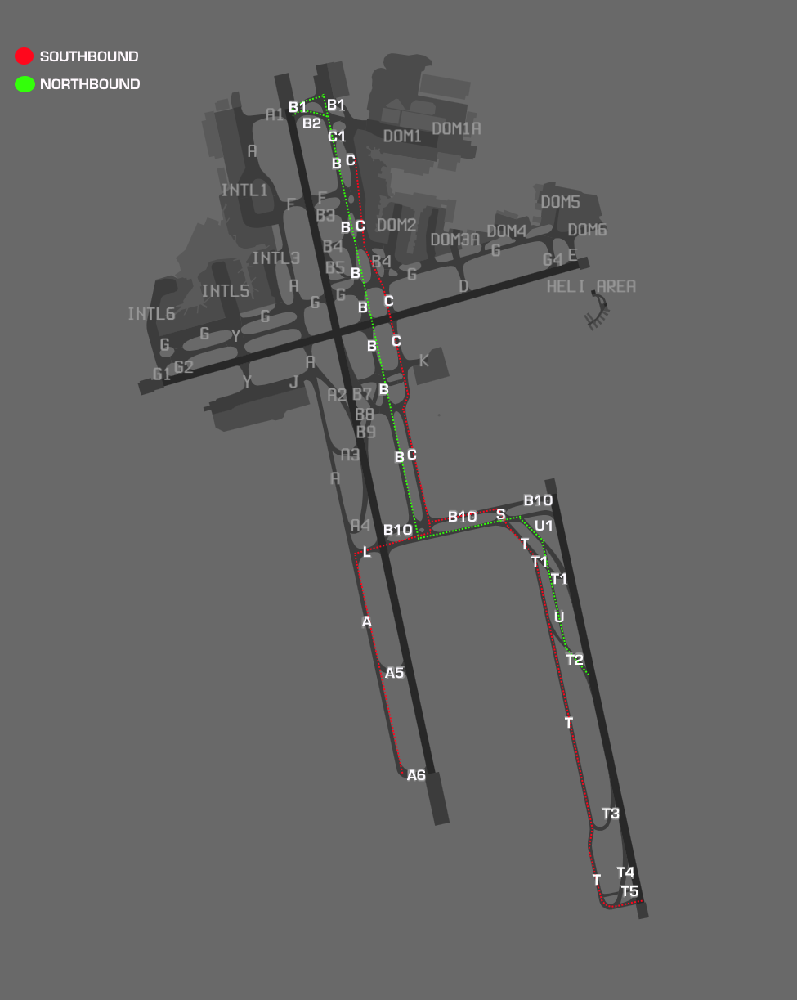

--8<-- "includes/abbreviations.md"

## Positions

| Name               | Callsign       | Frequency        | Login Identifier                         |
| ------------------ | -------------- | ---------------- | ---------------------------------------- |
| **Sydney ADC West**    | **Sydney Tower**   | **120.500**          | **SY_TWR**                                   |
| Sydney ADC East†   | Sydney Tower   | 124.700          | SY-E_TWR                                 |
| **Sydney SMC West**    | **Sydney Ground**  | **126.500**          | **SY_GND**                                   |
| Sydney SMC East†   | Sydney Ground  | 121.700          | SY-E_GND                                 |
| Sydney Coordinator† | Sydney Coordinator   | 127.600          | SY-C_GND                                |
| **Sydney ACD**         | **Sydney Delivery**| **133.800**          | **SY_DEL**                                   |
| Sydney ATIS        |                | 126.250          | YSSY_ATIS                                |

† *Non-standard positions* may only be used in accordance with [VATPAC Air Traffic Services Policy](https://vatpac.org/publications/policies)  

## Airspace
SY ADC is responsible for the Class C airspace in the SY CTR `SFC` to `A005` as shown below.

<figure markdown>
{ width="700" }
  <figcaption>SY ADC Airspace</figcaption>
</figure>

### Helicopter Operations
Refer to [Heliport Responsibility](#heliport-responsibility) to determine which ADC position (when both are online) is responsible for managing helicopter arrivals and departures.

#### Departures
VFR helicopters are generally processed via one of Sydney's Helicopter Routes. IFR helicopters should conform to fixed wing ops and be processed via the **SY (RADAR) SID** from an appropriate runway, unless a visual departure is acceptable.

SY ACD will issue airways clearance for a Helicopter Route through a coded clearance.
!!! tip
    You can find details of each Helicopter Route (including applicable clearance limits) in the `ERSA FAC YSSY`.

!!! example
    **YOE:** "Sydney Delivery, helicopter YOE, for the Harbour Bridge 5 outbound, request clearance"  
    **SY ACD:** "YOE, Delivery, cleared Harbour Bridge 5 outbound, squawk 0215, departure frequency 123.0"  
    **YOE:** "Cleared Harbour Bridge 5 outbound, squawk 0215, departure frequency 123.0, YOE"

Most helicopters will be capable of departing from their company helipad.  If reposition is required to Helipad 1 (the primary helipad), this must be approved by **SY ADC**.
!!! example
    **YOE:** "Sydney Tower, helicopter YOE, Hotel 7, request reposition Hotel 1"  
    **SY ADC:** "YOE, reposition approved"  
    **YOE:** "Reposition approved, YOE"

Helipad 1 is controlled by **SY ADC** and treated like a runway (takeoff clearances required).  All other pads are outside Tower's jurisdiction and do not require a takeoff/landing clearance, however, approval must still be sought for helicopters to become airborne in the SY CTR.  This approval is communicated in the form of a requirement to *'report airborne'*.
!!! example
    **HWD:** "Sydney Tower, helicopter HWD, Hotel 7, for the Harbour Bridge 5 outbound, ready"  
    **SY ADC:** "HWD, Sydney Tower, report airborne"  
    **HWD:** "HWD"  
     
    **HWD:** "HWD, airborne"  
    **SY ADC:** "HWD, contact departures"  
    **HWD:** "Departures, HWD"

Helicopter operations should be accommodated without unduly delaying fixed wing traffic to/from the aerodrome.  Where possible, visually separate helicopters and fixed wing aircraft, and when necessary, delegate responsibility for separation to the helicopter.
!!! example
    **SY ADC:** "HSZ, traffic is a 737 shortly rolling on runway 34R, report in sight"  
    **HSZ:** "Traffic sighted, HSZ"  
    **SY ADC:** "HSZ, maintain own separation, caution wake turbulence, report airborne"  
    **HSZ:** "Maintain own separation, wilco, HSZ"

#### Arrivals
VFR helicopters are generally processed via by one of Sydney's Helicopter Routes.  IFR helicopters should conform to fixed wing ops and be processed via an appropriate runway.

SY TCU will clear helicopters for all inbound Helicopter Routes, with the exception of the `CAPE BANKS 5 INBOUND` and `WANDA 5 INBOUND`.  Tower controllers should assess the current traffic situation and issue clearances for these aircraft when available.  Each procedure is delivered as a coded clearance, which includes automatic altitude assignment, tracking, and a clearance limit designed to separate helicopters from fixed-wing aircraft.

!!! example
    **YZD:** "Sydney Tower, helicopter YZD, JIBN, A005, received Tango, request Cape Banks 5 Inbound"  
    **SY ADC:** "YZD, Sydney Tower, cleared Cape Banks 5 Inbound, report at the Container Terminal"  
    **YZD:** "Cleared Cape Banks 5 Inbound, YZD"  

    **YZD:** "YZD, Container Terminal"  
    **SY ADC:** "YZD, cleared visual approach, report on the ground"  
    **YZD:** "Cleared visual approach, wilco, YZD"

!!! tip
    You can find details of each Helicopter Route (including applicable clearance limits) in the `YSSY ERSA FAC`.

During times of peak fixed wing traffic, instruct helicopters to hold at their designated clearance limit on their Helicopter Route and maintain own separation on approach to the heliport.
!!! example
    **SY ADC:** "YOE, hold at the clearance limit, traffic is a 717 on a 4nm final to runway 25, report in sight"  
    **YOE:** "Hold at the clearance limit, traffic sighted, YOE"  
    **SY ADC:** "YOE, pass behind that aircraft, maintain own separation, caution wake turbulence, cleared visual approach, report on the ground"  
    **YOE:** "Pass behind the 717, maintain own separation, cleared visual approach, YOE" 

    *Remember to pass traffic information to both aircraft.*  
    **SY ADC:** "QJE1745, traffic is a helicopter, currently 3nm north of the field, they'll maintain own separation and pass behind you on approach to the heliport, runway 25, cleared to land"  
    **QJE1745:** "Runway 25, cleared to land, QJE1745" 
    
    **YOE:** "YOE, on the pad"  
    **SY ADC:** "YOE"

Helipad 1 is controlled by **SY ADC** and treated like a runway (landing clearances required).  All other pads are outside Tower's jurisdiction and do not require a takeoff/landing clearance.  Helicopters should be instructed to *'report on the ground'* so the controller knows when they are no longer active in their airspace.

## Maneuvering Area Responsibility
<figure markdown>
{ width="500" }
  <figcaption>Maneuvering Area</figcaption>
</figure>

## Standard Taxi Routes
Except when the traffic situation warrants, taxi clearances shall conform to the following diagram:
<figure markdown>
{ width="500" }
  <figcaption>Standard Taxi Routes</figcaption>
</figure>

!!! tip
    For aircraft taxiing northbound on B, consider instructing them to hold short of taxiway B8 when 34L or 16R are in use for arrivals, in order to separate from aircraft using the B7 & B9 rapid exits.

`ERSA FAC YSSY` noise abatement procedures require jet aircraft to depart runway 34L from full length only. This should be simulated where practical but intersection departures should be offered to jet aircraft on request where available.

### Runway 16L/34R
When both ADC and SMC are online, SMC shall issue aircraft departing on runway 16L/34R with a taxi limit in accordance with the table below. When runway 34R is in use, ADC shall issue further taxi to the holding point, considering any conflict with arriving aircraft taxiing via `U1` and `L`.

| Departure Runway | Taxi Limit |
| --- | --- |
| Runway 16L | Holding point `B10` |
| Runway 34R | Taxiway `S` |

!!! example
    **SY SMC:** "VOZ853, taxi Charlie, cross runway 25, hold short Sierra"  
    **VOZ853:** "Taxi Charlie, cross runway 25, hold short Sierra, VOZ853"  

    **VOZ853:** "Sydney Tower, VOZ853, holding short Sierra, ready"  
    **SY ADC:** "VOZ853, Sydney Tower, give way to the inbound Jetstar A320, taxi holding point Tango Six, runway 34R"

Aircraft landing on runway 16L/34R are expected to vacate the runway and taxi via the standard taxi routes to join taxiway Lima. If pilots are unfamiliar with local procedures, they should be instructed by **ADC** to taxi accordingly. Where possible, outbound aircraft should give way to inbound aircraft to avoid creating congestion at the runway exits.

!!! example
    **SY ADC**: "JAL52, taxi Tango, Lima, on Lima contact Ground 121.7"

### Transferring Between SMCs
When both SMC positions are online and an aircraft is to be passed from one to the other (e.g. an aircraft taxis from the domestic terminal for runway 34L), they should be instructed to hold short of runway 16R/34L and to contact the next SMC frequency.

!!! example
    **SMC East**: "JST412, cross runway 25, taxi Lima, hold short runway 34L, on Lima contact ground 126.5"  
    **JST412**: "Cross runway 25, taxi Lima, hold short runway 34L, contact ground 126.5, JST412"  

    **JST412**: "Sydney Ground, JST412, holding short runway 34L"  
    **SMC West**: "JST412, cross runway 34L, taxi holding point Alpha Six"  
    **JST412**: "Cross runway 34L, taxi holding point Alpha Six, JST412"

Generally, aircraft shall cross runway 16R/34L in the following directions at the following locations:

| Location | Direction of Taxi |
| --- | --- |
| Taxiway Golf | Eastbound |
| Runway 25 | Westbound |
| Taxiway Lima | As required |

## Runway Modes
### Preferred Runway Modes
Winds must always be considered for Runway modes (Crosswind <20kts, Tailwind <5kts), however the order of preference is as follows:

| Priority - Mode | Arrivals  | Departures |
| ----------------| --------- | ---------- |
| 1 - SODPROPS    | 34L       | 16L        |
| 2 - 34 PROPS    | 34L & 34R | 34L & 34R  |
| 2 - 16 PROPS    | 16L & 16R | 16L & 16R  |
| 3 - 16D/07A     | 07        | 16L & 16R  |
| 3 - 25D/34A     | 34L & 34R | 25         |
| 4 - 16D/25A     | 25        | 16L & 16R  |
| 5 - 07          | 07        | 07         |
| 5 - 25          | 25        | 25         |
| *Curfew         | 34L       | 16R        |

*Permitted between the hours of 2300 and 0600 Local. If the pilot does not want to participate in curfew mode operations, the controller must accommodate this request.

!!! note
    In general, the SODPROPS, 16D/07A, and 25D/34A modes are most suitable for Noise Abatement. The PROPS modes are most suitable for higher capacity. Since for the most part, neither of these are a factor on VATSIM, it is up to you which runway mode you would like to operate, subject to winds. Consider favouring the higher capacity PROPS modes during busy times, such as events like Milk Run Monday or Panic Stations.

!!! tip
    Take in to account an aircraft's weight when runways 16L/34R or 07/25 are in use. Heavier aircraft may operationally require the longer Runway 16R/34L, or pilots may prefer a departure from 16R instead of 16L so they have a shorter taxi. If in doubt, ask the pilot and try to be accommodating of these requests.

### SODPROPS
When using the SODPROPS mode, pass traffic information to aircraft that are departing and landing at the same time.

!!! example
    **SY ADC:** "JST521, traffic is a 737 on a 3nm final for the opposite direction parallel runway, runway 16L, cleared for takeoff"  
    **JST521:** "Runway 16L, cleared for takeoff, JST521"  
    **SY ADC:** "VOZ954, traffic is an A320 departing from the opposite direction parallel runway to the southeast, runway 34L, cleared to land"  
    **VOZ954:** "Runway 34L, cleared to land, VOZ954"  

### Heliport Responsibility
When runway 25 is in use, the responsibility for management of the helicopter area falls to **ADC West**. When runway 25 is not in use, **ADC East** (if online) takes responsibility for the heliport.

## Parallel Runway Operations
Refer to [Parallel Runway Separation Standards](../../../separation-standards/parallelapps) for more information

### Go-arounds / Missed Approaches
When operating under PROPS, go around headings shall diverge from the extended centreline of the parallel runway by at least 30°. Aircraft cleared the ILS or IVA may follow the published missed approach in order to meet this requirement.  
Go arounds / missed approaches shall be coordinated with the SY TCU as per the standard procedure.

### Runway Selection
Unless operationally required, aircraft shall be assigned the following runways for departure when PROPS are in progress:

| Aircraft tracking | Runway  |
| ----------------| --------- |
| via KADOM   | 16R/34L      |
| Jets via WOL | 16R/**34R** |
| Non-Jets via WOL | 16R/34L |
| via RIC | 16R/34L |
| via OLSEM | 16L/34R |
| Other aircraft: |
| To the NORTH and EAST | 16L/34R |
| Non-Jets To the SOUTH WEST | 16R/34L |
| To the WEST | 16R/34L |

!!! note
    During times of heavy traffic, it may be beneficial for ACD to balance the load between Runways 34L and 34R for domestic jet departures via WOL. Non-jet departures via WOL should still be processed on 34L. The same principle may be applied to the Runway 16 direction when the 16R holding points are becoming congested and a large amount of heavy, international aircraft are planned to depart during a given window.  

    Where the traffic levels are normal, preference should be given to departing aircraft in accordance with the runway selection table above.

## SID Selection

!!! tip
    A radar SID (e.g. **SY (RADAR) SID**) is distinct from a procedural SID with a RADAR transition (eg, **RIC SID, RADAR transition**). A radar SID can be identified in the [DAPs](https://www.airservicesaustralia.com/aip/current/dap/AeroProcChartsTOC.htm) as having a *"(RADAR)"* at the end of the name.

### Runway 07

| Type  | Via  | SID     |
| ------| ---- | --------|
| Jet  | OLSEM WOL | **FISHA** SID, Relevant Transition |
| Jet  | All others | **FISHA** SID, RADAR Transition |
| Non-Jet| All       | **RADAR** SID |

### Runway 16L

| Type  | Via  | SID     |
| ------| ---- | --------|
| Jet  | OLSEM NOBAR DIPSO EVONN CAWLY OPTIC | **KEVIN** SID, Relevant Transition |
| Jet  | WOL | **ABBEY** SID, WOL Transition |
| Jet  | All others | **KEVIN** SID, RADAR Transition |
| Non-Jet | All | **RADAR** SID |

### Runway 16R

| Type  | Via  | SID     |
| ------| ---- | --------|
| Jet  | RIC KADOM WOL | **KAMPI** SID, Relevant Transition |
| Jet  | All others | **KAMPI** SID, RADAR Transition |
| Non-Jet | All | **RADAR** SID |

### Runway 25

| Type  | Via  | SID     |
| ------| ---- | --------|
| All  | All | **RADAR** SID |

### Runway 34L

| Type  | Via  | SID     |
| ------| ---- | --------|
| Jet  | WOL | **WOL** SID |
| Jet  | KADOM | **KADOM** SID |
| Jet  | RIC | **RIC** SID, RIC Transition |
| Jet  | All others | **RIC** SID, RADAR Transition |
| Non-Jet | All | **RADAR** SID |

### Runway 34R

| Type  | Via  | SID     |
| ------| ---- | --------|
| Jet  | OLSEM | **OLSEM** SID |
| Jet  | WOL | **MARUB** SID, WOL Transition |
| Jet  | All others | **MARUB** SID, RADAR Transition |
| Non-Jet | All | **RADAR** SID |

### Climb Gradient Requirements
Climb Gradient Requirements apply to all Procedural SIDs. It is the pilot's responsibility to advise if they are unable to meet these requirements. Pilots that advise this can be assigned a **RADAR** SID instead.

## ATIS
### Approach Types

| Cloud Base             | Visibility     | Approach                             |
| -----------------------| -------------- | -------------------------------------|
| >3000FT                | >5000M         | `EXP INDEP VISUAL APCH` |
| Between 2000FT & 3000FT| >5000M         | `EXP INST APCH THEN INDEP VISUAL APCH WHEN VISUAL`|
| Below 2000FT **or**    | <5000M         | `EXP INST APCH`                |

When Independent Visual Approaches are run during PROPS, the APCH field must also include:  
`DO NOT PASS THRU ASSIGNED RWY CL`

### Operational Info

When parallel runways are used for departures but inbound traffic levels don't necessitate independent approaches (low traffic levels), the ATIS OPR INFO shall include:  
`INDEP PARL DEPS IN PROG`  

When parallel runways are used for departures and the arrival sequence requires independent approaches (high traffic levels), the ATIS OPR INFO shall include:  
`INDEP PARL APPROACHES AND DEPS IN PROG`   

When SODPROPS are in operation, the ATIS OPR INFO shall include:  
`SIMUL OPP DIR PARL RWY OPS IN PROG`  

!!! example
    <figure markdown>
        
    </figure>

## Sydney Coordinator
Sydney Coordinator is activated when required to reduce frequency congestion on SMC and to ensure compliance with pre-determined slot times as necessary. The position is rarely used on VATSIM and is only beneficial with the large amounts of traffic only seen during annual events like WorldFlight. When Coordinator is online, all departures are first directed to them prior to contacting SMC.

!!! important
    Sydney Coordinator is a non-standard position which may only be used in accordance with [VATPAC Air Traffic Services Policy](https://vatpac.org/publications/policies).

!!! example
    **VOZ543**: "Sydney Delivery, VOZ543, PDC read back"  
    **SY ACD**: "VOZ543, go ahead the read back"  
    **VOZ543**: "OLSEM1 departure, squawk 1336, bay 33, VOZ543"  
    **SY ACD**: "VOZ543, contact Coordinator 127.6 for pushback"  
    **VOZ543**: "127.6 for push, VOZ543"

When aircraft contact Coordinator, the controller should check that it is suitable for them to be directed to SMC, then instruct them to **monitor** that frequency. This means that the pilot will switch to the appropriate frequency and wait for that controller to call them.

!!! example
    **VOZ543**: "Sydney Coordinator, VOZ543, bay 33, request pushback"  
    **SY COORD**: "VOZ543, monitor ground 121.7"  
    **VOZ543**: "Monitor 121.7, VOZ543"

    **SY SMC**: "VOZ543, Sydney Ground, pushback approved"  
    **VOZ543**: "Pushback approved, VOZ543"

!!! important
    As aircraft will monitor the SMC frequency, it is up to SMC to initiate contact when Coordinator is online. It is important that Coordinator informs SMC of each aircraft as they are instructed to monitor their frequency. It is up to each controller to determine their preferred way of performing this coordination.

If a delay is required prior to transferring an aircraft to SMC, provide an estimated delay value to the pilot.

!!! example
    **VOZ543**: "Sydney Coordinator, QFA1, bay 22, request pushback"  
    **SY COORD**: "QFA1, expect a 10 minute delay, remain this frequency."

When Coordinator is online, the ATIS shall include `WHEN READY FOR PUSH BACK OR TAXI CTC COORDINATOR 127.6` in the OPR INFO field.

## Coordination
### Auto Release
!!! important
    YSSY utilises auto release for all **Procedural** SIDs (except **ABBEY** SID during SODPROPS), and the **SY (RADAR)** SID provided aircraft are assigned the standard assignable level and a [Standard Assignable Heading](#standard-assignable-departure-headings).

'Next' coordination is **not** required for aircraft that are:   
    a) Departing from a runway nominated on the ATIS; and   
    b) Assigned the Standard assignable level; and  
    c) Assigned a **Procedural SID** (except **ABBEY** SID during SODPROPS); or  
    d) Assigned a [Standard Assignable Heading](#standard-assignable-departure-headings)

All other aircraft require a 'Next' call to SY TCU.

"Next" coordination is additionally required for:  
    a) Visual departures  
    b) Departures to YSBK  
    c) After a go around, the next departure from that runway  
    d) Jets departing 16L via WOL
    e) All aircraft during the Curfew Runway Mode

!!! example
    **SY ADC** -> **SY TCU**: "Next, MHQ, Runway 34R"  
    **SY TCU** -> **SY ADC**: "MHQ, heading 030, unrestricted"  
    **SY ADC** -> **SY TCU**: "Heading 030, MHQ"  

    **SY ADC**: "MHQ, Assigned heading right 030, Runway 34R, Cleared for Takeoff"  
    **MHQ**: "Right heading 030, Runway 34R, Cleared for Takeoff, MHQ"

The SY TCU controller can suspend/resume Auto Release at any time, with the concurrence of **SY ADC**.

The Standard Assignable level from SY ADC to SY TCU is:  
For Jets: `A050`  
For Non-Jets: The lower of `A030` or the `RFL`

### Departures Controller
Refer to [Sydney TCU Airspace Division](../../../terminal/sydney/#airspace-division) for information on airspace divisions when **SDN** and/or **SDS** are online.

### Standard Assignable Departure Headings
Aircraft that have been cleared the **SY (RADAR) SID** must receive an assigned heading with their line up or takeoff clearance. 'Next' coordination is not required to the SY TCU controller when the departing aircraft has been assigned the standard assignable level and assigned one of the headings listed below:

| Runway | Jet | Non-Jet 
| ----------------- | -------------- | ---------------- |
| 07                | 070         | 020, 110       |
| 16L                | 125          | 125 (RWY 25 in use), 090 (RWY 25 not in use) |
| 16R               | 170         | 210         |
| 25                | 300, 240          | 020, 210, 240 |
| 34L                | 290          | 230 |
| 34R                | 030, 070          | 350 |

!!! tip
    If strong winds are present at altitude, TWR/DEP should discuss slight changes to these headings (+/- 5 degrees) to compensate for large crosswind components.

### Between ADC and SMC
#### Inactive Runway Releases
**SY ADC** has responsibility of all runways, requiring **SY SMC** to coordinate with **SY ADC** to allow aircraft to cross runways whilst taxiing. **SY SMC** may request, or **SY ADC** may elect, to release certain runways to the **SY SMC** controller, so they may let aircraft cross the runway without coordination (for example, releasing runway 07/25 to **SY SMC** whilst PROPS are in progress.) This release may also be cancelled at the controller's discretion.

### ACD to SY TCU
The controller assuming responsibility of **SY ACD** shall give heads-up coordination to the relevant SY TCU controller prior to the issue of the following clearances:  
a) VFR Departures  
b) Aircraft using a runway not on the ATIS 

!!! example
    **TEK:** "Sydney Delivery, TEK, for YSHL via CUL, A025, request clearance"  
    **SY ACD:** "TEK, Sydney Delivery, standby"    

    **SY ACD** -> **SY TCU**: "TEK, requesting clearance for YSHL via CUL, A025"  
    **SY TCU** -> **SY ACD**: "TEK, cleared to YSHL via CUL, A025"  
    **SY ACD** -> **SY TCU**: "Cleared to YSHL via CUL, A025, TEK"   

    **SY ACD:** "TEK, cleared to YSHL via CUL, climb A025, squawk 0552, departure frequency 123.0"  
    **TEK:** "Cleared to YSHL via CUL, climb A025, squawk 0552, departure frequency 123.0, TEK"  