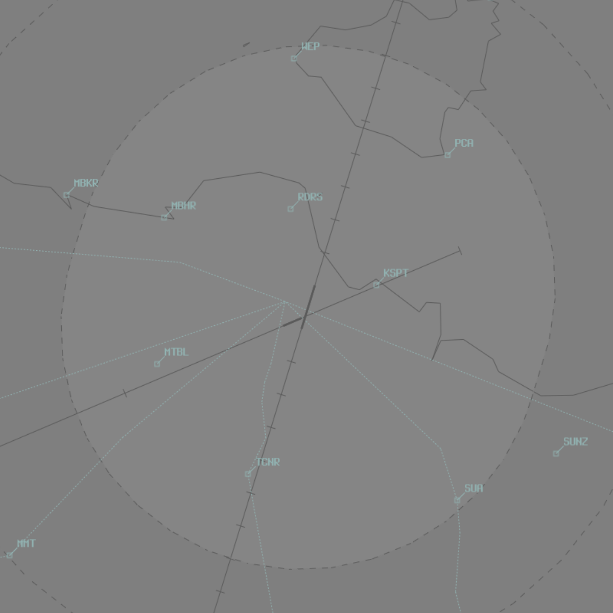
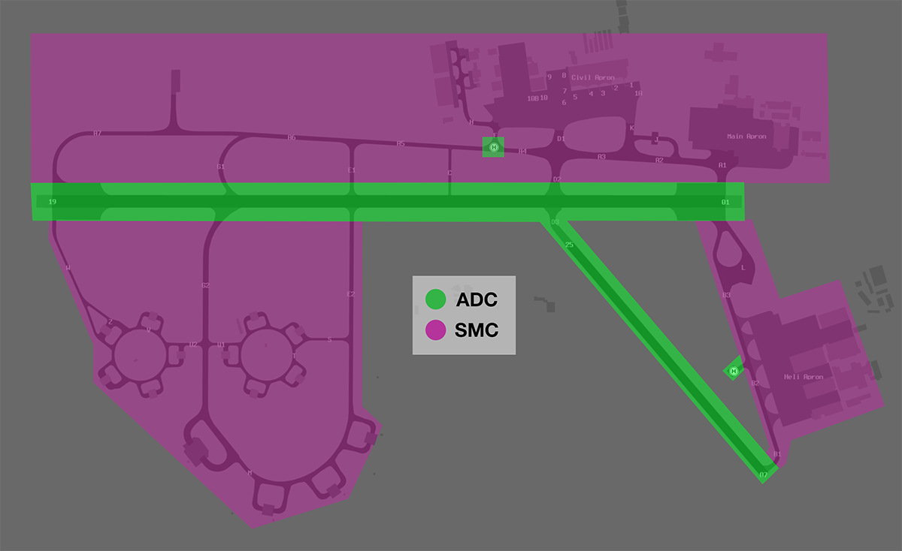
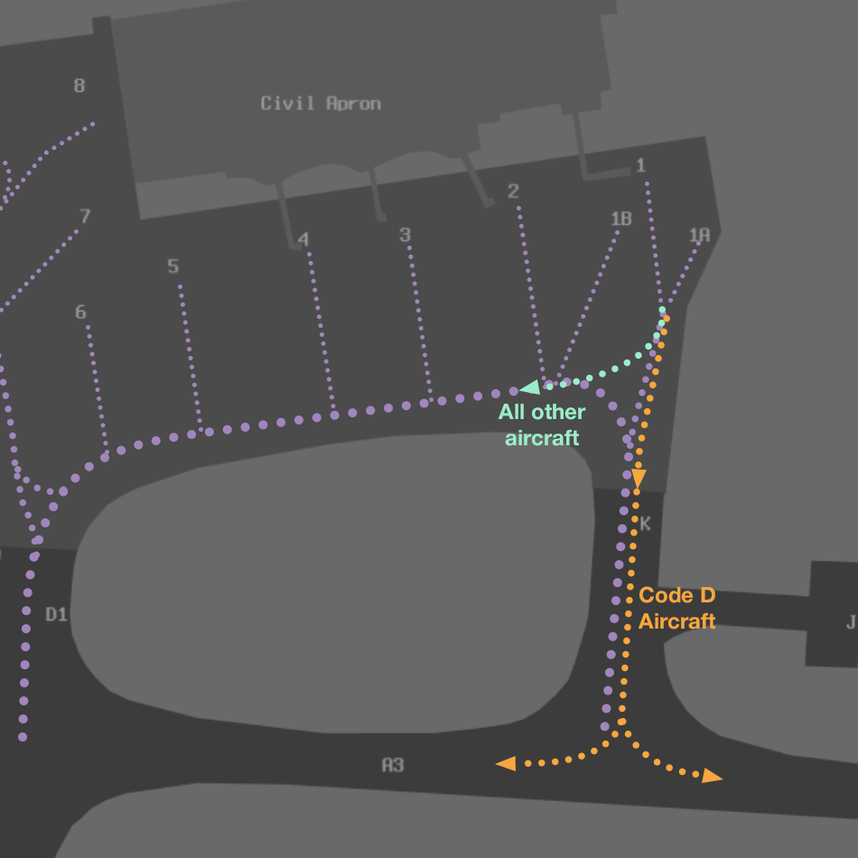
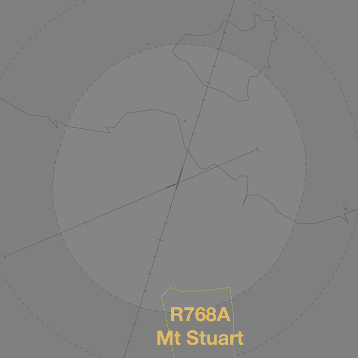
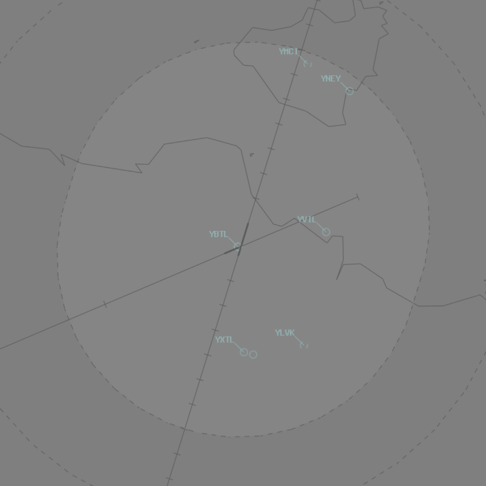
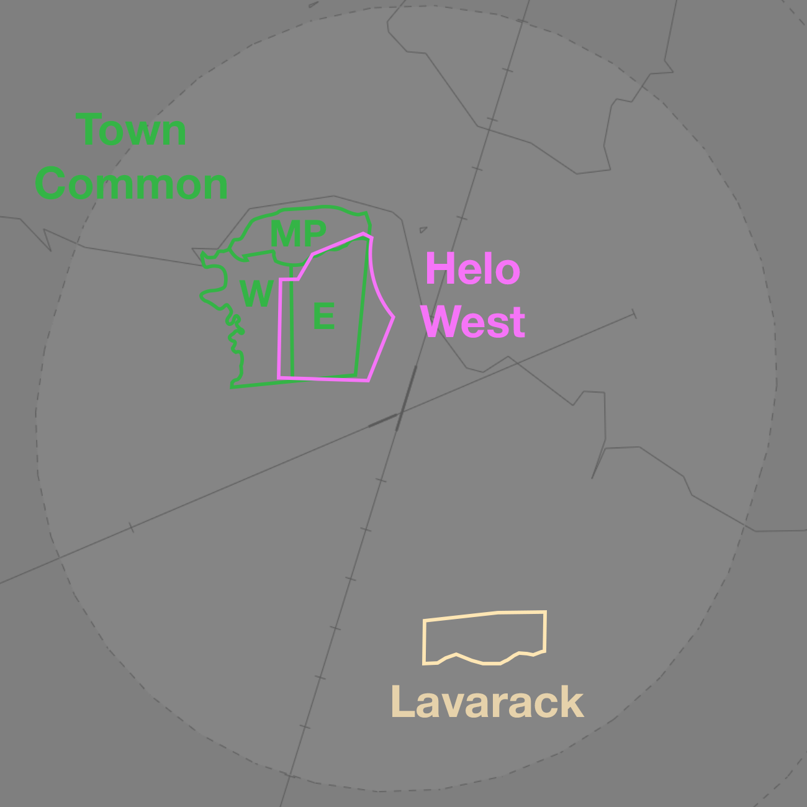
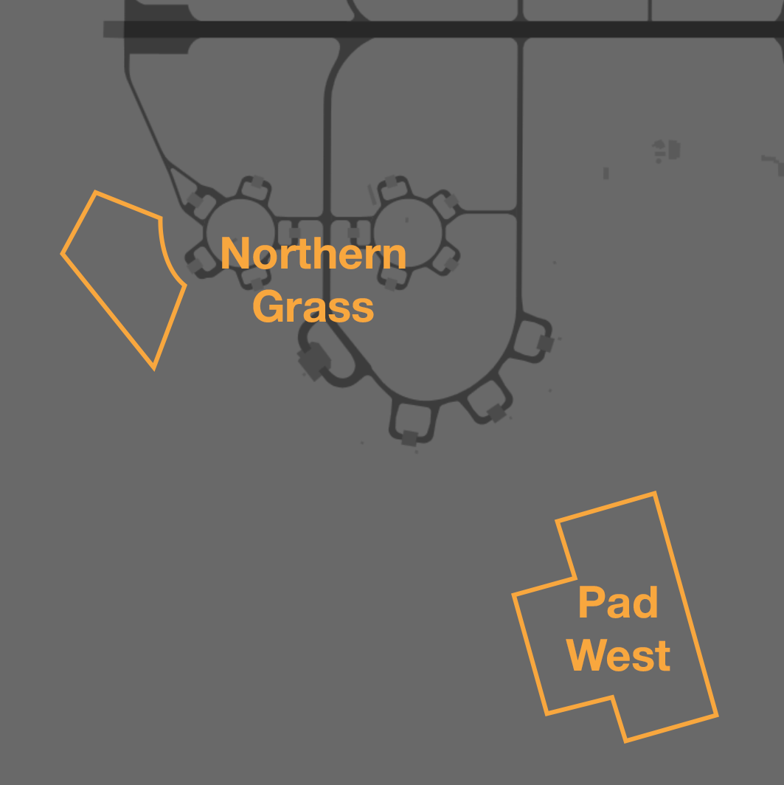

--8<-- "includes/abbreviations.md"

## Positions

| Name                | Callsign                | Frequency   | Login ID      |
| ------------------- | ----------------------- | ----------- | ------------- |
| **Townsville ADC**  | **Townsville Tower**    | **118.300** | **TL_TWR**    |
| **Townsville SMC**  | **Townsville Ground**   | **121.800** | **TL_GND**    |
| **Townsville ACD**  | **Townsville Delivery** | **128.100** | **TL_DEL**    |
| **Townsville ATIS** |                         | **133.500** | **YBTL_ATIS** |

!!! note
    YBTL is a [joint military/civil aerodrome](../../../controller-skills/military/#military-aerodromes) and procedures can differ significantly to those at a civil aerodrome. Ensure you are familiar with the [military controller skills](../../../controller-skills/military) necessary to provide a quality service.

## Airspace
TL ADC owns the Class C airspace in the TL MIL CTR `SFC` to `A015`. 

<figure markdown>
{ width="600" }
  <figcaption>TL ADC Airspace</figcaption>
</figure>

## Restricted Area Activations
There are no [restricted areas or MOAs](../../controller-skills/sua) activated by default when TL ADC is online.

## Manoeuvring Area
### Manoeuvring Area Responsibility
ADC is responsible for all runways as well as [**Helipad B** and **Helipad F**](#helipads).

<figure markdown>
{ width="500" }
  <figcaption>YBTL Manoeuvring Area Responsibility</figcaption>
</figure>

Aircraft landing on **Runway 07** are required to hold short of

!!! note
    Despite being located on a taxiway, **Helipad F** is treated as a runway. All aircraft need explicit clearance to cross the helipad holding points when taxiing on Taxiway A.
    
### Bay 1 Pushbacks
Code D aircraft requiring pushback from **Bay 1** must pushback onto Taxiway A.
 
<figure markdown>
{ width="700" }
  <figcaption>Bay 1 Pushback</figcaption>
</figure>

All other aircraft will pushback onto the taxilane behind Bay 2.

### Taxiway Limitations
Taxiway **C** is only available to light aircraft. Taxiways **J** is not available to any aircraft.

## Local Procedures
### Initial and Pitch
The [intial points](../../controller-skills/military/#initial-and-pitch) are 5NM from the ARP, displaced 1,000 feet laterally to the dead side of the runway, `A025`.

Aircraft arriving Runway 19 should be assigned either a **left initial** or **right initial**; a straight initial is not available due to high terrain over Magnetic Island.

Aircraft arriving Runway 01 should be assigned either a **left initial**, **standard right initial**, or **close right initial**. On a close right initial aircraft will track north of Mt Stuart, as opposed to aircraft tracking on a standard right initial, who pass Mt Stuart to the south.

### Coded Clearances
There are multiple different coded clearances used for a variety of civil and military operations.

!!! tip
    [Coordination requirements](#acd-to-tl-tcu) exist between ACD and TCU when aircraft are requesting clearance to operate in an SUA that has not been activated. Controllers performing the role of ACD should ensure they coordinate with TCU before providing clearance

#### Bluewater Clearance
The D764 (Townsville) [danger area](../../controller-skills/sua/#danger-areas), also known as the **Bluewater Training Area**, is a commonly used training area west of YBTL.

Aircraft departing to the training area should be cleared a 'BLUEWATER' clearance. This clearance gives aircraft permission depart the TL MIL CTR, and transit to the D764 danger area via the appropriate track.

| Duty RWY | Direction | Tracking | Notes |
| -------- | --------- | --------------- | ----- | 
| RWY 01   | Outbound  | YBTL-via coast remaining over land-D764 | Not above `A015` until within D764 |
| RWY 01   | Inbound   | D764-YBU-YBTL   | |
| RWY 19   | Outbound  | YBTL-YBU-D764   | Not above `A015` until within D764 |
| RWY 19   | Inbound   | D764-via coast remaining over land-YBTL | |

!!! phraseology
    **ABC**: "Townsville Delivery, ABC for Bluewater Training Area, request clearance.”   
    **TL ACD**: "ABC, Townsville Delivery, standby."   
       
    **TL ACD** -> **TLA**: "ABC, requests clearance to D764.”  
    **TLA** -> **TL ACD**: "ABC, clearance approved."  
    
    **TL ACD**: "ABC, clearance avilable"  
    **ABC**: "ABC” 
    **TL ACD**: "ABC, cleared BLUEWATER, not above `A015`, squawk 0361, departure frequency 126.8"   

!!! note
    ACD shall write the coded clearance in the **global ops field** prior to issuing clearance, for the awareness of other controllers.

#### YPAM Traffic
In VMc, light aircraft travelling between YBTL and YPAM should be cleared a '**CORDELIA**' or '**RATTLESNAKE**' clearance, according to the YBTL runway in use.

| Duty RWY     | Clearance            | Tracking Points    | Notes |
| ------------ | -------------------- | ------------------ | ----- |
| RWY 01 or 07 | CORDELIA Outbound    | `YBTL RDRS RKI052005 YPAM` | Aircraft to remain east of RDRS and *Cordelia Rocks* (RKI052005) |
| RWY 01 or 07 | RATTLESNAKE Inbound  | `YBTL MBHR RKI YPAM`       | When [R747 restricted area](../../terminal/Townsville/#r747-rattlesnake-island) is active, expect amended tracking |
| RWY 19 or 25 | RATTLESNAKE Outbound | `YPAM RKI MBHR YBTL`       | When [R747 restricted area](../../terminal/Townsville/#r747-rattlesnake-island) is active, expect amended tracking 
| RWY 19 or 25 | CORDELIA Inbound     | `YPAM RKI052005 RDRS YBTL` | Aircraft to remain east of RDRS and *Cordelia Rocks* (RKI052005) |

!!! phraseology
    **DEF**: "Townsville Delivery, DEF for YPAM, request clearance.”   
    **TL ACD**: "DEF, Townsville Delivery, cleared CORDELIA Outbound, climb `A035`, squawk 0313, departure frequency 126.8."   

!!! note
    ACD shall update the pilot's route and write the coded clearance in the **global ops field** prior to issuing clearance, for the awareness of other controllers.

#### Maggy Arrival

#### Military Gates
There are several [military gates](../../controller-skills/military/#military-gates) established throughout the TL TCU to facilitate entry and exit to adjoining SUA.

<figure markdown>
{ width="700" }
  <figcaption>TL SUA Gates</figcaption>
</figure>

!!! phraseology
    *RPLC15 plans to enter the M581 MOA via Gate 7 for military training and airwork.*  
    **RPLC15**: "Willy Delivery, RPLC15 for Gate 7, `F120` for M581, request clearance."
    **WLM ACD**: "RPLC15, Willy Delivery. Cleared Gate 7, Classic departure. Climb via SID to `F120`, squawk 6001, departure frequency 135.7."   

If the pilot **does not** nominate a gate, or nominates a gate that does not provide access to their intended SUA, WLM ACD should clear the aircraft to depart via the **appropriate gate**.

| Intended SUA    | TCU Exit Gate       |
| --------------- | ------------------- |
| D745            | 
| M742            |
| R736            |
| R738A-F         |
| R738G-H         |
| R732            |
| R739            |
| R747            |
| R751            |
| R752            |
| R768A-B         |

### Special Use Airspace
#### R768A Mt Stuart
The R768A Mt Stuart [restricted area](../../controller-skills/sua/#restricted-areas) is a non-flying SUA located in the south of the TL MIL CTR, `SFC-A020`. It is activated daily from 2100-1200 UTC.

<figure markdown>
{ width="700" }
  <figcaption>R768A Mt Stuart</figcaption>
</figure>

All instrument approaches for Runway 01 and Runway 19 SIDs are procedurally separated from the restricted area. All other aircraft should be [separated](../../controller-skills/sua/#controlled-airspace), when activated.

## VFR Operations
### VFR Routes

<figure markdown>
{ width="600" }
  <figcaption>YBTL VFR Routes</figcaption>
</figure>

| Direction from AYPY | Code | Name | Dep/Arr |
| ------------------- | ---- | ---- | ------- |
| North | BRW | Brown River Bridge | Both |
| North | MLA | Mt Lawes | Both |
| Northeast | - | False Gap | Both |
| Northeast | GAP | Kokoda Gap | Both |
| Northeast | HOM | Hombrom Bluff | Both |
| East | SIR | Sirinumu | Both |
| Southeast | GAR | Gaire | Both |
| Southeast | TUB | Tubusereia | Both |
| West | FAI | Fairfax | Both |
| West | BOH | Boera Head | Both |
| Northwest | RES | Redscar Head | Both |
| Northwest | GAE | Galley | Both |
| Northwest | - | Aroa | Both |

## Helicopter Operations
### Helipads
There are two helipads at YBTL: **Helipad F**, located at the intersection of Taxiways B and F; and **Helipad B**, located north of Taxiway B. Both helipads are part of the manoeuvring area and controlled by TL ADC. Any helicopter taking off or landing on the helipads require a specific takeoff or landing clearance from ADC.

!!! phraseology 
    **TL ADC**: "FTBY21, helipad F, cleared to land"
    
### Departures

### Arrivals

### Hospital Helipads
Within the Townsville CTR there are half a dozen HLS's, including two helipads at Townsville Hospital (YXTL and YXTS).

<figure markdown>
{ width="700" }
  <figcaption>HLS in TL ADC Airspace</figcaption>
</figure>

### Operating Areas
There are multiple defined operating areas within the TL MIL CTR to facilitate helicopter operations.

<figure markdown>
{ width="600" }
  <figcaption>Helicopter Operating Areas within TL MIL CTR</figcaption>
</figure>

<figure markdown>
{ width="600" }
  <figcaption>Helicopter Operating Areas within TL MIL CTR (Ground View)</figcaption>
</figure>

#### Northern Grass
Helicopters may perform airwork below 100FT AGL within the '**Northern Grass**', an area north of the northern OLA.

Helicopters requesting clearance to operate in the Northern Grass shall be cleared to air transit to, and then operate within, the area by ADC.

!!! phraseology
    **AGRY11**: "Townsville Tower, helicopter AGRY11, Heli Apron, for the Northern Grass."   
    **TL ADC**: "AGRY11, Townsville Tower, air transit Northern Grass, cross runway 07. Report established."
	**AGRY11**: "Air transit Northern Grass, cross runway 07, AGRY11" 
	
	**AGRY11**: "Townsville Tower, AGRY11, established Northern Grass."   
    **TL ADC**: "AGRY11, cleared to operate Northern Grass, not above 100ft."

#### Helo West
The **Helo West** operating area

##### Pad West

#### Lavarack Circuit Area
The **Lavarack Circuit Area** is established over the Lavarack Barracks (YLVK), southwest of YBTL. Helicopters may request the activation of the Lavarack Circuit Area, not above `A010`.

The Lavarack Circuit Area is **not** separated from aircraft departing Runway 19 on a procedural SID or aircraft tracking via the RNP-Z and RNP-P Runway 01 approach.

#### Town Common

## Runway Modes
### Preferred Runway Modes
Winds must always be considered for runway modes (Crosswind <20kts, Tailwind <5kts), however the order of preference is as follows:

| Priority - Mode | Arrivals | Departures |
| ----------------| -------- | ---------- |
| =1 - 01AD/07AD | 01 & 07 | 01 & 07 |
| =1 - 19AD/25AD | 19 & 25 | 19 & 25 |
| =2 - 01 Only   | 01 | 01 |
| =2 - 19 Only   | 19 | 19 |
| =3 - 07 Only   | 07 | 07 |
| =3 - 25 Only   | 25 | 25 |

### Circuits
The circuit height is `A015`.

#### Circuit Direction
| Runway | Direction |
| ------ | ----------|
| 01     | Left      |
| 07     | Left      |
| 19     | Right     |
| 25     | Right     |

## SID Selection
Aircraft planned via **AKROM**, **ANRUB**, **CARMN**, **CATEY**, **JEMMA**, **PEWEE** and **WALTA** shall be assigned the **Procedural SID** that terminates at the appropriate SID terminus. Aircraft **not** planned via any of these waypoints shall receive amended routing via the most appropriate SID terminus, unless the pilot indicates they are unable to accept a procedural SID.

**RNP (0.3)** approved operators planned via **JEMMA** and departing Runway 19 shall be assigned the **KVALM** procedural SID.

Aircraft that are unable to accept a procedural SID terminating on their route shall be assigned the appropriate procedural or radar SID from the table below.

| Runway | Westbound        | Eastbound       |
| ------ | ---------------- | --------------- |
| 01     | **TL NORTH** SID | **TL EAST** SID |
| 19     | **IGBIK** SID    | **RURTO** SID   |
| 07/25  | Visual           | Visual          |

Light and **non-RNAV** aircraft shall be assigned a visual departure.

## ATIS

## Coordination
### Auto Release  
[Next](../../controller-skills/coordination.md#next) coordination is **not** required from TL ADC to TL TCU for aircraft that are:  

- Departing from a runway nominated in the ATIS; and  
- Assigned the standard assignable level; and 
- Assigned a **Procedural** SID 

The Standard Assignable level from TL ADC to TL TCU is:

| Aircraft | Level |
| -------- | ------- |
| All      | The lower of `F180` and `RFL` |

### Departures Controller
When a TCU controller is online, aircraft shall be issued with a departure frequency during their airways clearance in accordance with the table below. If no TCU controllers are online, the Advisory frequency shall be issued.

| Runway | Via | Departure Frequency |
| ------ | ---- | -------------------- |
| All | All | 126.8 (TLA) |

### ACD to TL TCU
The controller assuming responsibility of **ACD** shall give [heads-up](../../controller-skills/coordination/#airways-clearance) coordination to TLA (or the enroute controller responsible for the TL TCU) prior to the issue of a clearance to an aircraft intending to operate in an SUA that **has not** been activated. 

!!! phraseology
    **TL ACD** -> **TLA**: "PSSM31 requests clearance to M742”  
    **TLA** -> **TL ACD**: "PSSM31, clearance approved."
    
## Charts
!!! abstract "Reference"
    In addition to the civilian `ERSA` and `AIP` publications, [the RAAF AIP website](https://ais-af.airforce.gov.au/australian-aip){target=new} contains the necessary charts (available in the TERMA) and description of procedures (in each airports' FIHA).