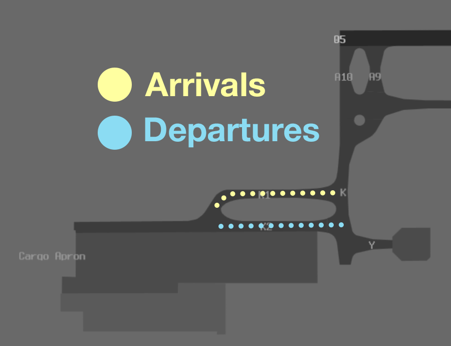

--8<-- "includes/abbreviations.md"

## Positions

| Name                      | Callsign               | Frequency   | Login ID      |
| ------------------------- | ---------------------- | ----------- | ------------- |
| **Nancy-Bird Walton ADC** | **Walton Tower**       | **128.100** | **WS_TWR**    |
| **Nancy-Bird Walton SMC** | **Walton Ground**      | **124.050** | **WS_GND**    |
| **Nancy-Bird Walton ACD** | **Walton Delivery**    | **118.650** | **WS_DEL**    |
| **Nancy-Bird Walton ATIS** |                       | **127.000** | **YSWS_ATIS** |

## Airspace
WS ADC is not responsible for any airspace by default.

## Manoeuvring Area
### Recommended Taxi Routes
To minimise conflict on the Cargo Apron, it is recommended that taxi instructions conform to the following diagram:

<figure markdown>
{ width="500" }
  <figcaption>YSWS Cargo Apron Taxi Routes</figcaption>
</figure>

`ERSA FAC YSWS` noise abatement procedures require all aircraft to depart from full length only. This should be simulated where practical but intersection departures should be provided to aircraft on request, where available.

<!--## Local Procedures

## VFR Operations

## Helicopter Operations
-->
## Runway Modes
### Preferred Runway Modes
Winds must always be considered for Runway modes (Crosswind <20kts, Tailwind <5kts), however the order of preference is as follows:

| Priority - Mode | Arrivals  | Departures |
| ----------------| --------- | ---------- |
| 1 - 23          | 23        | 25         |
| 2 - 05          | 05        | 05         |
| * RRO        | 05        | 23         |

*Permitted between the hours of 2300 and 0530 local when [YSSY Curfew Operations](../Sydney/#preferred-runway-modes) are in use.

#### Reciprocal Runway Operations
During Reciprocal Runway Operations (RRO) aircraft will depart and arrive in opposite directions on the same runway.

The RRO procedures on YSWS are designed to utilise airspace vacated by [YSSY Curfew Operations](../Sydney/#preferred-runway-modes). Outside of YSSY curfew hours, or when YSSY is using a non-curfew runway mode, the RRO runway mode **must not** be used.

!!! tip
    There is no requirement to nominate RRO during the hours listed above. RRO must only be nominated when the prevailing meteorological conditions allow. 

## SID Selection
!!! tip
    A radar SID (e.g. **WS (RADAR)** SID) is distinct from a procedural SID with a RADAR transition (eg, **REDAS SID, RADAR transition**), or a Procedural SID that ends in RADAR vectors (eg, **ISDIT** SID). A radar SID can be identified in the [DAPs](https://www.airservicesaustralia.com/aip/aip.asp){target=new} as having a *"(RADAR)"* at the end of the name.
	
YSWS uses four different SID designators to differentiate between different variations of SIDs that will be issued, according to the time of day, weather, and runway mode in use.

|      | SID Designator | Condition                     |
| ---- | -------------- | ----------------------------- |
| D    | Day            | Between 0530-2300 Local       |
| H    | Hot/Heavy      | Temperature ≥ 35° C, or Heavy aircraft unable to meet level restrictions (on request) |
| N    | Night          | Between 2300-0530 Local, when RRO is **not** in use |
| Q    | RRO            | Between 2300-0530 Local, when RRO is **in use**  |

=== "05"
	=== "Day"
		| Type    | Via      | SID           |
		| ------- | ------   | ------------- |
		| Jet     | BENBU    | **BENBU D** SID |
		| Jet     | CAWLY DIPSO EVONN NOBAR OLSEM OPTIC | **TESAT D** SID, Relevant Transition |
		| Jet     | PKS VOR  | **PKS D** SID   |
		| Jet     | TEEVE    | **TEEVE D** SID |
		| Jet     | LEECE NWA NDB | **TONTO D** SID, Relevant Transition | 
		| Jet     | All others | RADAR SID |
		| Non-Jet | DIPSO KAMBA NOBAR | **KAMBA D** SID, Relevant Transition |
		| Non-Jet | South Southeast Southwest | **ADPAV D** SID |
		| Non-Jet | All others | **ISDIT D** SID |
		
	=== "Hot/Heavy"
		| Type    | Via      | SID           |
		| ------- | ------   | ------------- |
		| Jet     | LEECE NWA NDB | **TONTO H** SID, Relevant Transition |
		

	=== "Night"
		| Type    | Via      | SID           |
		| ------- | ------   | ------------- |
		| Jet     | BENBU    | **BENBU N** SID |
		| Jet     | CAWLY EVONN OPTIC | **ENDEV N** SID, Relevant Transition |
		| Jet     | DIPSO EVONN NOBAR | **PASGO N** SID, Relevant Transition |
		| Jet     | EXETA LEECE NWA NDB | **REDAS N** SID, Relevant Transition |
		| Jet     | TEEVE    | **TEEVE N** SID |
		| Jet     | PKS VOR  | **TEEVE N** SID, Relevant Transition |
		| Jet     | All others | RADAR SID |
		| Non-Jet | KAMBA    | **KAMBA N** SID |
		| Non-Jet | All others | As per Jets |

=== "23"
	=== "Day"
		| Type    | Via      | SID           |
		| ------- | ------   | ------------- |
		| Jet     | BENBU    | **BENBU D** SID |
		| Jet     | CAWLY DIPSO EVONN NOBAR OLSEM OPTIC | **TESAT D** SID, Relevant Transition |
		| Jet     | PKS VOR  | **PKS D** SID   |
		| Jet     | TEEVE    | **TEEVE D** SID |
		| Jet     | LEECE NWA NDB | **TONTO D** SID, Relevant Transition | 
		| Jet     | All others | RADAR SID |
		| Non-Jet | EXETA NWA NDB WOL NDB | **REGER D** SID, Relevant Transition |
		| Non-Jet | North and East | **LEKID D** SID |
		| Non-Jet | All others | RADAR SID |
		
		
	=== "Hot/Heavy"
		| Type    | Via      | SID           |
		| ------- | ------   | ------------- |
		| Jet     | LEECE NWA NDB | **MELIT H** SID, Relevant Transition |

	=== "Night"
		| Type    | Via      | SID           |
		| ------- | ------   | ------------- |
		| Jet     | BENBU    | **BENBU N** SID |
		| Jet     | CAWLY EVONN OPTIC | **ENDEV N** SID, Relevant Transition |
		| Jet     | DIPSO NOBAR | **PASGO N** SID, Relevant Transition |
		| Jet     | EXETA LEECE NWA NDB | **REDAS N** SID, Relevant Transition |
		| Jet     | TEEVE    | **TEEVE N** SID |
		| Jet     | PKS VOR  | **TEEVE N** SID, Relevant Transition |
		| Jet     | All others | **REDAS N** SID, RADAR Transition |
		| Non-Jet | KAMBA    | **KAMBA N** SID, Relevant Transition |
		| Non-Jet | All others | As per Jets |
		
	=== "RRO"
		| Type    | Via      | SID           |
		| ------- | ------   | ------------- |
		| Jet     | BENBU    | **BENBU Q** SID |
		| Jet     | CAWLY DISPO EVONN NOBAR OLSEM OPTIC | **ENDEV Q** SID, Relevant Transition |
		| Jet     | EXETA LEECE NWA NDB | **TONTO Q** SID, Relevant Transition |
		| Jet     | TEEVE    | **TEEVE Q** SID |
		| Jet     | PKS VOR  | **TEEVE Q** SID, Relevant Transition |
		| Non-Jet | KAMBA    | **KAMBA Q** SID |
		| Non-Jet | All others | As per Jets |

        Aircraft **not** planned via any of these waypoints shall receive amended routing via the most appropriate SID terminus, unless the pilot indicates they are unable to accept a Procedural SID.

!!! warning
    Whilst OzStrips will automatically select the correct SID based on runway mode, time of day, and temperature, controllers using the default vatSys strips (e.g. while top down) will need to manually select the most relevant procedure from the table above. The default SID may not be the correct one. 

## ATIS
### Operational Info
The OPR INFO field should be updated to reflect the level of controlled airspace within the SY C10 area when it is lowered overnight.

| Condition    | OPR INFO Field |
| ------------ | -------------- |
| Between 2300 and 0600 Local   | `SY CTA 10 SOUTH OF WS CTR ACTIVE` |

#### ACD Pushback Requests
When implementing the ['Pushback Requests on ACD'](../../../controller-skills/grounddelaymanagement/#pushback-requests-on-acd) procedure, the OPR INFO shall include:
`ALL DEPARTURES MUST REQUEST PUSH BACK ON 118.65`.

## Coordination
### Auto Release
[Next](../../../controller-skills/coordination/#next) coordination is **not** required for aircraft that are:   

- Departing from a runway nominated on the ATIS; and   
- Assigned the standard assignable level; and  
- Assigned a **Procedural** SID.

All other aircraft require a 'Next' call to SWA.

'Next' coordination is additionally required for:  
 
- [After a go around](../../../controller-skills/coordination/#after-a-go-around), the next departure from that runway.
- All aircraft during the [RRO](#reciprocal-runway-operations) runway mode.

The Standard Assignable level from WS ADC to SWA is: 

| Aircraft | Level  |
| -------- | ------ |
| Jets     | `A040` |
| Non-Jets | The lower of `A030` and `RFL` |

### Departures Controller
When a TCU controller is online, aircraft shall be issued with a departure frequency during their airways clearance in accordance with the table below. If no TCU controllers are online, the most appropriate enroute controller or advisory frequency shall be issued.

| Runway | Via  | Departure Frequency |
| ------ | ---- | ------------------- |
| All    | All  | 118.4 (SWA) |

#### ACD to SY TCU
The controller assuming responsibility of **WS ACD** shall give [heads-up](../../../controller-skills/coordination/#airways-clearance) coordination to SWA prior to the issue of the following clearances: 

- VFR departures
- Aircraft with `ADES` YSSY, YSBK, YSCN, YSRI, or YSHW
- Aircraft using a runway not on the ATIS
