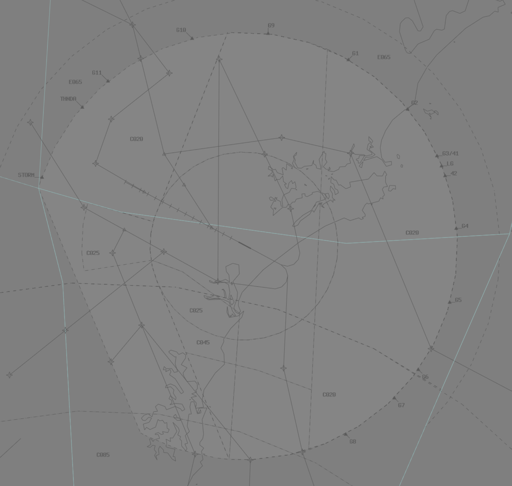

--8<-- "includes/abbreviations.md"

## Positions

| Name               | Callsign       | Frequency        | Login ID              |
| ------------------ | -------------- | ---------------- | --------------------------------------|
| **Williamtown ADC**    | **Willy Tower**  | **118.300**         | **WLM_TWR**        |
| **Williamtown SMC**    | **Willy Ground**  | **121.800**         | **WLM_GND**        |
| **Williamtown ACD**    | **Willy Delivery**  | **130.350**         | **WLM_DEL**       |
| Williamtown ATIS    |   | 134.450         | YWLM_ATIS       |

## Airspace
WLM ADC owns the airspace within the WLM MIL CTR A (`SFC`-`A050`). This may be amended/released as required between WLM ADC and WLM TCU.

<figure markdown>
{ width="700" }
  <figcaption>WLM ADC Airspace</figcaption>
</figure>

### SID Selection
Aircraft planned via **KEXAR**, **LIMLO**, **MONDO**, **UBSON**, shall be assigned the **Procedural SID** that terminates at the appropriate waypoint.  

Aircraft who are not planned via those points may be assigned the **WLM (RADAR) SID** or a visual departure. 

#### Fast-Jet SIDs
!!! important
    These procedures are only available when the WLM TMA is extended above `F125` through NOTAM or prior coordination. ACD must ensure that the controller responsible for the WLM TMA has approved their use prior to issuing airways clearance.

The [TERMA](https://ais-af.airforce.gov.au/australian-aip) contains two SIDs for use by fast-jet aircraft, allowing them to depart via any of the nominated [SUA gates](#sua-gates).

!!! note
    These SIDs are not present in vatSys, so WLM ACD must write the name of the SID in the Global Ops Field of the FDR and amend the flight plan route to include the relevant gate, as well as any RNAV tracking points on the procedure.

Aircraft shall be assigned a SID based on their cleared gate, as per below:

| Tracking Gate | SID | Initial Constraint |
| ----- | ---------| --------------- |
| G1-G2 | PEPPER  | `A080` at ERVEV |
| G3-G7 | CLASSIC | `F125` at G3-G7 |
| G9    | WLM (RADAR)    | `F125` at G9 |
| UKDIP | CLASSIC | `A090` at UKDIP |
| OLVEP | CLASSIC | `F130` at OLVEP |

!!! phraseology
    WGTL21 plans to enter M550 via Gate 4 for Military Training.  
    **WLM ADC**: "WGTL21, cleared to YWLM via Gate 4, flight planned route, runway 12, Classic 1 departure, climb via SID to F125, squawk 5001, departure frequency 133.3"  

Aircraft on the **CLASSIC SID** must be instructed to make left or right turn with their takeoff clearance, as per the SID procedure. See [coordination](#departures) for coordination requirements with the TCU.

### SUA Gates
There are 8 gates to facilitate departures and arrivals into surrounding training airspace, based on the WLM TACAN. 

| Gate Name | Ident | Bearing (°M) | Distance (nm) | Restricted Area |
| ----- | ---------| --------------- | -------- | ---------------- |
| Gate 1 | G1 | 029 | 25 | R586 |
| Gate 2 | G2 | 050 | 25 | R586 | 
| Gate 3 | G3 | 068 | 25 | M550 |
| Gate 4 | G4 | 088 | 25 | M550 |
| Gate 5 | G5 | 105 | 25 | M550 |
| Gate 6 | G6 | 125 | 25 | M550 |
| Gate 7 | G7 | 135 | 25 | M550 |
| Gate 9 | G9 | 007 | 25 | R585 |
| UKDIP | UKDIP | - | - | R560 |
| OLVEP | OLVEP | - | - | R596 |

<figure markdown>
{ width="700" }
  <figcaption>WLM Gates</figcaption>
</figure>

Aircraft cleared via a gate must have their flight plan amended to reflect the new tracking point.

!!! example
    An aircraft tracking via Gate 4 would have `WLM088025` added to their route.

### Initial and Pitch Procedures 
The Intial Points for RWY 12 is the SW tip of Grahamstown Dam, and RWY 30 is the coastline.

## Charts
!!! abstract "Reference"
    Additional charts to the AIP may be found in the RAAF TERMA document, available towards the bottom of [RAAF AIP page](https://ais-af.airforce.gov.au/australian-aip){target=new}

## Coordination
### Departures
'Next' coordination is **not** required from WLM ADC to WLM TCU for aircraft that are:  
a) Departing from a runway nominated in the ATIS; and  
b) Assigned the standard assignable level;  
c) Assigned a **civil, procedural** SID  

!!! phraseology
    **WLM ADC** -> **WLM TCU**: "Next, MVP"  
    **WLM TCU** -> **WLM ADC**: "MVP, Left Heading 010, Unrestricted"  
    **WLM ADC** -> **WLM TCU**: "Left Heading 010, MVP"  

The Standard Assignable level from WLM ADC to WLM TCU is:  
a) the lower of `F120` or the `RFL`, for aircraft assigned a **civil** procedural or radar SID, or visual departure  
b) `F125`, for aircraft assigned a fast-jet SID

#### CLASSIC SID
The **CLASSIC SID** provides multiple tracking paths which pilots will take based on their departure instructions. During Next coordination with ADC, **WLM TCU** shall nominate a turn direction which will be relayed to the pilot with their takeoff clearance.

### Arrivals/Overfliers
Voiceless coordination is in place from WLM TCU to WLM ADC for arrivals cleared for an approach on to a runway nominated on the ATIS. All other aircraft and all overfliers must be heads-up coordinated as soon as practical.

!!! phraseology
    **WLM TCU** -> **WLM ADC**: "via WLM, ZULU, Close formation of 5, do you have any restrictions or requirements?”  
    **WLM ADC** -> **WLM TCU**: "ZULU, no restrictions or requirements, A040"  
