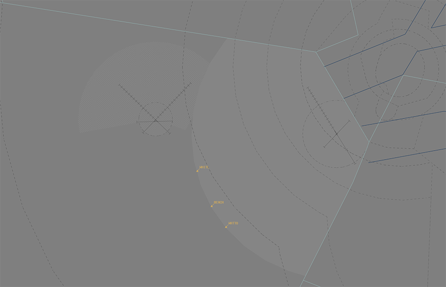

--8<-- "includes/abbreviations.md"

## Positions

| Name              | Callsign              | Frequency   | Login ID      |
| ----------------- | --------------------- | ----------- | ------------- |
| **Amberley ADC**  | **Amberley Tower**    | **118.300** | **AMB_TWR**   |
| **Amberley SMC**  | **Amberley Ground**   | **129.350** | **AMB_GND**   |
| **Amberley ACD**  | **Amberley Delivery** | **134.600** | **AMB_DEL**   |
| **Amberley ATIS** |                       | **123.300** | **YAMB_ATIS** |

!!! note
    YAMB is a [military aerodrome](../../../controller-skills/military/#military-aerodromes) and procedures can differ significantly to those at a civil aerodrome. Ensure you are familiar with the [military controller skills](../../../controller-skills/military) necessary to provide a quality service.

## Airspace
AMB ADC owns the Class C airspace in the AMB CTR from `SFC` to `A015`.

<figure markdown>
{ width="600" }
  <figcaption>AMB ADC Airspace</figcaption>
</figure>

### Restricted Area Activations
There are no [restricted areas or MOAs](../../../controller-skills/sua) activated by default when AMB ADC is online.

## Local Procedures
### Initial Pitch Procedures
The [initial points](../../../controller-skills/military/#initial-and-pitch) are aligned with Engine Test Cell 2 at the following locations.

| RWY  | Initial Point | Altitude |
| ---- | ------------- | -------- |
| 15   | 5NM downwind  | `A020`   |
| 33   | 5NM downwind  | `A020`   |

### Coded Clearances
Aircraft departing to the M640A-D, M646, M649A-B, or M661A-B MOAs should be cleared via the appropriate coded clearance. Each coded clearance gives aircraft permission to transit via the appropriate **[military corridor](#military-gates)**

[Coordination](#acd-to-tcu) may be required with AMB TCU prior to issuing clearance to an aircraft intending to operate in an SUA.

!!! phraseology
    *CRNG21 plans to enter M640A-D via the NORTHERN corridor for military training.*  
    **AMB ACD**: "CRNG21, Cleared NORTHERN 5, SID departure. Climb via SID to `F190`, squawk 6003, departure frequency 126.2"  
    
#### Northern Clearance Transitions
The **Northern** coded clearance includes a steep climb gradient to reach the initial altitude restriction. Aircraft that are unable to meet the initial altitude restrictions may request to depart via the **WOBBL** or **AM2NG** transition, which offers additional track miles.

!!! phraseology
    *STAL11 plans to enter M640A-D via the NORTHERN corridor for military training, and requires the WOBBL transition due performance*  
    **STAL11**: "Amberley Delivery, STAL11 for M640A-D via BEACH, request clearance, require WOBBL transition."  
    **AMB ACD**: "STAL11, Cleared NORTHERN 5, WOBBL transition. SID departure, climb via SID to `F190`, squawk 6003, departure frequency 126.2"  

!!! tip
    ACD should include details about the coded clearance transitions in the Global Ops field.

### Military Gates
There are numerous [military gates](../../../controller-skills/military/#military-gates) established throughout the AMB/OK TCU to facilitate entry and exit to adjoining SUA.

<figure markdown>
{ width="700" }
  <figcaption>AMB/OK SUA Gates</figcaption>
</figure>

Pilots should include the desired departure gate when requesting clearance.

!!! phraseology
    *WOLF11 plans to enter the R639A restricted area via BEACH for military training and airwork.*  
    **WOLF11**: "Amberley Delivery, WOLF11 for R639A via BEACH, request clearance."  
    **AMB ACD**: "WOLF11, Amberley Delivery. Cleared BEACH direct, visual departure. Climb to `F180`, squawk 6001, departure frequency 126.2."   

If the pilot **does not** nominate a gate, or nominates a gate that does not provide access to their intended SUA, WLM ACD should clear the aircraft to depart via the **appropriate gate**.

| Intended SUA    | TCU Exit Gate       |
| --------------- | ------------------- |
| M640A-D         | [Northern Corridor](#coded-clearances) |
| M646            | [Central Corridor](#coded-clearances) |
| M649A-B         | [Central Corridor](#coded-clearances) |
| M661A-B         | [Byron Corridor](#coded-clearances) |
| R639A-D         | BEACH               |

!!! tip
    [Coordination requirements](#acd-to-tcu) exist between ACD and TCU when aircraft are requesting clearance to operate in an SUA that has not been activated. Controllers performing the role of ACD should ensure they coordinate with TCU before providing clearance.

#### South Western Training Area
The South Western Training Area (SWTA) is located to the southwest of the AMB MIL CTR. The SWTA is divided in half by the Rosewood-Mt Walker-Aratula Road into SWTA Alpha (north) and SWTA Bravo (south). The training area is classified Class G airspace but a clearance is required to transit the AMB CTA to/from SWTA.

## VFR Operations
### Outbound Aircraft
Aircraft shall be cleared via the following waypoints when departing YAMB for the SWTA, assigned `A025`:

| **Duty Runway** | **Routing** |
|-----------------|-----------|
| 15              | MTWK      |
| 33              | CLVT      |
| 04 or 22        | As required |

!!! phraseology 
    **AMB ACD**: "ASTR203, cleared to South Western Training Area Alpha via MTWK, climb to A025, squawk 7301"  
    **ASTR203**: "Cleared South Western Training Area Alpha via MTWK, climb to A025, squawk 7301, ASTR203"

### Inbound Aircraft
AMB TCU will clear inbound aircraft to YAMB via the following waypoints:

| **Duty Runway** | **Routing** |
|-----------------|-----------|
| 15              | CLVT      |
| 33              | MTWK      |
| 04 or 22        | As required |

TCU will transfer the aircraft to ADC approaching the CTR boundary. Instruct the aircraft to join the circuit for the applicable duty runway and clear them for a visual approach (traffic permitting).   

!!! phraseology  
    **ASTR203**: "Amberley Tower, ASTR203, A015"     
    **AMB ADC**: "ASTR203, Amberley Tower, join final Runway 33, cleared visual approach"  
    **ASTR203**: "Join final Runway 33, cleared visual approach, ASTR203"  

## Helicopter Operations
### Arrivals & Departures
Helicopters should be processed as per fixed wing operations unless requested otherwise.

The HLS at the intersection of Taxiway Alpha and Quebec may be used for arriving or departing helicopters at pilot request. It must be treated like a runway, with takeoff and landing clearances issued.

!!! phraseology 
    **BSMN60**: "Amberley Tower, helicopter BSMN60, 12nm south, A010, inbound, received Foxtrot, request Taxiway Alpha"  
    **AMB ADC**: "BSMN60, Amberley Tower, track to Taxiway Alpha, not above A010"  
    **BSMN60**: "Track to Taxiway Alpha, not above A010, BSMN60"  

    **AMB ADC**: "BSMN60, Taxiway Alpha, cleared to land"  
    **BSMN60**: "Taxiway Alpha, cleared to land, BSMN60"

### Low-Level Ops
Taxiway Alpha is used for a variety of ground effect & low-level helicopter operations. It is divided into the following regions:

| Location | Name |
| ------ | ----------|
| Between A2 and A4     | Alpha North  |
| Between A2 and RWY 04/22     | Alpha Centre |
| Between A1 and RWY 04/22     | Alpha South |
| TWY Q and A Junction     | Holding Point Quebec |

<figure markdown>
{ width="600" }
  <figcaption>YAMB Helicopter Taxiway Alpha</figcaption>
</figure>

!!! phraseology 
    **CHOP41**: "Amberley Delivery, CHOP41, for low-level ops within Alpha Centre, request clearance"  
    **AMB ACD**: "CHOP41, Amberley Delivery, cleared to operate within Alpha Centre, not above A001"  
    **CHOP41**: "Cleared to operate within Alpha Centre, not above A001, CHOP41" 

#### Taxiway Segregation
SMC shall provide taxi instructions to the designated area of operations and retain the helicopter on their frequency. It may be necessary to instruct the helicopter to give way to other taxiing aircraft, or provide alternate taxi instructions to other aircraft.

Aircraft taxiing outbound from the Southern Apron shall be instructed to hold short of Holding Point Quebec when necessary, to provide separation with helicopters operating on Taxiway Alpha.

### Helicopter Circuits
To facilitate helicopter circuits, two areas have been established.

**Choppers East**:  
Utilising the threshold RWY 22 as a HLS, remaining east of a line parallel to RWY 15/33 intersecting threshold RWY 22. 

**Choppers West**  
Utilising the threshold RWY 04 as a HLS, remaining west of a line parallel to RWY 15/33 intersecting threshold RWY 04.

!!! note
    The primary area for continuous circuit operations is **Choppers East**, due to the displaced distance of the threshold of runway 22 from runway 15/33.

Circuits are flown at `A010`, in the same circuit direction as the duty runway. 

## Runway Modes
Runways 15/33 are the primary runways at YAMB.

### Circuits
The Circuit Area Airspace is allocated to be within 5nm of the YAMB ARP from `SFC` to `A015`. Aircraft can be instructed to extend outside of this airspace by ATC for traffic management.

Circuits are flown at the following altitudes:

| Aircraft Type | Circuit Altitude |
| ------------- | ---------------- |
| Jets & large turboprops | `A015` |
| Non-jets, small turboprops (up to C-27J) | `A010` | 

### Circuit Direction
| Runway | Direction |
| ------ | --------- |
| 15     | Right     |
| 33     | Left      |
| 04     | Left      |
| 22     | Left      |

## SID Selection

IFR aircraft planned via **BN**, **JEDDA**, **MESED**, **BOBOP**, **TATEN**, shall be assigned the **Procedural SID** that terminates at the appropriate waypoint.

Aircraft who are not planned via those points may be assigned the RADAR SID or a visual departure. 

## Coordination
### Auto Release
[Next](../../controller-skills/coordination.md#next) coordination is required from AMB ADC to AMB TCU for all aircraft.

The Standard Assignable Level from  **AMB ADC** to **AMB TCU** is:  

| Assigned Departure | Level  |
| ------------------ | ------ |
| Coded Clearance    | `F190` |
| All others         | The lower of `F180` and `RFL` |

### Departures Controller
When a TCU controller is online, aircraft shall be issued with a departure frequency during their airways clearance in accordance with the table below. If no TCU controllers are online, the appropriate enroute frequency or advisory frequency shall be issued.

| Runway | Via | Departure Frequency |
| ------ | ---- | -------------------- |
| All | All | 126.2 (AMA) |

#### ACD to TCU
The controller assuming responsibility of **ACD** shall give [heads-up](../../controller-skills/coordination/#airways-clearance) coordination to AMA/OKA (or the enroute controller responsible for the AMB/OK TCU) prior to the issue of a clearance to an aircraft intending to operate in an SUA that **has not** been activated. 

!!! phraseology
    **AMB ACD** -> **AMA**: "CRNG21 requests clearance to M640A-D.”  
    **AMA** -> **AMB ACD**: "CRNG21, clearance approved."

## Charts
!!! abstract "Reference"
    In addition to the civilian `ERSA` and `AIP` publications, [the RAAF AIP website](https://ais-af.airforce.gov.au/australian-aip){target=new} contains the necessary charts (available in the TERMA) and description of procedures (in each airports' FIHA).
