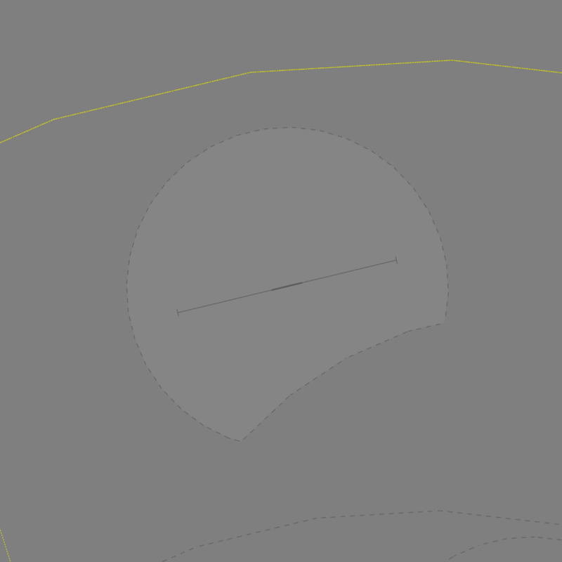

--8<-- "includes/abbreviations.md"

## Positions

| Name              | Callsign              | Frequency   | Login ID      |
| ----------------- | --------------------- | ----------- | ------------- |
| **Gingin ADC**    | **Gingin Tower**      | **118.500** | **GIG_TWR**   |
| **Gingin SMC**    | **Gingin Ground**     | **121.650** | **GIG_GND**   |
| **Gingin ATIS**   |                       | **134.500** | **YGIG_ATIS** |

!!! note
    YGIG is a [military aerodrome](../../../controller-skills/military/#military-aerodromes) and procedures can differ significantly to those at a civil aerodrome. Ensure you are familiar with the [military controller skills](../../../controller-skills/military) necessary to provide a quality service.

## Airspace
GIG ADC owns the airspace within the Gingin CIRA (**5nm** of the YGIG ARP, *excluding* the area south of **12 TACAN PEA**), `SFC` to `A035`.

<figure markdown>
{ width="600" }
  <figcaption>GIG ADC Airspace</figcaption>
</figure>

### Restricted Area Activations
There are no [restricted areas or MOAs](../../../controller-skills/sua) activated by default when GIG ADC is online.

## Local Procedures
### Initial and Pitch
The [intial points](../../../controller-skills/military/#initial-and-pitch) are offset north of the runway at the following locations.

| RWY  | Initial Point | Altitude |
| ---- | ------------- | -------- |
| 08   | 2NM west at the corner of Dunnart Road and the unnamed track east of Swan Road | `A015`   |
| 26   | 4NM east at the paddock divided by the creek, north of Breera Road  | `A015`   |

### Military Gates
There are several [military lanes](../../../controller-skills/military/#military-gates) established throughout the PE TMA to facilitate entry and exit to adjoining SUA.

<figure markdown>
{ width="700" }
  <figcaption>PE SUA Gates</figcaption>
</figure>

These lanes are designed for aircraft arriving and departing YPEA. Aircraft intending to depart via one of these gates must be cleared to an initial gate before joining the desired lane.

!!! phraseology
    *CYGT11 plans to enter the R156 restricted via the WANNAMAL Lane for military training and airwork.*  
    **CYGT11**: "Gingin Ground, DUGT19 for R156 via WANNAMAL, `A050`, request clearance."  
    **GIG SMC**: "DUGT19, Gingin Ground. Cleared to R156 via NORTHGATE thence WANNAMAL Lane, visual departure. Climb to `A050`, squawk 6001, departure frequency 130.2." 

!!! tip
    [Coordination requirements](#smc-to-pe-tcu) exist between SMC and TCU when aircraft are requesting clearance to operate in an SUA that has not been activated. Controllers performing the role of SMC should ensure they coordinate with TCU **before** providing clearance.

## Runway Modes
### Circuits 
### Circuits
The circuit height is `A016` for jets, and `A012` for non-jets.

#### Circuit Direction
| Runway | Direction |
| ------ | ----------|
| 08     | Right     |
| 26     | Left      |

## Coordination
### Auto Release
[Next](../../../controller-skills/coordination/#next) coordination is required from GIG ADC to PE TCU for all aircraft.

The Standard Assignable Level from **GIG ADC** to **PE TCU** is:

| Aircraft | Level |
| -------- | ----- |
| All | The lower of `A050` and `RFL` |

### Departures Controller
When a PE TCU controller is online, aircraft shall be issued with a departure frequency during their airways clearance in accordance with the table below. If no TCU controllers are online, the appropriate enroute frequency or advisory frequency shall be issued.

| Runway | Via  | Departure Frequency  |
| ------ | ---- | -------------------- |
| All    | All  | 130.2 (PEA)          |

### SMC to PE TCU
The controller assuming responsibility of **SMC** shall give [heads-up](../../../controller-skills/coordination/#airways-clearance) coordination to PEA (or the enroute controller responsible for the PE TCU) prior to the issue of a clearance to an aircraft intending to operate in an SUA that **has not** been activated. 

!!! phraseology
    **GIG SMC** -> **PEA**: "SIRA31 requests clearance to M171A"  
    **PEA** -> **GIG SMC**: "SIRA31, clearance approved. 

## Charts
!!! abstract "Reference"
    In addition to the civilian `ERSA` and `AIP` publications, [the RAAF AIP website](https://ais-af.airforce.gov.au/australian-aip){target=new} contains the necessary charts (available in the TERMA) and description of procedures (in each airports' FIHA).