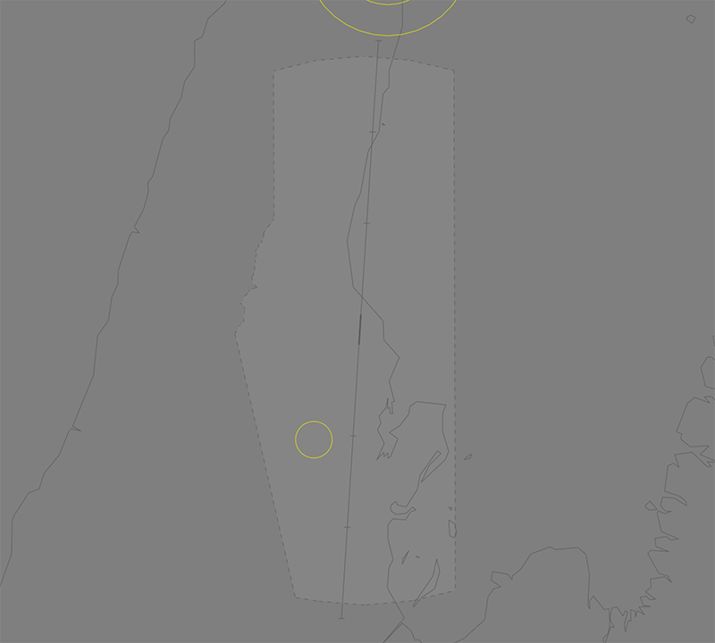

--8<-- "includes/abbreviations.md"

## Positions

| Name               | Callsign              | Frequency   | Login ID      |
| ------------------ | --------------------- | ----------- | ------------- |
| **Learmonth ADC**  | **Learmonth Tower**   | **118.300** | **LM_TWR**    |
| **Learmonth SMC**  | **Learmonth Ground**  | **126.200** | **LM_GND**    |
| **Learmonth ATIS** |                       | **123.300** | **YPLM_ATIS** |

!!! note
    YPLM is a [joint military/civil aerodrome](../../../controller-skills/military/#military-aerodromes) and procedures can differ significantly to those at a civil aerodrome. Ensure you are familiar with the [military controller skills](../../../controller-skills/military) necessary to provide a quality service.

## Airspace
**LM ADC** owns the Class C airspace within the LM MIL CTR (`SFC`-`A015`).

<figure markdown>
{ width="700" }
  <figcaption>LM ADC Airspace</figcaption>
</figure>

### Restricted Area Activations
There are no [restricted areas or MOAs](../../../controller-skills/sua) activated by default when LM ADC is online.

## Local Procedures
### Initial and Pitch 
The [initial points](../../../controller-skills/military/#initial-and-pitch) are aligned with Taxiway A at the following locations.

| RWY  | Initial Point | Altitude |
| ---- | ------------- | --------------------------- |
| 18   | 5.5 DME LM, at the creek mouth south of Charles Knife Road | `A015` |
| 36   | 5.5DME LM, abeam the bend in Minilya-Exxmouth Road | `A015` |

### Military Gates
There are numerous [military gates](../../../controller-skills/military/#military-gates) established throughout the LM TMA to facilitate entry and exit to adjoining SUA.

<figure markdown>
{ width="700" }
  <figcaption>LM SUA Gates</figcaption>
</figure>

Pilots should include the desired departure gate when requesting clearance.

!!! phraseology
    *PHNX11 plans to enter the M855A MOA via Gate 2 for military training and airwork.*  
    **PHNX11**: "Learmonth Ground, PHNX11 for Gate 2, `F190` for M855A, request clearance."  
    **LM SMC**: "PHNX11, Learmonth Ground. cleared Gate 2 direct, climb to `F190`, squawk 6001, departure frequency 120.5."   

If the pilot **does not** nominate a gate, or nominates a gate that does not provide access to their intended SUA, LM SMC should clear the aircraft to depart via the **appropriate gate**.

| Intended SUA    | TCU Exit Gate       |
| --------------- | ------------------- |
| M855            | Gate 2              |
| M856            | Gate 12             |
| M865            | Gate 10 or 12       |
| M866            | Gate 8              |
| M867            | Gate 8              |
| R850            | Gate 6              |
| R851            | Gate 4              |

!!! tip
    [Coordination requirements](#smc-to-lm-tcu) exist between SMC and TCU when aircraft are requesting clearance to operate in an SUA that has not been activated. Controllers performing the role of SMC should ensure they coordinate with TCU before providing clearance.

## Helicopter Operations
### Helipads
There are four helipads at YPLM: 

- **Helipads H1, H2, and H3** (in the eastern half of the Civil Apron)
- **South Helipad** (south of Taxiway A, adjacent the RAAF Apron)

The South Helipad is part of the manoeuvring area and controlled by LM ADC. Any helicopters taking off or landing on the helipad require a specific takeoff or landing clearance from ADC.

!!! phraseology 
    **LM ADC**: "CHOP71, south helipad, cleared to land"  

Helipads 1-3 are outside the maneouvring area so no takeoff or landing clearances should be issued. Instead, helicopters should be instructed to report airborne or report on the ground.

### Offshore Operations
There are several HLS located offshore in Exmouth Gulf. IFR helicopters operating between YPLM and these HLS will generally depart/arrive via the LM 020° radial to avoid conflicting with VFR aircraft around Ningaloo Reef. 

## Runway Modes
### Circuits
The circuit height is `A015`.

## Coordination
### Auto Release
[Next](../../../controller-skills/coordination/#next) coordination is required from LM ADC to LM TCU for all aircraft.

The Standard Assignable Level from  **LM ADC** to **LM TCU** is:

| Aircraft | Level |
| -------- | ----- |
| All | The lower of `F190` and `RFL` |

### Departures Controller
When a TCU controller is online, aircraft shall be issued with a departure frequency during their airways clearance in accordance with the table below. If no TCU controllers are online, the appropriate enroute frequency or advisory frequency shall be issued.

| Runway | Via  | Departure Frequency |
| ------ | ---- | ------------------- |
| All    | All  | 120.5 (LMA)         |

### SMC to LM TCU
The controller assuming responsibility of **SMC** shall give [heads-up](../../../controller-skills/coordination/#airways-clearance) coordination to LMA (or the enroute controller responsible for the LM TCU) prior to the issue of a clearance to an aircraft intending to operate in an SUA that **has not** been activated. 

!!! phraseology
    **LM SMC** -> **LMA**: "PHNX11 requests clearance to M855A”  
    **LMA** -> **LM SMC**: "PHNX11, clearance approved."  

## Charts
!!! abstract "Reference"
    In addition to the civilian `ERSA` and `AIP` publications, [the RAAF AIP website](https://ais-af.airforce.gov.au/australian-aip){target=new} contains the necessary charts (available in the TERMA) and description of procedures (in each airports' FIHA).
