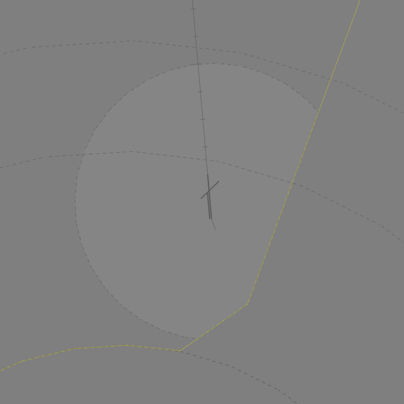
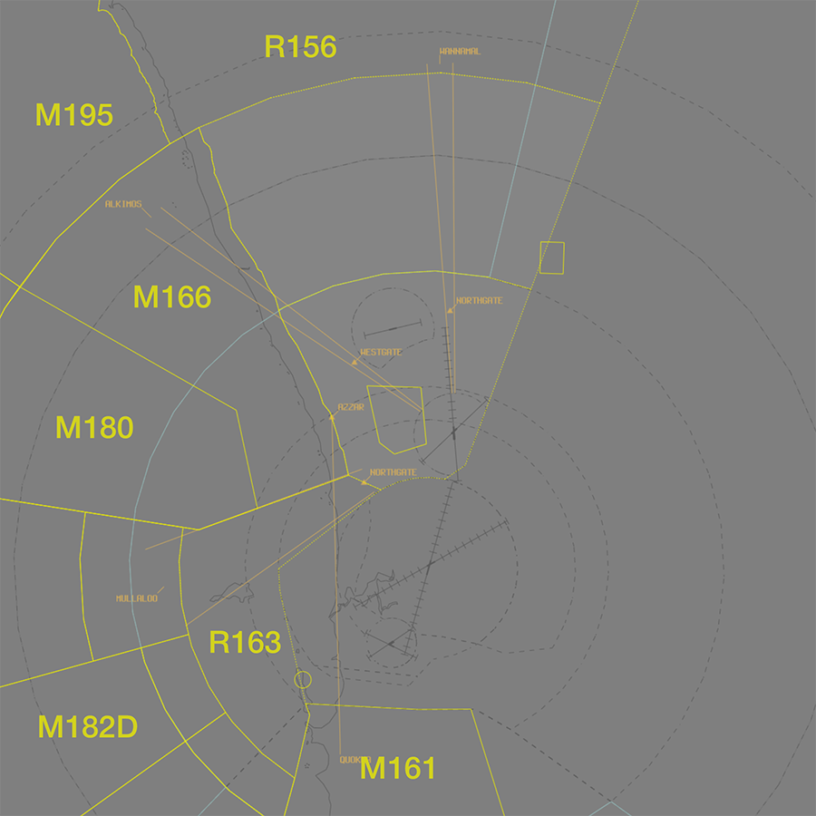
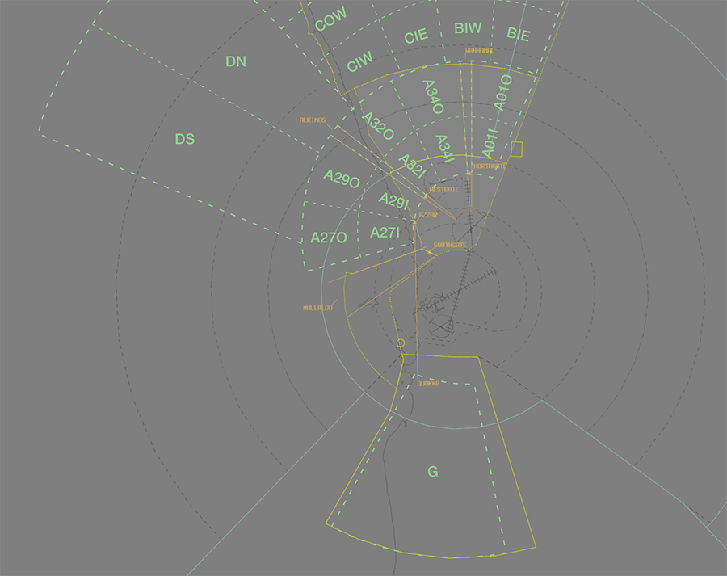

--8<-- "includes/abbreviations.md"

## Positions

| Name              | Callsign              | Frequency   | Login ID      |
| ----------------- | --------------------- | ----------- | ------------- |
| **Pearce ADC**    | **Pearce Tower**      | **118.300** | **PE_TWR**    |
| **Pearce SMC**    | **Pearce Ground**     | **127.250** | **PE_GND**    |
| **Pearce ACD**    | **Pearce Delivery**   | **134.100** | **PE_DEL**    |
| **Pearce ATIS**   |                       | **136.400** | **YPEA_ATIS** |

!!! note
    YPEA is a [military aerodrome](../../../controller-skills/military/#military-aerodromes) and procedures can differ significantly to those at a civil aerodrome. Ensure you are familiar with the [military controller skills](../../../controller-skills/military) necessary to provide a quality service.

## Airspace
PE ADC owns the airspace within the Pearce CIRA (**5nm** Radius of YPEA ARP, located entirely within **R155A**), `SFC` to `A035`.

<figure markdown>
{ width="600" }
  <figcaption>PE ADC Airspace</figcaption>
</figure>

## Restricted Area Activations
When **PE ADC** is online, the **R155A** restricted area is **partially [activated](../../../controller-skills/sua/#activation-of-sua)** by default, `SFC` to `A035` within 5NM of YPEA.

## Local Procedures 
### Initial and Pitch
The [initial](../../../../controller-skills/military/#initial-and-pitch) points changes according to both runway, and direction.

| RWY  | Initial Point       | Altitude                 |
| ---- | ------------------- | ------------------------ |
| 18s  | 4NM north at Quarry | `A015` |
| 36s  | 3.5NM south, at Ellenbrook Speedway | `A015` (Right Initial) `A010` (Left Initial) |
| 05   | 5nm west, where Warbrook Road leaves the pines | `A015` |
| 23   | 4.5NM east, at Quarry | `A010` |

### Military Gates
There are several [military lanes](../../../controller-skills/military/#military-gates) established throughout the PE TMA to facilitate entry and exit to adjoining SUA.

<figure markdown>
{ width="700" }
  <figcaption>PE SUA Gates</figcaption>
</figure>

Pilots should include the desired departure lane when requesting clearance.

!!! phraseology
    *DUGT19 plans to enter the M166 MOA via the ALKIMOS Lane for military training and airwork.*  
    **DUGT19**: "Pearce Delivery, DUGT19 for M166 via ALKIMOS, `A100`, request clearance."  
    **PE ACD**: "DUGT19, Pearce Delivery. Cleared to M166 via ALKIMOS lane, visual departure. Climb to `A100`, squawk 6001, departure frequency 130.2."   
If the pilot **does not** nominate a lane, or nominates a lane that does not provide access to their intended SUA, PE ACD should clear the aircraft to depart via the **appropriate lane**.

| Intended SUA    | TCU Exit Lane        |
| --------------- | -------------------- |
| M161            | MULLALOO or [QUOKKA](#quokka-lane) |
| M166            | ALKIMOS              |
| M170A-B         | MULLALOO             |
| M180            | MULLALOO             |
| M182A-G         | MULLALOO             |
| M195            | ALKIMOS              |
| R156            | WANNAMAL             |
| R163            | MULLALOO             |

!!! tip
    [Coordination requirements](#acd-to-pe-tcu) exist between ACD and TCU when aircraft are requesting clearance to operate in an SUA that has not been activated. Controllers performing the role of ACD should ensure they coordinate with TCU **before** providing clearance.
    
#### Quokka Lane
The **Quokka Lane** is defined as the AZZAR-FENDA track in the south-west of the TCU, `A090`-`F140`. It facilitates transit to/from the [M161 MOA](../../../terminal/pearce/#m161-pearce) on the southern side of the PH TCU, and offers shorter track miles for military aircraft that would otherwise transit via the Wannamal Lane.

Aircraft may be cleared to via the Quokka Lane in lieu of the Wannamal Lane following coordination with PEA.

!!! phraseology
    **PE ACD** -> **PEA**: "VIPR21 requests clearance to M161."  
    **PEA** -> **PE ACD**: "VIPR21, clearance approved via Quokka Lane. 
    
   
Aircraft cleared via the Quokka Lane must be issued a requirement to reach `A090` by the 250° PEA TAC radial.

!!! phraseology
    **PE ACD**: "VIPR21, cleared to M161 via Quokka Lane, visual departure. Climb to `A100`, requirement to reach `A090` by the 250 radial PEA..."   

### Training Areas
The PE TMA and adjoining SUAs contain multiple segmented training areas to facilitate local training operations. 

<figure markdown>
{ width="700" }
  <figcaption>PE Training Areas</figcaption>
</figure>

The 'A' inner training areas (with designator ending in 'I') extend from 15NM to 30NM PEA TAC, and the 'A' outer training areas (with designator ending in 'O') extend from 30NM to 45NM PEA TAC. The 'B', 'C', and 'D' training areas extend beyond 45NM PEA TAC, and the 'G' training area extends from 40NM PEA TAC to 70NM PH VOR, within the [M161 MOA](../../../terminal/pearce/#m161-pearce).

Aircraft requesting clearance to operate in a training area will be cleared via the appropriate [military lane](#military-gates).

## Runway Modes
### Preferred Runway Modes
The preferred runway direction is **Runway 18**.

#### Night Operational Restrictions
Runway 18R/36L is unlit, and **cannot** be used at night.

### Special Runway Operations
#### Parallel Runway Operations
Simultaneous parallel runway operations, including PROPS and SODROPS, are not authorised at YPEA. 

### Circuits
The circuit height is `A015`.

#### Circuit Direction
| Runway | Direction |
| ------ | --------- |
| 05     | Left      |
| 18L    | Right     |
| 18R    | Right     |
| 23     | Right     |
| 36L    | Left      |
| 36R    | Left      |

## SID Selection
Aircraft planned via **GUNOK** shall be assigned the **GUNOK** SID. Aircraft planned via the [**Wannamal**, **Alkimos**, or **Mullalloo Lanes**](#military-gates) shall be assigned relevant **Procedural SID**.

Aircraft **not** meeting that criteria, and **non-RNAV** aircraft shall be assigned either the RADAR SID or a visual departure. 

## ATIS
### Operational Info
#### SUA Activations
The Operational Information field should be updated when the [R179 Pearce (Muchea Air Weapons Range) restricted area](../../../terminal/pearce#muchea-air-weapons-range-sua) is active.

| Activated SUA | OPR INFO Field |
| ------------- | -------------- |
| R179     | `R 1 7 9 ACTIVE` |

## Coordination
### Auto Release
[Next](../../../controller-skills/coordination/#next) coordination is required from PE ADC to PE TCU for all aircraft.

The Standard Assignable Level from **PE ADC** to **PE TCU** is:

| Departure Procedure | Level |
| ------------------- | ----- |
| **GUNOK** SID | `A030` |
| A **Procedural** SID | `F130` |
| All others | The lower of `F130` and `RFL` |

### Departures Controller
When a TCU controller is online, aircraft shall be issued with a departure frequency during their airways clearance in accordance with the table below. If no TCU controllers are online, the appropriate enroute frequency or advisory frequency shall be issued.

| Runway | Via  | Departure Frequency |
| ------ | ---- | ------------------- |
| All    | All  | 130.2 (PEA)         |

### ACD to PE TCU
The controller assuming responsibility of **ACD** shall give [heads-up](../../../controller-skills/coordination/#airways-clearance) coordination to PEA (or the enroute controller responsible for the PE TCU) prior to the issue of a clearance to an aircraft intending to operate in an SUA that **has not** been activated. 

!!! phraseology
    **PE ACD** -> **PEA**: "DUGT19 requests clearance to M166"  
    **PEA** -> **PE ACD**: "DUGT19, clearance approved. 

## Charts
!!! abstract "Reference"
    In addition to the civilian `ERSA` and `AIP` publications, [the RAAF AIP website](https://ais-af.airforce.gov.au/australian-aip){target=new} contains the necessary charts (available in the TERMA) and description of procedures (in each airports' FIHA).
