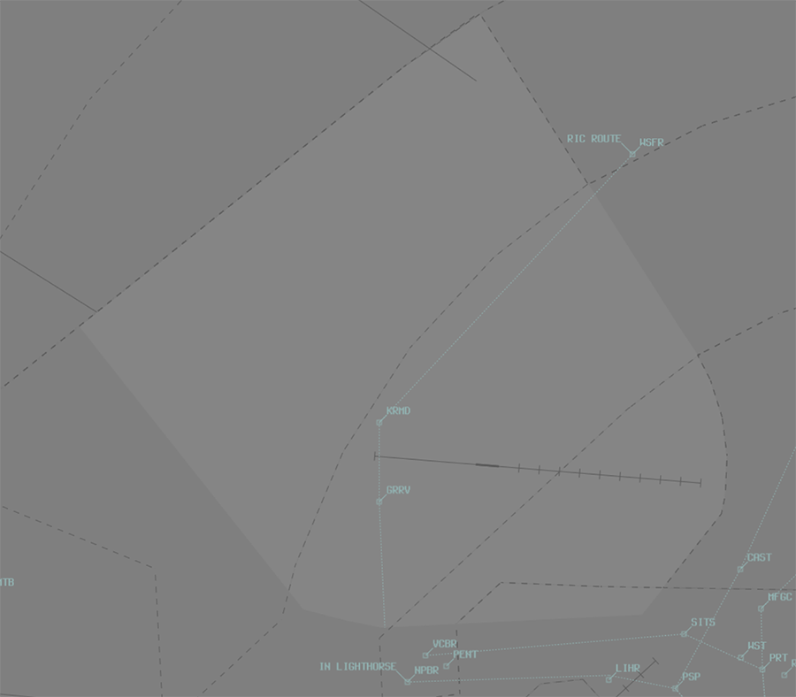
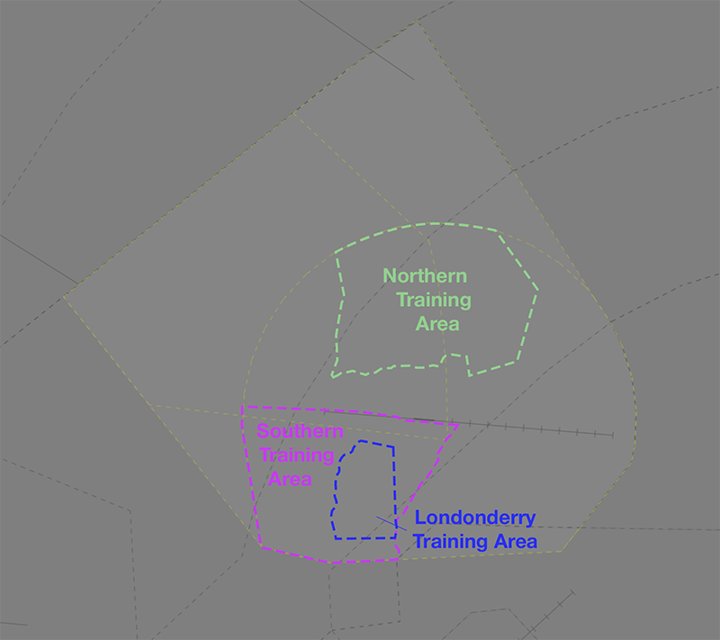

--8<-- "includes/abbreviations.md"

## Positions

| Name               | Callsign              | Frequency   | Login ID      |
| ------------------ | --------------------- | ----------- | ------------- |
| **Richmond ADC**   | **Richmond Tower**    | **135.500** | **RI_TWR**    |
| **Richmond SMC**   | **Richmond Ground**   | **128.250** | **RI_GND**    |
| **Richmond ATIS**  |                       | **126.300** | **YSRI_ATIS** |

!!! note
    YSRI is a [military aerodrome](../../../controller-skills/military/#military-aerodromes) and procedures can differ significantly to those at a civil aerodrome. Ensure you are familiar with the [military controller skills](../../../controller-skills/military) necessary to provide a quality service.

## Airspace
<figure markdown>
{ width="700" }
  <figcaption>RI ADC Airspace</figcaption>
</figure>

**RI ADC** is responsible for the Class C airspace within the **R479** [restricted area](../../../controller-skills/sua/#restricted-areas), `SFC` to `A015`.

### Restricted Area Activations
When **RI ADC** is online, the **R479** restricted area `SFC` to `A015` is [activated](../../../controller-skills/sua/#activation-of-sua) by default.

#### SUA in TCU Airspace
Military operations taking place in SUA in TCU airspace are outside the jurisdiction of RI ADC.

RI SMC must [give **heads up** coordination](#smc-to-sy-tcu) to relevant TCU controllers before providing airways clearance to an aircraft intending to operate in a currently inactive SUA.

This gives the parent controller sufficient time to assess the request, make necessary adjustments to any aircraft in the area currently, and activate the SUA; or alternately to refuse the activation request before the aircraft is in the air.

## Local Procedures
### Training Areas
There are three training areas located within R479, used for both civil and military operations.

<figure markdown>
{ width="700" }
  <figcaption>RI Training Areas</figcaption>
</figure>

Aircraft requesting clearance to operate in one of the trianing area shall be cleared a visual departure, along with clearance to operate within the area.

!!! phraseology
    **SFRI11**: "Richmond Ground, SFRI11 for Londonderry Training area, request clearance.”   
    **RI SMC**: "SFRI11, cleared to Londonderry Training Area direct, squawk 0361."    

!!! warning "Important"
    Operations above `A015` require an airspace release and coordination with **SRA**. Due to published procedures from YSSY and YSWS, levels above `A040` may not be available.

#### Londonderry Training Area
The **Londonderry Training Area** is located in the south-west of the RI CTR `SFC-A015`, entirely within the R479 restricted area.

#### Northern Training Area
The **Northern Training Area** is located in the north of the RI CTR `SFC-A060`, entirely within the R479 restricted area.

#### Southern Training Area
The **Southern Training Area** is located in the south-west of the RI CTR `SFC-A040`, entirely within the R479 restricted area.

### Inital and Pitch
The standard [initial](../../../../controller-skills/military/#initial-and-pitch) points are 5nm downwind of the active runway, dead side, left pitch/circuit.

## VFR Procedures
VFR aircraft transiting to/from YSRI should do so at `A015`.

Aircraft intending to transit the RIC CTR should plan via the [Richmond Lane of Entry](#richmond-lane-of-entry).

### Richmond Lane of Entry
A lane of entry is available in the western portion of the RIC CTR, allowing aircraft to transit the zone from north to south (or vice versa). A clearance is required from **RI ADC** prior to entering the CTR.

| Direction | Routing | Altitude | Reporting Point |
| --- | --- | --- | --- |
| Northbound | NPBR, then via the powerlines to KRMD, then WSFR | `A015` | KRMD |
| Southbound | WSFR to KRMD, then via the powerlines to NPBR | `A015` | KRMD |

!!! phraseology
    **FWC**: "Richmond Tower, FWC, Cessna 172, 4nm south of NPBR, `A015`, received Bravo, for the lane of entry, request clearance"  
    **RI ADC**: "FWC, squawk 0366, remain outside controlled airspace"  
    **FWC**: "Squawk 0366, remain outside controlled airspace, FWC"  
    **RI ADC**: "FWC, identified, cleared to track via the lane northbound, maintain `A015`"  
    **FWC**: "Cleared to track via the lane northbound, maintain `A015`, FWC"  

Pilots must report their position and estimate for their next waypoint at KRMD.

!!! phraselogy
    **FWC**: "FWC, KRMD, estimating WSFR at time 33"  
    **RI ADC**: "FWC"

Details of the lane are available in the `YSRI ERSA FAC` and on the Sydney VTC.

!!! note
    Delays may be required during times of peak traffic into/out of YSRI.

## Runway Modes
### Circuits
YSRI circuit area is defined as within 6nm of the YSRI ARP. An aircraft operating in the circuit will be issued a clearance to the operate within the circuit area not above `A015`.

#### Circuit Direction
| Runway | Direction |
| ------ | ----------|
| 10     | Left  |
| 28     | Left |

## SID Selection
IFR aircraft shall be assigned a SID corresponding to their direction of travel.

| Via                | SID         |
| ------------------ | ----------- |
| BEROW or TESAT     | **BEROW** SID, Relevant Transition (if applicable) |
| NIVOT              | **NIVOT** SID |
| RUTOS              | **RUTOS** SID |
| All others         | **RADAR** SID |

Aircraft which would otherwise be assigned the RADAR SID may be processed via a visual departure to the north or west, if conditions allow.

## Coordination
### Auto Release
[Next](../../../controller-skills/coordination/#next) coordination is required from RI ADC to SY TCU for all aircraft **entering SY TCU CTA**.

The Standard Assignable Level from **RI ADC** to **SY TCU** is:  

| Aircraft | Level |
| -------- | ----- |
| All | The lower of `A050` and `RFL` |

### Departures Controller
When a TCU controller is online, aircraft shall be issued with a departure frequency during their airways clearance in accordance with the table below. If no TCU controllers are online, the appropriate enroute frequency or advisory frequency shall be issued.

| Runway | Via  | Departure Frequency |
| ------ | ---- | ------------------- |
| All    | All  | 135.900 (SRA) |

### SMC to SY TCU
The controller assuming responsibility of **SMC** shall give [heads-up](../../../controller-skills/coordination/#airways-clearance) coordination to SRA (or the enroute controller responsible for the SY TCU) prior to the issue of a clearance to an aircraft intending to operate in an SUA that **has not** been activated. 

!!! phraseology
    **RI SMC** -> **SRA**: "PSSM31 requests clearance to M742"  
    **SRA** -> **RI SMC**: "PSSM31, clearance approved."  

## Charts
!!! abstract "Reference"
    In addition to the civilian `ERSA` and `AIP` publications, [the RAAF AIP website](https://ais-af.airforce.gov.au/australian-aip){target=new} contains the necessary charts (available in the TERMA) and description of procedures (in each airports' FIHA).
